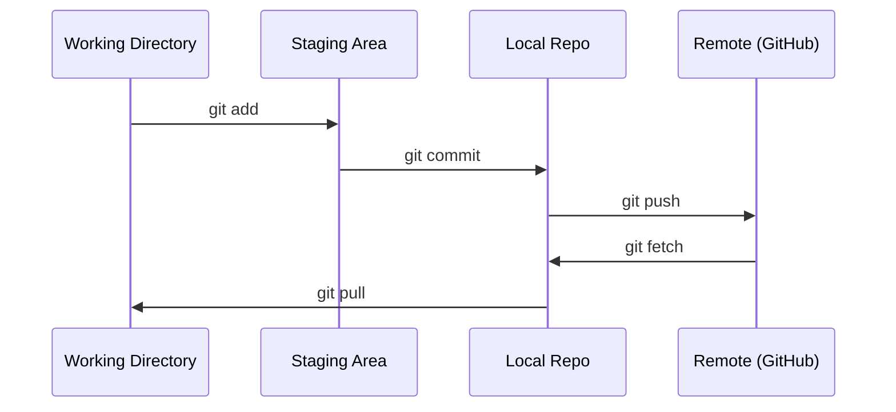

# Git & Collaboration

> Version control is not optional. Every experiment, every model, every lesson you build here gets tracked.

**Type:** Learn
**Languages:** --
**Prerequisites:** Phase 0, Lesson 01
**Time:** ~30 minutes

## Learning Objectives

- Configure git identity and use the daily workflow of add, commit, and push
- Create and merge branches for isolated experiments without breaking main
- Write a `.gitignore` that excludes model checkpoints and large binary files
- Navigate the commit history with `git log` to understand project evolution

## The Problem

You're about to write hundreds of code files across 20 phases. Without version control you will lose work, break things you can't undo, and have no way to collaborate with others.

Git is the tool. GitHub is where the code lives. This lesson covers what you need for this course and nothing more.

## The Concept



Three things to remember:
1. Save often (`git commit`)
2. Push to remote (`git push`)
3. Branch for experiments (`git checkout -b experiment`)

## Build It

### Step 1: Configure git

```bash
git config --global user.name "Your Name"
git config --global user.email "you@example.com"
```

### Step 2: The daily workflow

```bash
git status
git add file.py
git commit -m "Add perceptron implementation"
git push origin main
```

### Step 3: Branching for experiments

```bash
git checkout -b experiment/new-optimizer

# ... make changes, commit ...

git checkout main
git merge experiment/new-optimizer
```

### Step 4: Working with this course repo

```bash
git clone https://github.com/rohitg00/ai-engineering-from-scratch.git
cd ai-engineering-from-scratch

git checkout -b my-progress
# work through lessons, commit your code
git push origin my-progress
```

## 使用它

对于本课程，您需要以下命令：

|命令 |当 |
|---------|------|
| `git 克隆` |获取课程存储库 |
| `git add` + `git commit` |保存您的工作 |
| `git 推送` |备份到 GitHub |
| `git checkout -b` |尝试一些不破坏 main | 的东西
| `git log --oneline` |看看你做了什么 |

就是这样。本课程不需要 rebase、cherry-pick 或子模块。

## 练习

1.克隆这个repo，创建一个名为“my-progress”的分支，创建一个文件，提交，推送
2. 创建一个排除模型检查点文件的“.gitignore”（“.pt”、“.pth”、“.safetensors”）
3. 使用 `git log --oneline` 查看此存储库的提交历史记录，并了解如何添加课程

## 关键术语

|术语 |人们怎么说 |它实际上意味着什么 |
|------|----------------|----------------------|
|提交 | “节省” |整个项目在某个时间点的快照 |
|分公司| “副本”|指向在您工作时向前推进的提交的指针 |
|合并 | “组合代码”|从一个分支获取更改并将其应用到另一个分支 |
|远程| “云”|托管在其他地方（GitHub、GitLab）的存储库副本 |
