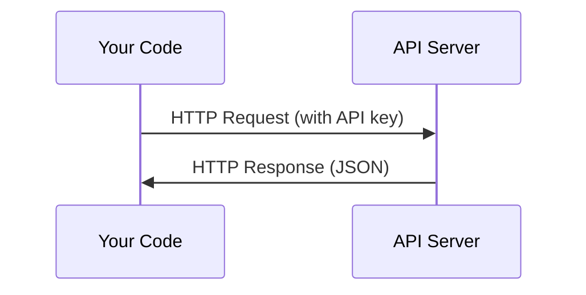

# APIs & Keys

> Every AI API works the same way: send a request, get a response. The details change, the pattern doesn't.

**Type:** Build
**Languages:** Python, TypeScript
**Prerequisites:** Phase 0, Lesson 01
**Time:** ~30 minutes

## Learning Objectives

- Store API keys securely using environment variables and `.env` files
- Make an LLM API call using both the Anthropic Python SDK and raw HTTP
- Compare SDK-based and raw HTTP request/response formats for debugging
- Identify and handle common API errors including authentication and rate limits

## The Problem

Starting from Phase 11, you'll call LLM APIs (Anthropic, OpenAI, Google). In Phase 13-16 you'll build agents that use these APIs in loops. You need to know how API keys work, how to store them safely, and how to make your first API call.

## The Concept



Every API call has:
1. An endpoint (URL)
2. An API key (authentication)
3. A request body (what you want)
4. A response body (what you get back)

## Build It

### Step 1: Store API keys safely

Never put API keys in code. Use environment variables.

```bash
export ANTHROPIC_API_KEY="sk-ant-..."
export OPENAI_API_KEY="sk-..."
```

Or use a `.env` file (add it to `.gitignore`):

```
ANTHROPIC_API_KEY=sk-ant-...
OPENAI_API_KEY=sk-...
```

### Step 2: First API call (Python)

```python
import anthropic

client = anthropic.Anthropic()

response = client.messages.create(
    model="claude-sonnet-4-20250514",
    max_tokens=256,
    messages=[{"role": "user", "content": "What is a neural network in one sentence?"}]
)

print(response.content[0].text)
```

### Step 3: First API call (TypeScript)

```typescript
import Anthropic from "@anthropic-ai/sdk";

const client = new Anthropic();

const response = await client.messages.create({
  model: "claude-sonnet-4-20250514",
  max_tokens: 256,
  messages: [{ role: "user", content: "What is a neural network in one sentence?" }],
});

console.log(response.content[0].text);
```

### Step 4: Raw HTTP (no SDK)

```python
import os
import urllib.request
import json

url = "https://api.anthropic.com/v1/messages"
headers = {
    "Content-Type": "application/json",
    "x-api-key": os.environ["ANTHROPIC_API_KEY"],
    "anthropic-version": "2023-06-01",
}
body = json.dumps({
    "model": "claude-sonnet-4-20250514",
    "max_tokens": 256,
    "messages": [{"role": "user", "content": "What is a neural network in one sentence?"}],
}).encode()

req = urllib.request.Request(url, data=body, headers=headers, method="POST")
with urllib.request.urlopen(req) as resp:
    result = json.loads(resp.read())
    print(result["content"][0]["text"])
```

这就是 SDK 在幕后所做的事情。了解原始 HTTP 调用有助于调试。

## 使用它

对于本课程：

|应用程序接口 |当你需要的时候 |免费套餐 |
|-----|--------------------|------------|
|人择（克劳德）|第 11-16 阶段（代理、工具）|注册时可获得 5 美元赠金 |
|开放人工智能 |第 11 阶段（比较）|注册时可获得 5 美元赠金 |
|拥抱脸|第 4-10 阶段（模型、数据集）|免费|

您现在不需要所有这些。当课程需要时设置它们。

## 发货

本课产生：
- `outputs/prompt-api-troubleshooter.md` - 诊断常见 API 错误

## 练习

1. 获取 Anthropic API 密钥并进行第一次 API 调用
2. 尝试原始HTTP版本并将响应格式与SDK版本进行比较
3.故意使用错误的API密钥并阅读错误消息

## 关键术语

|术语 |人们怎么说 |它实际上意味着什么 |
|------|----------------|----------------------|
| API 密钥 | “API 密码”|标识您的帐户并授权请求的唯一字符串 |
|速率限制 | “他们正在扼杀我”|每分钟/小时的最大请求数，以防止滥用并确保公平使用 |
|代币| “一句话”（在 API 上下文中）|计费单位：输入和输出代币分开计数并计费 |
|流媒体| “实时响应” |逐字获取回复，而不是等待完整回复 |
