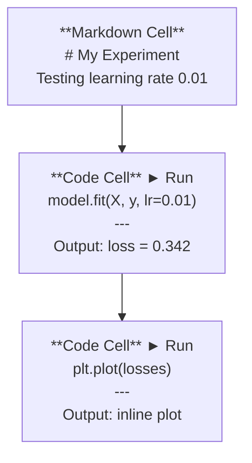
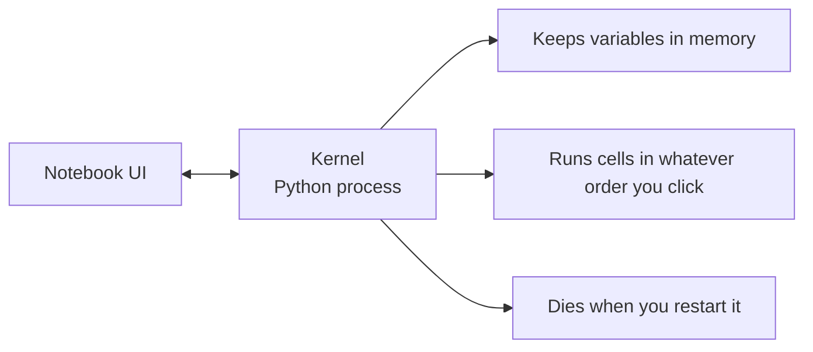

# Jupyter Notebooks

> Notebooks are the lab bench of AI engineering. You prototype here, then move what works into production.

**Type:** Build
**Languages:** Python
**Prerequisites:** Phase 0, Lesson 01
**Time:** ~30 minutes

## Learning Objectives

- Install and launch JupyterLab, Jupyter Notebook, or VS Code with the Jupyter extension
- Use magic commands (`%timeit`, `%%time`, `%matplotlib inline`) to benchmark and visualize inline
- Distinguish when to use notebooks vs scripts and apply the "explore in notebooks, ship in scripts" workflow
- Identify and avoid common notebook traps: out-of-order execution, hidden state, and memory leaks

## The Problem

Every AI paper, tutorial, and Kaggle competition uses Jupyter notebooks. They let you run code in pieces, see outputs inline, mix code with explanations, and iterate fast. If you try to learn AI without notebooks, you're doing math homework without scratch paper.

But notebooks have real traps. People use them for everything, including things they're terrible at. Knowing when to use a notebook and when to use a script will save you from debugging nightmares later.

## The Concept

A notebook is a list of cells. Each cell is either code or text.



The kernel is a Python process running in the background. When you run a cell, it sends the code to the kernel, which executes it and sends back the result. All cells share the same kernel, so variables persist between cells.



That "whatever order you click" part is both the superpower and the foot-gun.

## Build It

### Step 1: Pick your interface

Three options, one format:

| Interface | Install | Best for |
|-----------|---------|----------|
| JupyterLab | `pip install jupyterlab` then `jupyter lab` | Full IDE experience, multiple tabs, file browser, terminal |
| Jupyter Notebook | `pip install notebook` then `jupyter notebook` | Simple, lightweight, one notebook at a time |
| VS Code | Install "Jupyter" extension | Already in your editor, git integration, debugging |

All three read and write the same `.ipynb` file. Pick whatever you like. JupyterLab is the most common in AI work.

```bash
pip install jupyterlab
jupyter lab
```

### Step 2: Keyboard shortcuts that matter

You operate in two modes. Press `Escape` for command mode (blue bar on the left), `Enter` for edit mode (green bar).

**Command mode (most used):**

| Key | Action |
|-----|--------|
| `Shift+Enter` | Run cell, move to next |
| `A` | Insert cell above |
| `B` | Insert cell below |
| `DD` | Delete cell |
| `M` | Convert to markdown |
| `Y` | Convert to code |
| `Z` | Undo cell operation |
| `Ctrl+Shift+H` | Show all shortcuts |

**Edit mode:**

| Key | Action |
|-----|--------|
| `Tab` | Autocomplete |
| `Shift+Tab` | Show function signature |
| `Ctrl+/` | Toggle comment |

`Shift+Enter` is the one you'll use a thousand times a day. Learn it first.

### Step 3: Cell types

**Code cells** run Python and show the output:

```python
import numpy as np
data = np.random.randn(1000)
data.mean(), data.std()
```

Output: `(0.0032, 0.9987)`

**Markdown cells** render formatted text. Use them to document what you're doing and why. Supports headers, bold, italic, LaTeX math (`$E = mc^2$`), tables, and images.

### Step 4: Magic commands

These aren't Python. They're Jupyter-specific commands that start with `%` (line magic) or `%%` (cell magic).

**Time your code:**

```python
%timeit np.random.randn(10000)
```

Output: `45.2 us +/- 1.3 us per loop`

```python
%%time
model.fit(X_train, y_train, epochs=10)
```

Output: `Wall time: 2.34 s`

`%timeit` runs the code many times and averages. `%%time` runs it once. Use `%timeit` for microbenchmarks, `%%time` for training runs.

**Enable inline plots:**

```python
%matplotlib inline
```

Every `plt.plot()` or `plt.show()` now renders directly in the notebook.

**Install packages without leaving the notebook:**

```python
!pip install scikit-learn
```

The `!` prefix runs any shell command.

**Check environment variables:**

```python
%env CUDA_VISIBLE_DEVICES
```

### Step 5: Display rich output inline

Notebooks auto-display the last expression in a cell. But you can control it:

```python
import pandas as pd

df = pd.DataFrame({
    "model": ["Linear", "Random Forest", "Neural Net"],
    "accuracy": [0.72, 0.89, 0.94],
    "training_time": [0.1, 2.3, 45.6]
})
df
```

This renders a formatted HTML table, not a text dump. Same with plots:

```python
import matplotlib.pyplot as plt

plt.figure(figsize=(8, 4))
plt.plot([1, 2, 3, 4], [1, 4, 2, 3])
plt.title("Inline Plot")
plt.show()
```

The plot appears right below the cell. This is why notebooks dominate AI work. You see the data, the plot, and the code together.

For images:

```python
from IPython.display import Image, display
display(Image(filename="architecture.png"))
```

### 第 6 步：谷歌 Colab

Colab 是云中的免费 Jupyter 笔记本。它为您提供 GPU、预装库和 Google Drive 集成。无需设置。

1. 前往 [colab.research.google.com](https://colab.research.google.com)
2. 上传本课程中的任何“.ipynb”文件
3.运行时 > 更改运行时类型 > T4 GPU（免费）

Colab 与本地 Jupyter 的差异：
- 文件在会话之间不会保留（保存到云端硬盘或下载）
- 预安装：numpy、pandas、matplotlib、torch、tensorflow、sklearn
- `from google.colab import files` 上传/下载文件
- `从 google.colab 导入驱动器；用于持久存储的drive.mount('/content/drive')`
- 90 分钟不活动后会话超时（免费套餐）

## 使用它

### 笔记本与脚本：何时使用哪个

|使用笔记本来 |使用脚本 |
|--------------------|-----------------|
|探索数据集 |培训管道|
|制作模型原型 |可重复使用的实用程序 |
|可视化结果 |任何带有 `if __name__` | 的内容
|解释你的工作 |按计划运行的代码 |
|快速实验 |生产代码|
|课程练习|包和库 |

规则：**在笔记本中探索，在脚本中发布**。

AI 中的常见工作流程：
1. 探索笔记本中的数据
2. 在笔记本中制作模型原型
3. 运行后，将代码移至“.py”文件
4. 将这些`.py`文件导入回笔记本中以进行进一步的实验

### 常见陷阱

**乱序执行。** 您运行单元 5，然后运行单元 2，然后运行单元 7。笔记本可以在您的计算机上运行，​​但当有人从上到下运行它时会损坏。修复：共享之前内核 > 重新启动并运行全部。

**隐藏状态。** 您删除了一个单元格，但它创建的变量仍在内存中。笔记本看起来很干净，但依赖于幽灵电池。修复：定期重启内核。

**内存泄漏。** 加载 4GB 数据集，训练模型，加载另一个数据集。什么都没有被释放。修复：`delvariable_name`和`gc.collect()`，或者重新启动内核。

## 发货

本课产生：
- `outputs/prompt-notebook-helper.md` 用于调试笔记本问题

## 练习

1. 打开 JupyterLab，创建一个笔记本，然后使用“%timeit”来比较列表理解与 numpy 创建 100,000 个随机数的数组
2. 创建一个包含 Markdown 和代码单元的笔记本，用于加载 CSV、显示数据框并绘制图表。然后运行 ​​Kernel > Restart & Run All 以验证它从上到下是否正常工作
3. 从 `code/notebook_tips.py` 中获取代码，将其粘贴到 Colab 笔记本中，并使用空闲 GPU 运行它

## 关键术语

|术语 |人们怎么说 |它实际上意味着什么 |
|------|----------------|----------------------|
|内核| “运行我的代码的东西”|执行单元并将变量保存在内存中的独立 Python 进程 |
|细胞| “代码块” |笔记本中可独立运行的单元，无论是代码还是 Markdown |
|魔法指令| “Jupyter 技巧” |以“%”或“%%”为前缀的控制笔记本环境的特殊命令 |
| `.ipynb` | “笔记本文件”|包含单元格、输出和元数据的 JSON 文件。代表 IPython 笔记本 |

## 进一步阅读

- [JupyterLab 文档](https://jupyterlab.readthedocs.io/) 了解完整功能集
- [Google Colab 常见问题解答](https://research.google.com/colaboratory/faq.html) 了解 Colab 特定的限制和功能
- [28 Jupyter Notebook Tips](https://www.dataquest.io/blog/jupyter-notebook-tips-tricks-shortcuts/) 适用于高级用户快捷方式
