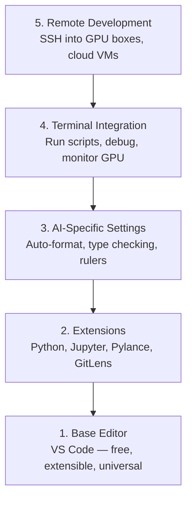

# Editor Setup

> Your editor is your co-pilot. Configure it once so it stays out of your way and starts pulling its weight.

**Type:** Build
**Languages:** --
**Prerequisites:** Phase 0, Lesson 01
**Time:** ~20 minutes

## Learning Objectives

- Install VS Code with essential extensions for Python, Jupyter, linting, and remote SSH
- Configure format-on-save, type checking, and notebook output scrolling for AI workflows
- Set up Remote SSH to edit and debug code on remote GPU machines as if they were local
- Evaluate editor alternatives (Cursor, Windsurf, Neovim) and their tradeoffs for AI work

## The Problem

You'll spend thousands of hours inside your editor writing Python, running notebooks, debugging training loops, and SSH-ing into GPU boxes. A misconfigured editor turns every session into friction: no autocomplete, no type hints, no inline errors, manual formatting, and a clunky terminal workflow.

The right setup takes 20 minutes. Skipping it costs you 20 minutes every day.

## The Concept

An AI engineering editor setup needs five things:



## Build It

### Step 1: Install VS Code

VS Code is the recommended editor. It is free, runs on every OS, has first-class Jupyter notebook support, and the extension ecosystem covers everything you need for AI work.

Download it from [code.visualstudio.com](https://code.visualstudio.com/).

Verify from the terminal:

```bash
code --version
```

If `code` is not found on macOS, open VS Code, press `Cmd+Shift+P`, type "Shell Command", and select "Install 'code' command in PATH".

### Step 2: Install Essential Extensions

Open the integrated terminal in VS Code (`Ctrl+`` ` or `` Cmd+` ``) and install the extensions that matter for AI work:

```bash
code --install-extension ms-python.python
code --install-extension ms-python.vscode-pylance
code --install-extension ms-toolsai.jupyter
code --install-extension eamodio.gitlens
code --install-extension ms-vscode-remote.remote-ssh
code --install-extension ms-python.debugpy
code --install-extension ms-python.black-formatter
code --install-extension charliermarsh.ruff
```

What each one does:

| Extension | Why |
|-----------|-----|
| Python | Language support, virtual env detection, run/debug |
| Pylance | Fast type checking, autocomplete, import resolution |
| Jupyter | Run notebooks inside VS Code, variable explorer |
| GitLens | See who changed what, inline git blame |
| Remote SSH | Open a folder on a remote GPU box as if it were local |
| Debugpy | Step-through debugging for Python |
| Black Formatter | Auto-format on save, consistent style |
| Ruff | Fast linting, catches common mistakes |

The file `code/.vscode/extensions.json` in this lesson contains the full recommendations list. When you open the project folder, VS Code will prompt you to install them.

### Step 3: Configure Settings

Copy the settings from `code/.vscode/settings.json` in this lesson, or apply them manually through `Settings > Open Settings (JSON)`.

The key settings for AI work:

```jsonc
{
    "python.analysis.typeCheckingMode": "basic",
    "editor.formatOnSave": true,
    "editor.rulers": [88, 120],
    "notebook.output.scrolling": true,
    "files.autoSave": "afterDelay"
}
```

Why these matter:

- **Type checking on basic**: Catches wrong argument types before you run. Saves debugging time on tensor shape mismatches and wrong API parameters.
- **Format on save**: Never think about formatting again. Black handles it.
- **Rulers at 88 and 120**: Black wraps at 88. The 120 marker shows when docstrings and comments are getting too long.
- **Notebook output scrolling**: Training loops print thousands of lines. Without scrolling, the output panel explodes.
- **Auto-save**: You will forget to save. Your training script will run stale code. Auto-save prevents that.

### Step 4: Terminal Integration

VS Code's integrated terminal is where you run training scripts, monitor GPUs, and manage environments.

Set it up properly:

```jsonc
{
    "terminal.integrated.defaultProfile.osx": "zsh",
    "terminal.integrated.defaultProfile.linux": "bash",
    "terminal.integrated.fontSize": 13,
    "terminal.integrated.scrollback": 10000
}
```

Useful shortcuts:

| Action | macOS | Linux/Windows |
|--------|-------|---------------|
| Toggle terminal | `` Ctrl+` `` | `` Ctrl+` `` |
| New terminal | `Ctrl+Shift+`` ` | `Ctrl+Shift+`` ` |
| Split terminal | `Cmd+\` | `Ctrl+\` |

Split terminals are useful: one for running your script, one for monitoring GPU with `nvidia-smi -l 1` or `watch -n 1 nvidia-smi`.

### Step 5: Remote Development (SSH into GPU Boxes)

This is the most important extension for AI work. You will run training on remote machines (cloud VMs, lab servers, Lambda, Vast.ai). Remote SSH lets you open the remote filesystem, edit files, run terminals, and debug as if everything were local.

Setup:

1. Install the Remote SSH extension (done in Step 2).
2. Press `Ctrl+Shift+P` (or `Cmd+Shift+P`), type "Remote-SSH: Connect to Host".
3. Enter `user@your-gpu-box-ip`.
4. VS Code installs its server component on the remote machine automatically.

For passwordless access, set up SSH keys:

```bash
ssh-keygen -t ed25519 -C "your-email@example.com"
ssh-copy-id user@your-gpu-box-ip
```

Add the host to `~/.ssh/config` for convenience:

```
Host gpu-box
    HostName 203.0.113.50
    User ubuntu
    IdentityFile ~/.ssh/id_ed25519
    ForwardAgent yes
```

现在“远程 SSH：连接到主机 > gpu-box”立即连接。

## 替代方案

＃＃＃ 光标

[cursor.com](https://cursor.com) 是一个具有内置 AI 代码生成功能的 VS Code 分支。它使用相同的扩展生态系统和设置格式。如果您使用光标，本课程中的所有内容仍然适用。导入相同的“settings.json”和“extensions.json”。

### 风帆冲浪

[windsurf.com](https://windsurf.com) 是另一个 AI 优先的 VS Code 分支。同样的故事：相同的扩展、相同的设置格式、相同的远程 SSH 支持。

### Vim/Neovim

如果您已经使用 Vim 或 Neovim 并且效率很高，请继续使用。 AI Python 工作的最低设置：

- **pyright** 或 **pylsp** 用于类型检查（通过 Mason 或手动安装）
- **nvim-lspconfig** 用于语言服务器集成
- **jupyter-vim** 或 **molten-nvim** 用于类似笔记本的执行
- **telescope.nvim** 用于文件/符号搜索
- **none-ls.nvim** 带有黑色和皱褶用于格式化/绒毛

如果您尚未使用 Vim，请不要立即开始。学习曲线将与学习人工智能工程相竞争。使用 VS 代码。

## 使用它

通过此设置，您的日常工作流程如下所示：

1. 在 VS Code 中打开项目文件夹（或通过远程 SSH 连接到 GPU 盒）。
2. 在编辑器中编写具有自动完成、类型提示和内联错误的 Python。
3. 运行与 Jupyter 扩展内联的 Jupyter 笔记本。
4. 使用集成终端进行训练脚本、`uv pip install` 和 GPU 监控。
5. 在提交之前使用 GitLens 检查更改。

## 练习

1. 安装 VS Code 和步骤 2 中列出的所有扩展
2. 将本课中的“settings.json”复制到您的 VS Code 配置中
3. 打开 Python 文件并验证 Pylance 在保存时是否显示类型提示和黑色格式
4. 如果您有权访问远程计算机，请设置远程 SSH 并打开其上的文件夹

## 关键术语

|术语 |人们怎么说 |它实际上意味着什么 |
|------|----------------|----------------------|
| LSP | “自动完成引擎” |语言服务器协议：编辑器从特定于语言的服务器获取类型信息、完成和诊断的标准 |
|皮兰斯 | “Python 插件” |微软的Python语言服务器使用Pyright进行类型检查和IntelliSense |
|远程 SSH | “在服务器上工作”| VS Code 扩展在远程计算机上运行轻量级服务器并将 UI 流式传输到本地编辑器 |
|保存时格式化 | “自动更漂亮”|每次保存时编辑器都会运行格式化程序（Black、Ruff），因此代码风格始终保持一致 |
