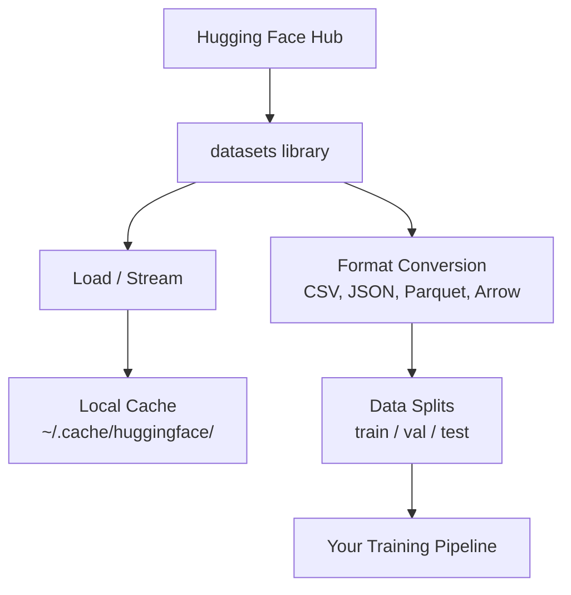

# Data Management

> Data is the fuel. How you manage it determines how fast you go.

**Type:** Build
**Language:** Python
**Prerequisites:** Phase 0, Lesson 01
**Time:** ~45 minutes

## Learning Objectives

- Load, stream, and cache datasets using the Hugging Face `datasets` library
- Convert between CSV, JSON, Parquet, and Arrow formats and explain their tradeoffs
- Create reproducible train/validation/test splits with fixed random seeds
- Manage large model and dataset files using `.gitignore`, Git LFS, or DVC

## The Problem

Every AI project starts with data. You need to find datasets, download them, convert between formats, split them for training and evaluation, and version them so experiments are reproducible. Doing this manually every time is slow and error-prone. You need a repeatable workflow.

## The Concept



The Hugging Face `datasets` library is the standard way to load data for AI work. It handles downloading, caching, format conversion, and streaming out of the box.

## Build It

### Step 1: Install the datasets library

```bash
pip install datasets huggingface_hub
```

### Step 2: Load a dataset

```python
from datasets import load_dataset

dataset = load_dataset("imdb")
print(dataset)
print(dataset["train"][0])
```

This downloads the IMDB movie review dataset. After the first download, it loads from cache at `~/.cache/huggingface/datasets/`.

### Step 3: Stream large datasets

Some datasets are too large to fit on disk. Streaming loads them row by row without downloading the full thing.

```python
dataset = load_dataset("wikimedia/wikipedia", "20220301.en", split="train", streaming=True)

for i, example in enumerate(dataset):
    print(example["title"])
    if i >= 4:
        break
```

Streaming gives you an `IterableDataset`. You process rows as they arrive. Memory usage stays constant regardless of dataset size.

### Step 4: Dataset formats

The `datasets` library uses Apache Arrow under the hood. You can convert to other formats depending on what your pipeline needs.

```python
dataset = load_dataset("imdb", split="train")

dataset.to_csv("imdb_train.csv")
dataset.to_json("imdb_train.json")
dataset.to_parquet("imdb_train.parquet")
```

Format comparison:

| Format | Size | Read Speed | Best For |
|--------|------|-----------|----------|
| CSV | Large | Slow | Human readability, spreadsheets |
| JSON | Large | Slow | APIs, nested data |
| Parquet | Small | Fast | Analytics, columnar queries |
| Arrow | Small | Fastest | In-memory processing (what `datasets` uses internally) |

For AI work, Parquet is the best storage format. Arrow is what you work with in memory. CSV and JSON are for interchange.

### Step 5: Data splits

Every ML project needs three splits:

- **Train**: The model learns from this (typically 80%)
- **Validation**: You check progress during training (typically 10%)
- **Test**: Final evaluation after training is done (typically 10%)

Some datasets come pre-split. When they don't, split them yourself:

```python
dataset = load_dataset("imdb", split="train")

split = dataset.train_test_split(test_size=0.2, seed=42)
train_val = split["train"].train_test_split(test_size=0.125, seed=42)

train_ds = train_val["train"]
val_ds = train_val["test"]
test_ds = split["test"]

print(f"Train: {len(train_ds)}, Val: {len(val_ds)}, Test: {len(test_ds)}")
```

Always set a seed for reproducibility. The same seed produces the same split every time.

### Step 6: Download and cache models

Models are large files. The `huggingface_hub` library handles downloading and caching.

```python
from huggingface_hub import hf_hub_download, snapshot_download

model_path = hf_hub_download(
    repo_id="sentence-transformers/all-MiniLM-L6-v2",
    filename="config.json"
)
print(f"Cached at: {model_path}")

model_dir = snapshot_download("sentence-transformers/all-MiniLM-L6-v2")
print(f"Full model at: {model_dir}")
```

Models cache to `~/.cache/huggingface/hub/`. Once downloaded, they load instantly on subsequent runs.

### Step 7: Handle large files

Model weights and large datasets should not go into git. Three options:

**Option A: .gitignore (simplest)**

```
*.bin
*.safetensors
*.pt
*.onnx
data/*.parquet
data/*.csv
models/
```

**Option B: Git LFS (track large files in git)**

```bash
git lfs install
git lfs track "*.bin"
git lfs track "*.safetensors"
git add .gitattributes
```

Git LFS stores pointers in your repo and the actual files on a separate server. GitHub gives you 1 GB free.

**Option C: DVC (data version control)**

```bash
pip install dvc
dvc init
dvc add data/training_set.parquet
git add data/training_set.parquet.dvc data/.gitignore
git commit -m "Track training data with DVC"
```

DVC creates small `.dvc` files that point to your data. The data itself lives in S3, GCS, or another remote storage backend.

| Approach | Complexity | Best For |
|----------|-----------|----------|
| .gitignore | Low | Personal projects, downloaded data you can re-fetch |
| Git LFS | Medium | Teams sharing model weights via git |
| DVC | High | Reproducible experiments, large datasets, teams |

For this course, `.gitignore` is enough. Use DVC when you need to reproduce exact experiments across machines.

### Step 8: Storage patterns

**Local storage** works for datasets under ~10 GB. The HF cache handles this automatically.

**Cloud storage** is for anything larger or shared across machines:

```python
import os

local_path = os.path.expanduser("~/.cache/huggingface/datasets/")

# s3_path = "s3://my-bucket/datasets/"
# gcs_path = "gs://my-bucket/datasets/"
```

DVC integrates with S3 and GCS directly:

```bash
dvc remote add -d myremote s3://my-bucket/dvc-store
dvc push
```

For this course, local storage is sufficient. Cloud storage becomes relevant when you fine-tune on remote GPU instances.

## Datasets Used in This Course

| Dataset | Lessons | Size | What It Teaches |
|---------|---------|------|----------------|
| IMDB | Tokenization, classification | 84 MB | Text classification basics |
| WikiText | Language modeling | 181 MB | Next-token prediction |
| SQuAD | QA systems | 35 MB | Question answering, spans |
| Common Crawl (subset) | Embeddings | Varies | Large-scale text processing |
| MNIST | Vision basics | 21 MB | Image classification fundamentals |
| COCO (subset) | Multimodal | Varies | Image-text pairs |

You do not need to download all of these now. Each lesson specifies what it needs.

## Use It

Run the utility script to verify everything works:

```bash
python code/data_utils.py
```

这会下载一个小数据集，对其进行转换、分割并打印摘要。

## 发货

本课产生：
- `code/data_utils.py` - 可重用的数据加载和缓存实用程序
- `outputs/prompt-data-helper.md` - 提示为任务查找正确的数据集

## 练习

1. 使用“mrpc”配置加载“glue”数据集并检查前 5 个示例
2. 流式传输“c4”数据集并计算 10 秒内可以处理多少个示例
3. 将数据集转换为 Parquet 并将文件大小与 CSV 进行比较
4. 使用固定种子创建 70/15/15 训练/验证/测试拆分并验证大小

## 关键术语

|术语 |人们怎么说 |它实际上意味着什么 |
|------|----------------|----------------------|
|数据集分割| “训练数据” |在 ML 生命周期的不同阶段使用的命名子集（训练/验证/测试）|
|流媒体| “延迟加载”|逐行处理来自远程源的数据，无需下载完整数据集 |
|实木复合地板| “压缩的 CSV”|针对分析查询和存储效率进行优化的列式文件格式 |
|箭头| “快速数据框” |数据集库内部用于零拷贝读取的内存中列格式 |
| Git LFS | “Git 用于大文件” |一个扩展，可以在 git 存储库之外存储大文件，同时将指针保留在版本控制中 |
| DVC | “Git 获取数据” |与云存储集成的数据集和模型的版本控制系统 |
|缓存| “已经下载” |先前获取的数据的本地副本，默认存储在 ~/.cache/huggingface/ |
