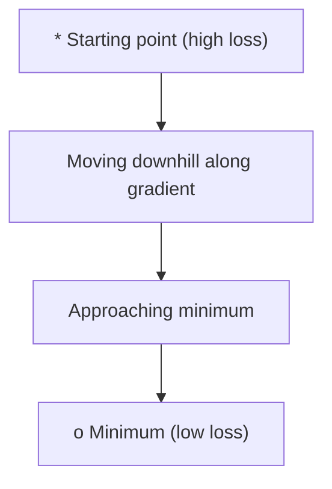
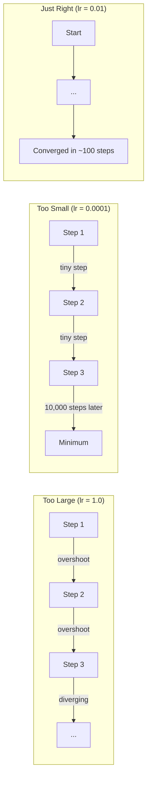
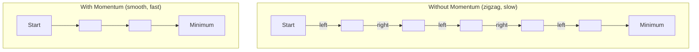
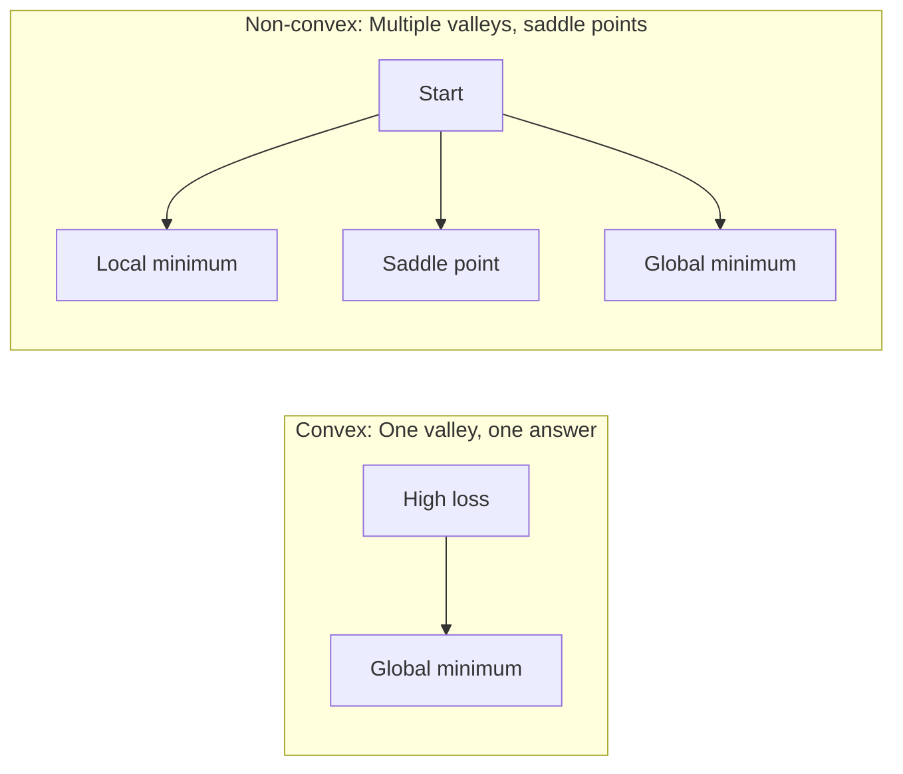
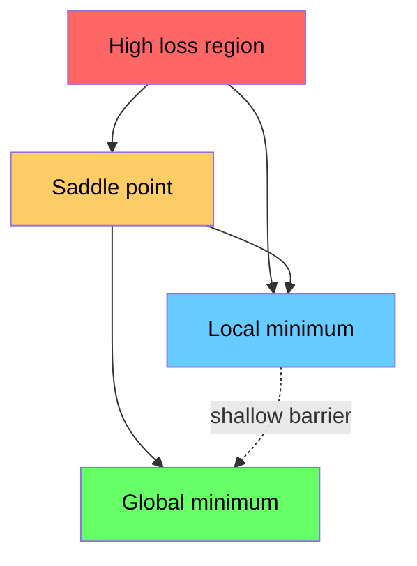

# Optimization

> Training a neural network is nothing more than finding the bottom of a valley.

**Type:** Build
**Language:** Python
**Prerequisites:** Phase 1, Lessons 04-05 (Derivatives, Gradients)
**Time:** ~75 minutes

## Learning Objectives

- Implement vanilla gradient descent, SGD with momentum, and Adam from scratch
- Compare optimizer convergence on the Rosenbrock function and explain why Adam adapts per-weight learning rates
- Distinguish convex from non-convex loss landscapes and explain the role of saddle points in high dimensions
- Configure learning rate schedules (step decay, cosine annealing, warmup) for training stability

## The Problem

You have a loss function. It tells you how wrong your model is. You have gradients. They tell you which direction makes the loss worse. Now you need a strategy for walking downhill.

The naive approach is simple: move opposite the gradient. Scale the step by some number called the learning rate. Repeat. This is gradient descent, and it works. But "works" has caveats. Too large a learning rate and you overshoot the valley entirely, bouncing between walls. Too small and you crawl toward the answer over thousands of unnecessary steps. Hit a saddle point and you stop moving even though you have not found a minimum.

Every optimizer in deep learning is an answer to the same question: how do you get to the bottom of the valley faster and more reliably?

## The Concept

### What optimization means

Optimization is finding the input values that minimize (or maximize) a function. In machine learning, the function is the loss. The inputs are the model's weights. Training is optimization.

```
minimize L(w) where:
  L = loss function
  w = model weights (could be millions of parameters)
```

### Gradient descent (vanilla)

The simplest optimizer. Compute the gradient of the loss with respect to every weight. Move each weight in the opposite direction of its gradient. Scale the step by the learning rate.

```
w = w - lr * gradient
```

That is the entire algorithm. One line.



### Learning rate: the most important hyperparameter

The learning rate controls step size. It determines everything about convergence.



There is no formula for the right learning rate. You find it by experiment. Common starting points: 0.001 for Adam, 0.01 for SGD with momentum.

### SGD vs batch vs mini-batch

Vanilla gradient descent computes the gradient over the entire dataset before taking one step. This is called batch gradient descent. It is stable but slow.

Stochastic gradient descent (SGD) computes the gradient on a single random sample and steps immediately. It is noisy but fast.

Mini-batch gradient descent splits the difference. Compute the gradient over a small batch (32, 64, 128, 256 samples), then step. This is what everyone actually uses.

| Variant | Batch size | Gradient quality | Speed per step | Noise |
|---------|-----------|-----------------|---------------|-------|
| Batch GD | Entire dataset | Exact | Slow | None |
| SGD | 1 sample | Very noisy | Fast | High |
| Mini-batch | 32-256 | Good estimate | Balanced | Moderate |

The noise in SGD and mini-batch is not a bug. It helps escape shallow local minima and saddle points.

### Momentum: the ball rolling downhill

Vanilla gradient descent only looks at the current gradient. If the gradient zigzags (common in narrow valleys), progress is slow. Momentum fixes this by accumulating past gradients into a velocity term.

```
v = beta * v + gradient
w = w - lr * v
```

The analogy: a ball rolling downhill. It does not stop and restart at every bump. It builds speed in consistent directions and dampens oscillations.



`beta` (typically 0.9) controls how much history to keep. Higher beta means more momentum, smoother paths, but slower response to direction changes.

### Adam: adaptive learning rates

Different weights need different learning rates. A weight that rarely gets large gradients should take bigger steps when it finally does. A weight that gets huge gradients constantly should take smaller steps.

Adam (Adaptive Moment Estimation) tracks two things per weight:

1. First moment (m): running average of gradients (like momentum)
2. Second moment (v): running average of squared gradients (gradient magnitude)

```
m = beta1 * m + (1 - beta1) * gradient
v = beta2 * v + (1 - beta2) * gradient^2

m_hat = m / (1 - beta1^t)    bias correction
v_hat = v / (1 - beta2^t)    bias correction

w = w - lr * m_hat / (sqrt(v_hat) + epsilon)
```

The division by `sqrt(v_hat)` is the key insight. Weights with large gradients get divided by a large number (small effective step). Weights with small gradients get divided by a small number (large effective step). Each weight gets its own adaptive learning rate.

Default hyperparameters: `lr=0.001, beta1=0.9, beta2=0.999, epsilon=1e-8`. These defaults work well for most problems.

### Learning rate schedules

A fixed learning rate is a compromise. Early in training, you want large steps to make fast progress. Late in training, you want small steps to fine-tune near the minimum.

Common schedules:

| Schedule | Formula | Use case |
|----------|---------|----------|
| Step decay | lr = lr * factor every N epochs | Simple, manual control |
| Exponential decay | lr = lr_0 * decay^t | Smooth reduction |
| Cosine annealing | lr = lr_min + 0.5 * (lr_max - lr_min) * (1 + cos(pi * t / T)) | Transformers, modern training |
| Warmup + decay | Linear ramp up, then decay | Large models, prevents early instability |

### Convex vs non-convex

A convex function has one minimum. Gradient descent always finds it. A quadratic like `f(x) = x^2` is convex.

Neural network loss functions are non-convex. They have many local minima, saddle points, and flat regions.



In practice, local minima in high-dimensional neural networks are rarely a problem. Most local minima have loss values close to the global minimum. Saddle points (flat in some directions, curved in others) are the real obstacle. Momentum and noise from mini-batches help escape them.

### Loss landscape visualization

The loss is a function of all weights. For a model with 1 million weights, the loss landscape lives in 1,000,001-dimensional space. We visualize it by picking two random directions in weight space and plotting the loss along those directions, producing a 2D surface.



Sharp minima generalize poorly. Flat minima generalize well. This is one reason SGD with momentum often outperforms Adam on final test accuracy: its noise prevents settling into sharp minima.

## Build It

### Step 1: Define a test function

The Rosenbrock function is a classic optimization benchmark. Its minimum is at (1, 1) inside a narrow curved valley that is easy to find but hard to follow.

```
f(x, y) = (1 - x)^2 + 100 * (y - x^2)^2
```

```python
def rosenbrock(params):
    x, y = params
    return (1 - x) ** 2 + 100 * (y - x ** 2) ** 2

def rosenbrock_gradient(params):
    x, y = params
    df_dx = -2 * (1 - x) + 200 * (y - x ** 2) * (-2 * x)
    df_dy = 200 * (y - x ** 2)
    return [df_dx, df_dy]
```

### Step 2: Vanilla gradient descent

```python
class GradientDescent:
    def __init__(self, lr=0.001):
        self.lr = lr

    def step(self, params, grads):
        return [p - self.lr * g for p, g in zip(params, grads)]
```

### Step 3: SGD with momentum

```python
class SGDMomentum:
    def __init__(self, lr=0.001, momentum=0.9):
        self.lr = lr
        self.momentum = momentum
        self.velocity = None

    def step(self, params, grads):
        if self.velocity is None:
            self.velocity = [0.0] * len(params)
        self.velocity = [
            self.momentum * v + g
            for v, g in zip(self.velocity, grads)
        ]
        return [p - self.lr * v for p, v in zip(params, self.velocity)]
```

### Step 4: Adam

```python
class Adam:
    def __init__(self, lr=0.001, beta1=0.9, beta2=0.999, epsilon=1e-8):
        self.lr = lr
        self.beta1 = beta1
        self.beta2 = beta2
        self.epsilon = epsilon
        self.m = None
        self.v = None
        self.t = 0

    def step(self, params, grads):
        if self.m is None:
            self.m = [0.0] * len(params)
            self.v = [0.0] * len(params)

        self.t += 1

        self.m = [
            self.beta1 * m + (1 - self.beta1) * g
            for m, g in zip(self.m, grads)
        ]
        self.v = [
            self.beta2 * v + (1 - self.beta2) * g ** 2
            for v, g in zip(self.v, grads)
        ]

        m_hat = [m / (1 - self.beta1 ** self.t) for m in self.m]
        v_hat = [v / (1 - self.beta2 ** self.t) for v in self.v]

        return [
            p - self.lr * mh / (vh ** 0.5 + self.epsilon)
            for p, mh, vh in zip(params, m_hat, v_hat)
        ]
```

### Step 5: Run and compare

```python
def optimize(optimizer, func, grad_func, start, steps=5000):
    params = list(start)
    history = [params[:]]
    for _ in range(steps):
        grads = grad_func(params)
        params = optimizer.step(params, grads)
        history.append(params[:])
    return history

start = [-1.0, 1.0]

gd_history = optimize(GradientDescent(lr=0.0005), rosenbrock, rosenbrock_gradient, start)
sgd_history = optimize(SGDMomentum(lr=0.0001, momentum=0.9), rosenbrock, rosenbrock_gradient, start)
adam_history = optimize(Adam(lr=0.01), rosenbrock, rosenbrock_gradient, start)

for name, history in [("GD", gd_history), ("SGD+M", sgd_history), ("Adam", adam_history)]:
    final = history[-1]
    loss = rosenbrock(final)
    print(f"{name:6s} -> x={final[0]:.6f}, y={final[1]:.6f}, loss={loss:.8f}")
```

Expected output: Adam converges fastest. SGD with momentum follows a smoother path. Vanilla GD makes slow progress along the narrow valley.

## Use It

In practice, use PyTorch or JAX optimizers. They handle parameter groups, weight decay, gradient clipping, and GPU acceleration.

```python
import torch

model = torch.nn.Linear(784, 10)

sgd = torch.optim.SGD(model.parameters(), lr=0.01, momentum=0.9)
adam = torch.optim.Adam(model.parameters(), lr=0.001)
adamw = torch.optim.AdamW(model.parameters(), lr=0.001, weight_decay=0.01)

scheduler = torch.optim.lr_scheduler.CosineAnnealingLR(adam, T_max=100)
```

经验法则：

- 从 Adam 开始（lr=0.001）。它无需调整即可解决大多数问题。
- 当您需要最佳的最终精度并且可以承受更多调整时，切换到动量 SGD（lr=0.01，动量=0.9）。
- 使用 AdamW（具有解耦权重衰减的 Adam）作为变压器。
- 始终使用学习率计划来进行超过几个时期的训练。
- 如果训练不稳定，降低学习率。如果训练太慢，请增加训练量。

## 发货

本课程将提示您选择正确的优化器。请参阅“outputs/prompt-optimizer-guide.md”。

当我们从头开始训练神经网络时，此处构建的优化器类会在第 3 阶段重新出现。

## 练习

1. **学习率扫描。** 在 Rosenbrock 函数上运行普通梯度下降，学习率为 [0.0001, 0.0005, 0.001, 0.005, 0.01]。绘制或打印每个步骤 5000 步后的最终损失。找到仍然收敛的最大学习率。

2. **动量比较。** 在 Rosenbrock 函数上使用动量值 [0.0, 0.5, 0.9, 0.99] 运行 SGD。跟踪每一步的损失。哪个动量值收敛得最快？哪个超调了？

3. **鞍点逃逸。** 定义函数`f(x, y) = x^2 - y^2`（原点处的鞍点）。从 (0.01, 0.01) 开始。比较普通 GD、带动量的 SGD 和 Adam 的行为。哪个逃脱了鞍点？

4. **实现学习率衰减。** 在 GradientDescent 类中添加指数衰减时间表：`lr = lr_0 * 0.999^step`。比较 Rosenbrock 函数有和没有衰减的收敛性。

## 关键术语

|术语 |人们怎么说 |它实际上意味着什么 |
|------|----------------|----------------------|
|梯度下降| “走下坡路”|通过减去学习率缩放的梯度来更新权重。最基本的优化器。 |
|学习率| “步长”|控制每次更新将权重移动多远的标量。太大会导致发散。太小会浪费计算。 |
|势头| “继续滚动”|将过去的梯度累积到速度向量中。抑制振荡并加速一致方向的运动。 |
|新元 | “随机抽样”|随机梯度下降。在随机子集而不是完整数据集上计算梯度。在实践中几乎总是意味着小批量 SGD。 |
|小批量| “一大块数据”|用于估计梯度的一小部分训练数据（32-256 个样本）。平衡速度和梯度精度。 |
|亚当| “默认优化器”|自适应矩估计。跟踪每个权重的梯度和梯度平方运行平均值，为每个权重提供自己的学习率。 |
|偏差校正| “修复冷启动” | Adam 的第一和第二时刻被初始化为零。偏差校正除以 (1 - beta^t) 以在早期步骤中进行补偿。 |
|学习率表| “随着时间的推移改变lr” |在训练过程中调整学习率的函数。早迈大步，晚迈小步。 |
|凸函数| 《一谷》|任何局部最小值都是全局最小值的函数。梯度下降总能找到它。神经网络损失不是凸的。 |
|鞍点| “持平但不是最低限度” |梯度为零但在某些方向上最小而在其他方向上最大的点。常见于高维度。 |
|损失景观| “地形”|损失函数在权重空间上绘制。通过沿两个随机方向切片来可视化。 |
|收敛| “到达那里”|优化器已经达到了进一步的步骤并不能有效减少损失的程度。 |

## 进一步阅读

- [Sebastian Ruder：梯度下降优化算法概述](https://ruder.io/optimizing-gradient-descent/) - 所有主要优化器的全面调查
- [为什么 Momentum 真正有效 (Distill)](https://distill.pub/2017/momentum/) - 动量动态的交互式可视化
- [Adam: A Method for Stochastic Optimization (Kingma & Ba, 2014)](https://arxiv.org/abs/1412.6980) - Adam 的原始论文，可读且简短
- [可视化神经网络的损失景观 (Li et al., 2018)](https://arxiv.org/abs/1712.09913) - 该论文显示了锐利与平坦的最小值
