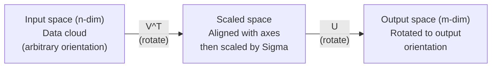
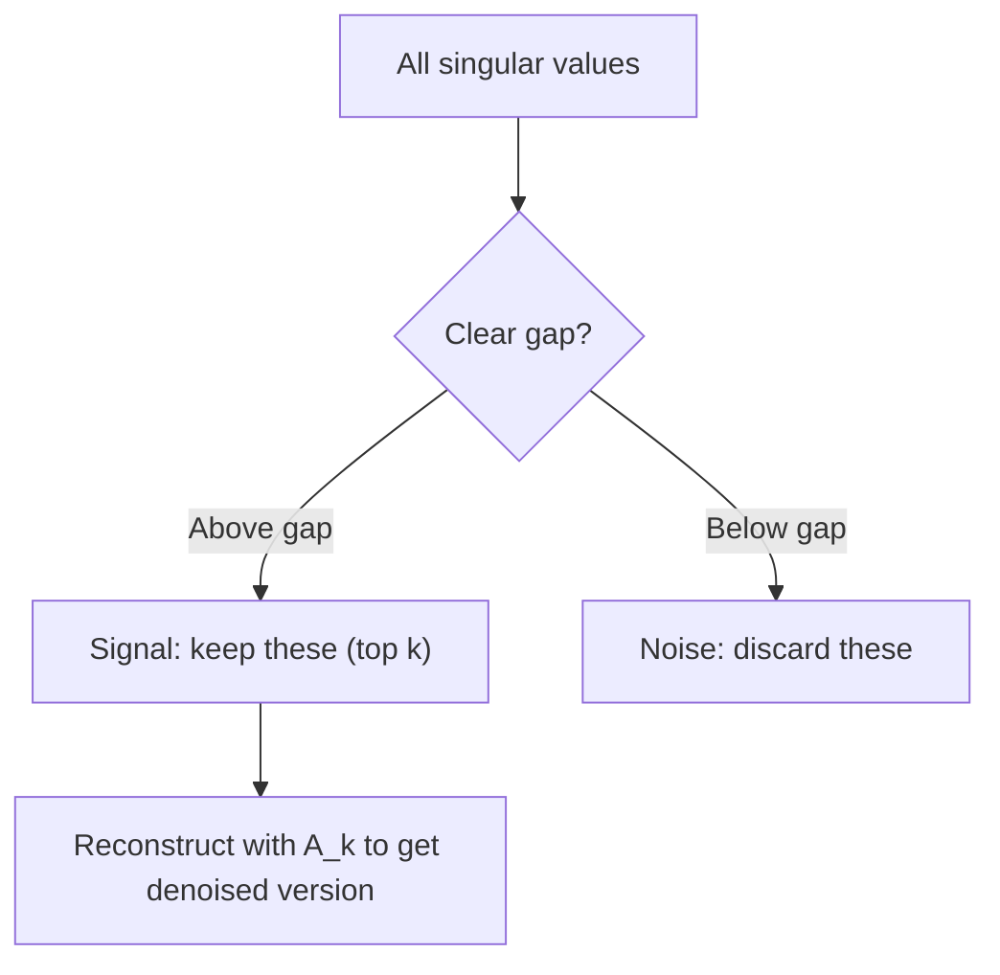

# Singular Value Decomposition

> SVD is the Swiss Army knife of linear algebra. Every matrix has one. Every data scientist needs one.

**Type:** Build
**Languages:** Python, Julia
**Prerequisites:** Phase 1, Lessons 01 (Linear Algebra Intuition), 02 (Vectors & Matrices Operations), 03 (Matrix Transformations)
**Time:** ~120 minutes

## Learning Objectives

- Implement SVD via power iteration and explain the geometric meaning of U, Sigma, and V^T
- Apply truncated SVD for image compression and measure the compression ratio vs reconstruction error
- Compute the Moore-Penrose pseudoinverse via SVD to solve overdetermined least-squares systems
- Connect SVD to PCA, recommendation systems (latent factors), and Latent Semantic Analysis in NLP

## The Problem

You have a 1000x2000 matrix. Maybe it is user-movie ratings. Maybe it is a document-term frequency table. Maybe it is the pixel values of an image. You need to compress it, denoise it, find hidden structure in it, or solve a least-squares system with it. Eigendecomposition only works on square matrices. Even then, it requires the matrix to have a full set of linearly independent eigenvectors.

SVD works on any matrix. Any shape. Any rank. No conditions. It decomposes the matrix into three factors that reveal the geometry of what the matrix does to space. It is the most general and most useful factorization in all of linear algebra.

## The Concept

### What SVD does geometrically

Every matrix, regardless of shape, performs three operations in sequence: rotate, scale, rotate. SVD makes this decomposition explicit.

```
A = U * Sigma * V^T

      m x n     m x m    m x n    n x n
     (any)    (rotate)  (scale)  (rotate)
```

Given any matrix A, SVD factors it into:
- V^T rotates vectors in the input space (n-dimensional)
- Sigma scales along each axis (stretches or compresses)
- U rotates the result into the output space (m-dimensional)



Think of it this way. You hand SVD a matrix. It tells you: "This matrix takes a sphere of inputs, first rotates it by V^T, then stretches it into an ellipsoid by Sigma, then rotates the ellipsoid by U." The singular values are the lengths of the ellipsoid's axes.

### The full decomposition

For a matrix A with shape m x n:

```
A = U * Sigma * V^T

where:
  U     is m x m, orthogonal (U^T U = I)
  Sigma is m x n, diagonal (singular values on the diagonal)
  V     is n x n, orthogonal (V^T V = I)

The singular values sigma_1 >= sigma_2 >= ... >= sigma_r > 0
where r = rank(A)
```

The columns of U are called left singular vectors. The columns of V are called right singular vectors. The diagonal entries of Sigma are called singular values. They are always non-negative and conventionally sorted in decreasing order.

### Left singular vectors, singular values, right singular vectors

Each component of the SVD has a distinct geometric meaning.

**Right singular vectors (columns of V):** These form an orthonormal basis for the input space (R^n). They are the directions in input space that the matrix maps to orthogonal directions in output space. Think of them as the natural coordinate system for the domain.

**Singular values (diagonal of Sigma):** These are the scaling factors. The i-th singular value tells you how much the matrix stretches vectors along the i-th right singular vector. A singular value of zero means the matrix crushes that direction entirely.

**Left singular vectors (columns of U):** These form an orthonormal basis for the output space (R^m). The i-th left singular vector is the direction in output space where the i-th right singular vector lands (after scaling).

The relationship between them:

```
A * v_i = sigma_i * u_i

The matrix A takes the i-th right singular vector v_i,
scales it by sigma_i, and maps it to the i-th left singular vector u_i.
```

This gives you a coordinate-by-coordinate picture of what any matrix does.

### Outer product form

The SVD can be written as a sum of rank-1 matrices:

```
A = sigma_1 * u_1 * v_1^T + sigma_2 * u_2 * v_2^T + ... + sigma_r * u_r * v_r^T

Each term sigma_i * u_i * v_i^T is a rank-1 matrix (an outer product).
The full matrix is the sum of r such matrices, where r is the rank.
```

This form is the foundation of low-rank approximation. Each term adds one layer of structure. The first term captures the single most important pattern. The second captures the next most important. And so on. Truncating this sum gives you the best possible approximation at any given rank.

```
Rank-1 approx:    A_1 = sigma_1 * u_1 * v_1^T
                  (captures the dominant pattern)

Rank-2 approx:    A_2 = sigma_1 * u_1 * v_1^T + sigma_2 * u_2 * v_2^T
                  (captures the two most important patterns)

Rank-k approx:    A_k = sum of top k terms
                  (optimal by the Eckart-Young theorem)
```

### Relationship to eigendecomposition

SVD and eigendecomposition are deeply connected. The singular values and vectors of A come directly from the eigenvalues and eigenvectors of A^T A and A A^T.

```
A^T A = V * Sigma^T * U^T * U * Sigma * V^T
      = V * Sigma^T * Sigma * V^T
      = V * D * V^T

where D = Sigma^T * Sigma is a diagonal matrix with sigma_i^2 on the diagonal.

So:
- The right singular vectors (V) are eigenvectors of A^T A
- The singular values squared (sigma_i^2) are eigenvalues of A^T A

Similarly:
A A^T = U * Sigma * V^T * V * Sigma^T * U^T
      = U * Sigma * Sigma^T * U^T

So:
- The left singular vectors (U) are eigenvectors of A A^T
- The eigenvalues of A A^T are also sigma_i^2
```

This connection tells you three things:
1. Singular values are always real and non-negative (they are square roots of eigenvalues of a positive semi-definite matrix).
2. You could compute SVD via eigendecomposition of A^T A, but this squares the condition number and loses numerical precision. Dedicated SVD algorithms avoid this.
3. When A is square and symmetric positive semi-definite, SVD and eigendecomposition are the same thing.

### Truncated SVD: low-rank approximation

The Eckart-Young-Mirsky theorem states that the best rank-k approximation to A (in both Frobenius and spectral norm) is obtained by keeping only the top k singular values and their corresponding vectors:

```
A_k = U_k * Sigma_k * V_k^T

where:
  U_k     is m x k  (first k columns of U)
  Sigma_k is k x k  (top-left k x k block of Sigma)
  V_k     is n x k  (first k columns of V)

Approximation error = sigma_{k+1}  (in spectral norm)
                    = sqrt(sigma_{k+1}^2 + ... + sigma_r^2)  (in Frobenius norm)
```

This is not just "a good" approximation. It is provably the best possible approximation of rank k. No other rank-k matrix is closer to A.

| Component | Relative magnitude | Kept in rank-3 approx? |
|-----------|-------------------|------------------------|
| sigma_1 | Largest | Yes |
| sigma_2 | Large | Yes |
| sigma_3 | Medium-large | Yes |
| sigma_4 | Medium | No (error) |
| sigma_5 | Medium-small | No (error) |
| sigma_6 | Small | No (error) |
| sigma_7 | Very small | No (error) |
| sigma_8 | Tiny | No (error) |

Keep top 3: A_3 captures the three largest singular values. Error = remaining values (sigma_4 through sigma_8).

If singular values decay fast, a small k captures most of the matrix. If they decay slowly, the matrix has no low-rank structure.

### Image compression with SVD

A grayscale image is a matrix of pixel intensities. An 800x600 image has 480,000 values. SVD lets you approximate it with far fewer.

```
Original image: 800 x 600 = 480,000 values

SVD with rank k:
  U_k:      800 x k values
  Sigma_k:  k values
  V_k:      600 x k values
  Total:    k * (800 + 600 + 1) = k * 1401 values

  k=10:   14,010 values   (2.9% of original)
  k=50:   70,050 values  (14.6% of original)
  k=100: 140,100 values  (29.2% of original)

  The compression ratio improves as k gets smaller,
  but visual quality degrades.
```

The key insight: natural images have rapidly decaying singular values. The first few singular values capture the broad structure (shapes, gradients). The later ones capture fine detail and noise. Truncating at rank 50 often produces an image that looks nearly identical to the original while using 85% less storage.

### SVD for recommendation systems

The Netflix Prize made this famous. You have a user-movie ratings matrix where most entries are missing.

```
             Movie1  Movie2  Movie3  Movie4  Movie5
  User1      [  5      ?       3       ?       1  ]
  User2      [  ?      4       ?       2       ?  ]
  User3      [  3      ?       5       ?       ?  ]
  User4      [  ?      ?       ?       4       3  ]

  ? = unknown rating
```

The idea: this ratings matrix has low rank. Users do not have completely independent tastes. There are a handful of latent factors (action vs. drama, old vs. new, cerebral vs. visceral) that explain most preferences.

SVD on the (filled-in) ratings matrix decomposes it into:
- U: user profiles in latent factor space
- Sigma: importance of each latent factor
- V^T: movie profiles in latent factor space

A user's predicted rating for a movie is the dot product of their user profile with the movie's profile (weighted by singular values). The low-rank approximation fills in the missing entries.

In practice, you use variants like Simon Funk's incremental SVD or ALS (alternating least squares) that handle missing data directly. But the core idea is the same: latent factor decomposition via SVD.

### SVD in NLP: Latent Semantic Analysis

Latent Semantic Analysis (LSA), also called Latent Semantic Indexing (LSI), applies SVD to a term-document matrix.

```
             Doc1   Doc2   Doc3   Doc4
  "cat"      [  3      0      1      0  ]
  "dog"      [  2      0      0      1  ]
  "fish"     [  0      4      1      0  ]
  "pet"      [  1      1      1      1  ]
  "ocean"    [  0      3      0      0  ]

After SVD with rank k=2:

  Each document becomes a point in 2D "concept space."
  Each term becomes a point in the same 2D space.
  Documents about similar topics cluster together.
  Terms with similar meanings cluster together.

  "cat" and "dog" end up near each other (land pets).
  "fish" and "ocean" end up near each other (water concepts).
  Doc1 and Doc3 cluster if they share similar topics.
```

LSA was one of the first successful methods for capturing semantic similarity from raw text. It works because synonymous terms tend to appear in similar documents, so SVD groups them into the same latent dimensions. Modern word embeddings (Word2Vec, GloVe) can be seen as descendants of this idea.

### SVD for noise reduction

Noisy data has signal concentrated in the top singular values and noise spread across all singular values. Truncating removes the noise floor.

**Clean signal singular values:**

| Component | Magnitude | Type |
|-----------|-----------|------|
| sigma_1 | Very large | Signal |
| sigma_2 | Large | Signal |
| sigma_3 | Medium | Signal |
| sigma_4 | Near zero | Negligible |
| sigma_5 | Near zero | Negligible |

**Noisy signal singular values (noise adds to all):**

| Component | Magnitude | Type |
|-----------|-----------|------|
| sigma_1 | Very large | Signal |
| sigma_2 | Large | Signal |
| sigma_3 | Medium | Signal |
| sigma_4 | Small | Noise |
| sigma_5 | Small | Noise |
| sigma_6 | Small | Noise |
| sigma_7 | Small | Noise |



This is used in signal processing, scientific measurement, and data cleaning. Any time you have a matrix corrupted by additive noise, truncated SVD is a principled way to separate signal from noise.

### Pseudoinverse via SVD

The Moore-Penrose pseudoinverse A+ generalizes matrix inversion to non-square and singular matrices. SVD makes computing it trivial.

```
If A = U * Sigma * V^T, then:

A+ = V * Sigma+ * U^T

where Sigma+ is formed by:
  1. Transpose Sigma (swap rows and columns)
  2. Replace each non-zero diagonal entry sigma_i with 1/sigma_i
  3. Leave zeros as zeros

For A (m x n):      A+ is (n x m)
For Sigma (m x n):  Sigma+ is (n x m)
```

The pseudoinverse solves least-squares problems. If Ax = b has no exact solution (overdetermined system), then x = A+ b is the least-squares solution (minimizes ||Ax - b||).

```
Overdetermined system (more equations than unknowns):

  [1  1]         [3]
  [2  1] x   =   [5]       No exact solution exists.
  [3  1]         [6]

  x_ls = A+ b = V * Sigma+ * U^T * b

  This gives the x that minimizes the sum of squared residuals.
  Same result as the normal equations (A^T A)^(-1) A^T b,
  but numerically more stable.
```

### Numerical stability advantages

Computing eigendecomposition of A^T A squares the singular values (eigenvalues of A^T A are sigma_i^2). This squares the condition number, amplifying numerical errors.

```
Example:
  A has singular values [1000, 1, 0.001]
  Condition number of A: 1000 / 0.001 = 10^6

  A^T A has eigenvalues [10^6, 1, 10^{-6}]
  Condition number of A^T A: 10^6 / 10^{-6} = 10^{12}

  Computing SVD directly: works with condition number 10^6
  Computing via A^T A:     works with condition number 10^{12}
                           (6 extra digits of precision lost)
```

Modern SVD algorithms (Golub-Kahan bidiagonalization) work directly on A, never forming A^T A. This is why you should always prefer `np.linalg.svd(A)` over `np.linalg.eig(A.T @ A)`.

### Connection to PCA

PCA IS SVD on centered data. This is not an analogy. It is literally the same computation.

```
Given data matrix X (n_samples x n_features), centered (mean subtracted):

Covariance matrix: C = (1/(n-1)) * X^T X

PCA finds eigenvectors of C. But:

  X = U * Sigma * V^T    (SVD of X)

  X^T X = V * Sigma^2 * V^T

  C = (1/(n-1)) * V * Sigma^2 * V^T

So the principal components are exactly the right singular vectors V.
The explained variance for each component is sigma_i^2 / (n-1).

In sklearn, PCA is implemented using SVD, not eigendecomposition.
It is faster and more numerically stable.
```

This means everything you learned about dimensionality reduction in Lesson 10 is SVD under the hood. PCA is the most common application of SVD in machine learning.

## Build It

### Step 1: SVD from scratch using power iteration

The idea: to find the largest singular value and its vectors, use power iteration on A^T A (or A A^T). Then deflate the matrix and repeat for the next singular value.

```python
import numpy as np

def power_iteration(M, num_iters=100):
    n = M.shape[1]
    v = np.random.randn(n)
    v = v / np.linalg.norm(v)

    for _ in range(num_iters):
        Mv = M @ v
        v = Mv / np.linalg.norm(Mv)

    eigenvalue = v @ M @ v
    return eigenvalue, v

def svd_from_scratch(A, k=None):
    m, n = A.shape
    if k is None:
        k = min(m, n)

    sigmas = []
    us = []
    vs = []

    A_residual = A.copy().astype(float)

    for _ in range(k):
        AtA = A_residual.T @ A_residual
        eigenvalue, v = power_iteration(AtA, num_iters=200)

        if eigenvalue < 1e-10:
            break

        sigma = np.sqrt(eigenvalue)
        u = A_residual @ v / sigma

        sigmas.append(sigma)
        us.append(u)
        vs.append(v)

        A_residual = A_residual - sigma * np.outer(u, v)

    U = np.column_stack(us) if us else np.empty((m, 0))
    S = np.array(sigmas)
    V = np.column_stack(vs) if vs else np.empty((n, 0))

    return U, S, V
```

### Step 2: Test and compare with NumPy

```python
np.random.seed(42)
A = np.random.randn(5, 4)

U_ours, S_ours, V_ours = svd_from_scratch(A)
U_np, S_np, Vt_np = np.linalg.svd(A, full_matrices=False)

print("Our singular values:", np.round(S_ours, 4))
print("NumPy singular values:", np.round(S_np, 4))

A_reconstructed = U_ours @ np.diag(S_ours) @ V_ours.T
print(f"Reconstruction error: {np.linalg.norm(A - A_reconstructed):.8f}")
```

### Step 3: Image compression demo

```python
def compress_image_svd(image_matrix, k):
    U, S, Vt = np.linalg.svd(image_matrix, full_matrices=False)
    compressed = U[:, :k] @ np.diag(S[:k]) @ Vt[:k, :]
    return compressed

image = np.random.seed(42)
rows, cols = 200, 300
image = np.random.randn(rows, cols)

for k in [1, 5, 10, 20, 50]:
    compressed = compress_image_svd(image, k)
    error = np.linalg.norm(image - compressed) / np.linalg.norm(image)
    original_size = rows * cols
    compressed_size = k * (rows + cols + 1)
    ratio = compressed_size / original_size
    print(f"k={k:>3d}  error={error:.4f}  storage={ratio:.1%}")
```

### Step 4: Noise reduction

```python
np.random.seed(42)
clean = np.outer(np.sin(np.linspace(0, 4*np.pi, 100)),
                 np.cos(np.linspace(0, 2*np.pi, 80)))
noise = 0.3 * np.random.randn(100, 80)
noisy = clean + noise

U, S, Vt = np.linalg.svd(noisy, full_matrices=False)
denoised = U[:, :5] @ np.diag(S[:5]) @ Vt[:5, :]

print(f"Noisy error:    {np.linalg.norm(noisy - clean):.4f}")
print(f"Denoised error: {np.linalg.norm(denoised - clean):.4f}")
print(f"Improvement:    {(1 - np.linalg.norm(denoised - clean) / np.linalg.norm(noisy - clean)):.1%}")
```

### Step 5: Pseudoinverse

```python
A = np.array([[1, 1], [2, 1], [3, 1]], dtype=float)
b = np.array([3, 5, 6], dtype=float)

U, S, Vt = np.linalg.svd(A, full_matrices=False)
S_inv = np.diag(1.0 / S)
A_pinv = Vt.T @ S_inv @ U.T

x_svd = A_pinv @ b
x_lstsq = np.linalg.lstsq(A, b, rcond=None)[0]
x_pinv = np.linalg.pinv(A) @ b

print(f"SVD pseudoinverse solution:  {x_svd}")
print(f"np.linalg.lstsq solution:   {x_lstsq}")
print(f"np.linalg.pinv solution:    {x_pinv}")
```

## Use It

Full working demos are in `code/svd.py`. Run it to see SVD applied to image compression, recommendation systems, latent semantic analysis, and noise reduction.

```bash
python svd.py
```

The Julia version in `code/svd.jl` demonstrates the same concepts using Julia's native `svd()` function and `LinearAlgebra` package.

```bash
julia svd.jl
```

## 发货

本课产生：
- `outputs/skill-svd.md` - 了解何时以及如何在实际项目中应用 SVD 的技能

## 练习

1. 从头开始​​实现完整的 SVD，而不使用幂迭代。相反，计算 A^T A 的特征分解以获得 V 和奇异值，然后计算 U = A V Sigma^{-1}。将数值精度与您的幂迭代版本和 NumPy 进行比较。

2. 加载真实的灰度图像（或将其转换为灰度图像）。按等级 1、5、10、25、50、100 对其进行压缩。对于每个等级，计算压缩比和相对误差。找到图像在视觉上可接受的等级。

3. 构建一个小型推荐系统。使用一些已知条目创建 10x8 用户电影评分矩阵。用行平均值填充缺失的条目。计算 SVD 并重建 3 阶近似。使用重建的矩阵来预测缺失的评分。验证预测是否合理。

4. 创建一个包含 3 个综合主题的 100x50 文档术语矩阵。每个主题有 5 个相关术语。添加噪音。应用 SVD 并验证前 3 个奇异值是否比其余的大得多。将文档投影到 3D 潜在空间中，并检查来自同一主题的文档是否聚集在一起。

5. 生成一个干净的低秩矩阵（秩为 3，大小为 50x40）并添加不同级别的高斯噪声（sigma = 0.1、0.5、1.0、2.0）。对于每个噪声级别，通过将 k 从 1 扫描到 40 并根据干净矩阵测量重建误差来找到最佳截断等级。绘制最佳 k 如何随噪声水平变化的图。

## 关键术语

|术语 |人们怎么说 |它实际上意味着什么 |
|------|----------------|----------------------|
|奇异值分解| “因式分解任意矩阵” |将 A 分解为 U Sigma V^T，其中 U 和 V 是正交的，而 Sigma 是具有非负项的对角线。适用于任何形状的任何矩阵。 |
|奇异值| “这个组件有多重要”| Sigma 的第 i 个对角线条目。测量矩阵沿第 i 个主方向拉伸的程度。始终非负，按降序排序。 |
|左奇异向量| “输出方向” | U 的列。第 i 个右奇异向量映射到的输出空间方向（按 sigma_i 缩放后）。 |
|右奇异向量| “输入方向” | V 的列。矩阵映射到第 i 个左奇异向量的输入空间方向（按 sigma_i 缩放后）。 |
|截断 SVD | “低阶近似” |仅保留前 k 个奇异值及其向量。产生原始矩阵的可证明最佳的 k 阶近似（埃卡特-杨定理）。 |
|排名| “真实的维度” |非零奇异值的数量。告诉您矩阵实际使用了多少个独立方向。 |
|伪逆| “广义逆”| V西格玛+ U^T。反转非零奇异值，将零保留为零。解决非方阵或奇异矩阵的最小二乘问题。 |
|条件编号| “对错误有多敏感”|西格玛_最大/西格玛_最小值。大的条件数意味着小的输入变化会导致大的输出变化。 SVD 直接揭示了这一点。 |
|潜在因素| “隐藏变量” | SVD 发现的低秩空间中的一个维度。在推荐中，潜在因素可能对应于类型偏好。在 NLP 中，它可能对应于一个主题。 |
|弗罗贝尼乌斯范数 | “总矩阵大小”|平方项之和的平方根。等于奇异值平方和的平方根。用于测量近似误差。 |
|埃卡特-杨定理| “SVD 提供最佳压缩”|对于任何目标秩 k，截断的 SVD 最小化所有可能的秩 k 矩阵的近似误差。 |
|动力迭代| “找到最大的特征向量”|将随机向量重复乘以矩阵并标准化。收敛到具有最大特征值的特征向量。许多 SVD 算法的构建块。 |

## 进一步阅读

- [Gilbert Strang：线性代数及其应用，第 7 章](https://math.mit.edu/~gs/linearalgebra/) - 通过应用彻底处理 SVD
- [3Blue1Brown：但是什么是 SVD？](https://www.youtube.com/watch?v=vSczTbgc8Rc) - SVD 的几何直觉
- [我们推荐奇异值分解](https://www.ams.org/publicoutreach/feature-column/fcarc-svd) - 来自美国数学会的可访问概述
- [Netflix 奖和矩阵分解](https://sifter.org/~simon/journal/20061211.html) - Simon Funk 关于 SVD 的原创博客文章寻求推荐
- [潜在语义分析](https://en.wikipedia.org/wiki/Latent_semantic_analysis) - SVD 的原始 NLP 应用
- [Trefethen 和 Bau 的数值线性代数](https://people.maths.ox.ac.uk/trefethen/text.html) - 理解 SVD 算法及其数值属性的黄金标准
