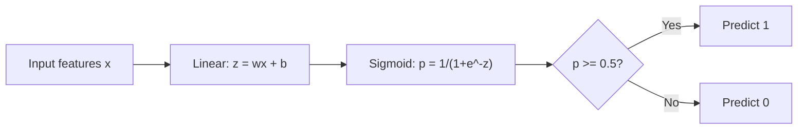
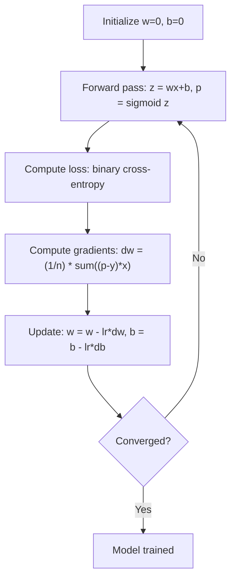

# Logistic Regression

> Logistic regression bends a straight line into an S-curve to answer yes-or-no questions with probabilities.

**Type:** Build
**Languages:** Python
**Prerequisites:** Phase 2 Lesson 1-2 (What Is ML, Linear Regression)
**Time:** ~90 minutes

## Learning Objectives

- Implement logistic regression from scratch using the sigmoid function and binary cross-entropy loss
- Compute and interpret precision, recall, F1 score, and the confusion matrix for binary classification
- Explain why MSE fails for classification and why binary cross-entropy produces a convex cost surface
- Build a softmax regression model for multi-class classification and evaluate threshold tuning tradeoffs

## The Problem

You want to predict whether a tumor is malignant or benign given its size. You try linear regression. It outputs numbers like 0.3 or 1.7 or -0.5. What do those mean? Is 1.7 "very malignant"? Is -0.5 "very benign"? Linear regression outputs unbounded numbers. Classification needs bounded probabilities between 0 and 1, and a clear decision: yes or no.

Logistic regression solves this. It takes the same linear combination (wx + b) and passes it through the sigmoid function, which squashes any number into the range (0, 1). The output is a probability. You set a threshold (usually 0.5) and make a decision.

This is one of the most widely used algorithms in practice. Despite its name, logistic regression is a classification algorithm, not a regression algorithm. The name comes from the logistic (sigmoid) function it uses.

## The Concept

### Why Linear Regression Fails for Classification

Imagine predicting pass/fail (1/0) based on study hours. Linear regression fits a line through the data:

```
hours:  1   2   3   4   5   6   7   8   9   10
actual: 0   0   0   0   1   1   1   1   1   1
```

A linear fit might produce predictions like -0.2 at hour 1 and 1.3 at hour 10. These values are not probabilities. They go below 0 and above 1. Worse, a single outlier (someone who studied 50 hours) would drag the entire line, changing predictions for everyone.

Classification needs a function that:
- Outputs values between 0 and 1 (probabilities)
- Creates a sharp transition (a decision boundary)
- Is not distorted by outliers far from the boundary

### The Sigmoid Function

The sigmoid function does exactly this:

```
sigmoid(z) = 1 / (1 + e^(-z))
```

Properties:
- When z is large and positive, sigmoid(z) approaches 1
- When z is large and negative, sigmoid(z) approaches 0
- When z = 0, sigmoid(z) = 0.5
- The output is always between 0 and 1
- The function is smooth and differentiable everywhere

The derivative has a convenient form: sigmoid'(z) = sigmoid(z) * (1 - sigmoid(z)). This makes gradient computation efficient.

### Logistic Regression = Linear Model + Sigmoid

The model computes z = wx + b (same as linear regression), then applies sigmoid:



The output p is interpreted as P(y=1 | x), the probability that the input belongs to class 1. The decision boundary is where wx + b = 0, which makes sigmoid output exactly 0.5.

### Binary Cross-Entropy Loss

You cannot use MSE for logistic regression. MSE with a sigmoid creates a non-convex cost surface with many local minima. Instead, use binary cross-entropy (log loss):

```
Loss = -(1/n) * sum(y * log(p) + (1-y) * log(1-p))
```

Why this works:
- When y=1 and p is close to 1: log(1) = 0, so loss is near 0 (correct, low cost)
- When y=1 and p is close to 0: log(0) approaches negative infinity, so loss is huge (wrong, high cost)
- When y=0 and p is close to 0: log(1) = 0, so loss is near 0 (correct, low cost)
- When y=0 and p is close to 1: log(0) approaches negative infinity, so loss is huge (wrong, high cost)

This loss function is convex for logistic regression, guaranteeing a single global minimum.

### Gradient Descent for Logistic Regression

The gradients for binary cross-entropy with sigmoid have a clean form:

```
dL/dw = (1/n) * sum((p - y) * x)
dL/db = (1/n) * sum(p - y)
```

These look identical to the linear regression gradients. The difference is that p = sigmoid(wx + b) instead of p = wx + b. The sigmoid introduces the nonlinearity, but the gradient update rule stays the same.



### The Decision Boundary

For a 2D input (two features), the decision boundary is the line where:

```
w1*x1 + w2*x2 + b = 0
```

Points on one side get classified as 1, points on the other side as 0. Logistic regression always produces a linear decision boundary. If you need a curved boundary, you either add polynomial features or use a nonlinear model.

### Multi-Class Classification with Softmax

Binary logistic regression handles two classes. For k classes, use the softmax function:

```
softmax(z_i) = e^(z_i) / sum(e^(z_j) for all j)
```

Each class has its own weight vector. The model computes a score z_i for each class, then softmax converts scores to probabilities that sum to 1. The predicted class is the one with the highest probability.

The loss function becomes categorical cross-entropy:

```
Loss = -(1/n) * sum(sum(y_k * log(p_k)))
```

where y_k is 1 for the true class and 0 for all others (one-hot encoding).

### Evaluation Metrics

Accuracy alone is not enough. For a dataset with 95% negative and 5% positive, a model that always predicts negative gets 95% accuracy but is useless.

**Confusion Matrix**:

| | Predicted Positive | Predicted Negative |
|---|---|---|
| Actually Positive | True Positive (TP) | False Negative (FN) |
| Actually Negative | False Positive (FP) | True Negative (TN) |

**Precision**: Of all predicted positives, how many are actually positive?
```
Precision = TP / (TP + FP)
```

**Recall** (Sensitivity): Of all actual positives, how many did we catch?
```
Recall = TP / (TP + FN)
```

**F1 Score**: Harmonic mean of precision and recall. Balances both metrics.
```
F1 = 2 * (Precision * Recall) / (Precision + Recall)
```

When to prioritize:
- **Precision**: when false positives are costly (spam filter, you do not want to block legitimate email)
- **Recall**: when false negatives are costly (cancer screening, you do not want to miss a tumor)
- **F1**: when you need a single balanced metric

## Build It

### Step 1: Sigmoid function and data generation

```python
import random
import math

def sigmoid(z):
    z = max(-500, min(500, z))
    return 1.0 / (1.0 + math.exp(-z))


random.seed(42)
N = 200
X = []
y = []

for _ in range(N // 2):
    X.append([random.gauss(2, 1), random.gauss(2, 1)])
    y.append(0)

for _ in range(N // 2):
    X.append([random.gauss(5, 1), random.gauss(5, 1)])
    y.append(1)

combined = list(zip(X, y))
random.shuffle(combined)
X, y = zip(*combined)
X = list(X)
y = list(y)

print(f"Generated {N} samples (2 classes, 2 features)")
print(f"Class 0 center: (2, 2), Class 1 center: (5, 5)")
print(f"First 5 samples:")
for i in range(5):
    print(f"  Features: [{X[i][0]:.2f}, {X[i][1]:.2f}], Label: {y[i]}")
```

### Step 2: Logistic regression from scratch

```python
class LogisticRegression:
    def __init__(self, n_features, learning_rate=0.01):
        self.weights = [0.0] * n_features
        self.bias = 0.0
        self.lr = learning_rate
        self.loss_history = []

    def predict_proba(self, x):
        z = sum(w * xi for w, xi in zip(self.weights, x)) + self.bias
        return sigmoid(z)

    def predict(self, x, threshold=0.5):
        return 1 if self.predict_proba(x) >= threshold else 0

    def compute_loss(self, X, y):
        n = len(y)
        total = 0.0
        for i in range(n):
            p = self.predict_proba(X[i])
            p = max(1e-15, min(1 - 1e-15, p))
            total += y[i] * math.log(p) + (1 - y[i]) * math.log(1 - p)
        return -total / n

    def fit(self, X, y, epochs=1000, print_every=200):
        n = len(y)
        n_features = len(X[0])
        for epoch in range(epochs):
            dw = [0.0] * n_features
            db = 0.0
            for i in range(n):
                p = self.predict_proba(X[i])
                error = p - y[i]
                for j in range(n_features):
                    dw[j] += error * X[i][j]
                db += error
            for j in range(n_features):
                self.weights[j] -= self.lr * (dw[j] / n)
            self.bias -= self.lr * (db / n)
            loss = self.compute_loss(X, y)
            self.loss_history.append(loss)
            if epoch % print_every == 0:
                print(f"  Epoch {epoch:4d} | Loss: {loss:.4f} | w: [{self.weights[0]:.3f}, {self.weights[1]:.3f}] | b: {self.bias:.3f}")
        return self

    def accuracy(self, X, y):
        correct = sum(1 for i in range(len(y)) if self.predict(X[i]) == y[i])
        return correct / len(y)


split = int(0.8 * N)
X_train, X_test = X[:split], X[split:]
y_train, y_test = y[:split], y[split:]

print("\n=== Training Logistic Regression ===")
model = LogisticRegression(n_features=2, learning_rate=0.1)
model.fit(X_train, y_train, epochs=1000, print_every=200)

print(f"\nTrain accuracy: {model.accuracy(X_train, y_train):.4f}")
print(f"Test accuracy:  {model.accuracy(X_test, y_test):.4f}")
print(f"Weights: [{model.weights[0]:.4f}, {model.weights[1]:.4f}]")
print(f"Bias: {model.bias:.4f}")
```

### Step 3: Confusion matrix and metrics from scratch

```python
class ClassificationMetrics:
    def __init__(self, y_true, y_pred):
        self.tp = sum(1 for t, p in zip(y_true, y_pred) if t == 1 and p == 1)
        self.tn = sum(1 for t, p in zip(y_true, y_pred) if t == 0 and p == 0)
        self.fp = sum(1 for t, p in zip(y_true, y_pred) if t == 0 and p == 1)
        self.fn = sum(1 for t, p in zip(y_true, y_pred) if t == 1 and p == 0)

    def accuracy(self):
        total = self.tp + self.tn + self.fp + self.fn
        return (self.tp + self.tn) / total if total > 0 else 0

    def precision(self):
        denom = self.tp + self.fp
        return self.tp / denom if denom > 0 else 0

    def recall(self):
        denom = self.tp + self.fn
        return self.tp / denom if denom > 0 else 0

    def f1(self):
        p = self.precision()
        r = self.recall()
        return 2 * p * r / (p + r) if (p + r) > 0 else 0

    def print_confusion_matrix(self):
        print(f"\n  Confusion Matrix:")
        print(f"                  Predicted")
        print(f"                  Pos   Neg")
        print(f"  Actual Pos     {self.tp:4d}  {self.fn:4d}")
        print(f"  Actual Neg     {self.fp:4d}  {self.tn:4d}")

    def print_report(self):
        self.print_confusion_matrix()
        print(f"\n  Accuracy:  {self.accuracy():.4f}")
        print(f"  Precision: {self.precision():.4f}")
        print(f"  Recall:    {self.recall():.4f}")
        print(f"  F1 Score:  {self.f1():.4f}")


y_pred_test = [model.predict(x) for x in X_test]
print("\n=== Classification Report (Test Set) ===")
metrics = ClassificationMetrics(y_test, y_pred_test)
metrics.print_report()
```

### Step 4: Decision boundary analysis

```python
print("\n=== Decision Boundary ===")
w1, w2 = model.weights
b = model.bias
print(f"Decision boundary: {w1:.4f}*x1 + {w2:.4f}*x2 + {b:.4f} = 0")
if abs(w2) > 1e-10:
    print(f"Solved for x2:     x2 = {-w1/w2:.4f}*x1 + {-b/w2:.4f}")

print("\nSample predictions near the boundary:")
test_points = [
    [3.0, 3.0],
    [3.5, 3.5],
    [4.0, 4.0],
    [2.5, 2.5],
    [5.0, 5.0],
]
for point in test_points:
    prob = model.predict_proba(point)
    pred = model.predict(point)
    print(f"  [{point[0]}, {point[1]}] -> prob={prob:.4f}, class={pred}")
```

### Step 5: Multi-class with softmax

```python
class SoftmaxRegression:
    def __init__(self, n_features, n_classes, learning_rate=0.01):
        self.n_features = n_features
        self.n_classes = n_classes
        self.lr = learning_rate
        self.weights = [[0.0] * n_features for _ in range(n_classes)]
        self.biases = [0.0] * n_classes

    def softmax(self, scores):
        max_score = max(scores)
        exp_scores = [math.exp(s - max_score) for s in scores]
        total = sum(exp_scores)
        return [e / total for e in exp_scores]

    def predict_proba(self, x):
        scores = [
            sum(self.weights[k][j] * x[j] for j in range(self.n_features)) + self.biases[k]
            for k in range(self.n_classes)
        ]
        return self.softmax(scores)

    def predict(self, x):
        probs = self.predict_proba(x)
        return probs.index(max(probs))

    def fit(self, X, y, epochs=1000, print_every=200):
        n = len(y)
        for epoch in range(epochs):
            grad_w = [[0.0] * self.n_features for _ in range(self.n_classes)]
            grad_b = [0.0] * self.n_classes
            total_loss = 0.0
            for i in range(n):
                probs = self.predict_proba(X[i])
                for k in range(self.n_classes):
                    target = 1.0 if y[i] == k else 0.0
                    error = probs[k] - target
                    for j in range(self.n_features):
                        grad_w[k][j] += error * X[i][j]
                    grad_b[k] += error
                true_prob = max(probs[y[i]], 1e-15)
                total_loss -= math.log(true_prob)
            for k in range(self.n_classes):
                for j in range(self.n_features):
                    self.weights[k][j] -= self.lr * (grad_w[k][j] / n)
                self.biases[k] -= self.lr * (grad_b[k] / n)
            if epoch % print_every == 0:
                print(f"  Epoch {epoch:4d} | Loss: {total_loss / n:.4f}")
        return self

    def accuracy(self, X, y):
        correct = sum(1 for i in range(len(y)) if self.predict(X[i]) == y[i])
        return correct / len(y)


random.seed(42)
X_3class = []
y_3class = []

centers = [(1, 1), (5, 1), (3, 5)]
for label, (cx, cy) in enumerate(centers):
    for _ in range(50):
        X_3class.append([random.gauss(cx, 0.8), random.gauss(cy, 0.8)])
        y_3class.append(label)

combined = list(zip(X_3class, y_3class))
random.shuffle(combined)
X_3class, y_3class = zip(*combined)
X_3class = list(X_3class)
y_3class = list(y_3class)

split_3 = int(0.8 * len(X_3class))
X_train_3 = X_3class[:split_3]
y_train_3 = y_3class[:split_3]
X_test_3 = X_3class[split_3:]
y_test_3 = y_3class[split_3:]

print("\n=== Multi-class Softmax Regression (3 classes) ===")
softmax_model = SoftmaxRegression(n_features=2, n_classes=3, learning_rate=0.1)
softmax_model.fit(X_train_3, y_train_3, epochs=1000, print_every=200)
print(f"\nTrain accuracy: {softmax_model.accuracy(X_train_3, y_train_3):.4f}")
print(f"Test accuracy:  {softmax_model.accuracy(X_test_3, y_test_3):.4f}")

print("\nSample predictions:")
for i in range(5):
    probs = softmax_model.predict_proba(X_test_3[i])
    pred = softmax_model.predict(X_test_3[i])
    print(f"  True: {y_test_3[i]}, Predicted: {pred}, Probs: [{', '.join(f'{p:.3f}' for p in probs)}]")
```

### Step 6: Threshold tuning

```python
print("\n=== Threshold Tuning ===")
print("Default threshold: 0.5. Adjusting the threshold trades precision for recall.\n")

thresholds = [0.3, 0.4, 0.5, 0.6, 0.7]
print(f"{'Threshold':>10} {'Accuracy':>10} {'Precision':>10} {'Recall':>10} {'F1':>10}")
print("-" * 52)

for t in thresholds:
    y_pred_t = [1 if model.predict_proba(x) >= t else 0 for x in X_test]
    m = ClassificationMetrics(y_test, y_pred_t)
    print(f"{t:>10.1f} {m.accuracy():>10.4f} {m.precision():>10.4f} {m.recall():>10.4f} {m.f1():>10.4f}")
```

## Use It

Now the same thing with scikit-learn.

```python
from sklearn.linear_model import LogisticRegression as SklearnLR
from sklearn.metrics import accuracy_score, precision_score, recall_score, f1_score
from sklearn.metrics import confusion_matrix, classification_report
from sklearn.model_selection import train_test_split
from sklearn.preprocessing import StandardScaler
import numpy as np

np.random.seed(42)
X_0 = np.random.randn(100, 2) + [2, 2]
X_1 = np.random.randn(100, 2) + [5, 5]
X_sk = np.vstack([X_0, X_1])
y_sk = np.array([0] * 100 + [1] * 100)

X_tr, X_te, y_tr, y_te = train_test_split(X_sk, y_sk, test_size=0.2, random_state=42)

scaler = StandardScaler()
X_tr_sc = scaler.fit_transform(X_tr)
X_te_sc = scaler.transform(X_te)

lr = SklearnLR()
lr.fit(X_tr_sc, y_tr)
y_pred = lr.predict(X_te_sc)

print("=== Scikit-learn Logistic Regression ===")
print(f"Accuracy:  {accuracy_score(y_te, y_pred):.4f}")
print(f"Precision: {precision_score(y_te, y_pred):.4f}")
print(f"Recall:    {recall_score(y_te, y_pred):.4f}")
print(f"F1:        {f1_score(y_te, y_pred):.4f}")
print(f"\nConfusion Matrix:\n{confusion_matrix(y_te, y_pred)}")
print(f"\nClassification Report:\n{classification_report(y_te, y_pred)}")
```

您从头开始的实施会产生相同的决策边界和指标。 Scikit-learn 添加了求解器选项（liblinear、lbfgs、saga）、自动正则化、多类策略（一对一、多项式）和数值稳定性优化。

## 发货

本课产生：
- `code/logistic_regression.py` - 使用指标从头开始逻辑回归

## 练习

1. 生成不可线性分离的数据集（例如，两个同心圆）。训练逻辑回归并观察其失败情况。然后添加多项式特征（x1^2、x2^2、x1*x2）并再次训练。表明准确度有所提高。
2. 为 3 类 softmax 模型实现多类混淆矩阵。计算每类的精度和召回率。哪一类最难分类？
3. Build an ROC curve from scratch.对于从 0 到 1 的 100 个阈值，计算真阳性率和假阳性率。使用梯形规则计算 AUC（曲线下面积）。

## 关键术语

|术语 |人们怎么说 |它实际上意味着什么 |
|------|----------------|----------------------|
|逻辑回归| “分类回归” |线性模型，后接 sigmoid 函数，输出类概率 |
| S 形函数 | “S 曲线” |函数 1/(1+e^(-z)) 将任何实数映射到范围 (0, 1) |
|二元交叉熵 | “对数损失”|损失函数 -[y*log(p) + (1-y)*log(1-p)] 严重惩罚自信的错误预测 |
|决策边界| 《分界线》|模型输出概率等于 0.5 的表面，分隔预测类别 |
| Softmax| “多类 sigmoid”|将分数向量转换为总和为 1 | 的概率的函数
|精密| “有多少选择是相关的” | TP / (TP + FP)，实际为阳性的阳性预测的比例 |
|回忆| “选择了多少相关的” | TP / (TP + FN)，模型正确识别的实际阳性分数 |
| F1成绩| “平衡的准确性” |精度和召回率的调和平均值：2*P*R / (P+R) |
|混淆矩阵 | “错误细分” |显示每个类别对的 TP、TN、FP、FN 计数的表格 |
|门槛| “截止”|模型预测类别 1 高于该值的概率值（默认 0.5，可调）|
| One-hot 编码 | “类别的二进制列” |将类 k 表示为由 0 组成的向量，位置 k 处为 1 |
|分类交叉熵 | “多类对数损失” |使用 one-hot 编码标签将二元交叉熵扩展到 k 类 |
