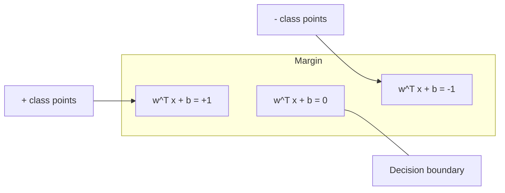
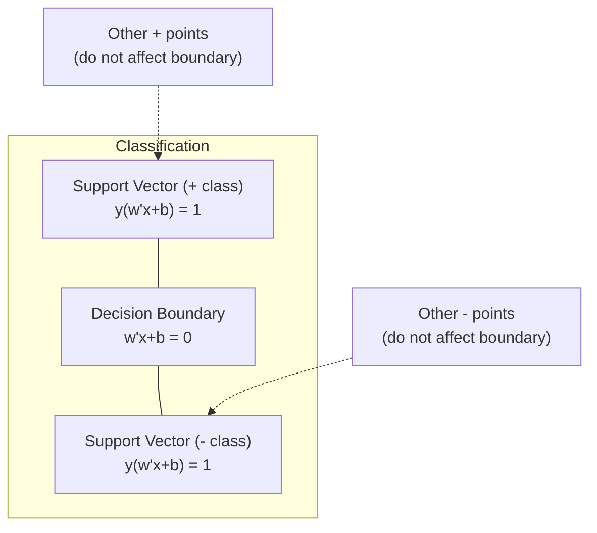
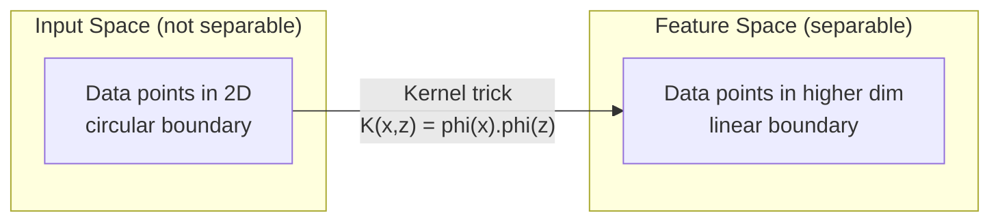

# Support Vector Machines

> Find the widest street between two classes. That is the entire idea.

**Type:** Build
**Language:** Python
**Prerequisites:** Phase 1 (Lessons 08 Optimization, 14 Norms and Distances, 18 Convex Optimization)
**Time:** ~90 minutes

## Learning Objectives

- Implement a linear SVM from scratch using hinge loss and gradient descent on the primal formulation
- Explain the maximum margin principle and identify support vectors from a trained model
- Compare linear, polynomial, and RBF kernels and explain how the kernel trick avoids explicit high-dimensional mapping
- Evaluate the tradeoff controlled by the C parameter between margin width and classification errors

## The Problem

You have two classes of data points and need to draw a line (or hyperplane) separating them. Infinitely many lines could work. Which one should you pick?

The one with the biggest margin. The margin is the distance between the decision boundary and the nearest data points on each side. A wider margin means the classifier is more confident and generalizes better to unseen data.

This intuition leads to Support Vector Machines, one of the most mathematically elegant algorithms in ML. SVMs were the dominant classification method before deep learning and remain the best choice for small datasets, high-dimensional data, and problems where you need a principled, well-understood model with theoretical guarantees.

SVMs connect directly to Phase 1: the optimization is convex (Lesson 18), the margin is measured with norms (Lesson 14), and the kernel trick exploits dot products to handle nonlinear boundaries without ever computing in the high-dimensional space.

## The Concept

### The maximum margin classifier

Given linearly separable data with labels y_i in {-1, +1} and feature vectors x_i, we want a hyperplane w^T x + b = 0 that separates the classes.

The distance from a point x_i to the hyperplane is:

```
distance = |w^T x_i + b| / ||w||
```

For a correctly classified point: y_i * (w^T x_i + b) > 0. The margin is twice the distance from the hyperplane to the nearest point on either side.



The optimization problem:

```
maximize    2 / ||w||     (the margin width)
subject to  y_i * (w^T x_i + b) >= 1  for all i
```

Equivalently (minimizing ||w||^2 is easier to optimize):

```
minimize    (1/2) ||w||^2
subject to  y_i * (w^T x_i + b) >= 1  for all i
```

This is a convex quadratic program. It has a unique global solution. The data points that sit exactly on the margin boundaries (where y_i * (w^T x_i + b) = 1) are the support vectors. They are the only points that determine the decision boundary. Move or remove any non-support-vector point, and the boundary does not change.

### Support vectors: the critical few



Most training points are irrelevant. Only the support vectors matter. This is why SVMs are memory-efficient at prediction time: you only need to store the support vectors, not the entire training set.

The number of support vectors also gives a bound on generalization error. Fewer support vectors relative to the dataset size means better generalization.

### Soft margin: handling noise with the C parameter

Real data is rarely perfectly separable. Some points may be on the wrong side of the boundary, or inside the margin. The soft margin formulation allows violations by introducing slack variables.

```
minimize    (1/2) ||w||^2 + C * sum(xi_i)
subject to  y_i * (w^T x_i + b) >= 1 - xi_i
            xi_i >= 0  for all i
```

The slack variable xi_i measures how much point i violates the margin. C controls the trade-off:

| C value | Behavior |
|---------|----------|
| Large C | Penalizes violations heavily. Narrow margin, fewer misclassifications. Overfits |
| Small C | Allows more violations. Wide margin, more misclassifications. Underfits |

C is the regularization strength, inverted. Large C = less regularization. Small C = more regularization.

### Hinge loss: the SVM loss function

The soft margin SVM can be rewritten as an unconstrained optimization:

```
minimize    (1/2) ||w||^2 + C * sum(max(0, 1 - y_i * (w^T x_i + b)))
```

The term max(0, 1 - y_i * f(x_i)) is the hinge loss. It is zero when the point is correctly classified and beyond the margin. It is linear when the point is inside the margin or misclassified.

```
Hinge loss for a single point:

loss
  |
  | \
  |  \
  |   \
  |    \
  |     \_______________
  |
  +-----|-----|-------->  y * f(x)
       0     1

Zero loss when y*f(x) >= 1 (correctly classified, outside margin).
Linear penalty when y*f(x) < 1.
```

Compare with logistic loss (logistic regression):

```
Hinge:     max(0, 1 - y*f(x))          Hard cutoff at margin
Logistic:  log(1 + exp(-y*f(x)))        Smooth, never exactly zero
```

Hinge loss produces sparse solutions (only support vectors have nonzero contribution). Logistic loss uses all data points. This makes SVMs more memory-efficient at prediction time.

### Training a linear SVM with gradient descent

You can train a linear SVM using gradient descent on the hinge loss plus L2 regularization, without solving the constrained QP:

```
L(w, b) = (lambda/2) * ||w||^2 + (1/n) * sum(max(0, 1 - y_i * (w^T x_i + b)))

Gradient with respect to w:
  If y_i * (w^T x_i + b) >= 1:  dL/dw = lambda * w
  If y_i * (w^T x_i + b) < 1:   dL/dw = lambda * w - y_i * x_i

Gradient with respect to b:
  If y_i * (w^T x_i + b) >= 1:  dL/db = 0
  If y_i * (w^T x_i + b) < 1:   dL/db = -y_i
```

This is called the primal formulation. It runs in O(n * d) per epoch, where n is the number of samples and d is the number of features. For large, sparse, high-dimensional data (text classification), this is fast.

### The dual formulation and the kernel trick

The Lagrangian dual of the SVM problem (from Phase 1 Lesson 18, KKT conditions) is:

```
maximize    sum(alpha_i) - (1/2) * sum_ij(alpha_i * alpha_j * y_i * y_j * (x_i . x_j))
subject to  0 <= alpha_i <= C
            sum(alpha_i * y_i) = 0
```

The dual only involves dot products x_i . x_j between data points. This is the key insight. Replace every dot product with a kernel function K(x_i, x_j) and the SVM can learn nonlinear boundaries without ever computing the transformation explicitly.

```
Linear kernel:      K(x, z) = x . z
Polynomial kernel:  K(x, z) = (x . z + c)^d
RBF (Gaussian):     K(x, z) = exp(-gamma * ||x - z||^2)
```

The RBF kernel maps data into an infinite-dimensional space. Points that are close in input space have kernel value near 1. Points that are far apart have kernel value near 0. It can learn any smooth decision boundary.



The kernel trick computes the dot product in the high-dimensional space without ever going there. For the polynomial kernel of degree d in D dimensions, the explicit feature space has O(D^d) dimensions. But K(x, z) is computed in O(D) time.

### SVM for regression (SVR)

Support Vector Regression fits a tube of width epsilon around the data. Points inside the tube have zero loss. Points outside the tube are penalized linearly.

```
minimize    (1/2) ||w||^2 + C * sum(xi_i + xi_i*)
subject to  y_i - (w^T x_i + b) <= epsilon + xi_i
            (w^T x_i + b) - y_i <= epsilon + xi_i*
            xi_i, xi_i* >= 0
```

The epsilon parameter controls the tube width. Wider tube = fewer support vectors = smoother fit. Narrower tube = more support vectors = tighter fit.

### Why SVMs lost to deep learning (and when they still win)

SVMs dominated ML from the late 1990s through the early 2010s. Deep learning surpassed them for several reasons:

| Factor | SVMs | Deep learning |
|--------|------|---------------|
| Feature engineering | Requires it | Learns features |
| Scalability | O(n^2) to O(n^3) for kernel | O(n) per epoch with SGD |
| Image/text/audio | Needs handcrafted features | Learns from raw data |
| Large datasets (>100k) | Slow | Scales well |
| GPU acceleration | Limited benefit | Massive speedup |

SVMs still win in these situations:
- Small datasets (hundreds to low thousands of samples)
- High-dimensional sparse data (text with TF-IDF features)
- When you need mathematical guarantees (margin bounds)
- When training time must be minimal (linear SVM is very fast)
- Binary classification with clear margin structure
- Anomaly detection (one-class SVM)

## Build It

### Step 1: Hinge loss and gradient

The foundation. Compute hinge loss for a batch and its gradient.

```python
def hinge_loss(X, y, w, b):
    n = len(X)
    total_loss = 0.0
    for i in range(n):
        margin = y[i] * (dot(w, X[i]) + b)
        total_loss += max(0.0, 1.0 - margin)
    return total_loss / n
```

### Step 2: Linear SVM via gradient descent

Train by minimizing regularized hinge loss. No QP solver needed.

```python
class LinearSVM:
    def __init__(self, lr=0.001, lambda_param=0.01, n_epochs=1000):
        self.lr = lr
        self.lambda_param = lambda_param
        self.n_epochs = n_epochs
        self.w = None
        self.b = 0.0

    def fit(self, X, y):
        n_features = len(X[0])
        self.w = [0.0] * n_features
        self.b = 0.0

        for epoch in range(self.n_epochs):
            for i in range(len(X)):
                margin = y[i] * (dot(self.w, X[i]) + self.b)
                if margin >= 1:
                    self.w = [wj - self.lr * self.lambda_param * wj
                              for wj in self.w]
                else:
                    self.w = [wj - self.lr * (self.lambda_param * wj - y[i] * X[i][j])
                              for j, wj in enumerate(self.w)]
                    self.b -= self.lr * (-y[i])

    def predict(self, X):
        return [1 if dot(self.w, x) + self.b >= 0 else -1 for x in X]
```

### Step 3: Kernel functions

Implement linear, polynomial, and RBF kernels.

```python
def linear_kernel(x, z):
    return dot(x, z)

def polynomial_kernel(x, z, degree=3, c=1.0):
    return (dot(x, z) + c) ** degree

def rbf_kernel(x, z, gamma=0.5):
    diff = [xi - zi for xi, zi in zip(x, z)]
    return math.exp(-gamma * dot(diff, diff))
```

### Step 4: Margin and support vector identification

After training, identify which points are support vectors and compute the margin width.

```python
def find_support_vectors(X, y, w, b, tol=1e-3):
    support_vectors = []
    for i in range(len(X)):
        margin = y[i] * (dot(w, X[i]) + b)
        if abs(margin - 1.0) < tol:
            support_vectors.append(i)
    return support_vectors
```

See `code/svm.py` for the complete implementation with all demos.

## Use It

With scikit-learn:

```python
from sklearn.svm import SVC, LinearSVC, SVR
from sklearn.preprocessing import StandardScaler
from sklearn.pipeline import Pipeline

clf = Pipeline([
    ("scaler", StandardScaler()),
    ("svm", SVC(kernel="rbf", C=1.0, gamma="scale")),
])
clf.fit(X_train, y_train)
print(f"Accuracy: {clf.score(X_test, y_test):.4f}")
print(f"Support vectors: {clf['svm'].n_support_}")
```

Important: always scale your features before training an SVM. SVMs are sensitive to feature magnitudes because the margin depends on ||w||, and unscaled features distort the geometry.

For large datasets, use `LinearSVC` (primal formulation, O(n) per epoch) instead of `SVC` (dual formulation, O(n^2) to O(n^3)):

```python
from sklearn.svm import LinearSVC

clf = Pipeline([
    ("scaler", StandardScaler()),
    ("svm", LinearSVC(C=1.0, max_iter=10000)),
])
```

## 练习

1. 生成二维线性可分数据集。训练 LinearSVM 并识别支持向量。验证支持向量是否是最接近决策边界的点。

2. 在噪声数据集上将 C 从 0.001 更改为 1000。绘制每个 C 值的决策边界。观察从宽边距（欠拟合）到窄边距（过拟合）的过渡。

3. 创建一个类边界为圆形（非线性）的数据集。证明线性 SVM 失败。计算 RBF 核矩阵并表明这些类在核引起的特征空间中变得可分离。

4. 在同一数据集上比较铰链损失与逻辑损失。训练线性 SVM 和逻辑回归。计算有多少训练点对每个模型的决策边界有贡献（支持向量与所有点）。

5. 实施SVR（epsilon-insensitive loss）。将其拟合为 y = sin(x) + 噪声。在预测周围绘制 epsilon 管并突出显示支持向量（管外的点）。

## 关键术语

|术语 |它实际上意味着什么 |
|------|------------------------|
|支持向量|最接近决策边界的训练点。确定超平面的唯一点 |
|保证金|决策边界和最近支持向量之间的距离。 SVM 最大化了这一点 |
|铰链损失|最大 (0, 1 - y*f(x))。当正确分类且超出边界时为零。否则线性惩罚 |
| C参数|边距宽度和分类误差之间的权衡。大 C = 窄边距，小 C = 宽边距 |
|软边距 | SVM 公式允许通过松弛变量进行边际违规。处理不可分离的数据 |
|内核技巧 |在高维特征空间中计算点积，无需显式映射到该空间 |
|线性核| K(x, z) = x 。 z。相当于标准点积。对于线性可分离数据 |
| RBF 核 | K(x, z) = exp(-gamma * \|\|x-z\|\|^2)。映射到无限维度。学习任何平滑边界 |
|多项式核 | K(x, z) = (x . z + c)^d。映射到多项式组合的特征空间 |
|双重配方|仅依赖于数据点之间的点积的 SVM 问题的重新表述。启用内核 |
| SVR |支持向量回归。在数据周围安装一个 epsilon 管。管内点零损耗|
|松弛变量 | xi_i：测量一个点违反边界的程度。对于边缘外正确分类的点为零 |
|最大保证金 |选择距离各类最近点距离最大的超平面的原则 |

## 进一步阅读

- [Vapnik: The Nature of Statistical Learning Theory (1995)](https://link.springer.com/book/10.1007/978-1-4757-3264-1) - SVM 和统计学习的基础文本
- [Cortes & Vapnik: 支持向量网络 (1995)](https://link.springer.com/article/10.1007/BF00994018) - 原始 SVM 论文
- [Platt: Sequential Minimal Optimization (1998)](https://www.microsoft.com/en-us/research/publication/sequential-minimal-optimization-a-fast-algorithm-for-training-support-vector-machines/) - 使 SVM 训练变得实用的 SMO 算法
- [scikit-learn SVM 文档](https://scikit-learn.org/stable/modules/svm.html) - 包含实现细节的实用指南
- [LIBSVM：支持向量机库](https://www.csie.ntu.edu.tw/~cjlin/libsvm/) - 大多数 SVM 实现背后的 C++ 库
