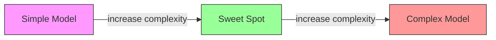
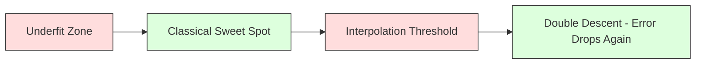
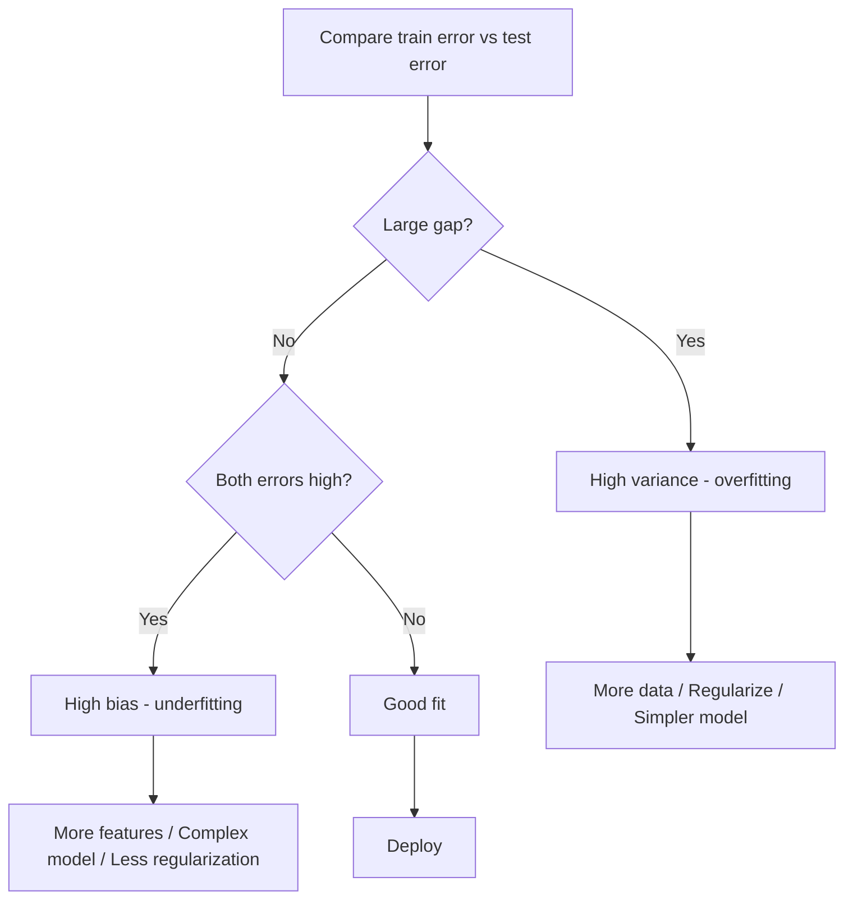
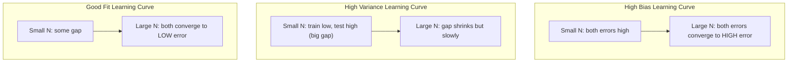
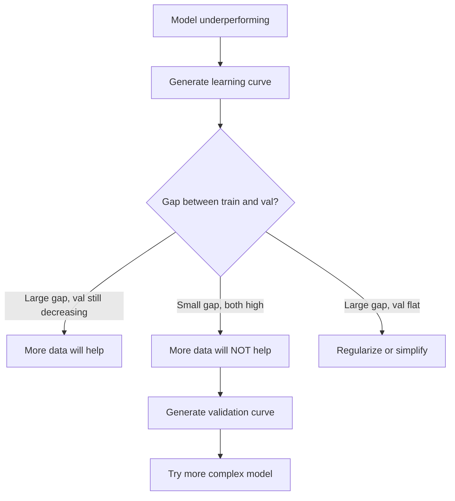

# Bias-Variance Tradeoff

> Every model error comes from one of three sources: bias, variance, or noise. You can only control the first two.

**Type:** Learn
**Language:** Python
**Prerequisites:** Phase 2, Lessons 01-09 (ML basics, regression, classification, evaluation)
**Time:** ~75 minutes

## Learning Objectives

- Derive the bias-variance decomposition of expected prediction error and explain the role of irreducible noise
- Diagnose whether a model suffers from high bias or high variance using training and test error patterns
- Explain how regularization techniques (L1, L2, dropout, early stopping) trade bias for variance
- Implement experiments that visualize the bias-variance tradeoff across models of increasing complexity

## The Problem

You trained a model. It has some error on test data. Where does that error come from?

If your model is too simple (linear regression on a curved dataset), it will consistently miss the true pattern. That is bias. If your model is too complex (degree-20 polynomial on 15 data points), it will fit the training data perfectly but give wildly different predictions on new data. That is variance.

You cannot minimize both at the same time for a fixed model capacity. Push bias down and variance goes up. Push variance down and bias goes up. Understanding this tradeoff is the single most useful diagnostic skill in machine learning. It tells you whether to make your model more complex or less complex, whether to get more data or engineer better features, whether to regularize more or less.

## The Concept

### Bias: Systematic Error

Bias measures how far off your model's average prediction is from the true value. If you trained the same model on many different training sets drawn from the same distribution and averaged the predictions, bias is the gap between that average and the truth.

High bias means the model is too rigid to capture the real pattern. A straight line fit to a parabola will always miss the curve, no matter how much data you give it. This is underfitting.

```
High bias (underfitting):
  Model always predicts roughly the same wrong thing.
  Training error: HIGH
  Test error: HIGH
  Gap between them: SMALL
```

### Variance: Sensitivity to Training Data

Variance measures how much your predictions change when you train on different subsets of data. If small changes in the training set cause large changes in the model, variance is high.

High variance means the model is fitting noise in the training data, not the underlying signal. A degree-20 polynomial will thread through every training point but oscillate wildly between them. This is overfitting.

```
High variance (overfitting):
  Model fits training data perfectly but fails on new data.
  Training error: LOW
  Test error: HIGH
  Gap between them: LARGE
```

### The Decomposition

For any point x, the expected prediction error under squared loss decomposes exactly:

```
Expected Error = Bias^2 + Variance + Irreducible Noise

where:
  Bias^2   = (E[f_hat(x)] - f(x))^2
  Variance = E[(f_hat(x) - E[f_hat(x)])^2]
  Noise    = E[(y - f(x))^2]             (sigma^2)
```

- `f(x)` is the true function
- `f_hat(x)` is your model's prediction
- `E[...]` is the expectation over different training sets
- `y` is the observed label (true function plus noise)

The noise term is irreducible. No model can do better than sigma^2 on noisy data. Your job is to find the right balance between bias^2 and variance.

### Model Complexity vs Error



The classic U-shaped curve:

| Complexity | Bias | Variance | Total Error |
|-----------|------|----------|-------------|
| Too low | HIGH | LOW | HIGH (underfitting) |
| Just right | MODERATE | MODERATE | LOWEST |
| Too high | LOW | HIGH | HIGH (overfitting) |

### Regularization as Bias-Variance Control

Regularization deliberately increases bias to reduce variance. It constrains the model so it cannot chase noise.

- **L2 (Ridge):** Shrinks all weights toward zero. Keeps all features but reduces their influence.
- **L1 (Lasso):** Pushes some weights exactly to zero. Performs feature selection.
- **Dropout:** Randomly disables neurons during training. Forces redundant representations.
- **Early stopping:** Stops training before the model fully fits the training data.

The regularization strength (lambda, dropout rate, number of epochs) directly controls where you sit on the bias-variance curve. More regularization means more bias, less variance.

### Double Descent: The Modern Perspective

Classical theory says: after the sweet spot, more complexity always hurts. But research since 2019 has shown something unexpected. If you keep increasing model capacity far past the interpolation threshold (where the model has enough parameters to perfectly fit training data), test error can decrease again.



This "double descent" phenomenon explains why massively overparameterized neural networks (with far more parameters than training examples) still generalize well. The classical bias-variance tradeoff is not wrong, but it is incomplete for the modern regime.

Key observations about double descent:
- It happens in linear models, decision trees, and neural networks
- More data can actually hurt in the interpolation region (sample-wise double descent)
- More training epochs can cause it too (epoch-wise double descent)
- Regularization smooths out the peak but does not eliminate it

Why does this happen? At the interpolation threshold, the model has just enough capacity to fit all training points. It is forced into a very specific solution that threads through every point, and small perturbations in the data cause large changes in the fit. This is where variance peaks. Past the threshold, the model has many possible solutions that fit the data perfectly. The learning algorithm (e.g., gradient descent with implicit regularization) tends to pick the simplest one among them. This implicit bias toward simple solutions is why overparameterized models generalize.

| Regime | Parameters vs Samples | Behavior |
|--------|----------------------|----------|
| Underparameterized | p << n | Classical tradeoff applies |
| Interpolation threshold | p ~ n | Variance peaks, test error spikes |
| Overparameterized | p >> n | Implicit regularization kicks in, test error drops |

For practical purposes: if you are using neural networks or large tree ensembles, do not stop at the interpolation threshold. Either stay well below it (with explicit regularization) or go well past it. The worst place to be is right at the threshold.

### Diagnosing Your Model



| Symptom | Diagnosis | Fix |
|---------|-----------|-----|
| High train error, high test error | Bias | More features, complex model, less regularization |
| Low train error, high test error | Variance | More data, regularization, simpler model, dropout |
| Low train error, low test error | Good fit | Ship it |
| Train error decreasing, test error increasing | Overfitting in progress | Early stopping |

### Practical Strategies

**When bias is the problem:**
- Add polynomial or interaction features
- Use a more flexible model (tree ensemble instead of linear)
- Reduce regularization strength
- Train longer (if not yet converged)

**When variance is the problem:**
- Get more training data
- Use bagging (random forests)
- Increase regularization (higher lambda, more dropout)
- Feature selection (remove noisy features)
- Use cross-validation to detect it early

### Ensemble Methods and Variance Reduction

Ensemble methods are the most practical tool for fighting variance.

**Bagging (Bootstrap Aggregating)** trains multiple models on different bootstrap samples of the training data, then averages their predictions. Each individual model has high variance, but the average has much lower variance. Random forests are bagging applied to decision trees.

Why it works mathematically: if you average N independent predictions, each with variance sigma^2, the variance of the average is sigma^2 / N. The models are not truly independent (they all see similar data), so the reduction is less than 1/N, but it is still substantial.

**Boosting** reduces bias by building models sequentially, where each new model focuses on the errors of the ensemble so far. Gradient boosting and AdaBoost are the main examples. Boosting can overfit if you add too many models, so you need early stopping or regularization.

| Method | Primary Effect | Bias Change | Variance Change |
|--------|---------------|-------------|-----------------|
| Bagging | Reduces variance | No change | Decreases |
| Boosting | Reduces bias | Decreases | Can increase |
| Stacking | Reduces both | Depends on meta-learner | Depends on base models |
| Dropout | Implicit bagging | Slight increase | Decreases |

**Practical rule:** if your base model has high variance (deep trees, high-degree polynomials), use bagging. If your base model has high bias (shallow stumps, simple linear models), use boosting.

### Learning Curves

Learning curves plot training and validation error as a function of training set size. They are the most practical diagnostic tool you have. Unlike a single train/test comparison, learning curves show you the trajectory of your model and tell you whether more data will help.



How to read them:

| Scenario | Training Error | Validation Error | Gap | What It Means | What to Do |
|----------|---------------|-----------------|-----|---------------|------------|
| High bias | High | High | Small | Model cannot capture the pattern | More features, complex model, less regularization |
| High variance | Low | High | Large | Model memorizes training data | More data, regularization, simpler model |
| Good fit | Moderate | Moderate | Small | Model generalizes well | Ship it |
| High variance, improving | Low | Decreasing with more data | Shrinking | Variance problem that data can fix | Collect more data |
| High bias, flat | High | High and flat | Small and flat | More data will NOT help | Change model architecture |

The critical insight: if both curves have plateaued and the gap is small but both errors are high, more data is useless. You need a better model. If the gap is large and still shrinking, more data will help.

### How to Generate Learning Curves

There are two approaches:

**Approach 1: Vary training set size, fixed model.** Hold the model and hyperparameters constant. Train on increasingly large subsets of the training data. Measure training error and validation error at each size. This is the standard learning curve.

**Approach 2: Vary model complexity, fixed data.** Hold the data constant. Sweep a complexity parameter (polynomial degree, tree depth, number of layers). Measure training error and validation error at each complexity. This is a validation curve and shows the bias-variance tradeoff directly.

Both approaches complement each other. The first tells you if more data will help. The second tells you if a different model will help. Run both before making decisions about your next step.



## Build It

The code in `code/bias_variance.py` runs the full bias-variance decomposition experiment. Here is the approach, step by step.

### Step 1: Generate Synthetic Data from a Known Function

We use `f(x) = sin(1.5x) + 0.5x` with Gaussian noise. Knowing the true function lets us compute exact bias and variance.

```python
def true_function(x):
    return np.sin(1.5 * x) + 0.5 * x

def generate_data(n_samples=30, noise_std=0.5, x_range=(-3, 3), seed=None):
    rng = np.random.RandomState(seed)
    x = rng.uniform(x_range[0], x_range[1], n_samples)
    y = true_function(x) + rng.normal(0, noise_std, n_samples)
    return x, y
```

### Step 2: Bootstrap Sampling and Polynomial Fitting

For each polynomial degree, we draw many bootstrap training sets, fit the polynomial, and record predictions on a fixed test grid. This gives us a distribution of predictions at each test point.

```python
def fit_polynomial(x_train, y_train, degree, lam=0.0):
    X = np.column_stack([x_train ** d for d in range(degree + 1)])
    if lam > 0:
        penalty = lam * np.eye(X.shape[1])
        penalty[0, 0] = 0
        w = np.linalg.solve(X.T @ X + penalty, X.T @ y_train)
    else:
        w = np.linalg.lstsq(X, y_train, rcond=None)[0]
    return w
```

We fit on 200 different bootstrap samples. Each bootstrap sample is drawn from the same underlying distribution but contains different points.

### Step 3: Computing Bias^2, Variance Decomposition

With 200 sets of predictions at each test point, we can compute the decomposition directly from the definition:

```python
mean_pred = predictions.mean(axis=0)
bias_sq = np.mean((mean_pred - y_true) ** 2)
variance = np.mean(predictions.var(axis=0))
total_error = np.mean(np.mean((predictions - y_true) ** 2, axis=1))
```

- `mean_pred` is E[f_hat(x)] estimated from bootstrap samples
- `bias_sq` is the squared gap between average prediction and truth
- `variance` is the average spread of predictions across bootstrap samples
- `total_error` should approximately equal bias^2 + variance + noise

### Step 4: Learning Curves

Learning curves sweep training set size while holding model complexity fixed. They show whether your model is data-limited or capacity-limited.

```python
def demo_learning_curves():
    sizes = [10, 15, 20, 30, 50, 75, 100, 150, 200, 300]
    degree = 5

    for n in sizes:
        train_errors = []
        test_errors = []
        for seed in range(50):
            x_train, y_train = generate_data(n_samples=n, seed=seed * 100)
            w = fit_polynomial(x_train, y_train, degree)
            train_pred = predict_polynomial(x_train, w)
            train_mse = np.mean((train_pred - y_train) ** 2)
            test_pred = predict_polynomial(x_test, w)
            test_mse = np.mean((test_pred - y_test) ** 2)
            train_errors.append(train_mse)
            test_errors.append(test_mse)
        # Average over runs gives the learning curve point
```

For a high-variance model (degree 5 with small data), you see:
- Training error starts low and increases as more data makes memorization harder
- Test error starts high and decreases as the model gets more signal
- The gap shrinks with more data

For a high-bias model (degree 1), both errors converge quickly to the same high value and more data does not help.

### Step 5: Regularization Sweep

The code also includes `demo_regularization_sweep()`, which fixes a high-degree polynomial (degree 15) and sweeps Ridge regularization strength from 0.001 to 100. This shows the bias-variance tradeoff from a different angle: instead of varying model complexity, we vary the constraint strength.

```python
def demo_regularization_sweep():
    alphas = [0.001, 0.005, 0.01, 0.05, 0.1, 0.5, 1.0, 5.0, 10.0, 50.0, 100.0]
    for alpha in alphas:
        results = bias_variance_decomposition([15], lam=alpha)
        r = results[15]
        print(f"alpha={alpha:.3f}  bias={r['bias_sq']:.4f}  var={r['variance']:.4f}")
```

At low alpha, the degree-15 polynomial is nearly unconstrained. Variance dominates because the model chases noise in each bootstrap sample. At high alpha, the penalty is so strong that the model effectively becomes a near-constant function. Bias dominates. The optimal alpha sits between these extremes.

This is the same U-curve from varying polynomial degree, but controlled by a continuous knob instead of a discrete one. In practice, regularization is the preferred way to control the tradeoff because it allows fine-grained control without changing the feature set.

## Use It

sklearn provides `learning_curve` and `validation_curve` to automate these diagnostics without writing bootstrap loops.

### Validation Curve: Sweep Model Complexity

```python
from sklearn.model_selection import validation_curve
from sklearn.pipeline import make_pipeline
from sklearn.preprocessing import PolynomialFeatures
from sklearn.linear_model import Ridge

degrees = list(range(1, 16))
train_scores_all = []
val_scores_all = []

for d in degrees:
    pipe = make_pipeline(PolynomialFeatures(d), Ridge(alpha=0.01))
    train_scores, val_scores = validation_curve(
        pipe, X, y, param_name="polynomialfeatures__degree",
        param_range=[d], cv=5, scoring="neg_mean_squared_error"
    )
    train_scores_all.append(-train_scores.mean())
    val_scores_all.append(-val_scores.mean())
```

This gives you the bias-variance tradeoff curve directly. Where the validation score is worst relative to train score, variance dominates. Where both are bad, bias dominates.

### Learning Curve: Sweep Training Set Size

```python
from sklearn.model_selection import learning_curve

pipe = make_pipeline(PolynomialFeatures(5), Ridge(alpha=0.01))
train_sizes, train_scores, val_scores = learning_curve(
    pipe, X, y, train_sizes=np.linspace(0.1, 1.0, 10),
    cv=5, scoring="neg_mean_squared_error"
)
train_mse = -train_scores.mean(axis=1)
val_mse = -val_scores.mean(axis=1)
```

Plot `train_mse` and `val_mse` against `train_sizes`. The shape tells you everything about your model.

### Cross-Validation with Regularization Sweep

```python
from sklearn.model_selection import cross_val_score

alphas = [0.001, 0.01, 0.1, 1.0, 10.0, 100.0]
for alpha in alphas:
    pipe = make_pipeline(PolynomialFeatures(10), Ridge(alpha=alpha))
    scores = cross_val_score(pipe, X, y, cv=5, scoring="neg_mean_squared_error")
    print(f"alpha={alpha:>7.3f}  MSE={-scores.mean():.4f} +/- {scores.std():.4f}")
```

这会扫除固定模型复杂性的正则化强度。您将看到相同的偏差-方差权衡：低 alpha 意味着高方差，高 alpha 意味着高偏差。

### 将它们放在一起：完整的诊断工作流程

在实践中，您可以按顺序运行这些诊断：

1. 训练你的模型。计算训练和测试误差。
2. 如果两者都很高：则存在偏差问题。跳至步骤 4。
3. 如果train 较低但test 较高：则存在方差问题。生成学习曲线以查看更多数据是否有帮助。如果没有，则进行正规化。
4. 生成一条涵盖主要复杂性参数的验证曲线。找到最佳点。
5. 在最佳点，生成学习曲线。如果差距仍然很大，则需要更多数据或正则化。
6. 使用“cross_val_score”尝试具有不同 alpha 值的 Ridge/Lasso。选择交叉验证误差最低的 alpha。

对于大多数表格数据集，这需要 10-15 分钟的计算，并节省数小时的猜测时间。

## 发货

本课程产生：`outputs/prompt-model-diagnostics.md`

## 练习

1. 使用 `noise_std=0` 运行分解（无噪声）。不可约误差项会发生什么情况？最优复杂度会改变吗？

2. 将训练集大小从 30 增加到 300。这对方差分量有何影响？最优多项式次数是否会发生变化？

3. 在实验中添加L2正则化（岭回归）。对于固定的高次多项式（15 次），将 lambda 从 0 扫描到 100。将偏差^2 和方差绘制为 lambda 的函数。

4. 将 true 函数从多项式修改为 `sin(x)`。偏差-方差分解如何变化？是否还有明确的最佳程度？

5. 实现一个简单的引导聚合（装袋）包装器：根据引导样本和平均预测训练 10 个模型。证明这可以减少方差而不增加太多偏差。

## 关键术语

|术语 |人们怎么说 |它实际上意味着什么 |
|------|----------------|----------------------|
|偏见| “模型太简单”|错误假设造成的系统性错误。平均模型预测与真实情况之间的差距。 |
|方差| “模型过度拟合”|对训练数据的敏感性产生的错误。不同训练集的预测有多少变化。 |
|不可约误差| “数据中的噪音”|真实数据生成过程中的随机性误差。没有任何模型可以消除它。 |
|欠拟合| “学得不够”|模型具有高偏差。即使在训练数据上它也错过了真实的模式。 |
|过度拟合 | “记忆数据”|模型具有高方差。它适合训练数据中无法泛化的噪声。 |
|正则化| “约束模型”|添加惩罚以降低模型复杂性，用偏差换取更低的方差。 |
|双血统| “更多参数可以提供帮助”|当模型容量远超过插值阈值时，测试误差再次减小。 |
|模型复杂度 | “模型有多灵活”|模型拟合任意模式的能力。由架构、特性或正则化控制。 |

## 进一步阅读

- [Hastie、Tibshirani、Friedman：统计学习的要素，第 1 章7](https://hastie.su.domains/ElemStatLearn/)——偏差-方差分解的最终处理
- [Belkin 等人，《协调现代机器学习实践与偏差-方差权衡》(2019)](https://arxiv.org/abs/1812.11118)——双血统论文
- [Nakkiran et al., Deep Double Descent (2019)](https://arxiv.org/abs/1912.02292) -- epoch-wise和sample-wise双下降
- [Scott Fortmann-Roe：理解偏差-方差权衡](http://scott.fortmann-roe.com/docs/BiasVariance.html) -- 清晰的视觉解释
