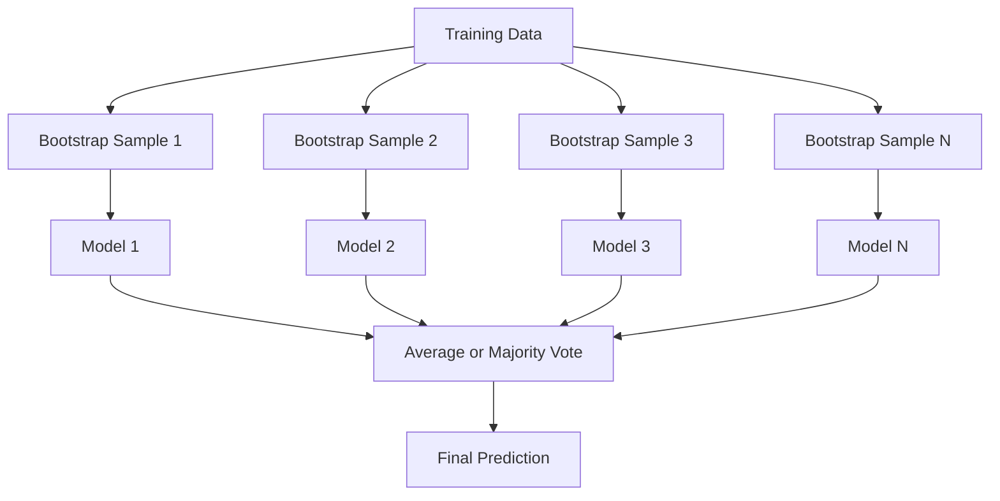
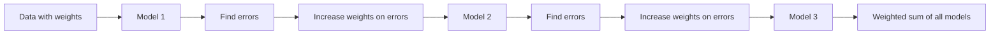
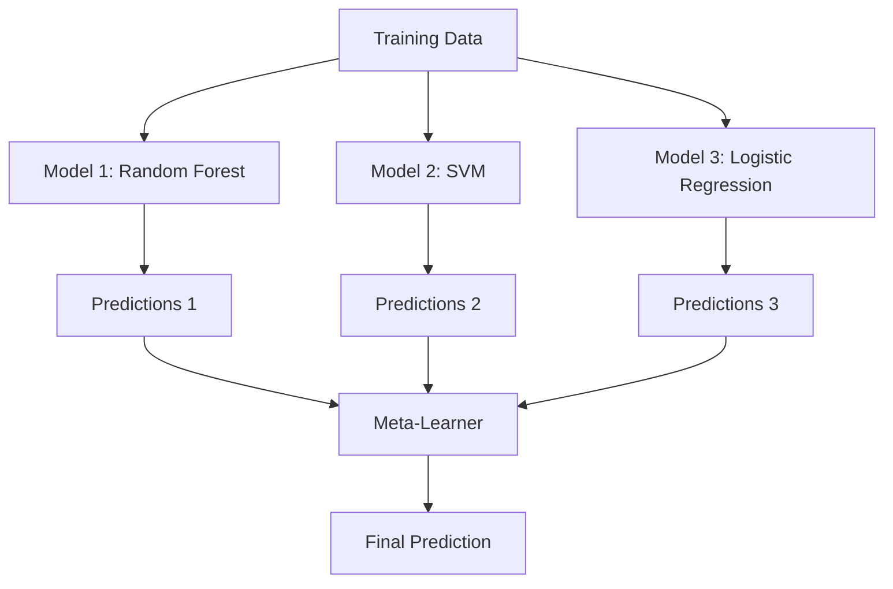

# Ensemble Methods

> A group of weak learners, combined correctly, becomes a strong learner. This is not a metaphor. It is a theorem.

**Type:** Build
**Language:** Python
**Prerequisites:** Phase 2, Lesson 10 (Bias-Variance Tradeoff)
**Time:** ~120 minutes

## Learning Objectives

- Implement AdaBoost and gradient boosting from scratch and explain how boosting sequentially reduces bias
- Build a bagging ensemble and demonstrate how averaging decorrelated models reduces variance without increasing bias
- Compare bagging, boosting, and stacking in terms of what error component each method targets
- Evaluate ensemble diversity and explain why majority voting accuracy improves with more independent weak learners

## The Problem

A single decision tree is fast to train and easy to interpret, but it overfits. A single linear model underfits on complex boundaries. You could spend days engineering the perfect model architecture. Or you could combine a bunch of imperfect models and get something better than any of them individually.

Ensemble methods do exactly this. They are the most reliable technique for winning Kaggle competitions on tabular data, they power most production ML systems, and they illustrate the bias-variance tradeoff in action. Bagging reduces variance. Boosting reduces bias. Stacking learns which models to trust on which inputs.

## The Concept

### Why Ensembles Work

Suppose you have N independent classifiers, each with accuracy p > 0.5. The majority vote has accuracy:

```
P(majority correct) = sum over k > N/2 of C(N,k) * p^k * (1-p)^(N-k)
```

For 21 classifiers each with 60% accuracy, majority vote accuracy is about 74%. With 101 classifiers, it rises to 84%. The errors cancel out when the models make different mistakes.

The key requirement is **diversity**. If all models make the same errors, combining them helps nothing. Ensembles work because they produce diverse models through:

- Different training subsets (bagging)
- Different feature subsets (random forests)
- Sequential error correction (boosting)
- Different model families (stacking)

### Bagging (Bootstrap Aggregating)

Bagging creates diversity by training each model on a different bootstrap sample of the training data.



A bootstrap sample is drawn with replacement from the original data, same size as the original. About 63.2% of unique samples appear in each bootstrap. The remaining 36.8% (out-of-bag samples) provide a free validation set.

Bagging reduces variance without increasing bias much. Each individual tree overfits to its bootstrap sample, but the overfitting is different for each tree, so averaging cancels out the noise.

**Random Forests** are bagging with an extra twist: at each split, only a random subset of features is considered. This forces even more diversity among trees. The typical number of candidate features is `sqrt(n_features)` for classification and `n_features / 3` for regression.

### Boosting (Sequential Error Correction)

Boosting trains models sequentially. Each new model focuses on the examples that previous models got wrong.



Boosting reduces bias. Each new model corrects the systematic errors of the ensemble so far. The final prediction is a weighted sum of all models, where better models get higher weights.

The tradeoff: boosting can overfit if you run too many rounds, because it keeps fitting harder examples, some of which may be noise.

### AdaBoost

AdaBoost (Adaptive Boosting) was the first practical boosting algorithm. It works with any base learner, typically decision stumps (depth-1 trees).

The algorithm:

```
1. Initialize sample weights: w_i = 1/N for all i

2. For t = 1 to T:
   a. Train weak learner h_t on weighted data
   b. Compute weighted error:
      err_t = sum(w_i * I(h_t(x_i) != y_i)) / sum(w_i)
   c. Compute model weight:
      alpha_t = 0.5 * ln((1 - err_t) / err_t)
   d. Update sample weights:
      w_i = w_i * exp(-alpha_t * y_i * h_t(x_i))
   e. Normalize weights to sum to 1

3. Final prediction: H(x) = sign(sum(alpha_t * h_t(x)))
```

Models with lower error get higher alpha. Misclassified samples get higher weights so the next model focuses on them.

### Gradient Boosting

Gradient boosting generalizes boosting to arbitrary loss functions. Instead of reweighting samples, it fits each new model to the residuals (negative gradient of the loss) of the current ensemble.

```
1. Initialize: F_0(x) = argmin_c sum(L(y_i, c))

2. For t = 1 to T:
   a. Compute pseudo-residuals:
      r_i = -dL(y_i, F_{t-1}(x_i)) / dF_{t-1}(x_i)
   b. Fit a tree h_t to the residuals r_i
   c. Find optimal step size:
      gamma_t = argmin_gamma sum(L(y_i, F_{t-1}(x_i) + gamma * h_t(x_i)))
   d. Update:
      F_t(x) = F_{t-1}(x) + learning_rate * gamma_t * h_t(x)

3. Final prediction: F_T(x)
```

For squared error loss, the pseudo-residuals are just the actual residuals: `r_i = y_i - F_{t-1}(x_i)`. Each tree literally fits the errors of the previous ensemble.

The learning rate (shrinkage) controls how much each tree contributes. Smaller learning rates require more trees but generalize better. Typical values: 0.01 to 0.3.

### XGBoost: Why It Dominates Tabular Data

XGBoost (eXtreme Gradient Boosting) is gradient boosting with engineering optimizations that make it fast, accurate, and resistant to overfitting:

- **Regularized objective:** L1 and L2 penalties on leaf weights prevent individual trees from being too confident
- **Second-order approximation:** Uses both first and second derivatives of the loss, giving better split decisions
- **Sparsity-aware splits:** Handles missing values natively by learning the best direction for missing data at each split
- **Column subsampling:** Like random forests, samples features at each split for diversity
- **Weighted quantile sketch:** Efficiently finds split points for continuous features on distributed data
- **Cache-aware block structure:** Memory layout optimized for CPU cache lines

For tabular data, XGBoost (and its successor LightGBM) consistently outperforms neural networks. This is not changing anytime soon. If your data fits in a table with rows and columns, start with gradient boosting.

### Stacking (Meta-Learning)

Stacking uses the predictions of multiple base models as features for a meta-learner.



The meta-learner learns which base model to trust for which inputs. If the random forest is better at certain regions and the SVM at others, the meta-learner will learn to route accordingly.

To avoid data leakage, base model predictions must be generated via cross-validation on the training set. You never train base models and generate meta-features on the same data.

### Voting

The simplest ensemble. Just combine predictions directly.

- **Hard voting:** Majority vote on class labels.
- **Soft voting:** Average predicted probabilities, pick the class with highest average probability. Usually better because it uses confidence information.

## Build It

### Step 1: Decision Stump (Base Learner)

The code in `code/ensembles.py` implements everything from scratch. We start with a decision stump: a tree with a single split.

```python
class DecisionStump:
    def __init__(self):
        self.feature_idx = None
        self.threshold = None
        self.polarity = 1
        self.alpha = None

    def fit(self, X, y, weights):
        n_samples, n_features = X.shape
        best_error = float("inf")

        for f in range(n_features):
            thresholds = np.unique(X[:, f])
            for thresh in thresholds:
                for polarity in [1, -1]:
                    pred = np.ones(n_samples)
                    pred[polarity * X[:, f] < polarity * thresh] = -1
                    error = np.sum(weights[pred != y])
                    if error < best_error:
                        best_error = error
                        self.feature_idx = f
                        self.threshold = thresh
                        self.polarity = polarity

    def predict(self, X):
        n = X.shape[0]
        pred = np.ones(n)
        idx = self.polarity * X[:, self.feature_idx] < self.polarity * self.threshold
        pred[idx] = -1
        return pred
```

### Step 2: AdaBoost from Scratch

```python
class AdaBoostScratch:
    def __init__(self, n_estimators=50):
        self.n_estimators = n_estimators
        self.stumps = []
        self.alphas = []

    def fit(self, X, y):
        n = X.shape[0]
        weights = np.full(n, 1 / n)

        for _ in range(self.n_estimators):
            stump = DecisionStump()
            stump.fit(X, y, weights)
            pred = stump.predict(X)

            err = np.sum(weights[pred != y])
            err = np.clip(err, 1e-10, 1 - 1e-10)

            alpha = 0.5 * np.log((1 - err) / err)
            weights *= np.exp(-alpha * y * pred)
            weights /= weights.sum()

            stump.alpha = alpha
            self.stumps.append(stump)
            self.alphas.append(alpha)

    def predict(self, X):
        total = sum(a * s.predict(X) for a, s in zip(self.alphas, self.stumps))
        return np.sign(total)
```

### Step 3: Gradient Boosting from Scratch

```python
class GradientBoostingScratch:
    def __init__(self, n_estimators=100, learning_rate=0.1, max_depth=3):
        self.n_estimators = n_estimators
        self.lr = learning_rate
        self.max_depth = max_depth
        self.trees = []
        self.initial_pred = None

    def fit(self, X, y):
        self.initial_pred = np.mean(y)
        current_pred = np.full(len(y), self.initial_pred)

        for _ in range(self.n_estimators):
            residuals = y - current_pred
            tree = SimpleRegressionTree(max_depth=self.max_depth)
            tree.fit(X, residuals)
            update = tree.predict(X)
            current_pred += self.lr * update
            self.trees.append(tree)

    def predict(self, X):
        pred = np.full(X.shape[0], self.initial_pred)
        for tree in self.trees:
            pred += self.lr * tree.predict(X)
        return pred
```

### 步骤 4：与 sklearn 进行比较

该代码验证了我们的从头开始实现与 sklearn 的“AdaBoostClassifier”和“GradientBoostingClassifier”具有相似的准确性，并并排比较了所有方法。

## 使用它

### 何时使用每种方法

|方法|减少|最适合 |留意|
|--------|---------|----------|---------------|
|套袋/随机森林|方差|噪声数据，特征众多 |无助于消除偏见|
|阿达Boost |偏见|干净的数据，简单的基础学习器 |对异常值和噪音敏感 |
|梯度提升|偏见|表格数据、竞赛 |训练慢，不调优容易过拟合 |
| XGBoost / LightGBM | XGBoost / LightGBM |两者 |生产表格 ML |许多超参数|
|堆叠|两者 |获得最后 1-2% 的准确度 |元学习器复杂且存在过度拟合的风险
|投票 |方差|多种车型快速组合 |仅当模型多样化时才有帮助 |

### 表格数据的生产堆栈

对于大多数表格预测问题，尝试的顺序如下：

1. **LightGBM 或 XGBoost** 带默认参数
2. 调整n_estimators、learning_rate、max_depth、min_child_weight
3. 如果您需要最后 0.5%，请构建具有 3-5 个不同模型的堆叠集成
4. 始终使用交叉验证

尽管不断进行研究尝试，表格数据上的神经网络几乎总是比梯度提升更糟糕。 TabNet、NODE 和类似的架构偶尔可以与经过良好调整的 XGBoost 相媲美，但很少能击败它。

## 发货

本课程生成“outputs/prompt-ensemble-selector.md”——一个帮助您为给定数据集选择正确的集成方法的提示。描述您的数据（大小、特征类型、噪声水平、类别平衡）以及您正在解决的问题。该提示会遍历决策清单，推荐一种方法，建议启动超参数，并警告该方法的常见错误。还生成包含完整选择指南的“outputs/skill-ensemble-builder.md”。

## 练习

1. 修改 AdaBoost 实现以跟踪每轮后的训练准确性。绘制准确度与估计器数量的关系图。什么时候收敛？

2. 通过向回归树添加随机特征子采样，从头开始实现随机森林。使用 max_features=sqrt(n_features) 和平均预测训练 100 棵树。将方差减少与单棵树进行比较。

3. 在梯度提升实现中，添加提前停止：在每轮之后跟踪验证损失，并在连续 10 轮没有改善时停止。它实际上需要多少棵树？

4. 使用三个基本模型（逻辑回归、决策树、k 最近邻）和逻辑回归元学习器构建堆叠集成。使用 5 折交叉验证来生成元特征。单独与每个基本模型进行比较。

5. 使用默认参数在同一数据集上运行 XGBoost。将其准确性与从头开始的梯度提升进行比较。时间两者。速度差异有多大？

## 关键术语

|术语 |人们怎么说 |它实际上意味着什么 |
|------|----------------|----------------------|
|装袋| “训练随机子集”| Bootstrap 聚合：在 Bootstrap 样本上训练模型，平均预测以减少方差 |
|提升| “专注于困难的例子” |按顺序训练模型，每个模型都纠正迄今为止集成的错误，以减少偏差 |
|阿达Boost | “重新衡量数据” |通过样本权重更新进行提升；错误分类的点对于下一个学习者来说会获得更高的权重 |
|梯度提升| “拟合残差”|通过将每个新模型拟合到损失函数的负梯度来进行提升 |
| XGBoost | “Kaggle 武器”|通过正则化、二阶优化和系统级速度技巧进行梯度提升 |
|堆叠| “模型之上的模型”|使用基本模型的预测作为元学习器的输入特征 |
|随机森林| “许多随机树”|使用决策树进行装袋，在每个分割处添加随机特征子采样以实现多样性 |
|乐团多样性 | “犯不同的错误” |模型的错误必须不相关，才能使整体优于个体 |
|袋外错误 | “免费验证”|不在引导抽签中的样本 (~36.8%) 可用作验证集，无需保留 |

## 进一步阅读

- [Schapire & Freund: Boosting: Foundations and Algorithms](https://mitpress.mit.edu/9780262526036/) -- AdaBoost 创建者所著的书
- [Friedman: Greedy Function Approximation: A Gradient Boosting Machine (2001)](https://statweb.stanford.edu/~jhf/ftp/trebst.pdf)——原始梯度提升论文
- [Chen & Guestrin: XGBoost (2016)](https://arxiv.org/abs/1603.02754) -- XGBoost 论文
- [Wolpert: Stacked Generalization (1992)](https://www.sciencedirect.com/science/article/abs/pii/S0893608005800231)——原始的堆叠论文
- [scikit-learn 集成方法](https://scikit-learn.org/stable/modules/ensemble.html) -- 实用参考
