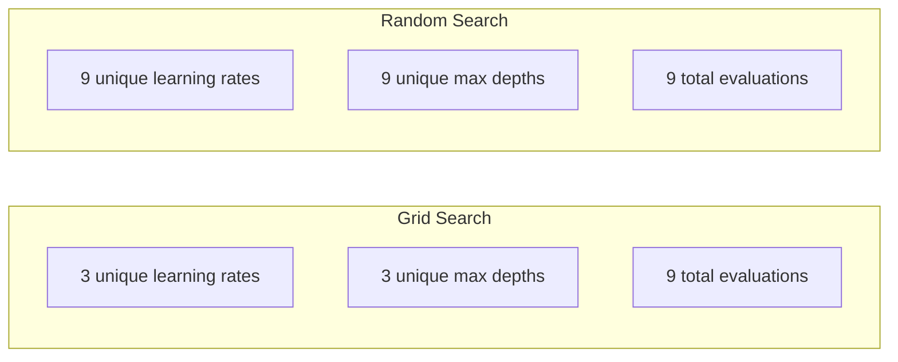
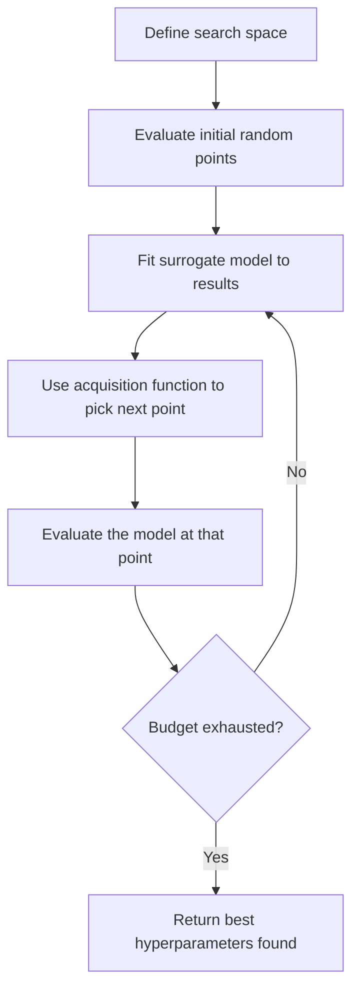
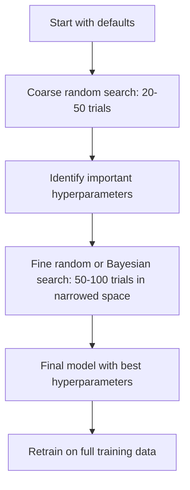
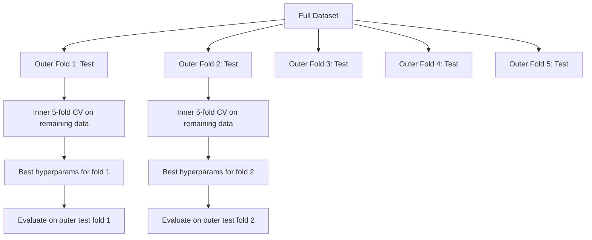

# Hyperparameter Tuning

> Hyperparameters are the knobs you turn before training starts. Turning them well is the difference between a mediocre model and a great one.

**Type:** Build
**Language:** Python
**Prerequisites:** Phase 2, Lesson 11 (Ensemble Methods)
**Time:** ~90 minutes

## Learning Objectives

- Implement grid search, random search, and Bayesian optimization from scratch and compare their sample efficiency
- Explain why random search outperforms grid search when most hyperparameters have low effective dimensionality
- Build a Bayesian optimization loop using a surrogate model and acquisition function to guide the search
- Design a hyperparameter tuning strategy that avoids overfitting the validation set through proper cross-validation

## The Problem

Your gradient boosting model has a learning rate, number of trees, max depth, min samples per leaf, subsample ratio, and column sample ratio. That is six hyperparameters. If each has 5 reasonable values, the grid has 5^6 = 15,625 combinations. Training each takes 10 seconds. That is 43 hours of compute to try them all.

Grid search is the obvious approach and the worst one at scale. Random search does better with less compute. Bayesian optimization does even better by learning from past evaluations. Knowing which strategy to use, and which hyperparameters actually matter, saves days of wasted GPU time.

## The Concept

### Parameters vs Hyperparameters

Parameters are learned during training (weights, biases, split thresholds). Hyperparameters are set before training starts and control how learning happens.

| Hyperparameter | What it controls | Typical range |
|---------------|-----------------|---------------|
| Learning rate | Step size per update | 0.001 to 1.0 |
| Number of trees/epochs | How long to train | 10 to 10,000 |
| Max depth | Model complexity | 1 to 30 |
| Regularization (lambda) | Overfitting prevention | 0.0001 to 100 |
| Batch size | Gradient estimation noise | 16 to 512 |
| Dropout rate | Fraction of neurons dropped | 0.0 to 0.5 |

### Grid Search

Grid search evaluates every combination of specified values. It is exhaustive and easy to understand, but scales exponentially with the number of hyperparameters.

```
Grid for 2 hyperparameters:

  learning_rate: [0.01, 0.1, 1.0]
  max_depth:     [3, 5, 7]

  Evaluations: 3 x 3 = 9 combinations

  (0.01, 3)  (0.01, 5)  (0.01, 7)
  (0.1,  3)  (0.1,  5)  (0.1,  7)
  (1.0,  3)  (1.0,  5)  (1.0,  7)
```

Grid search has a fundamental flaw: if one hyperparameter matters and the other does not, most evaluations are wasted. You get only 3 unique values of the important parameter from 9 evaluations.

### Random Search

Random search samples hyperparameters from distributions instead of a grid. With the same budget of 9 evaluations, you get 9 unique values of each hyperparameter.



Why random beats grid (Bergstra & Bengio, 2012):

- Most hyperparameters have low effective dimensionality. Only 1-2 of 6 hyperparameters usually matter for a given problem.
- Grid search wastes evaluations on unimportant dimensions.
- Random search covers the important dimensions more densely for the same budget.
- At 60 random trials, you have a 95% chance of finding a point within 5% of the optimum (if one exists in the search space).

### Bayesian Optimization

Random search ignores results. It does not learn that high learning rates cause divergence or that depth 3 consistently outperforms depth 10. Bayesian optimization uses past evaluations to decide where to search next.



The two key components:

**Surrogate model:** A cheap-to-evaluate model (usually a Gaussian process) that approximates the expensive objective function. It gives both a prediction and an uncertainty estimate at any point in the search space.

**Acquisition function:** Decides where to evaluate next by balancing exploitation (search near known good points) and exploration (search where uncertainty is high). Common choices:

- **Expected Improvement (EI):** How much improvement over the current best do we expect at this point?
- **Upper Confidence Bound (UCB):** Prediction plus a multiple of uncertainty. Higher UCB means either promising or unexplored.
- **Probability of Improvement (PI):** What is the probability this point beats the current best?

Bayesian optimization typically finds better hyperparameters than random search with 2-5x fewer evaluations. The overhead of fitting the surrogate model is negligible compared to training the actual model.

### Early Stopping

Not every training run needs to finish. If a configuration is clearly bad after 10 epochs, stop it and move on. This is early stopping in the context of hyperparameter search.

Strategies:
- **Patience-based:** Stop if validation loss has not improved for N consecutive epochs
- **Median pruning:** Stop if the trial's intermediate result is worse than the median of completed trials at the same step
- **Hyperband:** Allocate small budgets to many configurations, then progressively increase budget for the best ones

Hyperband is particularly effective. It starts 81 configurations with 1 epoch each, keeps the top third, gives them 3 epochs, keeps the top third, and so on. This finds good configurations 10-50x faster than evaluating all configs for the full budget.

### Learning Rate Schedulers

The learning rate is almost always the most important hyperparameter. Rather than keeping it fixed, schedulers adjust it during training.

| Scheduler | Formula | When to use |
|-----------|---------|-------------|
| Step decay | Multiply by 0.1 every N epochs | Classic CNN training |
| Cosine annealing | lr * 0.5 * (1 + cos(pi * t / T)) | Modern default |
| Warmup + decay | Linear increase then cosine decay | Transformers |
| One-cycle | Increase then decrease over one cycle | Fast convergence |
| Reduce on plateau | Reduce by factor when metric stalls | Safe default |

### Hyperparameter Importance

Not all hyperparameters matter equally. Research on random forests (Probst et al., 2019) and gradient boosting shows consistent patterns:

**High importance:**
- Learning rate (always tune first)
- Number of estimators / epochs (use early stopping instead of tuning)
- Regularization strength

**Medium importance:**
- Max depth / number of layers
- Min samples per leaf / weight decay
- Subsample ratio

**Low importance:**
- Max features (for random forests)
- Specific activation function choice
- Batch size (within reasonable range)

Tune the important ones first, leave the rest at defaults.

### Practical Strategy



The concrete workflow:

1. **Start with library defaults.** They are chosen by experienced practitioners and are often 80% of the way there.
2. **Coarse random search.** Wide ranges, 20-50 trials. Use early stopping to kill bad runs fast.
3. **Analyze results.** Which hyperparameters correlate with performance? Narrow the search space.
4. **Fine search.** Bayesian optimization or focused random search in the narrowed space. 50-100 trials.
5. **Retrain on all training data** with the best hyperparameters found.

### Cross-Validation Integration

Tuning hyperparameters on a single validation split is risky. The best hyperparameters might overfit to the specific validation fold. Nested cross-validation solves this by using two loops:

- **Outer loop** (evaluation): splits data into train+val and test. Reports unbiased performance.
- **Inner loop** (tuning): splits train+val into train and val. Finds best hyperparameters.



Each outer fold finds its own best hyperparameters independently. The outer scores are an unbiased estimate of generalization performance.

With sklearn:

```python
from sklearn.model_selection import cross_val_score, GridSearchCV
from sklearn.ensemble import GradientBoostingRegressor

inner_cv = GridSearchCV(
    GradientBoostingRegressor(),
    param_grid={
        "learning_rate": [0.01, 0.05, 0.1],
        "max_depth": [2, 3, 5],
        "n_estimators": [50, 100, 200],
    },
    cv=5,
    scoring="neg_mean_squared_error",
)

outer_scores = cross_val_score(
    inner_cv, X, y, cv=5, scoring="neg_mean_squared_error"
)

print(f"Nested CV MSE: {-outer_scores.mean():.4f} +/- {outer_scores.std():.4f}")
```

This is expensive (5 outer folds x 5 inner folds x 27 grid points = 675 model fits), but it gives you a trustworthy performance estimate. Use it when reporting final results in papers or when the stake of the decision is high.

### Practical Tips

**Start with the learning rate.** It is always the most important hyperparameter for gradient-based methods. A bad learning rate makes everything else irrelevant. Fix other hyperparameters at defaults and sweep learning rate first.

**Use log-uniform distributions for learning rate and regularization.** The difference between 0.001 and 0.01 matters as much as the difference between 0.1 and 1.0. Searching linearly wastes budget on the large end.

**Use early stopping instead of tuning n_estimators.** For boosting and neural networks, set n_estimators or epochs high and let early stopping decide when to stop. This removes one hyperparameter from the search.

**Budget allocation.** Spend 60% of your tuning budget on the top 2 most important hyperparameters. Spend the remaining 40% on everything else. The top 2 account for most of the performance variation.

**Scale matters.** Never search batch size on a log scale (16, 32, 64 are fine). Always search learning rate on a log scale. Match the search distribution to how the hyperparameter affects the model.

| Model Type | Top Hyperparameters | Recommended Search | Budget |
|-----------|--------------------|--------------------|--------|
| Random Forest | n_estimators, max_depth, min_samples_leaf | Random search, 50 trials | Low (fast training) |
| Gradient Boosting | learning_rate, n_estimators, max_depth | Bayesian, 100 trials + early stopping | Medium |
| Neural Network | learning_rate, weight_decay, batch_size | Bayesian or random, 100+ trials | High (slow training) |
| SVM | C, gamma (RBF kernel) | Grid on log scale, 25-50 trials | Low (2 params) |
| Lasso/Ridge | alpha | 1D search on log scale, 20 trials | Very low |
| XGBoost | learning_rate, max_depth, subsample, colsample | Bayesian, 100-200 trials + early stopping | Medium |

**When in doubt:** random search with 2x the number of hyperparameters as trials (e.g., 6 hyperparameters = 12+ trials minimum). You will be surprised how often random search with 50 trials beats carefully designed grid search.

## Build It

### Step 1: Grid Search from Scratch

The code in `code/tuning.py` implements grid search, random search, and a simple Bayesian optimizer from scratch.

```python
def grid_search(model_fn, param_grid, X_train, y_train, X_val, y_val):
    keys = list(param_grid.keys())
    values = list(param_grid.values())
    best_score = -float("inf")
    best_params = None
    n_evals = 0

    for combo in itertools.product(*values):
        params = dict(zip(keys, combo))
        model = model_fn(**params)
        model.fit(X_train, y_train)
        score = evaluate(model, X_val, y_val)
        n_evals += 1

        if score > best_score:
            best_score = score
            best_params = params

    return best_params, best_score, n_evals
```

### Step 2: Random Search from Scratch

```python
def random_search(model_fn, param_distributions, X_train, y_train,
                  X_val, y_val, n_iter=50, seed=42):
    rng = np.random.RandomState(seed)
    best_score = -float("inf")
    best_params = None

    for _ in range(n_iter):
        params = {k: sample(v, rng) for k, v in param_distributions.items()}
        model = model_fn(**params)
        model.fit(X_train, y_train)
        score = evaluate(model, X_val, y_val)

        if score > best_score:
            best_score = score
            best_params = params

    return best_params, best_score, n_iter
```

### Step 3: Bayesian Optimization (Simplified)

The core idea: fit a Gaussian process to observed (hyperparameter, score) pairs, then use an acquisition function to decide where to look next.

```python
class SimpleBayesianOptimizer:
    def __init__(self, search_space, n_initial=5):
        self.search_space = search_space
        self.n_initial = n_initial
        self.X_observed = []
        self.y_observed = []

    def _kernel(self, x1, x2, length_scale=1.0):
        dists = np.sum((x1[:, None, :] - x2[None, :, :]) ** 2, axis=2)
        return np.exp(-0.5 * dists / length_scale ** 2)

    def _fit_gp(self, X_new):
        X_obs = np.array(self.X_observed)
        y_obs = np.array(self.y_observed)
        y_mean = y_obs.mean()
        y_centered = y_obs - y_mean

        K = self._kernel(X_obs, X_obs) + 1e-4 * np.eye(len(X_obs))
        K_star = self._kernel(X_new, X_obs)

        L = np.linalg.cholesky(K)
        alpha = np.linalg.solve(L.T, np.linalg.solve(L, y_centered))
        mu = K_star @ alpha + y_mean

        v = np.linalg.solve(L, K_star.T)
        var = 1.0 - np.sum(v ** 2, axis=0)
        var = np.maximum(var, 1e-6)

        return mu, var

    def _expected_improvement(self, mu, var, best_y):
        sigma = np.sqrt(var)
        z = (mu - best_y) / (sigma + 1e-10)
        ei = sigma * (z * norm_cdf(z) + norm_pdf(z))
        return ei

    def suggest(self):
        if len(self.X_observed) < self.n_initial:
            return sample_random(self.search_space)

        candidates = [sample_random(self.search_space) for _ in range(500)]
        X_cand = np.array([to_vector(c) for c in candidates])
        mu, var = self._fit_gp(X_cand)
        ei = self._expected_improvement(mu, var, max(self.y_observed))
        return candidates[np.argmax(ei)]

    def observe(self, params, score):
        self.X_observed.append(to_vector(params))
        self.y_observed.append(score)
```

The GP surrogate gives two things at each candidate point: a predicted score (mu) and an uncertainty (var). Expected Improvement balances these: it favors points where the model predicts high scores OR where uncertainty is high. Early on, most points have high uncertainty so the optimizer explores. Later, it focuses on the most promising region.

### Step 4: Compare All Methods

Run all three methods on the same synthetic objective and compare. This comparison uses a simplified wrapper that calls each optimizer with a direct objective function (no model training), so the API differs from the model-based implementations above:

```python
def synthetic_objective(params):
    lr = params["learning_rate"]
    depth = params["max_depth"]
    return -(np.log10(lr) + 2) ** 2 - (depth - 4) ** 2 + 10

param_grid = {
    "learning_rate": [0.001, 0.01, 0.1, 1.0],
    "max_depth": [2, 3, 4, 5, 6, 7, 8],
}

grid_best = None
grid_score = -float("inf")
grid_history = []
for combo in itertools.product(*param_grid.values()):
    params = dict(zip(param_grid.keys(), combo))
    score = synthetic_objective(params)
    grid_history.append((params, score))
    if score > grid_score:
        grid_score = score
        grid_best = params

param_dist = {
    "learning_rate": ("log_float", 0.001, 1.0),
    "max_depth": ("int", 2, 8),
}

rand_best = None
rand_score = -float("inf")
rand_history = []
rng = np.random.RandomState(42)
for _ in range(28):
    params = {k: sample(v, rng) for k, v in param_dist.items()}
    score = synthetic_objective(params)
    rand_history.append((params, score))
    if score > rand_score:
        rand_score = score
        rand_best = params

optimizer = SimpleBayesianOptimizer(param_dist, n_initial=5)
bayes_history = []
for _ in range(28):
    params = optimizer.suggest()
    score = synthetic_objective(params)
    optimizer.observe(params, score)
    bayes_history.append((params, score))
bayes_score = max(s for _, s in bayes_history)

print(f"{'Method':<20} {'Best Score':>12} {'Evaluations':>12}")
print("-" * 50)
print(f"{'Grid Search':<20} {grid_score:>12.4f} {len(grid_history):>12}")
print(f"{'Random Search':<20} {rand_score:>12.4f} {len(rand_history):>12}")
print(f"{'Bayesian Opt':<20} {bayes_score:>12.4f} {len(bayes_history):>12}")
```

With the same budget, Bayesian optimization usually finds the best score fastest because it does not waste evaluations in clearly bad regions. Random search covers more ground than grid search. Grid search only wins when you have very few hyperparameters and can afford to be exhaustive.

## Use It

### Optuna in Practice

Optuna is the recommended library for serious hyperparameter tuning. It supports pruning, distributed search, and visualization out of the box.

```python
import optuna

def objective(trial):
    lr = trial.suggest_float("learning_rate", 1e-4, 1e-1, log=True)
    n_est = trial.suggest_int("n_estimators", 50, 500)
    max_depth = trial.suggest_int("max_depth", 2, 10)

    model = GradientBoostingRegressor(
        learning_rate=lr,
        n_estimators=n_est,
        max_depth=max_depth,
    )
    model.fit(X_train, y_train)
    return mean_squared_error(y_val, model.predict(X_val))

study = optuna.create_study(direction="minimize")
study.optimize(objective, n_trials=100)

print(f"Best params: {study.best_params}")
print(f"Best MSE: {study.best_value:.4f}")
```

Key Optuna features:
- `suggest_float(..., log=True)` for parameters best searched on log scale (learning rate, regularization)
- `suggest_int` for integer parameters
- `suggest_categorical` for discrete choices
- Built-in MedianPruner for early stopping of bad trials
- `study.trials_dataframe()` for analysis

### Optuna with Pruning

Pruning stops unpromising trials early, saving massive compute. Here is the pattern:

```python
import optuna
from sklearn.model_selection import cross_val_score

def objective(trial):
    params = {
        "learning_rate": trial.suggest_float("lr", 1e-4, 0.5, log=True),
        "max_depth": trial.suggest_int("max_depth", 2, 10),
        "n_estimators": trial.suggest_int("n_estimators", 50, 500),
        "subsample": trial.suggest_float("subsample", 0.5, 1.0),
    }

    model = GradientBoostingRegressor(**params)
    scores = cross_val_score(model, X_train, y_train, cv=3,
                             scoring="neg_mean_squared_error")
    mean_score = -scores.mean()

    trial.report(mean_score, step=0)
    if trial.should_prune():
        raise optuna.TrialPruned()

    return mean_score

pruner = optuna.pruners.MedianPruner(n_startup_trials=10, n_warmup_steps=5)
study = optuna.create_study(direction="minimize", pruner=pruner)
study.optimize(objective, n_trials=200)
```

The `MedianPruner` stops a trial if its intermediate value is worse than the median of all completed trials at the same step. Pruning requires calling `trial.report()` to report intermediate metrics and `trial.should_prune()` to check whether the trial should be stopped. The `n_startup_trials=10` ensures at least 10 trials complete fully before pruning kicks in. This typically saves 40-60% of total compute.

### sklearn's Built-in Tuners

For quick experiments, sklearn provides `GridSearchCV`, `RandomizedSearchCV`, and `HalvingRandomSearchCV`:

```python
from sklearn.model_selection import RandomizedSearchCV
from scipy.stats import loguniform, randint

param_dist = {
    "learning_rate": loguniform(1e-4, 0.5),
    "max_depth": randint(2, 10),
    "n_estimators": randint(50, 500),
}

search = RandomizedSearchCV(
    GradientBoostingRegressor(),
    param_dist,
    n_iter=100,
    cv=5,
    scoring="neg_mean_squared_error",
    random_state=42,
    n_jobs=-1,
)
search.fit(X_train, y_train)
print(f"Best params: {search.best_params_}")
print(f"Best CV MSE: {-search.best_score_:.4f}")
```

使用 scipy 中的“loguniform”来实现学习率和正则化。使用“randint”作为整数超参数。 `n_jobs=-1` 标志在所有 CPU 核心上并行化。

### 超参数调优中的常见错误

**通过预处理造成数据泄漏。** 如果在交叉验证之前在完整数据集上安装缩放器，则来自验证折叠的信息会泄漏到训练中。始终将预处理放在“Pipeline”中，以便它仅适合训练折叠。

**对验证集过度拟合。** 运行数千次试验可有效地对验证集进行训练。使用嵌套交叉验证进行最终性能估计，或保留在调优过程中从未接触过的单独测试集。

**搜索范围太窄。**如果您的最佳值位于搜索空间的边界，则说明您的搜索范围不够广。最佳值可能超出您的范围。始终检查最佳参数是否位于边缘。

**忽略交互作用。** 学习率和估计器数量在提升过程中相互作用强烈。较低的学习率需要更多的估计器。单独调整它们会比一起调整它们产生更糟糕的结果。

**迭代模型不使用早期停止。**对于梯度增强和神经网络，将 n_estimators 或 epochs 设置为较高值并使用早期停止。这绝对比调整迭代次数作为超参数要好。

## 练习

1. 使用相同的总预算（例如 50 次评估）运行网格搜索和随机搜索。比较找到的最佳分数。使用不同的种子进行 10 次实验。随机搜索获胜的频率有多少？

2. 从头开始​​实施 Hyperband。从 81 个配置开始，每个配置训练 1 个时期。每轮保留前 1/3 的人，并将其预算增加三倍。将总计算量（所有配置的所有周期的总和）与运行 81 个配置的全部预算进行比较。

3. 在第 11 课的梯度提升实现中添加学习率调度程序（余弦退火）。与固定学习率相比，它有帮助吗？

4. 使用 Optuna 在真实数据集（例如 sklearn 的乳腺癌数据集）上调整 RandomForestClassifier。使用 optuna.visualization.plot_param_importances(study) 来查看哪些超参数最重要。它与本课的重要性排名相符吗？

5. 实现一个简单的获取功能（预期改进）并演示探索与利用。绘制替代模型的均值和不确定性，并显示 EI 接下来选择评估的位置。

## 关键术语

|术语 |人们怎么说 |它实际上意味着什么 |
|------|----------------|----------------------|
|超参数| “您选择的设置” |训练前设置的值，用于控制学习过程，而不是从数据中学习 |
|网格搜索 | “尝试每种组合” |对指定参数网格的穷举搜索。指数成本。 |
|随机搜索| “只是随机抽样”|从分布中采样超参数。比网格搜索更好地涵盖重要维度。 |
|贝叶斯优化 | 「智能搜索」|使用目标的替代模型来决定下一步评估的位置，平衡探索和利用 |
|代理模型| “一个廉价的近似”|从观察到的评估中近似昂贵的目标函数的模型（通常是高斯过程）|
|采集功能| “下一步看哪里”|通过平衡预期改进与不确定性来给候选者打分。 EI和UCB是常见的选择。 |
|早停 | “别再浪费时间了” |当验证性能停止改善时尽早终止训练 |
|超频带 | “配置的锦标赛支架” |自适应资源分配：以较小的预算启动许多配置，保留最佳配置并增加预算 |
|学习率调度器| “在训练期间更改 lr”|在训练过程中调整学习率以实现更好收敛的函数 |

## 进一步阅读

- [Bergstra & Bengio: Random Search for Hyper-Parameter Optimization (2012)](https://jmlr.org/papers/v13/bergstra12a.html)——展示随机节拍网格的论文
- [Snoek 等人，机器学习算法的实用贝叶斯优化 (2012)](https://arxiv.org/abs/1206.2944) -- ML 的贝叶斯优化
- [Li et al., Hyperband: A Novel Bandit-Based Approach (2018)](https://jmlr.org/papers/v18/16-558.html)——Hyperband 论文
- [Optuna：下一代超参数优化框架](https://arxiv.org/abs/1907.10902) -- Optuna 论文
- [Probst 等人，可调节性：超参数的重要性 (2019)](https://jmlr.org/papers/v20/18-444.html)——哪些超参数很重要
