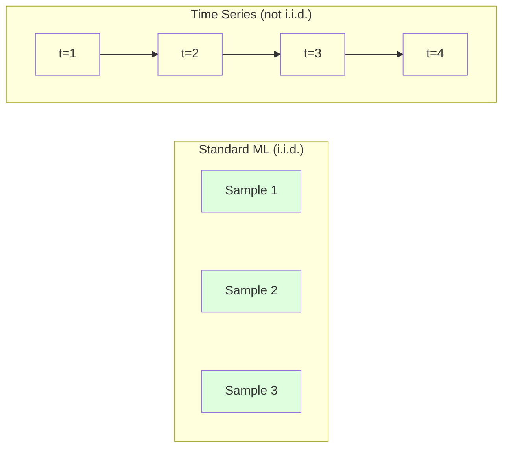
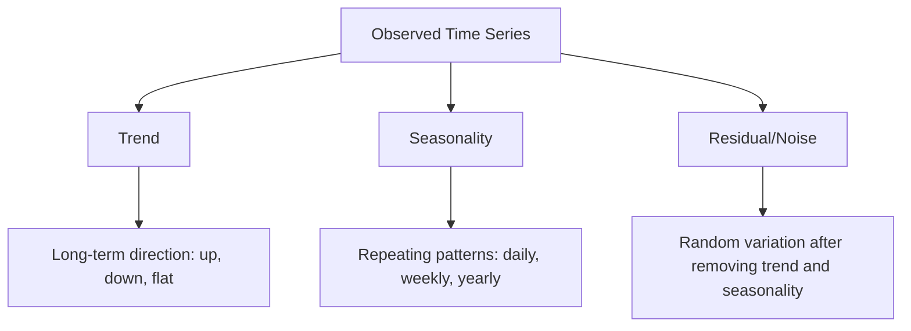
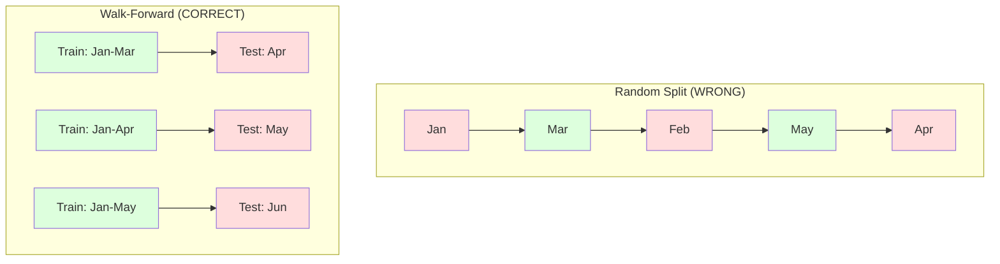

# Time Series Fundamentals

> Past performance does predict future results -- if you check for stationarity first.

**Type:** Build
**Language:** Python
**Prerequisites:** Phase 2, Lessons 01-09
**Time:** ~90 minutes

## Learning Objectives

- Decompose a time series into trend, seasonality, and residual components and test for stationarity
- Implement lag features and rolling statistics to convert a time series into a supervised learning problem
- Build a walk-forward validation framework that prevents future data from leaking into training
- Explain why random train/test splits are invalid for time series and demonstrate the performance gap versus proper temporal splits

## The Problem

You have data ordered by time. Daily sales, hourly temperature, per-minute CPU usage, weekly stock prices. You want to predict the next value, the next week, the next quarter.

You reach for your standard ML toolkit: random train/test split, cross-validation, feature matrix in, prediction out. Every step is wrong.

Time series breaks the assumptions that standard ML relies on. Samples are not independent -- today's temperature depends on yesterday's. Random splits leak future information into the past. Features that look great in backtest fail in production because they rely on patterns that shift over time.

A model that gets 95% accuracy with random cross-validation might get 55% with proper time-based evaluation. The difference is not a technicality. It is the difference between a model that works on paper and one that works in production.

This lesson covers the fundamentals: what makes time data different, how to evaluate models honestly, and how to turn a time series into features that standard ML models can consume.

## The Concept

### What Makes Time Series Different

Standard ML assumes i.i.d. -- independent and identically distributed. Each sample is drawn from the same distribution, independently of other samples. Time series violates both:

- **Not independent.** Today's stock price depends on yesterday's. This week's sales correlate with last week's.
- **Not identically distributed.** The distribution shifts over time. Sales in December look different from sales in March.

These violations are not minor. They change how you build features, how you evaluate models, and which algorithms work.



In standard ML, samples are interchangeable. Shuffling them changes nothing. In time series, order is everything. Shuffling destroys the signal.

### Components of a Time Series

Every time series is a combination of:



- **Trend**: The long-term direction. Revenue growing 10% per year. Global temperature rising.
- **Seasonality**: Repeating patterns at fixed intervals. Retail sales spike in December. Air conditioning usage peaks in July.
- **Residual**: Whatever is left after removing trend and seasonality. If the residual looks like white noise, the decomposition captured the signal.

### Stationarity

A time series is stationary if its statistical properties (mean, variance, autocorrelation) do not change over time. Most forecasting methods assume stationarity.

**Why it matters:** A non-stationary series has a mean that drifts. A model trained on data from January has learned a different mean than what February will show. It will be systematically wrong.

**How to check:** Compute rolling mean and rolling standard deviation over windows. If they drift, the series is non-stationary.

**How to fix:** Differencing. Instead of modeling the raw values, model the change between consecutive values:

```
diff[t] = value[t] - value[t-1]
```

If one round of differencing does not make the series stationary, apply it again (second-order differencing). Most real-world series need at most two rounds.

**Example:**

Original series: [100, 102, 106, 112, 120]
First difference:  [2, 4, 6, 8] (still trending upward)
Second difference:  [2, 2, 2] (constant -- stationary)

The original series had a quadratic trend. First differencing turned it into a linear trend. Second differencing made it flat. In practice, you rarely need more than two rounds.

**Formal test:** The Augmented Dickey-Fuller (ADF) test is the standard statistical test for stationarity. The null hypothesis is "the series is non-stationary." A p-value below 0.05 means you can reject the null and conclude stationarity. We do not implement ADF from scratch (it requires asymptotic distribution tables), but the rolling statistics approach in our code gives a practical visual check.

### Autocorrelation

Autocorrelation measures how much a value at time t correlates with the value at time t-k (k steps in the past). The autocorrelation function (ACF) plots this correlation for each lag k.

**ACF tells you:**
- How far back the series remembers. If ACF drops to zero after lag 5, values more than 5 steps ago are irrelevant.
- Whether seasonality exists. If ACF spikes at lag 12 (monthly data), there is yearly seasonality.
- How many lag features to create. Use lags up to where ACF becomes negligible.

**PACF (Partial Autocorrelation Function)** removes indirect correlations. If today correlates with 3 days ago only because both correlate with yesterday, PACF at lag 3 will be zero while ACF at lag 3 will not.

### Lag Features: Turning Time Series into Supervised Learning

Standard ML models need a feature matrix X and a target y. Time series gives you a single column of values. The bridge is lag features.

Take the series [10, 12, 14, 13, 15] and create lag-1 and lag-2 features:

| lag_2 | lag_1 | target |
|-------|-------|--------|
| 10    | 12    | 14     |
| 12    | 14    | 13     |
| 14    | 13    | 15     |

Now you have a standard regression problem. Any ML model (linear regression, random forest, gradient boosting) can predict the target from the lags.

Additional features you can engineer:
- **Rolling statistics:** mean, std, min, max over the last k values
- **Calendar features:** day of week, month, is_holiday, is_weekend
- **Differenced values:** change from previous step
- **Expanding statistics:** cumulative mean, cumulative sum
- **Ratio features:** current value / rolling mean (how far from recent average)
- **Interaction features:** lag_1 * day_of_week (weekday effects on momentum)

**How many lags?** Use the autocorrelation function. If ACF is significant up to lag 10, use at least 10 lags. If there is weekly seasonality, include lag 7 (and possibly 14). More lags give the model more history but also more features to fit, increasing the risk of overfitting.

**The target alignment trap.** When creating lag features, the target must be the value at time t, and all features must use values at time t-1 or earlier. If you accidentally include the value at time t as a feature, you have a perfect predictor -- and a completely useless model. This is the most common bug in time series feature engineering.

### Walk-Forward Validation

This is the most important concept in this lesson. Standard k-fold cross-validation randomly assigns samples to train and test. For time series, this leaks future information.



Walk-forward validation:
1. Train on data up to time t
2. Predict at time t+1 (or t+1 to t+k for multi-step)
3. Slide the window forward
4. Repeat

Each test fold only contains data that comes after all training data. No future leakage. This gives you an honest estimate of how the model will perform when deployed.

**Expanding window** uses all historical data for training (window grows). **Sliding window** uses a fixed-size training window (window slides). Use expanding when you believe older data is still relevant. Use sliding when the world changes and old data hurts.

### ARIMA Intuition

ARIMA is the classical time series model. It has three components:

- **AR (Autoregressive):** Predict from past values. AR(p) uses the last p values.
- **I (Integrated):** Differencing to achieve stationarity. I(d) applies d rounds of differencing.
- **MA (Moving Average):** Predict from past forecast errors. MA(q) uses the last q errors.

ARIMA(p, d, q) combines all three. You choose p, d, q based on ACF/PACF analysis or automated search (auto-ARIMA).

We will not implement ARIMA from scratch -- it requires numerical optimization that is beyond the scope of this lesson. The key insight is understanding what each component does so you can interpret ARIMA results and know when to use it.

### When to Use What

| Approach | Best For | Handles Seasonality | Handles External Features |
|----------|---------|-------------------|------------------------|
| Lag features + ML | Tabular with many external features | With calendar features | Yes |
| ARIMA | Single univariate series, short-term | SARIMA variant | No (ARIMAX for limited) |
| Exponential smoothing | Simple trend + seasonality | Yes (Holt-Winters) | No |
| Prophet | Business forecasting, holidays | Yes (Fourier terms) | Limited |
| Neural networks (LSTM, Transformer) | Long sequences, many series | Learned | Yes |

For most practical problems, lag features + gradient boosting is the strongest starting point. It handles external features naturally, does not require stationarity, and is easy to debug.

### Forecasting Horizons and Strategies

Single-step forecasting predicts one time step ahead. Multi-step forecasting predicts multiple steps. There are three strategies:

**Recursive (iterated):** Predict one step ahead, use the prediction as input for the next step. Simple but errors accumulate -- each prediction uses the previous prediction, so mistakes compound.

**Direct:** Train a separate model for each horizon. Model-1 predicts t+1, Model-5 predicts t+5. No error accumulation, but each model has fewer training samples and they do not share information.

**Multi-output:** Train one model that outputs all horizons simultaneously. Shares information across horizons but requires a model that supports multiple outputs (or a custom loss function).

For most practical problems, start with recursive for short horizons (1-5 steps) and direct for longer horizons.

### Common Mistakes in Time Series

| Mistake | Why it happens | How to fix |
|---------|---------------|-----------|
| Random train/test split | Habit from standard ML | Use walk-forward or temporal split |
| Using future features | Feature at time t included by mistake | Audit every feature for temporal alignment |
| Overfitting to seasonality | Model memorizes calendar patterns | Hold out a full seasonal cycle in the test set |
| Ignoring scale changes | Revenue doubles but patterns stay | Model percentage change instead of absolute |
| Too many lag features | "More history is better" | Use ACF to determine relevant lags |
| Not differencing | "The model will figure it out" | Tree models handle trends; linear models need stationarity |

## Build It

The code in `code/time_series.py` implements the core building blocks from scratch.

### Lag Feature Creator

```python
def make_lag_features(series, n_lags):
    n = len(series)
    X = np.full((n, n_lags), np.nan)
    for lag in range(1, n_lags + 1):
        X[lag:, lag - 1] = series[:-lag]
    valid = ~np.isnan(X).any(axis=1)
    return X[valid], series[valid]
```

This converts a 1D series into a feature matrix where each row has the last `n_lags` values as features, and the current value as the target.

### Walk-Forward Cross-Validation

```python
def walk_forward_split(n_samples, n_splits=5, min_train=50):
    assert min_train < n_samples, "min_train must be less than n_samples"
    step = max(1, (n_samples - min_train) // n_splits)
    for i in range(n_splits):
        train_end = min_train + i * step
        test_end = min(train_end + step, n_samples)
        if train_end >= n_samples:
            break
        yield slice(0, train_end), slice(train_end, test_end)
```

Each split ensures training data comes strictly before test data. The training window expands with each fold.

### Simple Autoregressive Model

A pure AR model is just linear regression on lag features:

```python
class SimpleAR:
    def __init__(self, n_lags=5):
        self.n_lags = n_lags
        self.weights = None
        self.bias = None

    def fit(self, series):
        X, y = make_lag_features(series, self.n_lags)
        # Solve via normal equations
        X_b = np.column_stack([np.ones(len(X)), X])
        theta = np.linalg.lstsq(X_b, y, rcond=None)[0]
        self.bias = theta[0]
        self.weights = theta[1:]
        return self
```

This is conceptually identical to linear regression from Lesson 02, but applied to time-lagged versions of the same variable.

### Stationarity Check

The code computes rolling statistics to visually and numerically assess stationarity:

```python
def check_stationarity(series, window=50):
    rolling_mean = np.array([
        series[max(0, i - window):i].mean()
        for i in range(1, len(series) + 1)
    ])
    rolling_std = np.array([
        series[max(0, i - window):i].std()
        for i in range(1, len(series) + 1)
    ])
    return rolling_mean, rolling_std
```

If the rolling mean drifts or the rolling std changes, the series is non-stationary. Apply differencing and check again.

The code also checks stationarity by comparing the first half and second half of the series. If the means differ by more than half a standard deviation or the variance ratio exceeds 2x, the series is flagged as non-stationary.

### Autocorrelation

```python
def autocorrelation(series, max_lag=20):
    n = len(series)
    mean = series.mean()
    var = series.var()
    acf = np.zeros(max_lag + 1)
    for k in range(max_lag + 1):
        cov = np.mean((series[:n-k] - mean) * (series[k:] - mean))
        acf[k] = cov / var if var > 0 else 0
    return acf
```

## Use It

With sklearn, you use lag features directly with any regressor:

```python
from sklearn.linear_model import Ridge
from sklearn.ensemble import GradientBoostingRegressor

X, y = make_lag_features(series, n_lags=10)

for train_idx, test_idx in walk_forward_split(len(X)):
    model = Ridge(alpha=1.0)
    model.fit(X[train_idx], y[train_idx])
    predictions = model.predict(X[test_idx])
```

For ARIMA, use statsmodels:

```python
from statsmodels.tsa.arima.model import ARIMA

model = ARIMA(train_series, order=(5, 1, 2))
fitted = model.fit()
forecast = fitted.forecast(steps=30)
```

The code in `time_series.py` demonstrates both approaches and compares them using walk-forward validation.

### sklearn TimeSeriesSplit

sklearn provides `TimeSeriesSplit` which implements walk-forward validation:

```python
from sklearn.model_selection import TimeSeriesSplit

tscv = TimeSeriesSplit(n_splits=5)
for train_index, test_index in tscv.split(X):
    X_train, X_test = X[train_index], X[test_index]
    y_train, y_test = y[train_index], y[test_index]
    model.fit(X_train, y_train)
    score = model.score(X_test, y_test)
```

This is equivalent to our from-scratch `walk_forward_split` but integrated into sklearn's cross-validation framework. You can use it with `cross_val_score`:

```python
from sklearn.model_selection import cross_val_score

scores = cross_val_score(model, X, y, cv=TimeSeriesSplit(n_splits=5))
print(f"Mean score: {scores.mean():.4f} +/- {scores.std():.4f}")
```

### 评估指标

时间序列预测使用回归指标，但具有时间感知上下文：

- **MAE（平均绝对误差）：** |y_true - y_pred| 的平均值。易于以原始单位进行解释。 “平均而言，预测误差为 3.2 度。”
- **RMSE（均方根误差）：** 均方误差的平方根。与 MAE 相比，对大错误的惩罚更多。当大错误比许多小错误更严重时使用。
- **MAPE（平均绝对百分比误差）：** |error / true_value| 的平均值* 100。与比例无关，可用于比较不同系列。但当真值为零时未定义。
- **朴素基线比较：** 始终与简单基线进行比较。季节性朴素基线预测一个时期前（昨天、上周）的值。如果你的模型不能打败天真，那就是出了问题。

### 滚动功能

该代码演示了向滞后特征添加滚动统计数据（7 天和 14 天的窗口内的平均值、标准差、最小值、最大值）。这些为模型提供了有关近期趋势和波动性的信息，而仅凭滞后特征无法捕获这些信息。

例如，如果滚动平均值上升，则表明存在上升趋势。如果滚动标准增加，则表明波动性增加。这些是基于树的模型可以学习但线性模型不能学习的模式。

## 发货

本课产生：
- `outputs/prompt-time-series-advisor.md` -- 框架时间序列问题的提示
- `code/time_series.py` -- 滞后特征、前向验证、AR 模型、平稳性检查

### 你必须打破的底线

在构建任何模型之前，建立基线：

1. **最后一个值（持久性）。** 预测明天会和今天一样。对于许多系列来说，这是难以击败的。
2. **季节性天真。** 预测今天将与上周（或去年）的同一天相同。如果您的模型无法击败这一点，那么它就没有学到除季节性之外的任何有用模式。
3. **移动平均值。** 预测最后 k 个值的平均值。平滑噪音，但无法捕捉突然的变化。

如果您精美的 ML 模型输给了季节性朴素基线，那么您就会遇到错误。最常见的是：未来的特征泄漏、错误的评估方法，或者该系列确实是随机且不可预测的。

### 实用技巧

1. **从绘图开始。** 在任何建模之前，绘制原始序列。寻找趋势、季节性、异常值、结构性中断（行为的突然变化）。 30 秒的目视检查通常可以告诉您一个多小时的自动分析结果。

2. **差异第一，模型第二。** 如果该系列有明显的趋势，请在创建滞后特征之前对其进行差异。基于树的模型可以处理趋势，但线性模型不能，而且差分永远不会有坏处。

3. **坚持至少一个完整的季节性周期。** 如果您有每周季节性，则您的测试集至少需要一整周。如果每月一次，至少一整月。否则，您无法评估模型是否捕获了季节性模式。

4. **在生产中进行监控。** 随着世界的变化，时间序列模型会随着时间的推移而退化。滚动跟踪预测错误。当错误开始增加时，根据最新数据重新训练模型。

5. **谨防政权更迭。** 根据大流行前数据训练的模型无法预测大流行后的行为。包括已知政权变化的指标作为特征，或使用忘记旧数据的滑动窗口。

6. **对数变换偏斜系列。** 收入、价格和计数通常是右偏的。采用对数可以稳定方差并使乘法模式相加，这是线性模型可以处理的。在对数空间中进行预测，然后求幂以返回原始单位。

## 练习

1. **平稳性实验。** 生成具有线性趋势的序列。使用滚动统计检查平稳性。应用一阶差分。再次检查。二次趋势需要多少轮差分？

2. **滞后选择。** 计算季节性序列（周期 = 7）上的 ACF。哪些滞后具有最高的自相关性？仅使用这些滞后（而不是连续滞后）创建滞后特征。与使用滞后 1 到 7 相比，准确性是否有所提高？

3. **前向与随机分割。** 在滞后特征上训练岭回归。使用随机 80/20 分割和前向验证进行评估。随机分割高估了多少性能？

4. **特征工程。** 将滚动平均值（窗口 = 7）、滚动标准差（窗口 = 7）和星期特征添加到滞后特征中。使用前向验证来比较有和没有这些附加功能的准确性。

5. **多步预测。** 修改 AR 模型以预测提前 5 步而不是 1 步。比较两种策略：(a) 预测一步，使用预测作为下一步的输入（递归），以及 (b) 为每个范围训练单独的模型（直接）。哪个更准确？

## 关键术语

|术语 |人们怎么说 |它实际上意味着什么 |
|------|----------------|----------------------|
|平稳性| “统计数据不会随时间变化”|均值、方差和自相关结构随时间保持恒定的序列 |
|差异 | “减去连续值”|计算 y[t] - y[t-1] 以消除趋势并实现平稳性 |
|自相关 (ACF) | “系列如何与其自身相关”|时间序列与其自身的滞后副本之间的相关性，作为滞后的函数 |
|偏自相关 (PACF) | “仅直接相关” |消除所有较短滞后的影响后滞后 k 处的自相关 |
|滞后特征| “过去的值作为输入” |使用 y[t-1], y[t-2], ..., y[t-k] 作为特征来预测 y[t] |
|向前验证 | “尊重时间的交叉验证” |训练数据按时间顺序始终先于测试数据的评估 |
|华睿玛 | 《经典时间序列模型》|自回归综合移动平均线：结合了过去的值 (AR)、差分 (I) 和过去的误差 (MA) |
|季节性| “重复日历模式”|与日历周期（每日、每周、每年）相关的时间序列中的规则、可预测周期 |
|趋势 | “长期方向”|随着时间的推移，系列级别持续增加或减少 |
|扩展窗口 | “使用所有历史记录” |训练集随着每次折叠而增长的前向验证 |
|推拉窗| “固定大小的历史记录”|前向验证，其中训练集是向前滑动的固定长度窗口 |

## 进一步阅读

- [Hyndman 和 Athanasopoulos，预测：原理与实践（第 3 版）](https://otexts.com/fpp3/)——时间序列预测的最佳免费教科书
- [scikit-learn 时间序列分割](https://scikit-learn.org/stable/modules/ generated/sklearn.model_selection.TimeSeriesSplit.html) -- sklearn 的前向分割器
- [statsmodels ARIMA 文档](https://www.statsmodels.org/stable/ generated/statsmodels.tsa.arima.model.ARIMA.html) -- 带诊断的 ARIMA 实现
- [Makridakis 等人，M5 竞赛 (2022)](https://www.sciencedirect.com/science/article/pii/S0169207021001874) -- 展示 ML 方法与统计方法的大规模预测竞赛
