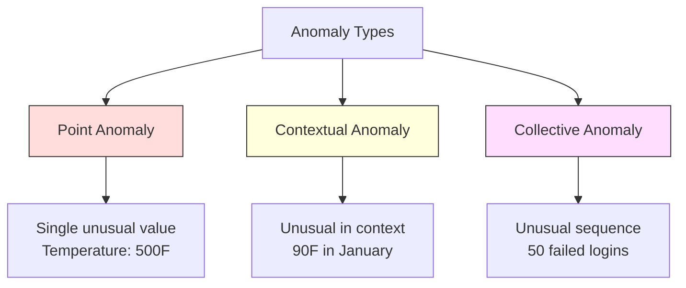
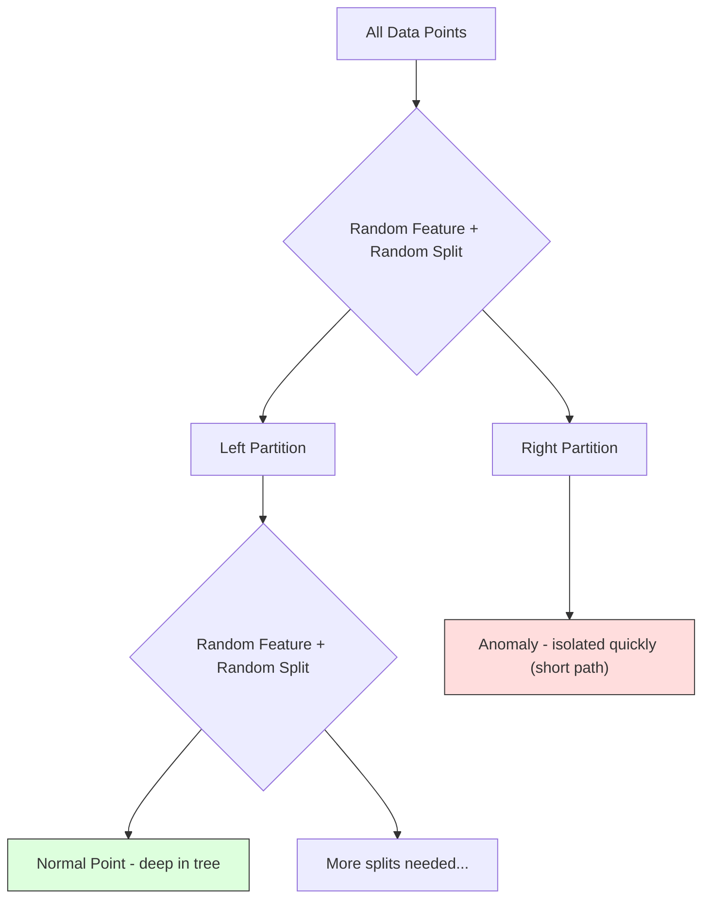
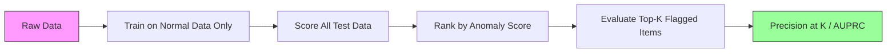

# Anomaly Detection

> Normal is easy to define. Abnormal is whatever doesn't fit.

**Type:** Build
**Language:** Python
**Prerequisites:** Phase 2, Lessons 01-09
**Time:** ~75 minutes

## Learning Objectives

- Implement Z-score, IQR, and Isolation Forest anomaly detection methods from scratch
- Distinguish between point, contextual, and collective anomalies and select the appropriate detection method for each
- Explain why anomaly detection is framed as modeling normal data rather than classifying anomalies
- Compare unsupervised anomaly detection with supervised classification and evaluate the tradeoff between novel anomaly coverage and precision

## The Problem

A credit card is used in New York at 2pm, then in Tokyo at 2:05pm. A factory sensor reads 150 degrees when the normal range is 80-120. A server sends 50,000 requests per second when the daily average is 200.

These are anomalies. Finding them matters. Fraud costs billions. Equipment failures cost downtime. Network intrusions cost data.

The challenge: you rarely have labeled examples of anomalies. Fraud makes up 0.1% of transactions. Equipment failures happen a few times per year. You cannot train a standard classifier because there is almost nothing in the "anomaly" class to learn from. Even if you have some labels, the anomalies you have seen are not the only types you will encounter. Tomorrow's fraud scheme looks different from today's.

Anomaly detection flips the problem. Instead of learning what is abnormal, learn what is normal. Anything that deviates from normal is suspicious. This works without labels, adapts to new types of anomalies, and scales to massive datasets.

## The Concept

### Types of Anomalies

Not all anomalies are the same:

- **Point anomalies.** A single data point that is unusual regardless of context. A temperature reading of 500 degrees. A transaction of $50,000 from an account that normally spends $50.
- **Contextual anomalies.** A data point that is unusual given its context. A temperature of 90 degrees is normal in summer, anomalous in winter. Same value, different context.
- **Collective anomalies.** A sequence of data points that is unusual as a group, even though each individual point might be normal. Five login failures is normal. Fifty in a row is a brute-force attack.

Most methods detect point anomalies. Contextual anomalies need time or location features. Collective anomalies need sequence-aware methods.



### The Unsupervised Framing

In standard classification, you have labels for both classes. In anomaly detection, you typically have one of three situations:

1. **Fully unsupervised.** No labels at all. You fit the detector on all data and hope anomalies are rare enough not to corrupt the "normal" model.
2. **Semi-supervised.** You have a clean dataset of normal data only. You fit on this clean set and score everything else. This is the strongest setup when possible.
3. **Weakly supervised.** You have a few labeled anomalies. Use them for evaluation, not training. Train unsupervised, then measure precision/recall on the labeled subset.

The key insight: anomaly detection is fundamentally different from classification. You are modeling the distribution of normal data, not the decision boundary between two classes.

### Supervised vs Unsupervised: The Tradeoff

If you do have labeled anomalies, should you use them for training (supervised classification) or for evaluation only (unsupervised detection)?

**Supervised (treat as classification):**
- Catches the exact types of anomalies you have seen before
- Higher precision on known anomaly types
- Misses novel anomaly types entirely
- Requires retraining when new anomaly types emerge
- Needs enough anomaly examples (often too few)

**Unsupervised (model normal, flag deviations):**
- Catches any deviation from normal, including novel types
- Does not require labeled anomalies
- Higher false positive rate (not everything unusual is bad)
- More robust to distribution shift

In practice, the best systems combine both: unsupervised detection for broad coverage, supervised models for known high-priority anomaly types, and human review for ambiguous cases.

### Z-Score Method

The simplest approach. Compute the mean and standard deviation of each feature. Flag any point more than k standard deviations from the mean.

```text
z_score = (x - mean) / std
anomaly if |z_score| > threshold
```

The default threshold is 3.0 (99.7% of normal data falls within 3 standard deviations for a Gaussian distribution).

**Strengths:** Simple. Fast. Interpretable ("this value is 4.5 standard deviations from normal").

**Weaknesses:** Assumes data is normally distributed. Sensitive to outliers in the training data (the outliers shift the mean and inflate the std, making them harder to detect). Fails on multimodal distributions.

**When it works well:** Single-feature monitoring where data is roughly bell-shaped. Server response times, manufacturing tolerances, sensor readings with stable baselines.

**When it fails:** Multi-cluster data (two office locations with different baseline temperatures), skewed data (transaction amounts where $1000 is rare but not anomalous), data with outliers in the training set.

### IQR Method

More robust than Z-score. Uses the interquartile range instead of mean and standard deviation.

```
Q1 = 25th percentile
Q3 = 75th percentile
IQR = Q3 - Q1
lower_bound = Q1 - factor * IQR
upper_bound = Q3 + factor * IQR
anomaly if x < lower_bound or x > upper_bound
```

The default factor is 1.5.

**Strengths:** Robust to outliers (percentiles are not affected by extreme values). Works on skewed distributions. No normality assumption.

**Weaknesses:** Univariate only (applies per feature independently). Cannot detect anomalies that are unusual only when features are considered together (a point might be normal in each feature individually but anomalous in the joint space).

**Practical note:** The 1.5 factor in IQR corresponds to the whiskers in a box plot. Points outside the whiskers are potential outliers. Using 3.0 instead of 1.5 makes the detector more conservative (fewer flags, fewer false positives). The right factor depends on your tolerance for false alarms.

### Isolation Forest

The key insight: anomalies are few and different. In a random partitioning of the data, anomalies are easier to isolate -- they need fewer random splits to be separated from the rest.



**How it works:**
1. Build many random trees (an isolation forest)
2. At each node, pick a random feature and a random split value between the feature's min and max
3. Keep splitting until every point is isolated (in its own leaf)
4. Anomalies have shorter average path lengths across all trees

**Why it works:** Normal points live in dense regions. Many random splits are needed to isolate one from its neighbors. Anomalies live in sparse regions. One or two random splits are enough to isolate them.

The anomaly score is based on the average path length across all trees, normalized by the expected path length of a random binary search tree:

```
score(x) = 2^(-average_path_length(x) / c(n))
```

Where `c(n)` is the expected path length for n samples. Score near 1 means anomaly. Score near 0.5 means normal. Score near 0 means very normal (deep in dense clusters).

**Strengths:** No distribution assumptions. Works in high dimensions. Scales well (sublinear in sample size because each tree uses a subsample). Handles mixed feature types.

**Weaknesses:** Struggles with anomalies in dense regions (masking effect). Random splitting is less effective when many features are irrelevant.

**Key hyperparameters:**
- `n_estimators`: Number of trees. 100 is usually enough. More trees give more stable scores but slower computation.
- `max_samples`: Number of samples per tree. 256 is the default in the original paper. Smaller values make individual trees less accurate but increase diversity. The subsampling is what makes Isolation Forest fast -- each tree sees a small fraction of the data.
- `contamination`: Expected fraction of anomalies. Used only for setting the threshold. Does not affect the scores themselves.

### Local Outlier Factor (LOF)

LOF compares the local density around a point to the density around its neighbors. A point in a sparse region surrounded by dense regions is anomalous.

**How it works:**
1. For each point, find its k nearest neighbors
2. Compute the local reachability density (how dense is the neighborhood)
3. Compare each point's density to its neighbors' densities
4. If a point has much lower density than its neighbors, it is an outlier

**LOF score:**
- LOF close to 1.0 means similar density as neighbors (normal)
- LOF greater than 1.0 means lower density than neighbors (potentially anomalous)
- LOF much greater than 1.0 (e.g., 2.0+) means significantly lower density (likely anomaly)

The "local" part is critical. Consider a dataset with two clusters: a dense cluster of 1000 points and a sparse cluster of 50 points. A point on the edge of the sparse cluster is not globally unusual -- it has 50 neighbors. But it is locally unusual if its immediate neighbors are denser than it is. LOF captures this nuance that global methods miss.

**Strengths:** Detects local anomalies (points that are unusual in their neighborhood, even if they are not globally unusual). Works on clusters of different densities.

**Weaknesses:** Slow on large datasets (O(n^2) for naive implementation). Sensitive to the choice of k. Does not work well in very high dimensions (curse of dimensionality affects distance calculations).

### Comparison

| Method | Assumptions | Speed | Handles High Dims | Detects Local Anomalies |
|--------|------------|-------|-------------------|------------------------|
| Z-score | Normal distribution | Very fast | Yes (per feature) | No |
| IQR | None (per feature) | Very fast | Yes (per feature) | No |
| Isolation Forest | None | Fast | Yes | Partially |
| LOF | Distance is meaningful | Slow | Poorly | Yes |

### Evaluation Challenges

Evaluating anomaly detectors is harder than evaluating classifiers:

- **Extreme class imbalance.** With 0.1% anomalies, predicting "normal" for everything gives 99.9% accuracy. Accuracy is useless.
- **AUROC is misleading.** With heavy imbalance, AUROC can look good even when the model misses most anomalies at practical thresholds.
- **Better metrics:** Precision@k (of the top k flagged items, how many are real anomalies), AUPRC (area under precision-recall curve), and recall at a fixed false positive rate.



### Anomaly Detection Pipeline

In practice, anomaly detection follows this workflow:

1. **Collect baseline data.** Ideally, a period where you know there are no (or very few) anomalies.
2. **Feature engineering.** Raw features plus derived features (rolling statistics, time features, ratios).
3. **Train the detector.** Fit on the baseline data. The model learns what "normal" looks like.
4. **Score new data.** Each new observation gets an anomaly score.
5. **Threshold selection.** Choose the score cutoff. This is a business decision: higher threshold means fewer false alarms but more missed anomalies.
6. **Alert and investigate.** Flagged points go to human review or automated response.
7. **Feedback collection.** Record whether flagged items were true anomalies or false alarms. Use this data to evaluate the detector and tune the threshold over time.

The pipeline is never "done." Data distributions shift, new anomaly types emerge, and thresholds need adjustment. Treat anomaly detection as a living system, not a one-time model.

## Build It

The code in `code/anomaly_detection.py` implements Z-score, IQR, and Isolation Forest from scratch.

### Z-Score Detector

```python
def zscore_detect(X, threshold=3.0):
    mean = X.mean(axis=0)
    std = X.std(axis=0)
    std[std == 0] = 1.0
    z = np.abs((X - mean) / std)
    return z.max(axis=1) > threshold
```

Simple and vectorized. Flags a point if any feature exceeds the threshold.

### IQR Detector

```python
def iqr_detect(X, factor=1.5):
    q1 = np.percentile(X, 25, axis=0)
    q3 = np.percentile(X, 75, axis=0)
    iqr = q3 - q1
    iqr[iqr == 0] = 1.0
    lower = q1 - factor * iqr
    upper = q3 + factor * iqr
    outside = (X < lower) | (X > upper)
    return outside.any(axis=1)
```

### Isolation Forest from Scratch

The from-scratch implementation builds isolation trees that randomly partition the feature space:

```python
class IsolationTree:
    def __init__(self, max_depth):
        self.max_depth = max_depth

    def fit(self, X, depth=0):
        n, p = X.shape
        if depth >= self.max_depth or n <= 1:
            self.is_leaf = True
            self.size = n
            return self
        self.is_leaf = False
        self.feature = np.random.randint(p)
        x_min = X[:, self.feature].min()
        x_max = X[:, self.feature].max()
        if x_min == x_max:
            self.is_leaf = True
            self.size = n
            return self
        self.threshold = np.random.uniform(x_min, x_max)
        left_mask = X[:, self.feature] < self.threshold
        self.left = IsolationTree(self.max_depth).fit(X[left_mask], depth + 1)
        self.right = IsolationTree(self.max_depth).fit(X[~left_mask], depth + 1)
        return self
```

The path length to isolate a point determines its anomaly score. Shorter paths mean more anomalous.

The `IsolationForest` class wraps multiple trees:

```python
class IsolationForest:
    def __init__(self, n_estimators=100, max_samples=256, seed=42):
        self.n_estimators = n_estimators
        self.max_samples = max_samples

    def fit(self, X):
        sample_size = min(self.max_samples, X.shape[0])
        max_depth = int(np.ceil(np.log2(sample_size)))
        for _ in range(self.n_estimators):
            idx = rng.choice(X.shape[0], size=sample_size, replace=False)
            tree = IsolationTree(max_depth=max_depth)
            tree.fit(X[idx])
            self.trees.append(tree)

    def anomaly_score(self, X):
        avg_path = average path length across all trees
        scores = 2.0 ** (-avg_path / c(max_samples))
        return scores
```

The normalization factor `c(n)` is the expected path length of an unsuccessful search in a binary search tree with n elements. It equals `2 * H(n-1) - 2*(n-1)/n` where `H` is the harmonic number. This normalization ensures scores are comparable across datasets of different sizes.

### Demo Scenarios

The code generates multiple test scenarios:

1. **Single cluster with outliers.** A 2D Gaussian cluster with anomalies injected far from the center. All methods should work here.
2. **Multimodal data.** Three clusters of different sizes and densities. Points between clusters are anomalous. Z-score struggles because the per-feature ranges are wide.
3. **High-dimensional data.** 50 features, but anomalies differ in only 5 of them. Tests whether methods can find anomalies in a subset of features.

Each demo compares all methods using precision, recall, F1, and Precision@k.

## Use It

With sklearn (using library implementations, not from-scratch):

```python
from sklearn.ensemble import IsolationForest
from sklearn.neighbors import LocalOutlierFactor

iso = IsolationForest(n_estimators=100, contamination=0.05, random_state=42)
iso.fit(X_train)
predictions = iso.predict(X_test)

lof = LocalOutlierFactor(n_neighbors=20, contamination=0.05, novelty=True)
lof.fit(X_train)
predictions = lof.predict(X_test)
```

Note `contamination` sets the expected fraction of anomalies. Setting it correctly matters -- too low misses anomalies, too high creates false alarms.

The code in `anomaly_detection.py` compares from-scratch implementations against sklearn on the same data.

### sklearn Contamination Parameter

The `contamination` parameter in sklearn determines the threshold for converting continuous anomaly scores into binary predictions. It does not change the underlying scores.

```python
iso_5 = IsolationForest(contamination=0.05)
iso_10 = IsolationForest(contamination=0.10)
```

Both produce the same anomaly scores. But `iso_5` flags the top 5% while `iso_10` flags the top 10%. If you do not know the true anomaly rate (you usually do not), set contamination to "auto" and work with the raw scores directly. Set your own threshold based on the cost tradeoff between false positives and false negatives.

### One-Class SVM

Another unsupervised anomaly detector worth knowing. One-Class SVM fits a boundary around normal data in a high-dimensional feature space (using the kernel trick).

```python
from sklearn.svm import OneClassSVM

oc_svm = OneClassSVM(kernel="rbf", gamma="auto", nu=0.05)
oc_svm.fit(X_train)
predictions = oc_svm.predict(X_test)
```

“nu”参数近似于异常的比例。一类 SVM 在中小型数据集上运行良好，但无法扩展到非常大的数据（核矩阵呈二次方增长）。

### 自动编码器方法（预览）

自动编码器是学习压缩和重建数据的神经网络。使用普通数据进行训练。在测试时，异常具有很高的重建误差，因为网络仅学会重建正常模式。

这将在第 3 阶段（深度学习）中介绍，但原理是相同的：对正常情况进行建模，对偏差进行标记。

### 集合异常检测

正如集成方法可以改进分类（第 11 课）一样，组合多个异常检测器可以改进检测。最简单的方法：

1.运行多个检测器（Z-score、IQR、Isolation Forest、LOF）
2. 将每个检测器的分数标准化为 [0, 1]
3. 平均归一化分数
4. 标记平均分数高于阈值的分数

这减少了误报，因为不同的方法有不同的故障模式。所有四种方法标记的点几乎肯定是异常的。仅由一个标记的点可能是该方法的一个怪癖。

更复杂的集成通过估计的可靠性对每个检测器进行加权（在具有已知异常的验证集上进行测量，如果可用）。

### 生产注意事项

1. **阈值漂移。** 随着数据分布的变化，固定阈值变得过时。监控异常分数的分布并定期调整。
2. **警报疲劳。** 误报过多，操作员不再注意。从较高的阈值（更少、更可靠的警报）开始，并随着信任的建立而降低阈值。
3. **集成方法。** 在生产中，组合多个检测器。仅当多种方法一致认为某个点异常时才标记该点。这显着减少了误报。
4. **特征工程。** 原始特征是远远不够的。添加滚动统计、比率、自上次事件以来的时间和特定于域的功能。良好的功能集比探测器的选择更重要。
5. **反馈循环。** 当操作员调查标记的项目并确认或驳回它们时，将其反馈到系统中。随着时间的推移积累标记数据以评估和改进检测器。

## 发货

本课产生：
- `outputs/skill-anomaly- detector.md` -- 选择正确检测器的决策技能
- `code/anomaly_detection.py` -- 从头开始​​的 Z 分数、IQR 和隔离森林，与 sklearn 比较

### 选择阈值

异常分数是连续的。您需要一个阈值来做出二元决策。这是一项业务决策，而不是技术决策。

考虑两种情况：
- **欺诈检测。** 错过欺诈的代价是昂贵的（退款、客户信任）。误报导致人类分析师花费了 5 分钟的时间进行调查。将阈值设置得低，以捕捉更多欺诈行为，接受更多误报。
- **设备维护。** 误报意味着不必要的停机，成本为 50,000 美元。错过一次故障意味着需要花费 500,000 美元进行维修。设置阈值来平衡这些成本。

在这两种情况下，最佳阈值取决于误报和漏报之间的成本比。绘制不同阈值下的精度和召回率，叠加成本函数，并选择最小成本点。

### 扩展到生产

对于生产中的实时异常检测：

1. **批量训练，在线评分。** 使用最近的正常数据定期（每天、每周）训练模型。对每个新观察结果进行评分。
2. **特征计算必须匹配。** 如果您使用滚动统计数据进行了超过 30 天的训练，则需要 30 天的历史记录来计算新观察的特征。缓冲所需的历史记录。
3. **分数分布监控。** 跟踪异常分数随时间的分布情况。如果中值分数向上漂移，则要么数据正在变化，要么模型已经过时。
4. **可解释性。** 当您标记异常时，请说明原因。 Z 分数：“特征 X 比正常值高 4.2 个标准差。”孤立森林：“这个点平均被孤立在 3.1 个分割中（正常点取 8.5 个）。”

## 练习

1. **阈值调整。** 使用从 1.0 到 5.0 的阈值（步长为 0.5）运行 Z 分数检测器。绘制每个阈值的精确度和召回率。您的数据的最佳位置在哪里？

2. **多变量异常。** 创建 2D 数据，其中每个特征单独看起来正常，但组合是异常的（例如，远离主簇对角线的点）。表明每个特征的 Z 分数错过了这些，但隔离森林抓住了它们。

3. **从头开始 LOF。** 使用 k 最近邻实现局部离群因子。在相同数据上与 sklearn 的 LocalOutlierFactor 进行比较。使用 k=10 和 k=50——k 的选择如何影响结果？

4. **流式异常检测。** 修改 Z 分数检测器以在流式设置中工作：当新点到达时更新运行均值和方差（Welford 的在线算法）。与相同数据的批量 Z 分数进行比较。

5. **真实世界评估。** 采用具有已知异常的数据集（例如，来自 Kaggle 的信用卡欺诈）。使用 precision@100、 precision@500 和 AUPRC 评估所有四种方法。哪种方法效果最好？为什么？

## 关键术语

|术语 |人们怎么说 |它实际上意味着什么 |
|------|----------------|----------------------|
|异常 | “异常点，异常点” |与正常数据的预期模式显着偏离的数据点 |
|点异常 | “一个奇怪的值”|无论背景如何，个人观察都是不寻常的|
|上下文异常 | “正常值，错误上下文” |考虑到其上下文（时间、地点等），该观察结果是不寻常的，但在另一个上下文中可能是正常的 |
|隔离森林| “随机分割以查找异常值”|随机树的集合，可以用比正常点更少的分裂来隔离异常 |
|局部离群因素| “与邻居比较密度”|一种标记局部密度远低于其邻居密度的点的方法 |
| Z 分数 | “平均值的标准差” | (x - 平均值) / std，以标准差为单位测量点距中心的距离 |
| IQR | “四分位距” | Q3 - Q1，测量中间 50% 数据的分布，用于稳健的异常值检测 |
|污染 | “预期异常比例” |超参数告诉检测器应将多大比例的数据标记为异常 |
|精度@k | “前 k 个旗帜中，有多少是真实的”|仅计算 k 个最可疑点的精度，对于不平衡异常检测很有用 |
|亚太研究中心 | “精确率-召回率曲线下的面积”|总结所有阈值的精确召回性能的指标，对于不平衡数据优于 AUROC |

## 进一步阅读

- [Liu et al., Isolation Forest (2008)](https://cs.nju.edu.cn/zhouzh/zhouzh.files/publication/icdm08b.pdf) -- 原始的隔离森林论文
- [Breunig 等人，LOF：识别基于密度的局部异常值 (2000)](https://dl.acm.org/doi/10.1145/342009.335388)——原始 LOF 论文
- [scikit-learn 离群值检测文档](https://scikit-learn.org/stable/modules/outlier_detection.html) -- 所有 sklearn 异常检测器的概述
- [Chandola 等人，异常检测：一项调查 (2009)](https://dl.acm.org/doi/10.1145/1541880.1541882) -- 异常检测方法的综合调查
- [Goldstein 和 Uchida，无监督异常检测算法的比较评估 (2016)](https://journals.plos.org/plosone/article?id=10.1371/journal.pone.0152173) -- 10 种方法在真实数据集上的实证比较
