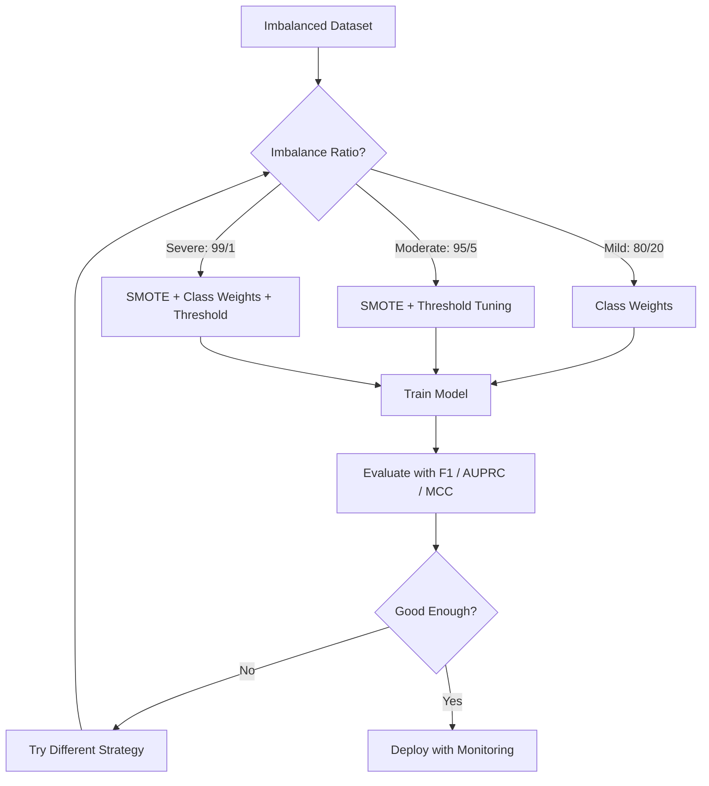
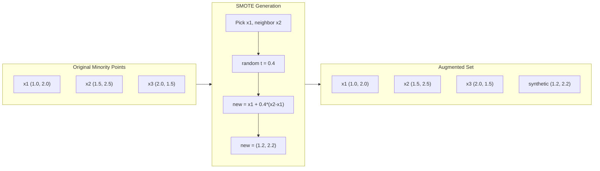
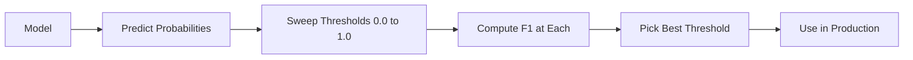
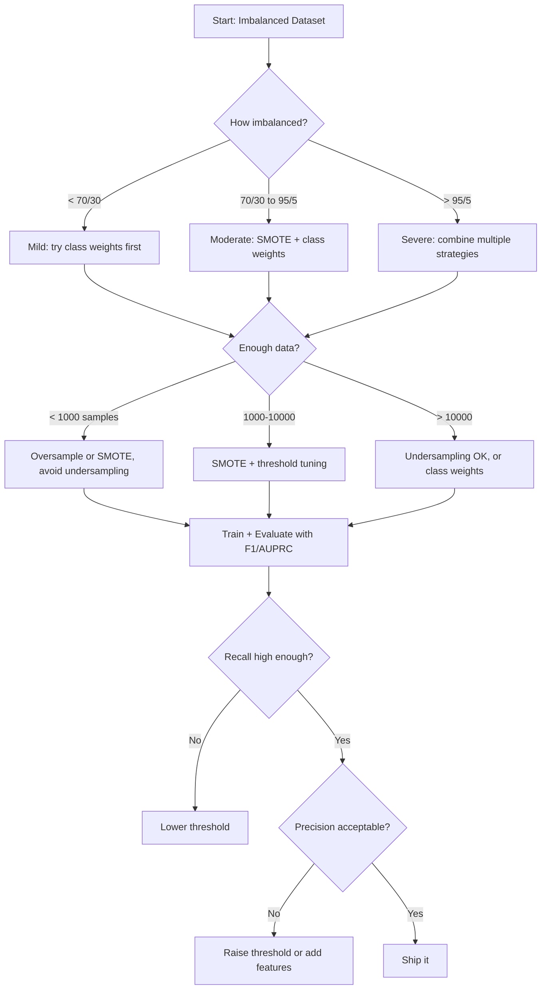

# Handling Imbalanced Data

> When 99% of your data is "normal," accuracy is a lie.

**Type:** Build
**Language:** Python
**Prerequisites:** Phase 2, Lessons 01-09 (especially evaluation metrics)
**Time:** ~90 minutes

## Learning Objectives

- Implement SMOTE from scratch and explain how synthetic oversampling differs from random duplication
- Evaluate imbalanced classifiers using F1, AUPRC, and Matthews Correlation Coefficient instead of accuracy
- Compare class weighting, threshold tuning, and resampling strategies and select the right approach for a given imbalance ratio
- Build a complete imbalanced data pipeline that combines SMOTE, class weights, and threshold optimization

## The Problem

You build a fraud detection model. It gets 99.9% accuracy. You celebrate. Then you realize it predicts "not fraud" for every single transaction.

This is not a bug. It is the rational thing to do when only 0.1% of transactions are fraudulent. The model learns that always guessing the majority class minimizes overall error. It is technically correct and completely useless.

This happens everywhere real classification matters. Disease diagnosis: 1% positive rate. Network intrusion: 0.01% attacks. Manufacturing defects: 0.5% defective. Spam filtering: 20% spam. Churn prediction: 5% churners. The more consequential the minority class, the rarer it tends to be.

Accuracy fails because it treats all correct predictions equally. Correctly labeling a legitimate transaction and correctly catching fraud both count as one point of accuracy. But catching fraud is the entire reason the model exists. We need metrics, techniques, and training strategies that force the model to pay attention to the rare but important class.

## The Concept

### Why Accuracy Fails

Consider a dataset with 1000 samples: 990 negative, 10 positive. A model that always predicts negative:

|  | Predicted Positive | Predicted Negative |
|--|---|---|
| Actually Positive | 0 (TP) | 10 (FN) |
| Actually Negative | 0 (FP) | 990 (TN) |

Accuracy = (0 + 990) / 1000 = 99.0%

The model catches zero fraud. Zero disease. Zero defects. But accuracy says 99%. This is why accuracy is dangerous for imbalanced problems.

### Better Metrics

**Precision** = TP / (TP + FP). Of everything flagged as positive, how many actually are? High precision means few false alarms.

**Recall** = TP / (TP + FN). Of everything actually positive, how many did we catch? High recall means few missed positives.

**F1 Score** = 2 * precision * recall / (precision + recall). The harmonic mean. Penalizes extreme imbalance between precision and recall more than the arithmetic mean would.

**F-beta Score** = (1 + beta^2) * precision * recall / (beta^2 * precision + recall). When beta > 1, recall matters more. When beta < 1, precision matters more. F2 is common in fraud detection (missing fraud is worse than a false alarm).

**AUPRC** (Area Under Precision-Recall Curve). Like AUC-ROC but more informative for imbalanced data. A random classifier has AUPRC equal to the positive class rate (not 0.5 like ROC). This makes improvements easier to see.

**Matthews Correlation Coefficient** = (TP * TN - FP * FN) / sqrt((TP+FP)(TP+FN)(TN+FP)(TN+FN)). Ranges from -1 to +1. Only gives a high score when the model does well on both classes. Balanced even when classes are very different sizes.

For the "always predict negative" model above: precision = 0/0 (undefined, often set to 0), recall = 0/10 = 0, F1 = 0, MCC = 0. These metrics correctly identify the model as worthless.

### The Imbalanced Data Pipeline



### SMOTE: Synthetic Minority Oversampling Technique

Random oversampling duplicates existing minority samples. This works but risks overfitting because the model sees identical points repeatedly.

SMOTE creates new synthetic minority samples that are plausible but not copies. The algorithm:

1. For each minority sample x, find its k nearest neighbors among other minority samples
2. Pick one neighbor at random
3. Create a new sample on the line segment between x and that neighbor

The formula: `new_sample = x + random(0, 1) * (neighbor - x)`

This interpolates between real minority points, creating samples in the same region of feature space without just copying existing data.



### Sampling Strategies Compared

**Random Oversampling**: duplicate minority samples to match majority count.
- Pros: simple, no information loss
- Cons: exact duplicates cause overfitting, increases training time

**Random Undersampling**: remove majority samples to match minority count.
- Pros: fast training, simple
- Cons: throws away potentially useful majority data, higher variance

**SMOTE**: create synthetic minority samples via interpolation.
- Pros: generates new data points, reduces overfitting compared to random oversampling
- Cons: can create noisy samples near the decision boundary, does not account for majority class distribution

| Strategy | Data Changed | Risk | When to Use |
|----------|-------------|------|-------------|
| Oversample | Minority duplicated | Overfitting | Small datasets, moderate imbalance |
| Undersample | Majority removed | Information loss | Large datasets, want fast training |
| SMOTE | Synthetic minority added | Boundary noise | Moderate imbalance, enough minority samples for k-NN |

### Class Weights

Instead of changing the data, change how the model treats errors. Assign higher weight to misclassifying the minority class.

For a binary problem with 950 negative and 50 positive samples:
- Weight for negative class = n_samples / (2 * n_negative) = 1000 / (2 * 950) = 0.526
- Weight for positive class = n_samples / (2 * n_positive) = 1000 / (2 * 50) = 10.0

The positive class gets 19x the weight. Misclassifying one positive sample costs as much as misclassifying 19 negative samples. The model is forced to pay attention to the minority class.

In logistic regression, this modifies the loss function:

```
weighted_loss = -sum(w_i * [y_i * log(p_i) + (1-y_i) * log(1-p_i)])
```

where w_i depends on the class of sample i.

Class weights are mathematically equivalent to oversampling in expectation, but without creating new data points. This makes them faster and avoids the overfitting risk of duplicated samples.

### Threshold Tuning

Most classifiers output a probability. The default threshold is 0.5: if P(positive) >= 0.5, predict positive. But 0.5 is arbitrary. When classes are imbalanced, the optimal threshold is usually much lower.

The process:
1. Train a model
2. Get predicted probabilities on the validation set
3. Sweep thresholds from 0.0 to 1.0
4. Compute F1 (or your chosen metric) at each threshold
5. Pick the threshold that maximizes your metric



A model might output P(fraud) = 0.15 for a fraudulent transaction. At threshold 0.5, this is classified as not fraud. At threshold 0.10, it is correctly caught. The probability calibration matters less than the ranking -- as long as fraud gets higher probabilities than non-fraud, there exists a threshold that separates them.

### Cost-Sensitive Learning

Generalization of class weights. Instead of uniform costs, assign specific misclassification costs:

| | Predict Positive | Predict Negative |
|--|---|---|
| Actually Positive | 0 (correct) | C_FN = 100 |
| Actually Negative | C_FP = 1 | 0 (correct) |

Missing a fraudulent transaction (FN) costs 100x more than a false alarm (FP). The model optimizes for total cost, not total error count.

This is the most principled approach when you can estimate real-world costs. A missed cancer diagnosis has a very different cost than a false alarm that leads to an extra biopsy. Making these costs explicit forces the right tradeoffs.

### Decision Flowchart



## Build It

### Step 1: Generate an imbalanced dataset

```python
import numpy as np


def make_imbalanced_data(n_majority=950, n_minority=50, seed=42):
    rng = np.random.RandomState(seed)

    X_maj = rng.randn(n_majority, 2) * 1.0 + np.array([0.0, 0.0])
    X_min = rng.randn(n_minority, 2) * 0.8 + np.array([2.5, 2.5])

    X = np.vstack([X_maj, X_min])
    y = np.concatenate([np.zeros(n_majority), np.ones(n_minority)])

    shuffle_idx = rng.permutation(len(y))
    return X[shuffle_idx], y[shuffle_idx]
```

### Step 2: SMOTE from scratch

```python
def euclidean_distance(a, b):
    return np.sqrt(np.sum((a - b) ** 2))


def find_k_neighbors(X, idx, k):
    distances = []
    for i in range(len(X)):
        if i == idx:
            continue
        d = euclidean_distance(X[idx], X[i])
        distances.append((i, d))
    distances.sort(key=lambda x: x[1])
    return [d[0] for d in distances[:k]]


def smote(X_minority, k=5, n_synthetic=100, seed=42):
    rng = np.random.RandomState(seed)
    n_samples = len(X_minority)
    k = min(k, n_samples - 1)
    synthetic = []

    for _ in range(n_synthetic):
        idx = rng.randint(0, n_samples)
        neighbors = find_k_neighbors(X_minority, idx, k)
        neighbor_idx = neighbors[rng.randint(0, len(neighbors))]
        t = rng.random()
        new_point = X_minority[idx] + t * (X_minority[neighbor_idx] - X_minority[idx])
        synthetic.append(new_point)

    return np.array(synthetic)
```

### Step 3: Random oversampling and undersampling

```python
def random_oversample(X, y, seed=42):
    rng = np.random.RandomState(seed)
    classes, counts = np.unique(y, return_counts=True)
    max_count = counts.max()

    X_resampled = list(X)
    y_resampled = list(y)

    for cls, count in zip(classes, counts):
        if count < max_count:
            cls_indices = np.where(y == cls)[0]
            n_needed = max_count - count
            chosen = rng.choice(cls_indices, size=n_needed, replace=True)
            X_resampled.extend(X[chosen])
            y_resampled.extend(y[chosen])

    X_out = np.array(X_resampled)
    y_out = np.array(y_resampled)
    shuffle = rng.permutation(len(y_out))
    return X_out[shuffle], y_out[shuffle]


def random_undersample(X, y, seed=42):
    rng = np.random.RandomState(seed)
    classes, counts = np.unique(y, return_counts=True)
    min_count = counts.min()

    X_resampled = []
    y_resampled = []

    for cls in classes:
        cls_indices = np.where(y == cls)[0]
        chosen = rng.choice(cls_indices, size=min_count, replace=False)
        X_resampled.extend(X[chosen])
        y_resampled.extend(y[chosen])

    X_out = np.array(X_resampled)
    y_out = np.array(y_resampled)
    shuffle = rng.permutation(len(y_out))
    return X_out[shuffle], y_out[shuffle]
```

### Step 4: Logistic regression with class weights

```python
def sigmoid(z):
    return 1.0 / (1.0 + np.exp(-np.clip(z, -500, 500)))


def logistic_regression_weighted(X, y, weights, lr=0.01, epochs=200):
    n_samples, n_features = X.shape
    w = np.zeros(n_features)
    b = 0.0

    for _ in range(epochs):
        z = X @ w + b
        pred = sigmoid(z)
        error = pred - y
        weighted_error = error * weights

        gradient_w = (X.T @ weighted_error) / n_samples
        gradient_b = np.mean(weighted_error)

        w -= lr * gradient_w
        b -= lr * gradient_b

    return w, b


def compute_class_weights(y):
    classes, counts = np.unique(y, return_counts=True)
    n_samples = len(y)
    n_classes = len(classes)
    weight_map = {}
    for cls, count in zip(classes, counts):
        weight_map[cls] = n_samples / (n_classes * count)
    return np.array([weight_map[yi] for yi in y])
```

### Step 5: Threshold tuning

```python
def find_optimal_threshold(y_true, y_probs, metric="f1"):
    best_threshold = 0.5
    best_score = -1.0

    for threshold in np.arange(0.05, 0.96, 0.01):
        y_pred = (y_probs >= threshold).astype(int)
        tp = np.sum((y_pred == 1) & (y_true == 1))
        fp = np.sum((y_pred == 1) & (y_true == 0))
        fn = np.sum((y_pred == 0) & (y_true == 1))

        if metric == "f1":
            precision = tp / (tp + fp) if (tp + fp) > 0 else 0.0
            recall = tp / (tp + fn) if (tp + fn) > 0 else 0.0
            score = 2 * precision * recall / (precision + recall) if (precision + recall) > 0 else 0.0
        elif metric == "recall":
            score = tp / (tp + fn) if (tp + fn) > 0 else 0.0
        elif metric == "precision":
            score = tp / (tp + fp) if (tp + fp) > 0 else 0.0

        if score > best_score:
            best_score = score
            best_threshold = threshold

    return best_threshold, best_score
```

### Step 6: Evaluation functions

```python
def confusion_matrix_values(y_true, y_pred):
    tp = np.sum((y_pred == 1) & (y_true == 1))
    tn = np.sum((y_pred == 0) & (y_true == 0))
    fp = np.sum((y_pred == 1) & (y_true == 0))
    fn = np.sum((y_pred == 0) & (y_true == 1))
    return tp, tn, fp, fn


def compute_metrics(y_true, y_pred):
    tp, tn, fp, fn = confusion_matrix_values(y_true, y_pred)
    accuracy = (tp + tn) / (tp + tn + fp + fn)
    precision = tp / (tp + fp) if (tp + fp) > 0 else 0.0
    recall = tp / (tp + fn) if (tp + fn) > 0 else 0.0
    f1 = 2 * precision * recall / (precision + recall) if (precision + recall) > 0 else 0.0

    denom = np.sqrt(float((tp + fp) * (tp + fn) * (tn + fp) * (tn + fn)))
    mcc = (tp * tn - fp * fn) / denom if denom > 0 else 0.0

    return {
        "accuracy": accuracy,
        "precision": precision,
        "recall": recall,
        "f1": f1,
        "mcc": mcc,
    }
```

### Step 7: Compare all approaches

```python
X, y = make_imbalanced_data(950, 50, seed=42)
split = int(0.8 * len(y))
X_train, X_test = X[:split], X[split:]
y_train, y_test = y[:split], y[split:]

# Baseline: no treatment
w_base, b_base = logistic_regression_weighted(
    X_train, y_train, np.ones(len(y_train)), lr=0.1, epochs=300
)
probs_base = sigmoid(X_test @ w_base + b_base)
preds_base = (probs_base >= 0.5).astype(int)

# Oversampled
X_over, y_over = random_oversample(X_train, y_train)
w_over, b_over = logistic_regression_weighted(
    X_over, y_over, np.ones(len(y_over)), lr=0.1, epochs=300
)
preds_over = (sigmoid(X_test @ w_over + b_over) >= 0.5).astype(int)

# SMOTE
minority_mask = y_train == 1
X_minority = X_train[minority_mask]
synthetic = smote(X_minority, k=5, n_synthetic=len(y_train) - 2 * int(minority_mask.sum()))
X_smote = np.vstack([X_train, synthetic])
y_smote = np.concatenate([y_train, np.ones(len(synthetic))])
w_sm, b_sm = logistic_regression_weighted(
    X_smote, y_smote, np.ones(len(y_smote)), lr=0.1, epochs=300
)
preds_smote = (sigmoid(X_test @ w_sm + b_sm) >= 0.5).astype(int)

# Class weights
sample_weights = compute_class_weights(y_train)
w_cw, b_cw = logistic_regression_weighted(
    X_train, y_train, sample_weights, lr=0.1, epochs=300
)
probs_cw = sigmoid(X_test @ w_cw + b_cw)
preds_cw = (probs_cw >= 0.5).astype(int)

# Threshold tuning (tune on held-out validation set, not test set)
probs_val = sigmoid(X_val @ w_cw + b_cw)
best_thresh, best_f1 = find_optimal_threshold(y_val, probs_val, metric="f1")
preds_thresh = (probs_cw >= best_thresh).astype(int)
```

The code file runs all of this in a single script and prints results.

## Use It

With scikit-learn and imbalanced-learn, these techniques are one-liners:

```python
from sklearn.linear_model import LogisticRegression
from sklearn.metrics import classification_report, f1_score
from sklearn.model_selection import train_test_split
from imblearn.over_sampling import SMOTE
from imblearn.under_sampling import RandomUnderSampler
from imblearn.pipeline import Pipeline

X_train, X_test, y_train, y_test = train_test_split(X, y, stratify=y)

model_weighted = LogisticRegression(class_weight="balanced")
model_weighted.fit(X_train, y_train)
print(classification_report(y_test, model_weighted.predict(X_test)))

smote = SMOTE(random_state=42)
X_resampled, y_resampled = smote.fit_resample(X_train, y_train)
model_smote = LogisticRegression()
model_smote.fit(X_resampled, y_resampled)
print(classification_report(y_test, model_smote.predict(X_test)))

pipeline = Pipeline([
    ("smote", SMOTE()),
    ("model", LogisticRegression(class_weight="balanced")),
])
pipeline.fit(X_train, y_train)
print(classification_report(y_test, pipeline.predict(X_test)))
```

从头开始的实现准确地展示了每种技术的作用。 SMOTE 只是少数类别上的 k-NN 插值。类别权重乘以损失。阈值调整是截止值上的 for 循环。没有魔法。

## 发货

本课产生：
- `outputs/skill-imbalanced-data.md` -- 用于处理不平衡分类问题的决策清单

## 练习

1. **Borderline-SMOTE**：修改 SMOTE 实现，仅为决策边界附近的少数点（其 k 最近邻包括多数类样本）生成合成样本。将结果与类别重叠的数据集上的标准 SMOTE 进行比较。

2. **成本矩阵优化**：以成本矩阵为参数实现成本敏感学习。创建一个函数，该函数采用成本矩阵并返回最小化预期成本的最佳预测。使用不同的成本比（1:10、1:100、1:1000）进行测试，并绘制精确率与召回率权衡的变化情况。

3. **阈值校准**：实施 Platt 缩放（在模型的原始输出上拟合逻辑回归以产生校准概率）。比较校准前后的精确率-召回率曲线。表明校准不会改变排名（AUC 保持不变），但会使概率更有意义。

4. **具有平衡装袋的集成**：训练多个模型，每个模型都在平衡引导样本上（所有少数+多数的随机子集）。平均他们的预测。将此方法与 SMOTE 的单一模型进行比较。测量运行期间的性能和差异。

5. **不平衡比例实验**：采用平衡数据集并逐步增加不平衡比例（50/50、70/30、90/10、95/5、99/1）。对于每个比率，使用和不使用 SMOTE 进行训练。绘制两种方法的 F1 与不平衡率的关系图。 SMOTE 在什么比例下开始产生有意义的变化？

## 关键术语

|术语 |人们怎么说 |它实际上意味着什么 |
|------|----------------|----------------------|
|阶级失衡| “一堂课有更多的样本”|数据集中类的分布明显偏斜，导致模型偏向于多数类 |
|斯莫特 | “合成过采样”|通过在现有少数样本与其 k 最近的少数邻居之间进行插值来创建新的少数样本 |
|班级权重 | “让罕见类别上的错误变得更加昂贵”|将损失函数乘以特定于类别的权重，以便模型对少数错误分类进行更严厉的惩罚 |
|阈值调整| “移动决策边界”|将分类的概率截止值从默认的 0.5 更改为优化所需指标的值 |
|精确率与召回率的权衡 | “你不能两者兼得”|降低阈值会捕获更多的阳性（更高的召回率），但也会标记更多的误报（更低的精度），反之亦然 |
|亚太研究中心 | “PR 曲线下面积”|将精确率-召回率曲线总结为一个数字；当类别严重不平衡时，比 AUC-ROC 提供更多信息 |
|马修斯相关系数| “平衡指标”|仅当模型在两个类别上都表现良好时，预测标签和实际标签之间的相关性才会产生高分 |
|成本敏感型学习 | “不同的错误付出的代价不同”|将现实世界的错误分类成本纳入训练目标，以便模型针对总成本而不是错误计数进行优化 |
|随机过采样| “复制少数”|重复少数类别样本以平衡类别数量；简单但有过度拟合重复点的风险

## 进一步阅读

- [SMOTE: Synthetic Minority Over-sampling Technique (Chawla et al., 2002)](https://arxiv.org/abs/1106.1813)——原始的 SMOTE 论文，仍然是关于不平衡学习被引用最多的工作
- [从不平衡数据中学习 (He & Garcia, 2009)](https://ieeexplore.ieee.org/document/5128907) -- 涵盖抽样、成本敏感和算法方法的综合调查
- [imbalanced-learn 文档](https://imbalanced-learn.org/stable/) -- 具有 SMOTE 变体、欠采样策略和管道集成的 Python 库
- [精确召回图比 ROC 图提供更多信息 (Saito & Rehmsmeier, 2015)](https://journals.plos.org/plosone/article?id=10.1371/journal.pone.0118432) -- 对于不平衡问题，何时以及为何更喜欢 PR 曲线而不是 ROC 曲线
