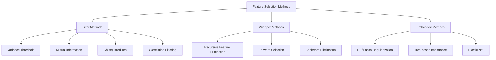
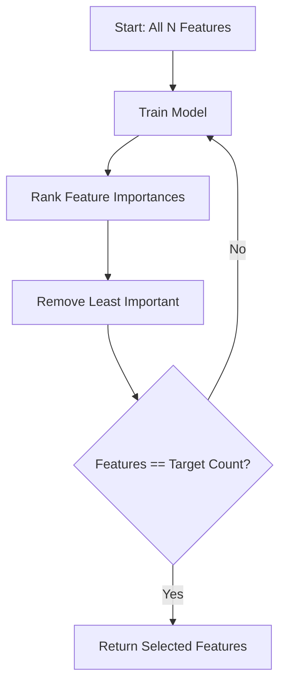
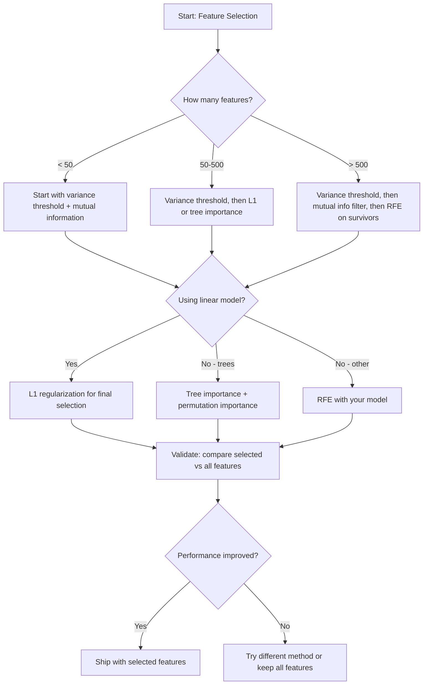

# Feature Selection

> More features is not better. The right features is better.

**Type:** Build
**Language:** Python
**Prerequisites:** Phase 2, Lessons 01-09, 08 (feature engineering)
**Time:** ~75 minutes

## Learning Objectives

- Implement filter methods (variance threshold, mutual information, chi-squared) and wrapper methods (RFE, forward selection) from scratch
- Explain why mutual information captures nonlinear feature-target relationships that correlation misses
- Compare L1 regularization (embedded selection) with RFE (wrapper selection) and evaluate their computational tradeoffs
- Build a feature selection pipeline that combines multiple methods and demonstrate improved generalization on held-out data

## The Problem

You have 500 features. Your model trains slowly, overfits constantly, and nobody can explain what it learned. You add more features hoping to improve performance. It gets worse.

This is the curse of dimensionality in action. As the number of features grows, the volume of the feature space explodes. Data points become sparse. Distances between points converge. The model needs exponentially more data to find real patterns. Noise features drown out signal features. Overfitting becomes the default.

Feature selection is the antidote. Strip away the noise. Remove the redundancy. Keep the features that carry actual information about the target. The result: faster training, better generalization, and models you can actually explain.

The goal is not to use all available information. It is to use the right information.

## The Concept

### Three Categories of Feature Selection

Every feature selection method falls into one of three categories:



**Filter methods** score each feature independently using a statistical measure. They do not use a model. Fast, but they miss feature interactions.

**Wrapper methods** train a model to evaluate feature subsets. They use model performance as the score. Better results, but expensive because they retrain the model many times.

**Embedded methods** select features as part of model training. L1 regularization drives weights to zero. Decision trees split on the most useful features. Selection happens during fitting, not as a separate step.

### Variance Threshold

The simplest filter. If a feature barely varies across samples, it carries almost no information.

Consider a feature that is 0.0 for 999 out of 1000 samples. Its variance is near zero. No model can use it to distinguish between classes. Remove it.

```
variance(x) = mean((x - mean(x))^2)
```

Set a threshold (e.g., 0.01). Drop every feature with variance below it. This removes constant or near-constant features without looking at the target variable at all.

When to use it: as a preprocessing step before other methods. It catches obviously useless features at near-zero cost.

Limitation: a feature can have high variance and still be pure noise. Variance threshold is necessary but not sufficient.

### Mutual Information

Mutual information measures how much knowing the value of feature X reduces uncertainty about target Y.

```
I(X; Y) = sum_x sum_y p(x, y) * log(p(x, y) / (p(x) * p(y)))
```

If X and Y are independent, p(x, y) = p(x) * p(y), so the log term is zero and I(X; Y) = 0. The more X tells you about Y, the higher the mutual information.

Key advantage over correlation: mutual information captures nonlinear relationships. A feature might have zero correlation with the target but high mutual information because the relationship is quadratic or periodic.

For continuous features, discretize into bins first (histogram-based estimation). The number of bins affects the estimate -- too few bins lose information, too many bins add noise. A common choice: sqrt(n) bins or Sturges' rule (1 + log2(n)).


### Recursive Feature Elimination (RFE)

RFE is a wrapper method. It uses a model's own feature importance to iteratively prune:

1. Train the model with all features
2. Rank features by importance (coefficients for linear models, impurity reduction for trees)
3. Remove the least important feature(s)
4. Repeat until the desired number of features remains



RFE considers feature interactions because the model sees all remaining features together. Removing one feature changes the importance of others. This makes it more thorough than filter methods.

The cost: you train the model N - target times. With 500 features and a target of 10, that is 490 training runs. For expensive models, this is slow. You can speed it up by removing multiple features per step (e.g., remove the bottom 10% each round).

### L1 (Lasso) Regularization

L1 regularization adds the absolute value of weights to the loss function:

```
loss = prediction_error + alpha * sum(|w_i|)
```

The alpha parameter controls how aggressively features are pruned. Higher alpha means more weights go to exactly zero.

Why exactly zero? The L1 penalty creates a diamond-shaped constraint region in weight space. The optimal solution tends to land at a corner of this diamond, where one or more weights are zero. L2 regularization (ridge) creates a circular constraint where weights shrink but rarely hit zero.

This is embedded feature selection: the model learns during training which features to ignore. Features with zero weight are effectively removed.

Advantages: single training run, handles correlated features (picks one and zeros the others), built into most linear model implementations.

Limitation: only works for linear models. Cannot capture nonlinear feature importance.

### Tree-Based Feature Importance

Decision trees and their ensembles (random forests, gradient boosting) naturally rank features. Every split reduces impurity (Gini or entropy for classification, variance for regression). Features that produce larger impurity reductions are more important.

For a random forest with T trees:

```
importance(feature_j) = (1/T) * sum over all trees of
    sum over all nodes splitting on feature_j of
        (n_samples * impurity_decrease)
```

This gives a normalized importance score for each feature. It handles nonlinear relationships and feature interactions automatically.

Caution: tree-based importance is biased toward features with many unique values (high cardinality). A random ID column will appear important because it perfectly splits every sample. Use permutation importance as a sanity check.

### Permutation Importance

A model-agnostic method:

1. Train the model and record baseline performance on validation data
2. For each feature: shuffle its values randomly, measure the drop in performance
3. The bigger the drop, the more important the feature

If shuffling a feature does not hurt performance, the model does not depend on it. If performance collapses, that feature is critical.

Permutation importance avoids the cardinality bias of tree-based importance. But it is slow: one full evaluation per feature, repeated multiple times for stability.

### Comparison Table

| Method | Type | Speed | Nonlinear | Feature Interactions |
|--------|------|-------|-----------|---------------------|
| Variance threshold | Filter | Very fast | No | No |
| Mutual information | Filter | Fast | Yes | No |
| Correlation filter | Filter | Fast | No | No |
| RFE | Wrapper | Slow | Depends on model | Yes |
| L1 / Lasso | Embedded | Fast | No (linear) | No |
| Tree importance | Embedded | Medium | Yes | Yes |
| Permutation importance | Model-agnostic | Slow | Yes | Yes |

### Decision Flowchart



## Build It

### Step 1: Generate synthetic data with known feature structure

```python
import numpy as np


def make_feature_selection_data(n_samples=500, seed=42):
    rng = np.random.RandomState(seed)

    x1 = rng.randn(n_samples)
    x2 = rng.randn(n_samples)
    x3 = rng.randn(n_samples)
    x4 = x1 + 0.1 * rng.randn(n_samples)
    x5 = x2 + 0.1 * rng.randn(n_samples)

    informative = np.column_stack([x1, x2, x3, x4, x5])

    correlated = np.column_stack([
        x1 * 0.9 + 0.1 * rng.randn(n_samples),
        x2 * 0.8 + 0.2 * rng.randn(n_samples),
        x3 * 0.7 + 0.3 * rng.randn(n_samples),
        x1 * 0.5 + x2 * 0.5 + 0.1 * rng.randn(n_samples),
        x2 * 0.6 + x3 * 0.4 + 0.1 * rng.randn(n_samples),
    ])

    noise = rng.randn(n_samples, 10) * 0.5

    X = np.hstack([informative, correlated, noise])
    y = (2 * x1 - 1.5 * x2 + x3 + 0.5 * rng.randn(n_samples) > 0).astype(int)

    feature_names = (
        [f"info_{i}" for i in range(5)]
        + [f"corr_{i}" for i in range(5)]
        + [f"noise_{i}" for i in range(10)]
    )

    return X, y, feature_names
```

We know the ground truth: features 0-4 are informative (plus 3 and 4 are correlated copies of 0 and 1), features 5-9 are correlated with informative features, features 10-19 are pure noise. A good selection method should rank 0-4 highest and 10-19 lowest.

### Step 2: Variance threshold

```python
def variance_threshold(X, threshold=0.01):
    variances = np.var(X, axis=0)
    mask = variances > threshold
    return mask, variances
```

### Step 3: Mutual information (discrete)

```python
def discretize(x, n_bins=10):
    min_val, max_val = x.min(), x.max()
    if max_val == min_val:
        return np.zeros_like(x, dtype=int)
    bin_edges = np.linspace(min_val, max_val, n_bins + 1)
    binned = np.digitize(x, bin_edges[1:-1])
    return binned


def mutual_information(X, y, n_bins=10):
    n_samples, n_features = X.shape
    mi_scores = np.zeros(n_features)

    y_vals, y_counts = np.unique(y, return_counts=True)
    p_y = y_counts / n_samples

    for f in range(n_features):
        x_binned = discretize(X[:, f], n_bins)
        x_vals, x_counts = np.unique(x_binned, return_counts=True)
        p_x = dict(zip(x_vals, x_counts / n_samples))

        mi = 0.0
        for xv in x_vals:
            for yi, yv in enumerate(y_vals):
                joint_mask = (x_binned == xv) & (y == yv)
                p_xy = np.sum(joint_mask) / n_samples
                if p_xy > 0:
                    mi += p_xy * np.log(p_xy / (p_x[xv] * p_y[yi]))
        mi_scores[f] = mi

    return mi_scores
```

### Step 4: Recursive Feature Elimination

```python
def simple_logistic_importance(X, y, lr=0.1, epochs=100):
    n_samples, n_features = X.shape
    w = np.zeros(n_features)
    b = 0.0

    for _ in range(epochs):
        z = X @ w + b
        pred = 1.0 / (1.0 + np.exp(-np.clip(z, -500, 500)))
        error = pred - y
        w -= lr * (X.T @ error) / n_samples
        b -= lr * np.mean(error)

    return w, b


def rfe(X, y, n_features_to_select=5, lr=0.1, epochs=100):
    n_total = X.shape[1]
    remaining = list(range(n_total))
    rankings = np.ones(n_total, dtype=int)
    rank = n_total

    while len(remaining) > n_features_to_select:
        X_subset = X[:, remaining]
        w, _ = simple_logistic_importance(X_subset, y, lr, epochs)
        importances = np.abs(w)

        least_idx = np.argmin(importances)
        original_idx = remaining[least_idx]
        rankings[original_idx] = rank
        rank -= 1
        remaining.pop(least_idx)

    for idx in remaining:
        rankings[idx] = 1

    selected_mask = rankings == 1
    return selected_mask, rankings
```

### Step 5: L1 feature selection

```python
def soft_threshold(w, alpha):
    return np.sign(w) * np.maximum(np.abs(w) - alpha, 0)


def l1_feature_selection(X, y, alpha=0.1, lr=0.01, epochs=500):
    n_samples, n_features = X.shape
    w = np.zeros(n_features)
    b = 0.0

    for _ in range(epochs):
        z = X @ w + b
        pred = 1.0 / (1.0 + np.exp(-np.clip(z, -500, 500)))
        error = pred - y

        gradient_w = (X.T @ error) / n_samples
        gradient_b = np.mean(error)

        w -= lr * gradient_w
        w = soft_threshold(w, lr * alpha)
        b -= lr * gradient_b

    selected_mask = np.abs(w) > 1e-6
    return selected_mask, w
```

### Step 6: Tree-based importance (simple decision tree)

```python
def gini_impurity(y):
    if len(y) == 0:
        return 0.0
    classes, counts = np.unique(y, return_counts=True)
    probs = counts / len(y)
    return 1.0 - np.sum(probs ** 2)


def best_split(X, y, feature_idx):
    values = np.unique(X[:, feature_idx])
    if len(values) <= 1:
        return None, -1.0

    best_threshold = None
    best_gain = -1.0
    parent_gini = gini_impurity(y)
    n = len(y)

    for i in range(len(values) - 1):
        threshold = (values[i] + values[i + 1]) / 2.0
        left_mask = X[:, feature_idx] <= threshold
        right_mask = ~left_mask

        n_left = np.sum(left_mask)
        n_right = np.sum(right_mask)

        if n_left == 0 or n_right == 0:
            continue

        gain = parent_gini - (n_left / n) * gini_impurity(y[left_mask]) - (n_right / n) * gini_impurity(y[right_mask])

        if gain > best_gain:
            best_gain = gain
            best_threshold = threshold

    return best_threshold, best_gain


def tree_importance(X, y, n_trees=50, max_depth=5, seed=42):
    rng = np.random.RandomState(seed)
    n_samples, n_features = X.shape
    importances = np.zeros(n_features)

    for _ in range(n_trees):
        sample_idx = rng.choice(n_samples, size=n_samples, replace=True)
        feature_subset = rng.choice(n_features, size=max(1, int(np.sqrt(n_features))), replace=False)

        X_boot = X[sample_idx]
        y_boot = y[sample_idx]

        tree_imp = _build_tree_importance(X_boot, y_boot, feature_subset, max_depth)
        importances += tree_imp

    total = importances.sum()
    if total > 0:
        importances /= total

    return importances


def _build_tree_importance(X, y, feature_subset, max_depth, depth=0):
    n_features = X.shape[1]
    importances = np.zeros(n_features)

    if depth >= max_depth or len(np.unique(y)) <= 1 or len(y) < 4:
        return importances

    best_feature = None
    best_threshold = None
    best_gain = -1.0

    for f in feature_subset:
        threshold, gain = best_split(X, y, f)
        if gain > best_gain:
            best_gain = gain
            best_feature = f
            best_threshold = threshold

    if best_feature is None or best_gain <= 0:
        return importances

    importances[best_feature] += best_gain * len(y)

    left_mask = X[:, best_feature] <= best_threshold
    right_mask = ~left_mask

    importances += _build_tree_importance(X[left_mask], y[left_mask], feature_subset, max_depth, depth + 1)
    importances += _build_tree_importance(X[right_mask], y[right_mask], feature_subset, max_depth, depth + 1)

    return importances
```

### Step 7: Run all methods and compare

The code file runs all five methods on the same synthetic dataset and prints a comparison table showing which features each method selects.

## Use It

With scikit-learn, feature selection is built into the pipeline:

```python
from sklearn.feature_selection import (
    VarianceThreshold,
    mutual_info_classif,
    RFE,
    SelectFromModel,
)
from sklearn.linear_model import Lasso, LogisticRegression
from sklearn.ensemble import RandomForestClassifier

vt = VarianceThreshold(threshold=0.01)
X_filtered = vt.fit_transform(X)

mi_scores = mutual_info_classif(X, y)
top_k = np.argsort(mi_scores)[-10:]

rfe_selector = RFE(LogisticRegression(), n_features_to_select=10)
rfe_selector.fit(X, y)
X_rfe = rfe_selector.transform(X)

lasso_selector = SelectFromModel(Lasso(alpha=0.01))
lasso_selector.fit(X, y)
X_lasso = lasso_selector.transform(X)

rf = RandomForestClassifier(n_estimators=100)
rf.fit(X, y)
importances = rf.feature_importances_
```

从头开始的实现准确地展示了每个方法内部发生的情况。方差阈值只是计算“var(X, axis=0)”并应用掩码。互信息是计算列联表中的联合频率和边际频率。 RFE 是一个训练、排名和修剪的循环。 L1 是带有软阈值步骤的梯度下降。树的重要性会累积各个分裂中的杂质减少量。没有魔法——只有统计数据和循环。

sklearn 版本增加了鲁棒性（例如，mutual_info_classif 使用 k-NN 密度估计而不是分箱）、速度（C 实现）和管道集成。

## 发货

本课产生：
- `outputs/skill-feature-selector.md` -- 用于选择正确特征选择方法的快速参考决策树

## 练习

1. **前向选择**：实现与RFE相反的操作。从零特征开始。在每个步骤中，添加最能提高模型性能的特征。当添加功能不再有帮助时停止。将所选功能与 RFE 结果进行比较。哪个更快？哪个能提供更好的结果？

2. **稳定性选择**：运行 L1 特征选择 50 次，每次都在数据的随机 80% 子样本上运行，且 alpha 值略有不同。计算每个功能被选择的频率。 > 80% 的运行中选择的特征是“稳定的”。将稳定特征与单次 L1 选择进行比较。哪个更可靠？

3. **多重共线性检测**：计算所有特征的相关矩阵。实现一个函数，在给定相关性阈值（例如 0.9）的情况下，从每个高度相关对中删除一个特征（保留与目标具有较高互信息的特征）。对合成数据集进行测试并验证它删除了冗余的相关特征。

4. **特征选择管道**：将方差阈值、互信息过滤器和 RFE 链接到单个管道中。首先删除接近零方差的特征，然后通过互信息保留前 50%，然后对幸存者运行 RFE。将此管道与在所有功能上单独运行 RFE 进行比较。管道速度更快吗？是否同样准确？

5. **从头开始排列重要性**：实现排列重要性。对于每个特征，将其值打乱 10 次，测量 F1 分数的平均下降情况。将排名与基于树的重要性进行比较。找出他们不同意的情况并解释原因（提示：相关特征）。

## 关键术语

|术语 |人们怎么说 |它实际上意味着什么 |
|------|----------------|----------------------|
|过滤方式| “独立对特征进行评分” |一种特征选择方法，使用统计度量对特征进行排名，无需训练模型，单独评估每个特征 |
|包装法 | “使用模型来选择特征”|一种特征选择方法，通过训练模型并使用其性能作为选择标准来评估特征子集 |
|嵌入法| “模型在训练期间选择特征” |作为模型拟合的一部分发生的特征选择，例如 L1 正则化将权重驱动为零 |
|互信息 | “一个变量能告诉你多少关于另一个变量的信息” |在已知 X 的情况下，衡量 Y 不确定性减少的度量，捕获线性和非线性依赖性 |
|递归特征消除 | “训练、排名、修剪、重复” |一种迭代包装方法，用于训练模型、删除最不重要的特征并重复直到达到目标计数 |
| L1/Lasso 正则化 | “杀死功能的惩罚”|将绝对权重值的总和添加到损失函数中，这会将不重要的特征权重精确为零 |
|方差阈值 | “删除常量特征” |丢弃样本间方差低于指定阈值的特征，过滤掉不携带信息的特征 |
|特征重要性| “哪些功能最重要”|表示每个特征对模型预测有多大贡献的分数，根据分割增益（树）或系数幅度（线性）计算得出 |
|排列重要性| “洗牌并测量伤害”|通过随机调整每个特征的值并测量模型性能由此产生的下降来评估特征重要性 |
|维数诅咒| “功能太多，数据不足”|添加特征会导致特征空间体积呈指数级增加，导致数据稀疏、距离变得毫无意义的现象 |

## 进一步阅读

- [变量和特征选择简介 (Guyon & Elisseeff, 2003)](https://jmlr.org/papers/v3/guyon03a.html)——特征选择方法的基础综述，至今仍被广泛引用
- [scikit-learn 特征选择指南](https://scikit-learn.org/stable/modules/feature_selection.html) -- 带有代码示例的过滤器、包装器和嵌入式方法的实用参考
- [稳定性选择 (Meinshausen & Buhlmann, 2010)](https://arxiv.org/abs/0809.2932) -- 将子采样与特征选择相结合，以获得稳健、可重复的结果
- [注意默认随机森林重要性 (Strobl et al., 2007)](https://bmcbioinformatics.biomedcentral.com/articles/10.1186/1471-2105-8-25) - 演示基于树的重要性中的基数偏差，并提出条件重要性作为替代方案
