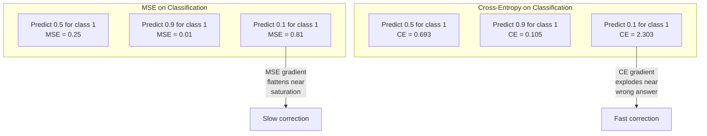
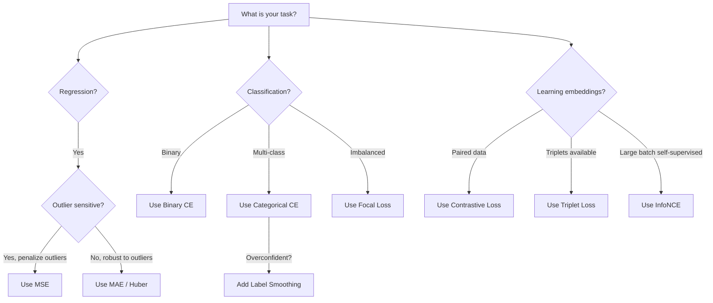
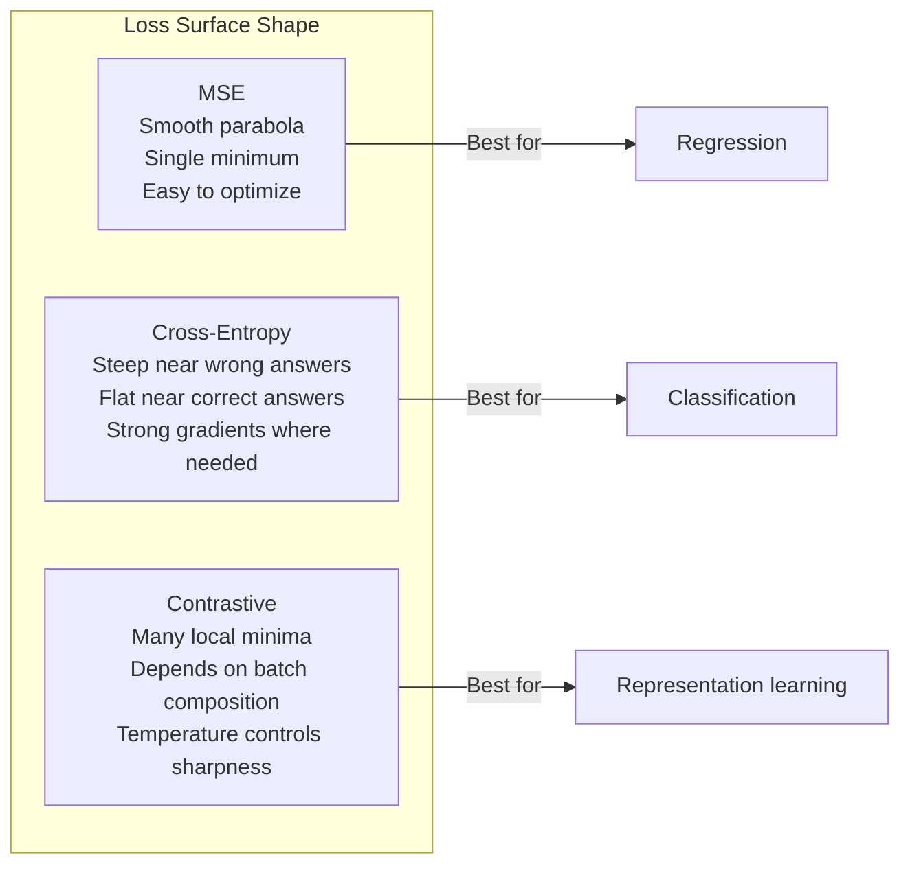

# Loss Functions

> Your network makes a prediction. The ground truth says otherwise. How wrong is it? That number is the loss. Pick the wrong loss function and your model optimizes for the wrong thing entirely.

**Type:** Build
**Languages:** Python
**Prerequisites:** Lesson 03.04 (Activation Functions)
**Time:** ~75 minutes

## Learning Objectives

- Implement MSE, binary cross-entropy, categorical cross-entropy, and contrastive loss (InfoNCE) from scratch with their gradients
- Explain why MSE fails for classification by demonstrating the "predict 0.5 for everything" failure mode
- Apply label smoothing to cross-entropy and describe how it prevents overconfident predictions
- Choose the correct loss function for regression, binary classification, multi-class classification, and embedding learning tasks

## The Problem

A model minimizing MSE on a classification problem will confidently predict 0.5 for everything. It's minimizing loss. It's also useless.

The loss function is the only thing your model actually optimizes. Not accuracy. Not F1 score. Not whatever metric you report to your manager. The optimizer takes the gradient of the loss function and adjusts weights to make that number smaller. If the loss function doesn't capture what you care about, the model will find the mathematically cheapest way to satisfy it, and that way is almost never what you wanted.

Here is a concrete example. You have a binary classification task. Two classes, 50/50 split. You use MSE as your loss. The model predicts 0.5 for every single input. The average MSE is 0.25, which is the minimum possible without actually learning anything. The model has zero discriminative ability but it has technically minimized your loss function. Switch to cross-entropy and the same model is forced to push predictions toward 0 or 1, because -log(0.5) = 0.693 is a terrible loss, while -log(0.99) = 0.01 rewards confident correct predictions. The choice of loss function is the difference between a model that learns and a model that games the metric.

It gets worse. In self-supervised learning, you don't even have labels. Contrastive loss defines the learning signal entirely: what counts as similar, what counts as different, and how hard the model should push them apart. Get contrastive loss wrong and your embeddings collapse to a single point -- every input maps to the same vector. Technically zero loss. Completely worthless.

## The Concept

### Mean Squared Error (MSE)

The default for regression. Compute the squared difference between prediction and target, average over all samples.

```
MSE = (1/n) * sum((y_pred - y_true)^2)
```

Why squaring matters: it penalizes large errors quadratically. An error of 2 costs 4x as much as an error of 1. An error of 10 costs 100x. This makes MSE sensitive to outliers -- a single wildly wrong prediction dominates the loss.

Real numbers: if your model predicts housing prices and is off by $10,000 on most houses but off by $200,000 on one mansion, MSE will aggressively try to fix that one mansion, potentially hurting performance on the other 99 houses.

The gradient of MSE with respect to a prediction is:

```
dMSE/dy_pred = (2/n) * (y_pred - y_true)
```

Linear in the error. Bigger errors get bigger gradients. This is a feature for regression (large errors need large corrections) and a bug for classification (you want to penalize confident wrong answers exponentially, not linearly).

### Cross-Entropy Loss

The loss function for classification. Rooted in information theory -- it measures the divergence between the predicted probability distribution and the true distribution.

**Binary Cross-Entropy (BCE):**

```
BCE = -(y * log(p) + (1 - y) * log(1 - p))
```

Where y is the true label (0 or 1) and p is the predicted probability.

Why -log(p) works: when the true label is 1 and you predict p = 0.99, the loss is -log(0.99) = 0.01. When you predict p = 0.01, the loss is -log(0.01) = 4.6. That 460x difference is why cross-entropy works. It brutally punishes confident wrong predictions while barely penalizing confident correct ones.

The gradient tells the same story:

```
dBCE/dp = -(y/p) + (1-y)/(1-p)
```

When y = 1 and p is near zero, the gradient is -1/p which approaches negative infinity. The model gets an enormous signal to fix its mistake. When p is near 1, the gradient is tiny. Already correct, nothing to fix.

**Categorical Cross-Entropy:**

For multi-class classification with one-hot encoded targets.

```
CCE = -sum(y_i * log(p_i))
```

Only the true class contributes to the loss (because all other y_i are zero). If there are 10 classes and the correct class gets probability 0.1 (random guessing), the loss is -log(0.1) = 2.3. If the correct class gets probability 0.9, the loss is -log(0.9) = 0.105. The model learns to concentrate probability mass on the right answer.

### Why MSE Fails for Classification



MSE gradients flatten when predictions are near 0 or 1 (due to sigmoid saturation). Cross-entropy gradients compensate for this -- the -log cancels the sigmoid's flat regions, giving strong gradients exactly where they are needed most.

### Label Smoothing

Standard one-hot labels say "this is 100% class 3 and 0% everything else." That's a strong claim. Label smoothing softens it:

```
smooth_label = (1 - alpha) * one_hot + alpha / num_classes
```

With alpha = 0.1 and 10 classes: instead of [0, 0, 1, 0, ...], the target becomes [0.01, 0.01, 0.91, 0.01, ...]. The model targets 0.91 instead of 1.0.

Why this works: a model trying to output exactly 1.0 through a softmax needs to push logits to infinity. This causes overconfidence, hurts generalization, and makes the model brittle to distribution shift. Label smoothing caps the target at 0.9 (with alpha=0.1), keeping logits in a reasonable range. GPT and most modern models use label smoothing or its equivalent.

### Contrastive Loss

No labels. No classes. Just pairs of inputs and the question: are these similar or different?

**SimCLR-style contrastive loss (NT-Xent / InfoNCE):**

Take one image. Create two augmented views of it (crop, rotate, color jitter). These are the "positive pair" -- they should have similar embeddings. Every other image in the batch forms a "negative pair" -- they should have different embeddings.

```
L = -log(exp(sim(z_i, z_j) / tau) / sum(exp(sim(z_i, z_k) / tau)))
```

Where sim() is cosine similarity, z_i and z_j are the positive pair, the sum is over all negatives, and tau (temperature) controls how sharp the distribution is. Lower temperature = harder negatives = more aggressive separation.

Real numbers: batch size 256 means 255 negatives per positive pair. Temperature tau = 0.07 (SimCLR default). The loss looks like a softmax over similarities -- it wants the positive pair's similarity to be highest among all 256 options.

**Triplet Loss:**

Takes three inputs: anchor, positive (same class), negative (different class).

```
L = max(0, d(anchor, positive) - d(anchor, negative) + margin)
```

The margin (typically 0.2-1.0) enforces a minimum gap between positive and negative distances. If the negative is already far enough away, the loss is zero -- no gradient, no update. This makes training efficient but requires careful triplet mining (choosing hard negatives that are close to the anchor).

### Focal Loss

For imbalanced datasets. Standard cross-entropy treats all correctly classified examples equally. Focal loss down-weights easy examples:

```
FL = -alpha * (1 - p_t)^gamma * log(p_t)
```

Where p_t is the predicted probability of the true class and gamma controls the focusing. With gamma = 0, this is standard cross-entropy. With gamma = 2 (the default):

- Easy example (p_t = 0.9): weight = (0.1)^2 = 0.01. Effectively ignored.
- Hard example (p_t = 0.1): weight = (0.9)^2 = 0.81. Full gradient signal.

Focal loss was introduced by Lin et al. for object detection, where 99% of candidate regions are background (easy negatives). Without focal loss, the model drowns in easy background examples and never learns to detect objects. With it, the model focuses its capacity on the hard, ambiguous cases that matter.

### Loss Function Decision Tree



### Loss Landscape



## Build It

### Step 1: MSE and Its Gradient

```python
def mse(predictions, targets):
    n = len(predictions)
    total = 0.0
    for p, t in zip(predictions, targets):
        total += (p - t) ** 2
    return total / n

def mse_gradient(predictions, targets):
    n = len(predictions)
    grads = []
    for p, t in zip(predictions, targets):
        grads.append(2.0 * (p - t) / n)
    return grads
```

### Step 2: Binary Cross-Entropy

The log(0) problem is real. If the model predicts exactly 0 for a positive example, log(0) = negative infinity. Clipping prevents this.

```python
import math

def binary_cross_entropy(predictions, targets, eps=1e-15):
    n = len(predictions)
    total = 0.0
    for p, t in zip(predictions, targets):
        p_clipped = max(eps, min(1 - eps, p))
        total += -(t * math.log(p_clipped) + (1 - t) * math.log(1 - p_clipped))
    return total / n

def bce_gradient(predictions, targets, eps=1e-15):
    grads = []
    for p, t in zip(predictions, targets):
        p_clipped = max(eps, min(1 - eps, p))
        grads.append(-(t / p_clipped) + (1 - t) / (1 - p_clipped))
    return grads
```

### Step 3: Categorical Cross-Entropy with Softmax

Softmax converts raw logits to probabilities. Then we compute the cross-entropy against one-hot targets.

```python
def softmax(logits):
    max_val = max(logits)
    exps = [math.exp(x - max_val) for x in logits]
    total = sum(exps)
    return [e / total for e in exps]

def categorical_cross_entropy(logits, target_index, eps=1e-15):
    probs = softmax(logits)
    p = max(eps, probs[target_index])
    return -math.log(p)

def cce_gradient(logits, target_index):
    probs = softmax(logits)
    grads = list(probs)
    grads[target_index] -= 1.0
    return grads
```

The gradient of softmax + cross-entropy simplifies beautifully: it's just (predicted probability - 1) for the true class, and (predicted probability) for all other classes. This elegant simplification is not a coincidence -- it's why softmax and cross-entropy are paired.

### Step 4: Label Smoothing

```python
def label_smoothed_cce(logits, target_index, num_classes, alpha=0.1, eps=1e-15):
    probs = softmax(logits)
    loss = 0.0
    for i in range(num_classes):
        if i == target_index:
            smooth_target = 1.0 - alpha + alpha / num_classes
        else:
            smooth_target = alpha / num_classes
        p = max(eps, probs[i])
        loss += -smooth_target * math.log(p)
    return loss
```

### Step 5: Contrastive Loss (Simplified InfoNCE)

```python
def cosine_similarity(a, b):
    dot = sum(x * y for x, y in zip(a, b))
    norm_a = math.sqrt(sum(x * x for x in a))
    norm_b = math.sqrt(sum(x * x for x in b))
    if norm_a < 1e-10 or norm_b < 1e-10:
        return 0.0
    return dot / (norm_a * norm_b)

def contrastive_loss(anchor, positive, negatives, temperature=0.07):
    sim_pos = cosine_similarity(anchor, positive) / temperature
    sim_negs = [cosine_similarity(anchor, neg) / temperature for neg in negatives]

    max_sim = max(sim_pos, max(sim_negs)) if sim_negs else sim_pos
    exp_pos = math.exp(sim_pos - max_sim)
    exp_negs = [math.exp(s - max_sim) for s in sim_negs]
    total_exp = exp_pos + sum(exp_negs)

    return -math.log(max(1e-15, exp_pos / total_exp))
```

### Step 6: MSE vs Cross-Entropy on Classification

Train the same network from lesson 04 (circle dataset) with both loss functions. Watch cross-entropy converge faster.

```python
import random

def sigmoid(x):
    x = max(-500, min(500, x))
    return 1.0 / (1.0 + math.exp(-x))

def make_circle_data(n=200, seed=42):
    random.seed(seed)
    data = []
    for _ in range(n):
        x = random.uniform(-2, 2)
        y = random.uniform(-2, 2)
        label = 1.0 if x * x + y * y < 1.5 else 0.0
        data.append(([x, y], label))
    return data


class LossComparisonNetwork:
    def __init__(self, loss_type="bce", hidden_size=8, lr=0.1):
        random.seed(0)
        self.loss_type = loss_type
        self.lr = lr
        self.hidden_size = hidden_size

        self.w1 = [[random.gauss(0, 0.5) for _ in range(2)] for _ in range(hidden_size)]
        self.b1 = [0.0] * hidden_size
        self.w2 = [random.gauss(0, 0.5) for _ in range(hidden_size)]
        self.b2 = 0.0

    def forward(self, x):
        self.x = x
        self.z1 = []
        self.h = []
        for i in range(self.hidden_size):
            z = self.w1[i][0] * x[0] + self.w1[i][1] * x[1] + self.b1[i]
            self.z1.append(z)
            self.h.append(max(0.0, z))

        self.z2 = sum(self.w2[i] * self.h[i] for i in range(self.hidden_size)) + self.b2
        self.out = sigmoid(self.z2)
        return self.out

    def backward(self, target):
        if self.loss_type == "mse":
            d_loss = 2.0 * (self.out - target)
        else:
            eps = 1e-15
            p = max(eps, min(1 - eps, self.out))
            d_loss = -(target / p) + (1 - target) / (1 - p)

        d_sigmoid = self.out * (1 - self.out)
        d_out = d_loss * d_sigmoid

        for i in range(self.hidden_size):
            d_relu = 1.0 if self.z1[i] > 0 else 0.0
            d_h = d_out * self.w2[i] * d_relu
            self.w2[i] -= self.lr * d_out * self.h[i]
            for j in range(2):
                self.w1[i][j] -= self.lr * d_h * self.x[j]
            self.b1[i] -= self.lr * d_h
        self.b2 -= self.lr * d_out

    def compute_loss(self, pred, target):
        if self.loss_type == "mse":
            return (pred - target) ** 2
        else:
            eps = 1e-15
            p = max(eps, min(1 - eps, pred))
            return -(target * math.log(p) + (1 - target) * math.log(1 - p))

    def train(self, data, epochs=200):
        losses = []
        for epoch in range(epochs):
            total_loss = 0.0
            correct = 0
            for x, y in data:
                pred = self.forward(x)
                self.backward(y)
                total_loss += self.compute_loss(pred, y)
                if (pred >= 0.5) == (y >= 0.5):
                    correct += 1
            avg_loss = total_loss / len(data)
            accuracy = correct / len(data) * 100
            losses.append((avg_loss, accuracy))
            if epoch % 50 == 0 or epoch == epochs - 1:
                print(f"    Epoch {epoch:3d}: loss={avg_loss:.4f}, accuracy={accuracy:.1f}%")
        return losses
```

## Use It

PyTorch provides all standard loss functions with numerical stability built in:

```python
import torch
import torch.nn as nn
import torch.nn.functional as F

predictions = torch.tensor([0.9, 0.1, 0.7], requires_grad=True)
targets = torch.tensor([1.0, 0.0, 1.0])

mse_loss = F.mse_loss(predictions, targets)
bce_loss = F.binary_cross_entropy(predictions, targets)

logits = torch.randn(4, 10)
labels = torch.tensor([3, 7, 1, 9])
ce_loss = F.cross_entropy(logits, labels)
ce_smooth = F.cross_entropy(logits, labels, label_smoothing=0.1)
```

使用“F.cross_entropy”（不是“F.nll_loss”加上手动 softmax）。它将 log-softmax 和负对数似然结合在一个数值稳定的操作中。单独应用 softmax 然后取对数不太稳定——在大指数的减法中你会失去精度。

对于对比学习，大多数团队使用自定义实现或库，例如“lightly”或“pytorch-metric-learning”。核心循环始终是相同的：计算成对相似性，创建正负数的 softmax，反向传播。

## 发货

本课产生：
- `outputs/prompt-loss-function-selector.md` -- 用于选择正确损失函数的可重用提示
- `outputs/prompt-loss-debugger.md` -- 当损失曲线看起来错误时的诊断提示

## 练习

1.实现Huber损失（平滑L1损失），对于小错误是MSE，对于大错误是MAE。当 5% 的训练目标添加了随机噪声（异常值）时，使用 MSE 与 Huber 训练预测 y = sin(x) 的回归网络。比较最终测试误差。

2. 将焦点损失添加到二元分类训练循环中。创建不平衡数据集（90% 0 类，10% 1 类）。比较标准 BCE 与焦点损失 (gamma=2) 在 200 个 epoch 后的少数类召回率。

3.通过半硬负挖矿实现三元组损失。生成 5 个类的 2D 嵌入数据。对于每个锚点，找到仍比正值更远的最难的负值（半困难）。将收敛性与随机三元组选择进行比较。

4. 运行 MSE 与交叉熵比较，但在训练期间跟踪每层的梯度大小。绘制每个时期的平均梯度范数。验证交叉熵在模型最不确定的早期时期是否会产生更大的梯度。

5. 实现 KL 散度损失，并验证当真实分布是独热时，最小化 KL(true||predicted) 会给出与交叉熵相同的梯度。然后尝试软目标（如知识蒸馏），其中“真实”分布来自教师模型的 softmax 输出。

## 关键术语

|术语 |人们怎么说 |它实际上意味着什么 |
|------|----------------|----------------------|
|损失函数| “这个模型有多么错误”|可微函数将预测和目标映射到优化器最小化的标量 |
|硕士 | “平均平方误差” |预测与目标之间的均方差；对大错误进行二次惩罚 |
|交叉熵 | “分类损失” |使用 -log(p) | 测量预测概率分布与真实分布之间的差异
|二元交叉熵 | “公元前”|两个类的交叉熵：-(y*log(p) + (1-y)*log(1-p)) |
|标签平滑 | “软化目标”|用软值（例如 0.1/0.9）替换硬 0/1 目标，以防止过度自信并提高泛化能力 |
|对比损失| “拉在一起，推开”|通过在嵌入空间中使相似对靠近、使不同对远离来学习表示的损失 |
|信息NCE | “CLIP/SimCLR 损失”|相似性分数的归一化温度尺度交叉熵；将对比学习视为分类 |
|焦点丧失 | “修复不平衡数据” |由 (1-p_t)^gamma 加权的交叉熵，以降低简单示例的权重并专注于困难示例 |
|三重态损失| “锚定-正-负” |在嵌入空间中将锚点推向正值而不是负值至少有一定的余量 |
|温度| “清晰度旋钮” |对数/相似度的标量除数，控制结果分布的峰值程度；更低=更锐利|

## 进一步阅读

- Lin 等人，“密集对象检测的焦点损失”(2017) -- 引入焦点损失来处理对象检测中的极端类别不平衡 (RetinaNet)
- Chen 等人，“视觉表示对比学习的简单框架”（SimCLR，2020）——定义了具有 NT-Xent 损失的现代对比学习流程
- Szegedy 等人，“重新思考 Inception 架构”（2016 年）——引入了标签平滑作为正则化技术，现已成为大多数大型模型的标准配置
- Hinton 等人，“在神经网络中蒸馏知识”（2015 年）——使用软目标和 KL 散度进行知识蒸馏，这是模型压缩的基础
