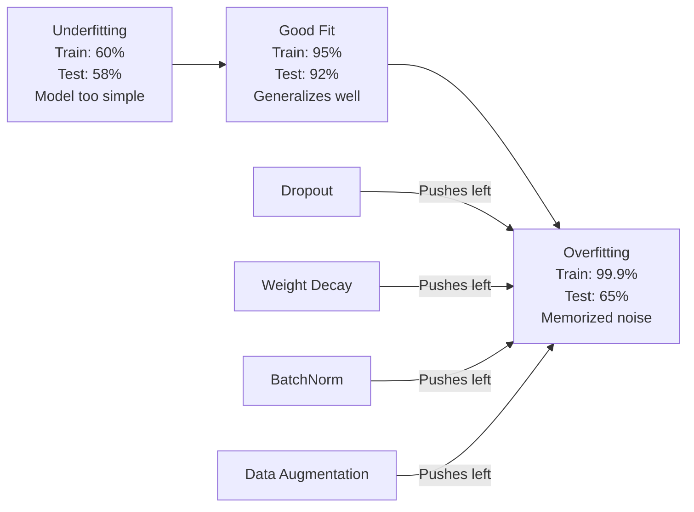
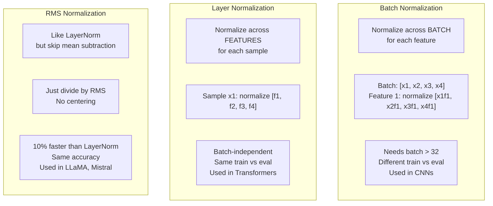
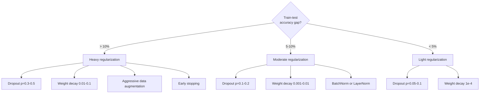

# Regularization

> Your model gets 99% on training data and 60% on test data. It memorized instead of learning. Regularization is the tax you impose on complexity to force generalization.

**Type:** Build
**Languages:** Python
**Prerequisites:** Lesson 03.06 (Optimizers)
**Time:** ~75 minutes

## Learning Objectives

- Implement dropout with inverted scaling, L2 weight decay, batch normalization, layer normalization, and RMSNorm from scratch
- Measure the train-test accuracy gap and diagnose overfitting using regularization experiments
- Explain why transformers use LayerNorm instead of BatchNorm and why modern LLMs prefer RMSNorm
- Apply the correct combination of regularization techniques based on the severity of overfitting

## The Problem

A neural network with enough parameters can memorize any dataset. This is not a hypothetical -- Zhang et al. (2017) proved it by training standard networks on ImageNet with random labels. The networks reached near-zero training loss on completely random label assignments. They memorized a million random input-output pairs with no pattern to learn. Training loss was perfect. Test accuracy was zero.

This is the overfitting problem, and it gets worse as models get larger. GPT-3 has 175 billion parameters. The training set has about 500 billion tokens. With that many parameters, the model has enough capacity to memorize significant chunks of the training data verbatim. Without regularization, it would just regurgitate training examples instead of learning generalizable patterns.

The gap between training performance and test performance is the overfitting gap. Every technique in this lesson attacks that gap from a different angle. Dropout forces the network to not rely on any single neuron. Weight decay prevents any single weight from growing too large. Batch normalization smooths the loss landscape so the optimizer finds flatter, more generalizable minima. Layer normalization does the same thing but works where batch normalization fails (small batches, variable-length sequences). RMSNorm does it 10% faster by dropping the mean calculation. Each technique is simple. Together, they're the difference between a model that memorizes and one that generalizes.

## The Concept

### The Overfitting Spectrum

Every model sits somewhere on a spectrum from underfitting (too simple to capture the pattern) to overfitting (so complex it captures noise). The sweet spot is in between, and regularization pushes models toward it from the overfit side.



### Dropout

The simplest regularization technique with the most elegant interpretation. During training, randomly set each neuron's output to zero with probability p.

```
output = activation(z) * mask    where mask[i] ~ Bernoulli(1 - p)
```

With p = 0.5, half the neurons are zeroed on every forward pass. The network must learn redundant representations because it can't predict which neurons will be available. This prevents co-adaptation -- neurons learning to rely on specific other neurons being present.

The ensemble interpretation: a network with N neurons and dropout creates 2^N possible subnetworks (every combination of which neurons are on or off). Training with dropout approximately trains all 2^N subnetworks simultaneously, each on different mini-batches. At test time, you use all neurons (no dropout) and scale outputs by (1 - p) to match the expected value during training. This is equivalent to averaging the predictions of 2^N subnetworks -- a massive ensemble from a single model.

In practice, the scaling is applied during training instead of testing (inverted dropout):

```
During training:  output = activation(z) * mask / (1 - p)
During testing:   output = activation(z)   (no change needed)
```

This is cleaner because test code doesn't need to know about dropout at all.

Default rates: p = 0.1 for transformers, p = 0.5 for MLPs, p = 0.2-0.3 for CNNs. Higher dropout = stronger regularization = more underfitting risk.

### Weight Decay (L2 Regularization)

Add the squared magnitude of all weights to the loss:

```
total_loss = task_loss + (lambda / 2) * sum(w_i^2)
```

The gradient of the regularization term is lambda * w. This means at every step, each weight is shrunk toward zero by a fraction proportional to its magnitude. Large weights get penalized more. The model is pushed toward solutions where no single weight dominates.

Why this helps generalization: overfit models tend to have large weights that amplify noise in the training data. Weight decay keeps weights small, which limits the model's effective capacity and forces it to rely on robust, generalizable features rather than memorized quirks.

The lambda hyperparameter controls the strength. Typical values:

- 0.01 for AdamW on transformers
- 1e-4 for SGD on CNNs
- 0.1 for heavily overfit models

As discussed in lesson 06: weight decay and L2 regularization are equivalent in SGD but not in Adam. Always use AdamW (decoupled weight decay) when training with Adam.

### Batch Normalization

Normalize the output of each layer across the mini-batch before passing it to the next layer.

For a mini-batch of activations at some layer:

```
mu = (1/B) * sum(x_i)           (batch mean)
sigma^2 = (1/B) * sum((x_i - mu)^2)   (batch variance)
x_hat = (x_i - mu) / sqrt(sigma^2 + eps)   (normalize)
y = gamma * x_hat + beta        (scale and shift)
```

Gamma and beta are learnable parameters that let the network undo the normalization if that's optimal. Without them, you'd be forcing every layer's output to be zero-mean unit-variance, which might not be what the network wants.

**Training vs inference split:** During training, mu and sigma come from the current mini-batch. During inference, you use running averages accumulated during training (exponential moving average with momentum = 0.1, meaning 90% old + 10% new).

Why BatchNorm works is still debated. The original paper claimed it reduces "internal covariate shift" (the distribution of layer inputs changing as earlier layers update). Santurkar et al. (2018) showed this explanation is wrong. The actual reason: BatchNorm makes the loss landscape smoother. The gradients are more predictive, the Lipschitz constants are smaller, and the optimizer can take larger steps safely. This is why BatchNorm lets you use higher learning rates and converge faster.

BatchNorm has a fundamental limitation: it depends on batch statistics. With batch size 1, the mean and variance are meaningless. With small batches (< 32), the statistics are noisy and hurt performance. This matters for tasks like object detection (where memory limits batch size) and language modeling (where sequence lengths vary).

### Layer Normalization

Normalize across features instead of across the batch. For a single sample:

```
mu = (1/D) * sum(x_j)           (feature mean)
sigma^2 = (1/D) * sum((x_j - mu)^2)   (feature variance)
x_hat = (x_j - mu) / sqrt(sigma^2 + eps)
y = gamma * x_hat + beta
```

D is the feature dimension. Each sample is normalized independently -- no dependence on batch size. This is why transformers use LayerNorm instead of BatchNorm. Sequences have variable lengths, batch sizes are often small (or 1 during generation), and the computation is identical between training and inference.

LayerNorm in transformers is applied after each self-attention block and each feed-forward block (Post-LN), or before them (Pre-LN, which is more stable for training).

### RMSNorm

LayerNorm without the mean subtraction. Proposed by Zhang & Sennrich (2019).

```
rms = sqrt((1/D) * sum(x_j^2))
y = gamma * x / rms
```

That's it. No mean computation, no beta parameter. The observation: the re-centering (mean subtraction) in LayerNorm contributes very little to the model's performance, but costs computation. Removing it gives the same accuracy with about 10% less overhead.

LLaMA, LLaMA 2, LLaMA 3, Mistral, and most modern LLMs use RMSNorm instead of LayerNorm. At the scale of billions of parameters and trillions of tokens, that 10% savings is significant.

### Normalization Comparison



### Data Augmentation as Regularization

Not a model modification but a data modification. Transform training inputs while preserving labels:

- Images: random crop, flip, rotation, color jitter, cutout
- Text: synonym replacement, back-translation, random deletion
- Audio: time stretch, pitch shift, noise addition

The effect is identical to regularization: it increases the effective size of the training set, making it harder for the model to memorize specific examples. A model that only sees each image once in its original form can memorize it. A model that sees 50 augmented versions of each image is forced to learn the invariant structure.

### Early Stopping

The simplest regularizer: stop training when validation loss starts increasing. The model hasn't overfit yet at that point. In practice, you track validation loss every epoch, save the best model, and continue training for a "patience" window (typically 5-20 epochs). If validation loss doesn't improve within the patience window, you stop and load the best saved model.

### When to Apply What



## Build It

### Step 1: Dropout (Train and Eval Mode)

```python
import random
import math


class Dropout:
    def __init__(self, p=0.5):
        self.p = p
        self.training = True
        self.mask = None

    def forward(self, x):
        if not self.training:
            return list(x)
        self.mask = []
        output = []
        for val in x:
            if random.random() < self.p:
                self.mask.append(0)
                output.append(0.0)
            else:
                self.mask.append(1)
                output.append(val / (1 - self.p))
        return output

    def backward(self, grad_output):
        grads = []
        for g, m in zip(grad_output, self.mask):
            if m == 0:
                grads.append(0.0)
            else:
                grads.append(g / (1 - self.p))
        return grads
```

### Step 2: L2 Weight Decay

```python
def l2_regularization(weights, lambda_reg):
    penalty = 0.0
    for w in weights:
        penalty += w * w
    return lambda_reg * 0.5 * penalty

def l2_gradient(weights, lambda_reg):
    return [lambda_reg * w for w in weights]
```

### Step 3: Batch Normalization

```python
class BatchNorm:
    def __init__(self, num_features, momentum=0.1, eps=1e-5):
        self.gamma = [1.0] * num_features
        self.beta = [0.0] * num_features
        self.eps = eps
        self.momentum = momentum
        self.running_mean = [0.0] * num_features
        self.running_var = [1.0] * num_features
        self.training = True
        self.num_features = num_features

    def forward(self, batch):
        batch_size = len(batch)
        if self.training:
            mean = [0.0] * self.num_features
            for sample in batch:
                for j in range(self.num_features):
                    mean[j] += sample[j]
            mean = [m / batch_size for m in mean]

            var = [0.0] * self.num_features
            for sample in batch:
                for j in range(self.num_features):
                    var[j] += (sample[j] - mean[j]) ** 2
            var = [v / batch_size for v in var]

            for j in range(self.num_features):
                self.running_mean[j] = (1 - self.momentum) * self.running_mean[j] + self.momentum * mean[j]
                self.running_var[j] = (1 - self.momentum) * self.running_var[j] + self.momentum * var[j]
        else:
            mean = list(self.running_mean)
            var = list(self.running_var)

        self.x_hat = []
        output = []
        for sample in batch:
            normalized = []
            out_sample = []
            for j in range(self.num_features):
                x_h = (sample[j] - mean[j]) / math.sqrt(var[j] + self.eps)
                normalized.append(x_h)
                out_sample.append(self.gamma[j] * x_h + self.beta[j])
            self.x_hat.append(normalized)
            output.append(out_sample)
        return output
```

### Step 4: Layer Normalization

```python
class LayerNorm:
    def __init__(self, num_features, eps=1e-5):
        self.gamma = [1.0] * num_features
        self.beta = [0.0] * num_features
        self.eps = eps
        self.num_features = num_features

    def forward(self, x):
        mean = sum(x) / len(x)
        var = sum((xi - mean) ** 2 for xi in x) / len(x)

        self.x_hat = []
        output = []
        for j in range(self.num_features):
            x_h = (x[j] - mean) / math.sqrt(var + self.eps)
            self.x_hat.append(x_h)
            output.append(self.gamma[j] * x_h + self.beta[j])
        return output
```

### Step 5: RMSNorm

```python
class RMSNorm:
    def __init__(self, num_features, eps=1e-6):
        self.gamma = [1.0] * num_features
        self.eps = eps
        self.num_features = num_features

    def forward(self, x):
        rms = math.sqrt(sum(xi * xi for xi in x) / len(x) + self.eps)
        output = []
        for j in range(self.num_features):
            output.append(self.gamma[j] * x[j] / rms)
        return output
```

### Step 6: Training With and Without Regularization

```python
def sigmoid(x):
    x = max(-500, min(500, x))
    return 1.0 / (1.0 + math.exp(-x))


def make_circle_data(n=200, seed=42):
    random.seed(seed)
    data = []
    for _ in range(n):
        x = random.uniform(-2, 2)
        y = random.uniform(-2, 2)
        label = 1.0 if x * x + y * y < 1.5 else 0.0
        data.append(([x, y], label))
    return data


class RegularizedNetwork:
    def __init__(self, hidden_size=16, lr=0.05, dropout_p=0.0, weight_decay=0.0):
        random.seed(0)
        self.hidden_size = hidden_size
        self.lr = lr
        self.dropout_p = dropout_p
        self.weight_decay = weight_decay
        self.dropout = Dropout(p=dropout_p) if dropout_p > 0 else None

        self.w1 = [[random.gauss(0, 0.5) for _ in range(2)] for _ in range(hidden_size)]
        self.b1 = [0.0] * hidden_size
        self.w2 = [random.gauss(0, 0.5) for _ in range(hidden_size)]
        self.b2 = 0.0

    def forward(self, x, training=True):
        self.x = x
        self.z1 = []
        self.h = []
        for i in range(self.hidden_size):
            z = self.w1[i][0] * x[0] + self.w1[i][1] * x[1] + self.b1[i]
            self.z1.append(z)
            self.h.append(max(0.0, z))

        if self.dropout and training:
            self.dropout.training = True
            self.h = self.dropout.forward(self.h)
        elif self.dropout:
            self.dropout.training = False
            self.h = self.dropout.forward(self.h)

        self.z2 = sum(self.w2[i] * self.h[i] for i in range(self.hidden_size)) + self.b2
        self.out = sigmoid(self.z2)
        return self.out

    def backward(self, target):
        eps = 1e-15
        p = max(eps, min(1 - eps, self.out))
        d_loss = -(target / p) + (1 - target) / (1 - p)
        d_sigmoid = self.out * (1 - self.out)
        d_out = d_loss * d_sigmoid

        for i in range(self.hidden_size):
            d_relu = 1.0 if self.z1[i] > 0 else 0.0
            d_h = d_out * self.w2[i] * d_relu
            self.w2[i] -= self.lr * (d_out * self.h[i] + self.weight_decay * self.w2[i])
            for j in range(2):
                self.w1[i][j] -= self.lr * (d_h * self.x[j] + self.weight_decay * self.w1[i][j])
            self.b1[i] -= self.lr * d_h
        self.b2 -= self.lr * d_out

    def evaluate(self, data):
        correct = 0
        total_loss = 0.0
        for x, y in data:
            pred = self.forward(x, training=False)
            eps = 1e-15
            p = max(eps, min(1 - eps, pred))
            total_loss += -(y * math.log(p) + (1 - y) * math.log(1 - p))
            if (pred >= 0.5) == (y >= 0.5):
                correct += 1
        return total_loss / len(data), correct / len(data) * 100

    def train_model(self, train_data, test_data, epochs=300):
        history = []
        for epoch in range(epochs):
            total_loss = 0.0
            correct = 0
            for x, y in train_data:
                pred = self.forward(x, training=True)
                self.backward(y)
                eps = 1e-15
                p = max(eps, min(1 - eps, pred))
                total_loss += -(y * math.log(p) + (1 - y) * math.log(1 - p))
                if (pred >= 0.5) == (y >= 0.5):
                    correct += 1
            train_loss = total_loss / len(train_data)
            train_acc = correct / len(train_data) * 100
            test_loss, test_acc = self.evaluate(test_data)
            history.append((train_loss, train_acc, test_loss, test_acc))
            if epoch % 75 == 0 or epoch == epochs - 1:
                gap = train_acc - test_acc
                print(f"    Epoch {epoch:3d}: train_acc={train_acc:.1f}%, test_acc={test_acc:.1f}%, gap={gap:.1f}%")
        return history
```

## Use It

PyTorch provides all normalization and regularization as modules:

```python
import torch
import torch.nn as nn

model = nn.Sequential(
    nn.Linear(784, 256),
    nn.BatchNorm1d(256),
    nn.ReLU(),
    nn.Dropout(0.3),
    nn.Linear(256, 128),
    nn.BatchNorm1d(128),
    nn.ReLU(),
    nn.Dropout(0.3),
    nn.Linear(128, 10),
)

model.train()
out_train = model(torch.randn(32, 784))

model.eval()
out_test = model(torch.randn(1, 784))
```

The `model.train()` / `model.eval()` toggle is critical. It switches dropout on/off and tells BatchNorm to use batch statistics vs running statistics. Forgetting `model.eval()` before inference is one of the most common bugs in deep learning. Your test accuracy will fluctuate randomly because dropout is still active and BatchNorm is using mini-batch statistics.

For transformers, the pattern is different:

```python
class TransformerBlock(nn.Module):
    def __init__(self, d_model=512, nhead=8, dropout=0.1):
        super().__init__()
        self.attention = nn.MultiheadAttention(d_model, nhead, dropout=dropout)
        self.norm1 = nn.LayerNorm(d_model)
        self.ff = nn.Sequential(
            nn.Linear(d_model, d_model * 4),
            nn.GELU(),
            nn.Linear(d_model * 4, d_model),
            nn.Dropout(dropout),
        )
        self.norm2 = nn.LayerNorm(d_model)
        self.dropout = nn.Dropout(dropout)

    def forward(self, x):
        attended, _ = self.attention(x, x, x)
        x = self.norm1(x + self.dropout(attended))
        x = self.norm2(x + self.ff(x))
        return x
```

LayerNorm，而不是 BatchNorm。辍学率 p=0.1，而不是 p=0.5。这些是变压器默认值。

## 发货

本课产生：
- `outputs/prompt-regularization-advisor.md` -- 诊断过度拟合并推荐正确的正则化策略的提示

## 练习

1. 对 2D 数据实现空间 dropout：不是丢弃单个神经元，而是丢弃整个特征通道。通过将连续特征组视为通道并丢弃整个组来模拟这一点。将训练-测试差距与隐藏大小=32 的圆数据集上的标准 dropout 进行比较。

2. 结合本课的 dropout 实施第 05 课中的标签平滑。使用四种配置进行训练：两者都不是、仅 dropout、仅标签平滑、两者。测量每个结果的最终训练测试精度差距。哪种组合给出的间隙最小？

3. 在圆形数据集网络的隐藏层和激活层之间添加 BatchNorm 层。使用或不使用 BatchNorm 以学习率 0.01、0.05 和 0.1 进行训练。 BatchNorm 应该允许在普通网络发散的情况下以更高的学习率进行稳定的训练。

4. 实施早期停止：跟踪每个 epoch 的测试损失，保存最佳权重，如果测试损失在 20 个 epoch 内没有改善，则停止。运行正则化网络 1000 个时期。报告哪个 epoch 具有最佳的测试准确性以及您节省了多少个 epoch 的计算。

5. 在 4 层网络（不仅仅是 2 层）上比较 LayerNorm 与 RMSNorm。使用相同的权重初始化两者。训练 200 个 epoch，并比较第一层的最终精度、训练速度（每个 epoch 的时间）和梯度大小。验证 RMSNorm 在相同精度下速度更快。

## 关键术语

|术语 |人们怎么说 |它实际上意味着什么 |
|------|----------------|----------------------|
|过度拟合 | “模型记住了数据”|当模型的训练性能显着超过其测试性能时，表明它学习到了噪声而不是信号 |
|正则化| “防止过度拟合”|任何限制模型复杂性以提高泛化能力的技术：dropout、权重衰减、归一化、增强 |
|辍学| “随机神经元删除” |在训练过程中以概率 p 将随机神经元归零，强制冗余表示；相当于训练一个集成 |
|体重衰减 | “L2 惩罚” |通过在每一步减去 lambda * w 将所有权重缩小到零；通过权重大小来惩罚复杂性 |
|批量归一化 | “每批次归一化”|在训练期间使用批量统计数据在批量维度上标准化层输出，在推理期间使用运行平均值 |
|层归一化 | “对每个样本进行归一化”|对每个样本内的特征进行标准化；与批次无关，用于批次大小不同的变压器 |
| RMS 范数 | “没有平均值的 LayerNorm”|均方根归一化；降低 LayerNorm 的平均减法，以同等精度实现 10% 的加速 |
|早停 | “在过度拟合之前停止” |当验证损失停止改善时停止训练；最简单的正则化器，经常与其他正则化器一起使用 |
|数据增强| “用更少的数据获取更多的数据” |转换训练输入（翻转、裁剪、噪声）以增加有效数据集大小并强制不变性学习 |
|泛化差距| “训练-测试分割” |训练和测试表现的差异；正规化旨在最大限度地减少这种差距|

## 进一步阅读

- Srivastava 等人，“Dropout：防止神经网络过度拟合的简单方法”（2014 年）——原始的 Dropout 论文，包含集成解释和广泛的实验
- Ioffe 和 Szegedy，“批量归一化：通过减少内部协变量偏移加速深度网络训练”(2015)——介绍了 BatchNorm 及其训练过程，这是引用次数最多的深度学习论文之一
-Zhang 和 Sennrich，“均方根层归一化”(2019)——表明 RMSNorm 与 LayerNorm 精度相匹配，但计算量减少；被 LLaMA 和 Mistral 采用
- 张等人，“理解深度学习需要重新思考泛化”（2017）——具有里程碑意义的论文表明神经网络可以记忆随机标签，挑战传统的泛化观点
