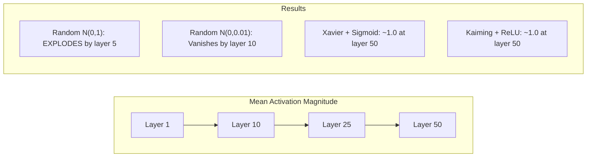
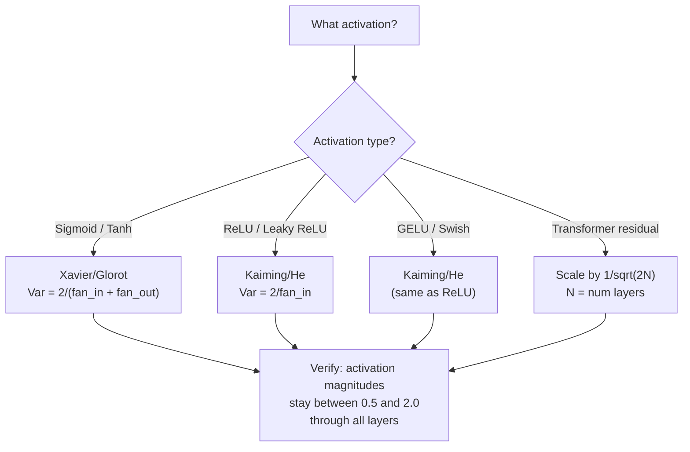

# Weight Initialization and Training Stability

> Initialize wrong and training never starts. Initialize right and 50 layers train as smoothly as 3.

**Type:** Build
**Languages:** Python
**Prerequisites:** Lesson 03.04 (Activation Functions), Lesson 03.07 (Regularization)
**Time:** ~90 minutes

## Learning Objectives

- Implement zero, random, Xavier/Glorot, and Kaiming/He initialization strategies and measure their effect on activation magnitudes through 50 layers
- Derive why Xavier init uses Var(w) = 2/(fan_in + fan_out) and Kaiming uses Var(w) = 2/fan_in
- Demonstrate the symmetry problem with zero initialization and explain why random scale alone is insufficient
- Match the correct initialization strategy to the activation function: Xavier for sigmoid/tanh, Kaiming for ReLU/GELU

## The Problem

Initialize all weights to zero. Nothing learns. Every neuron computes the same function, receives the same gradient, and updates identically. After 10,000 epochs, your 512-neuron hidden layer is still 512 copies of the same neuron. You paid for 512 parameters and got 1.

Initialize them too large. Activations explode through the network. By layer 10, values hit 1e15. By layer 20, they overflow to infinity. Gradients follow the same trajectory in reverse.

Initialize them randomly from a standard normal distribution. Works for 3 layers. At 50 layers, the signal collapses to zero or detonates to infinity depending on whether the random scale was slightly too small or slightly too large. The boundary between "works" and "broken" is razor-thin.

Weight initialization is the most underrated decision in deep learning. Architecture gets papers. Optimizers get blog posts. Initialization gets a footnote. But get it wrong and nothing else matters -- your network is dead before training begins.

## The Concept

### The Symmetry Problem

Every neuron in a layer has the same structure: multiply inputs by weights, add bias, apply activation. If all weights start at the same value (zero is the extreme case), every neuron computes the same output. During backpropagation, every neuron receives the same gradient. During the update step, every neuron changes by the same amount.

You're stuck. The network has hundreds of parameters, but they all move in lockstep. This is called symmetry, and random initialization is the brute-force way to break it. Each neuron starts at a different point in weight space, so each learns a different feature.

But "random" is not enough. The *scale* of the randomness determines whether the network trains.

### Variance Propagation Through Layers

Consider a single layer with fan_in inputs:

```
z = w1*x1 + w2*x2 + ... + w_n*x_n
```

If each weight wi is drawn from a distribution with variance Var(w) and each input xi has variance Var(x), the output variance is:

```
Var(z) = fan_in * Var(w) * Var(x)
```

If Var(w) = 1 and fan_in = 512, the output variance is 512x the input variance. After 10 layers: 512^10 = 1.2e27. Your signal has exploded.

If Var(w) = 0.001, the output variance shrinks by 0.001 * 512 = 0.512 per layer. After 10 layers: 0.512^10 = 0.00013. Your signal has vanished.

The goal: choose Var(w) so that Var(z) = Var(x). Signal magnitude stays constant across layers.

### Xavier/Glorot Initialization

Glorot and Bengio (2010) derived the solution for sigmoid and tanh activations. To keep variance constant in both the forward and backward pass:

```
Var(w) = 2 / (fan_in + fan_out)
```

In practice, weights are drawn from:

```
w ~ Uniform(-limit, limit)  where limit = sqrt(6 / (fan_in + fan_out))
```

or:

```
w ~ Normal(0, sqrt(2 / (fan_in + fan_out)))
```

This works because sigmoid and tanh are roughly linear near zero, where properly initialized activations live. The variance stays stable through dozens of layers.

### Kaiming/He Initialization

ReLU kills half the outputs (everything negative becomes zero). The effective fan_in is halved because on average half the inputs are zeroed. Xavier init doesn't account for this -- it underestimates the variance needed.

He et al. (2015) adjusted the formula:

```
Var(w) = 2 / fan_in
```

Weights are drawn from:

```
w ~ Normal(0, sqrt(2 / fan_in))
```

The factor of 2 compensates for ReLU zeroing half the activations. Without it, the signal shrinks by ~0.5x per layer. With 50 layers: 0.5^50 = 8.8e-16. Kaiming init prevents this.

### Transformer Initialization

GPT-2 introduced a different pattern. Residual connections add the output of each sub-layer to its input:

```
x = x + sublayer(x)
```

Each addition increases variance. With N residual layers, variance grows proportionally to N. GPT-2 scales the weights of residual layers by 1/sqrt(2N), where N is the number of layers. This keeps the accumulated signal magnitude stable.

Llama 3 (405B parameters, 126 layers) uses a similar scheme. Without this scaling, the residual stream would grow unbounded through 126 layers of attention and feedforward blocks.

```mermaid
flowchart TD
    subgraph "Zero Init"
        Z1["Layer 1<br/>All weights = 0"] --> Z2["Layer 2<br/>All neurons identical"]
        Z2 --> Z3["Layer 3<br/>Still identical"]
        Z3 --> ZR["Result: 1 effective neuron<br/>regardless of width"]
    end

    subgraph "Xavier Init"
        X1["Layer 1<br/>Var = 2/(fan_in+fan_out)"] --> X2["Layer 2<br/>Signal stable"]
        X2 --> X3["Layer 50<br/>Signal stable"]
        X3 --> XR["Result: Trains with<br/>sigmoid/tanh"]
    end

    subgraph "Kaiming Init"
        K1["Layer 1<br/>Var = 2/fan_in"] --> K2["Layer 2<br/>Signal stable"]
        K2 --> K3["Layer 50<br/>Signal stable"]
        K3 --> KR["Result: Trains with<br/>ReLU/GELU"]
    end
```



### Activation Magnitude Through 50 Layers



### Choosing the Right Init



## Build It

### Step 1: Initialization Strategies

Four ways to initialize a weight matrix. Each returns a list of lists (a 2D matrix) with fan_in columns and fan_out rows.

```python
import math
import random


def zero_init(fan_in, fan_out):
    return [[0.0 for _ in range(fan_in)] for _ in range(fan_out)]


def random_init(fan_in, fan_out, scale=1.0):
    return [[random.gauss(0, scale) for _ in range(fan_in)] for _ in range(fan_out)]


def xavier_init(fan_in, fan_out):
    std = math.sqrt(2.0 / (fan_in + fan_out))
    return [[random.gauss(0, std) for _ in range(fan_in)] for _ in range(fan_out)]


def kaiming_init(fan_in, fan_out):
    std = math.sqrt(2.0 / fan_in)
    return [[random.gauss(0, std) for _ in range(fan_in)] for _ in range(fan_out)]
```

### Step 2: Activation Functions

We need sigmoid, tanh, and ReLU to test each init strategy with its intended activation.

```python
def sigmoid(x):
    x = max(-500, min(500, x))
    return 1.0 / (1.0 + math.exp(-x))


def tanh_act(x):
    return math.tanh(x)


def relu(x):
    return max(0.0, x)
```

### Step 3: Forward Pass Through 50 Layers

Pass random data through a deep network and measure mean activation magnitude at each layer.

```python
def forward_deep(init_fn, activation_fn, n_layers=50, width=64, n_samples=100):
    random.seed(42)
    layer_magnitudes = []

    inputs = [[random.gauss(0, 1) for _ in range(width)] for _ in range(n_samples)]

    for layer_idx in range(n_layers):
        weights = init_fn(width, width)
        biases = [0.0] * width

        new_inputs = []
        for sample in inputs:
            output = []
            for neuron_idx in range(width):
                z = sum(weights[neuron_idx][j] * sample[j] for j in range(width)) + biases[neuron_idx]
                output.append(activation_fn(z))
            new_inputs.append(output)
        inputs = new_inputs

        magnitudes = []
        for sample in inputs:
            magnitudes.append(sum(abs(v) for v in sample) / width)
        mean_mag = sum(magnitudes) / len(magnitudes)
        layer_magnitudes.append(mean_mag)

    return layer_magnitudes
```

### Step 4: The Experiment

Run all combinations: zero init, random N(0,1), random N(0,0.01), Xavier with sigmoid, Xavier with tanh, Kaiming with ReLU. Print the magnitude at key layers.

```python
def run_experiment():
    configs = [
        ("Zero init + Sigmoid", lambda fi, fo: zero_init(fi, fo), sigmoid),
        ("Random N(0,1) + ReLU", lambda fi, fo: random_init(fi, fo, 1.0), relu),
        ("Random N(0,0.01) + ReLU", lambda fi, fo: random_init(fi, fo, 0.01), relu),
        ("Xavier + Sigmoid", xavier_init, sigmoid),
        ("Xavier + Tanh", xavier_init, tanh_act),
        ("Kaiming + ReLU", kaiming_init, relu),
    ]

    print(f"{'Strategy':<30} {'L1':>10} {'L5':>10} {'L10':>10} {'L25':>10} {'L50':>10}")
    print("-" * 80)

    for name, init_fn, act_fn in configs:
        mags = forward_deep(init_fn, act_fn)
        row = f"{name:<30}"
        for idx in [0, 4, 9, 24, 49]:
            val = mags[idx]
            if val > 1e6:
                row += f" {'EXPLODED':>10}"
            elif val < 1e-6:
                row += f" {'VANISHED':>10}"
            else:
                row += f" {val:>10.4f}"
        print(row)
```

### Step 5: Symmetry Demonstration

Show that zero init produces identical neurons.

```python
def symmetry_demo():
    random.seed(42)
    weights = zero_init(2, 4)
    biases = [0.0] * 4

    inputs = [0.5, -0.3]
    outputs = []
    for neuron_idx in range(4):
        z = sum(weights[neuron_idx][j] * inputs[j] for j in range(2)) + biases[neuron_idx]
        outputs.append(sigmoid(z))

    print("\nSymmetry Demo (4 neurons, zero init):")
    for i, out in enumerate(outputs):
        print(f"  Neuron {i}: output = {out:.6f}")
    all_same = all(abs(outputs[i] - outputs[0]) < 1e-10 for i in range(len(outputs)))
    print(f"  All identical: {all_same}")
    print(f"  Effective parameters: 1 (not {len(weights) * len(weights[0])})")
```

### Step 6: Layer-by-Layer Magnitude Report

Print a visual bar chart of activation magnitudes through 50 layers.

```python
def magnitude_report(name, magnitudes):
    print(f"\n{name}:")
    for i, mag in enumerate(magnitudes):
        if i % 5 == 0 or i == len(magnitudes) - 1:
            if mag > 1e6:
                bar = "X" * 50 + " EXPLODED"
            elif mag < 1e-6:
                bar = "." + " VANISHED"
            else:
                bar_len = min(50, max(1, int(mag * 10)))
                bar = "#" * bar_len
            print(f"  Layer {i+1:3d}: {bar} ({mag:.6f})")
```

## Use It

PyTorch provides these as built-in functions:

```python
import torch
import torch.nn as nn

layer = nn.Linear(512, 256)

nn.init.xavier_uniform_(layer.weight)
nn.init.xavier_normal_(layer.weight)

nn.init.kaiming_uniform_(layer.weight, nonlinearity='relu')
nn.init.kaiming_normal_(layer.weight, nonlinearity='relu')

nn.init.zeros_(layer.bias)
```

当你调用 nn.Linear(512, 256) 时，PyTorch 默认采用 Kaiming 统一初始化。这就是为什么大多数简单的网络“都能工作”——PyTorch 已经做出了正确的选择。但是，当您构建自定义架构或深入超过 20 层时，您需要了解正在发生的情况并可能覆盖默认值。

对于 Transformer，HuggingFace 模型通常在其“_init_weights”方法中处理初始化。 GPT-2 的实现将残差投影缩放为 1/sqrt(N)。如果您从头开始构建变压器，则需要自己添加它。

## 发货

本课产生：
- `outputs/prompt-init-strategy.md` -- 诊断权重初始化问题并推荐正确策略的提示

## 练习

1.添加LeCun初始化（Var = 1/fan_in，专为SELU激活而设计）。使用 LeCun init + tanh 运行 50 层实验，并与 Xavier + tanh 进行比较。

2. 实现GPT-2残差缩放：将每层的输出乘以1/sqrt(2*N)，然后添加到残差流。在缩放和不缩放的情况下运行 50 个层，测量残差幅度增长的速度。

3. 创建一个“init health check”函数，该函数获取网络的层尺寸和激活类型，然后建议正确的初始化，并警告当前 init 是否会导致问题。

4. 使用 fan_in = 16 与 fan_in = 1024 运行实验。Xavier 和 Kaiming 适应 fan_in，但 random init 不适应。展示“有效”和“破坏”之间的差距如何随着层数的增加而扩大。

5. 实现正交初始化（生成随机矩阵，计算其 SVD，使用正交矩阵 U）。与 Kaiming 的 50 层 ReLU 网络进行比较。

## 关键术语

|术语 |人们怎么说 |它实际上意味着什么 |
|------|----------------|----------------------|
|权重初始化| “随机设置起始权重” |选择初始权重值的策略决定网络是否可以训练 |
|对称性破缺| “让神经元变得不同”|使用随机初始化来确保神经元学习不同的特征而不是计算相同的函数 |
|扇入| “神经元的输入数量” |传入连接的数量，决定了输入方差如何在加权和中累积 |
|扇出 | “神经元的输出数量” |传出连接的数量，与反向传播期间保持梯度方差相关
|泽维尔/格洛罗初始化| “sigmoid 初始化” | Var(w) = 2/(fan_in + fan_out)，旨在通过 sigmoid 和 tanh 激活保留方差 |
|凯明/何初始化 | “ReLU 初始化” | Var(w) = 2/fan_in，说明 ReLU 将一半激活归零 |
| Variance propagation | "How signals grow or shrink through layers" |基于权重尺度激活方差如何逐层变化的数学分析 |
|残留结垢| “GPT-2 的初始化技巧”|将剩余连接权重缩放 1/sqrt(2N) 以防止通过 N 个转换器层的方差增长 |
|死网| “没有火车”|初始化不当导致所有梯度为零或所有激活饱和的网络 |
|爆炸式激活| “价值趋于无穷大”|当权重方差太高时，导致激活幅度在各层中呈指数增长 |

## 进一步阅读

- Glorot 和 Bengio，“理解训练深度前馈神经网络的难度”（2010 年）——带有方差分析的原始 Xavier 初始化论文
- He 等人，“深入研究整流器”(2015)——介绍了 ReLU 网络的 Kaiming 初始化
- Radford 等人，“语言模型是无监督多任务学习者”（2019）——具有残差缩放初始化的 GPT-2 论文
- Mishkin & Matas，“All You Need is a Good Init”（2016）——层序单位方差初始化，分析公式的经验替代
