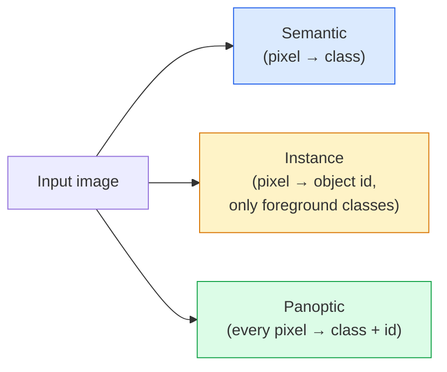
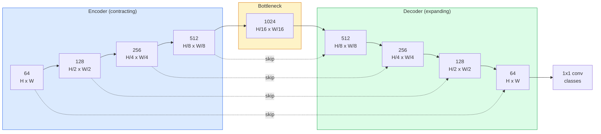

# Semantic Segmentation — U-Net

> Segmentation is classification at every pixel. U-Net makes it work by pairing a downsampling encoder with an upsampling decoder and wiring skip connections between them.

**Type:** Build
**Languages:** Python
**Prerequisites:** Phase 4 Lesson 03 (CNNs), Phase 4 Lesson 04 (Image Classification)
**Time:** ~75 minutes

## Learning Objectives

- Distinguish semantic, instance, and panoptic segmentation and pick the right task for a given problem
- Build a U-Net from scratch in PyTorch with encoder blocks, a bottleneck, a decoder with transposed convolutions, and skip connections
- Implement pixel-wise cross-entropy, Dice loss, and the combined loss that is the current default for medical and industrial segmentation
- Read IoU and Dice metrics per class and diagnose whether a bad score comes from small-object recall, boundary accuracy, or class imbalance

## The Problem

Classification outputs one label per image. Detection outputs a handful of boxes per image. Segmentation outputs one label per pixel. For an input of size `H x W`, the output is a tensor of shape `H x W` (semantic) or `H x W x N_instances` (instance). That is millions of predictions per image, not one.

The structure of segmentation is why it powers almost every dense-prediction vision product: medical imaging (tumour masks), autonomous driving (road, lane, obstacle), satellite (building footprints, crop boundaries), document parsing (layout zones), robotics (graspable regions). None of those tasks can be solved by putting a box around the object; they need the exact silhouette.

The architectural problem is simple to state and not simple to solve: you need the network to see the global context of an image (what kind of scene is this) and the local pixel detail (exactly which pixel is road vs pavement) simultaneously. A standard CNN compresses spatially to gain context, which throws away the detail. U-Net was the design that got both.

## The Concept

### Semantic vs instance vs panoptic



- **Semantic** says "this pixel is road, that pixel is car." Two cars next to each other collapse into a single blob.
- **Instance** says "this pixel is car #3, that pixel is car #5." Ignores background stuff ("stuff" = sky, road, grass).
- **Panoptic** unifies both: every pixel gets a class label, every instance gets a unique id, stuff and things both segmented.

This lesson covers semantic. The next lesson (Mask R-CNN) covers instance.

### The U-Net shape



The encoder halves spatial resolution four times and doubles channels. The decoder reverses: doubles spatial resolution four times and halves channels. The skip connections concatenate matching encoder features with decoder features at every resolution. The final 1x1 conv maps `64 -> num_classes` at full resolution.

Why skip connections are necessary: the decoder has seen only small feature maps by the time it tries to output pixel-level predictions. Without the skips it cannot localise edges accurately because that information was compressed away in the encoder. Skip connections hand it the high-resolution feature maps the encoder computed on the way down.

### Transposed vs bilinear upsample

The decoder has to expand spatial dimensions. Two options:

- **Transposed convolution** (`nn.ConvTranspose2d`) — learnable upsample. Historical U-Net default. Can produce checkerboard artifacts if stride and kernel size do not divide evenly.
- **Bilinear upsample + 3x3 conv** — smooth upsample followed by a conv. Fewer artifacts, fewer parameters, now the modern default.

Both appear in the wild. For a first U-Net, bilinear is safer.

### Cross-entropy on a pixel grid

For semantic segmentation with C classes, the model output is `(N, C, H, W)`. The target is `(N, H, W)` with integer class IDs. Cross-entropy is identical to the classification case, just applied at every spatial position:

```
Loss = mean over (n, h, w) of -log( softmax(logits[n, :, h, w])[target[n, h, w]] )
```

`F.cross_entropy` in PyTorch handles this shape natively. No reshape needed.

### Dice loss and why you need it

Cross-entropy treats every pixel equally. That is wrong when one class dominates the frame (medical imaging: 99% background, 1% tumour). The network can score 99% accuracy by predicting background everywhere and still be useless.

Dice loss solves this by directly optimising the overlap between predicted and true mask:

```
Dice(p, y) = 2 * sum(p * y) / (sum(p) + sum(y) + epsilon)
Dice_loss = 1 - Dice
```

where `p` is the sigmoid/softmax probability map for a class and `y` is the binary ground-truth mask. The loss is zero only when the overlap is perfect. Because it is ratio-based, class imbalance is irrelevant.

In practice, use the **combined loss**:

```
L = L_cross_entropy + lambda * L_dice       (lambda ~ 1)
```

Cross-entropy gives stable gradients early in training; Dice focuses the tail of training on actually matching the mask shape. This combination is the medical-imaging default and hard to beat on any class-imbalanced dataset.

### Evaluation metrics

- **Pixel accuracy** — percent of pixels predicted correctly. Cheap. Broken on imbalanced data for the same reason as accuracy in classification.
- **IoU per class** — intersection over union for each class's mask; average across classes = mIoU.
- **Dice (F1 on pixels)** — similar to IoU; `Dice = 2 * IoU / (1 + IoU)`. Medical imaging prefers Dice, driving community prefers IoU; they are monotonically related.
- **Boundary F1** — measures how close predicted boundaries are to ground-truth boundaries, penalising even small shifts. Important for high-precision tasks like semiconductor inspection.

Report IoU per class, not just mIoU. Mean IoU hides a class at 15% when nine others are at 85%.

### Input resolution trade-off

U-Net's encoder halves resolution four times, so the input must be divisible by 16. Medical images are often 512x512 or 1024x1024. Autonomous-driving crops are 2048x1024. The memory cost of U-Net scales with `H * W * C_max`, and at 1024x1024 with 1024 bottleneck channels the forward pass already uses gigabytes of VRAM.

Two standard workarounds:
1. Tile the input — process 256x256 tiles with overlap and stitch.
2. Replace the bottleneck with dilated convolutions that keep spatial resolution higher but widen receptive field (the DeepLab family).

For a first model, a 256x256 input with a 64-channel-base U-Net trains comfortably on 8 GB VRAM.

## Build It

### Step 1: Encoder block

Two 3x3 convs with batch norm and ReLU. The first conv changes channel count; the second keeps it.

```python
import torch
import torch.nn as nn
import torch.nn.functional as F

class DoubleConv(nn.Module):
    def __init__(self, in_c, out_c):
        super().__init__()
        self.net = nn.Sequential(
            nn.Conv2d(in_c, out_c, kernel_size=3, padding=1, bias=False),
            nn.BatchNorm2d(out_c),
            nn.ReLU(inplace=True),
            nn.Conv2d(out_c, out_c, kernel_size=3, padding=1, bias=False),
            nn.BatchNorm2d(out_c),
            nn.ReLU(inplace=True),
        )

    def forward(self, x):
        return self.net(x)
```

This block is reused throughout. `bias=False` because BN's beta handles the bias.

### Step 2: Down and up blocks

```python
class Down(nn.Module):
    def __init__(self, in_c, out_c):
        super().__init__()
        self.net = nn.Sequential(
            nn.MaxPool2d(2),
            DoubleConv(in_c, out_c),
        )

    def forward(self, x):
        return self.net(x)


class Up(nn.Module):
    def __init__(self, in_c, out_c):
        super().__init__()
        self.up = nn.Upsample(scale_factor=2, mode="bilinear", align_corners=False)
        self.conv = DoubleConv(in_c, out_c)

    def forward(self, x, skip):
        x = self.up(x)
        if x.shape[-2:] != skip.shape[-2:]:
            x = F.interpolate(x, size=skip.shape[-2:], mode="bilinear", align_corners=False)
        x = torch.cat([skip, x], dim=1)
        return self.conv(x)
```

The spatial-only shape check (`shape[-2:]`) handles inputs whose dimensions are not divisible by 16; a safe `F.interpolate` aligns the tensor before the concat. Comparing the full shape would also trigger on channel-count differences, which should be a loud error, not a silent interpolate.

### Step 3: The U-Net

```python
class UNet(nn.Module):
    def __init__(self, in_channels=3, num_classes=2, base=64):
        super().__init__()
        self.inc = DoubleConv(in_channels, base)
        self.d1 = Down(base, base * 2)
        self.d2 = Down(base * 2, base * 4)
        self.d3 = Down(base * 4, base * 8)
        self.d4 = Down(base * 8, base * 16)
        self.u1 = Up(base * 16 + base * 8, base * 8)
        self.u2 = Up(base * 8 + base * 4, base * 4)
        self.u3 = Up(base * 4 + base * 2, base * 2)
        self.u4 = Up(base * 2 + base, base)
        self.outc = nn.Conv2d(base, num_classes, kernel_size=1)

    def forward(self, x):
        x1 = self.inc(x)
        x2 = self.d1(x1)
        x3 = self.d2(x2)
        x4 = self.d3(x3)
        x5 = self.d4(x4)
        x = self.u1(x5, x4)
        x = self.u2(x, x3)
        x = self.u3(x, x2)
        x = self.u4(x, x1)
        return self.outc(x)

net = UNet(in_channels=3, num_classes=2, base=32)
x = torch.randn(1, 3, 256, 256)
print(f"output: {net(x).shape}")
print(f"params: {sum(p.numel() for p in net.parameters()):,}")
```

Output shape `(1, 2, 256, 256)` — same spatial size as the input, `num_classes` channels. About 7.7M parameters at `base=32`.

### Step 4: Losses

```python
def dice_loss(logits, targets, num_classes, eps=1e-6):
    probs = F.softmax(logits, dim=1)
    targets_one_hot = F.one_hot(targets, num_classes).permute(0, 3, 1, 2).float()
    dims = (0, 2, 3)
    intersection = (probs * targets_one_hot).sum(dim=dims)
    denom = probs.sum(dim=dims) + targets_one_hot.sum(dim=dims)
    dice = (2 * intersection + eps) / (denom + eps)
    return 1 - dice.mean()


def combined_loss(logits, targets, num_classes, lam=1.0):
    ce = F.cross_entropy(logits, targets)
    dc = dice_loss(logits, targets, num_classes)
    return ce + lam * dc, {"ce": ce.item(), "dice": dc.item()}
```

Dice is computed per class then averaged (macro Dice). The `eps` prevents division by zero on classes absent from the batch.

### Step 5: IoU metric

```python
@torch.no_grad()
def iou_per_class(logits, targets, num_classes):
    preds = logits.argmax(dim=1)
    ious = torch.zeros(num_classes)
    for c in range(num_classes):
        pred_c = (preds == c)
        true_c = (targets == c)
        inter = (pred_c & true_c).sum().float()
        union = (pred_c | true_c).sum().float()
        ious[c] = (inter / union) if union > 0 else torch.tensor(float("nan"))
    return ious
```

Returns a vector of length C. `nan` marks classes absent from the batch — do not average over those when computing mIoU.

### Step 6: Synthetic dataset for end-to-end verification

Generate shapes on coloured backgrounds so the network has to learn shape, not pixel colour.

```python
import numpy as np
from torch.utils.data import Dataset, DataLoader

def synthetic_segmentation(num_samples=200, size=64, seed=0):
    rng = np.random.default_rng(seed)
    images = np.zeros((num_samples, size, size, 3), dtype=np.float32)
    masks = np.zeros((num_samples, size, size), dtype=np.int64)
    for i in range(num_samples):
        bg = rng.uniform(0, 1, (3,))
        images[i] = bg
        masks[i] = 0
        num_shapes = rng.integers(1, 4)
        for _ in range(num_shapes):
            cls = int(rng.integers(1, 3))
            color = rng.uniform(0, 1, (3,))
            cx, cy = rng.integers(10, size - 10, size=2)
            r = int(rng.integers(4, 12))
            yy, xx = np.meshgrid(np.arange(size), np.arange(size), indexing="ij")
            if cls == 1:
                mask = (xx - cx) ** 2 + (yy - cy) ** 2 < r ** 2
            else:
                mask = (np.abs(xx - cx) < r) & (np.abs(yy - cy) < r)
            images[i][mask] = color
            masks[i][mask] = cls
        images[i] += rng.normal(0, 0.02, images[i].shape)
        images[i] = np.clip(images[i], 0, 1)
    return images, masks


class SegDataset(Dataset):
    def __init__(self, images, masks):
        self.images = images
        self.masks = masks

    def __len__(self):
        return len(self.images)

    def __getitem__(self, i):
        img = torch.from_numpy(self.images[i]).permute(2, 0, 1).float()
        mask = torch.from_numpy(self.masks[i]).long()
        return img, mask
```

Three classes: background (0), circles (1), squares (2). The network must learn to distinguish shape.

### Step 7: Training loop

```python
def train_one_epoch(model, loader, optimizer, device, num_classes):
    model.train()
    loss_sum, total = 0.0, 0
    iou_sum = torch.zeros(num_classes)
    for x, y in loader:
        x, y = x.to(device), y.to(device)
        logits = model(x)
        loss, _ = combined_loss(logits, y, num_classes)
        optimizer.zero_grad()
        loss.backward()
        optimizer.step()
        loss_sum += loss.item() * x.size(0)
        total += x.size(0)
        iou_sum += iou_per_class(logits, y, num_classes).nan_to_num(0)
    return loss_sum / total, iou_sum / len(loader)
```

Run this for 10-30 epochs on the synthetic dataset and watch mIoU climb past 0.9 for the shape classes. Note the `nan_to_num(0)` treats classes absent from a batch as zero; for accurate per-class IoU, mask by presence and use `torch.nanmean` across batches at evaluation time rather than averaging here.

## Use It

For production, `segmentation_models_pytorch` ("smp") wraps every standard segmentation architecture with any torchvision or timm backbone. Three lines:

```python
import segmentation_models_pytorch as smp

model = smp.Unet(
    encoder_name="resnet34",
    encoder_weights="imagenet",
    in_channels=3,
    classes=3,
)
```

在实际工作中还值得了解：
- **DeepLabV3+** 用扩张的卷积替换基于最大池的下采样，因此瓶颈保持分辨率；卫星和驾驶数据的更快边界。
- **SegFormer** 将转换编码器替换为分层转换器；目前在许多基准测试中都是 SOTA。
- **Mask2Former** / **OneFormer** 在单一架构中统一语义、实例和全景分割。

这三个都是具有相同数据加载器的“smp”或“transformers”的直接替代品。

## 发货

本课产生：

- `outputs/prompt-segmentation-task-picker.md` — 在语义、实例和全景分割之间进行选择的提示，并为给定任务命名架构。
- `outputs/skill-segmentation-mask-inspector.md` — 一项报告类别分布、预测掩模统计数据以及预测不足或边界模糊的类别的技能。

## 练习

1. **（简单）** 为二进制分割任务（前景与背景）实现“bce_dice_loss”。在合成的二类数据集上验证，当前景占像素的 5% 时，组合损失的收敛速度比单独的 BCE 更快。
2. **（中）** 将 `nn.Upsample + conv` 上块替换为 `nn.ConvTranspose2d` 上块。在合成数据集上训练并比较 mIoU。观察转置转换版本中出现棋盘伪影的位置。
3. **（困难）** 采用真实的分割数据集（Oxford-IIIT Pets、Cityscapes mini split 或医学子集）并将 U-Net 训练到“smp.Unet”参考的 2 个 IoU 点以内。报告每个类别的 IoU 并确定哪些类别通过将 Dice 添加到损失中获益最多。

## 关键术语

|术语 |人们怎么说 |它实际上意味着什么 |
|------|----------------|----------------------|
|语义分割| “标记每个像素” |按像素分类为 C 类；同一类的实例合并 |
|实例分割| “标记每个对象”|分隔同一类的不同实例；仅前台 |
|全景分割 | “语义+实例”|每个像素都有一个类别；每个事物实例也有一个唯一的 id |
|跳过连接 | “U网桥”|将编码器特征串联成匹配分辨率的解码器特征；保留高频细节 |
|转置转换| “反卷积”|可学习的上采样；可以制作棋盘工艺品|
|骰子损失 | “重叠损失” | 1 - 2|A ∩ B| / (|A| + |B|);直接优化掩码重叠并对类别不平衡具有鲁棒性
|米洛 | “并集的平均交集” |跨类平均 IoU；细分的社区标准指标 |
|边界F1 | “边界精度” |仅在边界像素上计算 F1 分数；对于精度要求严格的任务很重要|

## 进一步阅读

- [U-Net: 用于生物医学图像分割的卷积网络 (Ronneberger et al., 2015)](https://arxiv.org/abs/1505.04597) — 原始论文；大家复制的图在第 2 页
- [Fully Convolutional Networks (Long et al., 2015)](https://arxiv.org/abs/1411.4038) — 这篇论文首次将分割变成了端到端的转换问题
- [segmentation_models_pytorch](https://github.com/qubvel/segmentation_models.pytorch) — 生产分割的参考；每个标准架构加上每个标准损耗
- [从训练 SOTA 分割（kaggle.com 竞赛）中学到的经验教训](https://www.kaggle.com/code/iafoss/carvana-unet-pytorch) — 演练为什么 TTA、伪标签和类别权重对真实数据很重要
