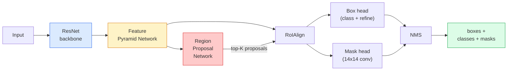

# Instance Segmentation — Mask R-CNN

> Add a tiny mask branch to a Faster R-CNN detector and you have instance segmentation. The hard part is RoIAlign, and it is harder than it looks.

**Type:** Build + Learn
**Languages:** Python
**Prerequisites:** Phase 4 Lesson 06 (YOLO), Phase 4 Lesson 07 (U-Net)
**Time:** ~75 minutes

## Learning Objectives

- Trace the Mask R-CNN architecture end-to-end: backbone, FPN, RPN, RoIAlign, box head, mask head
- Implement RoIAlign from scratch and explain why RoIPool is no longer used
- Use the torchvision `maskrcnn_resnet50_fpn_v2` pretrained model for production-quality instance masks and read its output format correctly
- Fine-tune Mask R-CNN on a small custom dataset by replacing the box and mask heads and keeping the backbone frozen

## The Problem

Semantic segmentation gives you one mask per class. Instance segmentation gives you one mask per object, even when two objects share a class. Counting individuals, tracking across frames, and measuring things (the bounding box of each brick in a wall, each cell in a microscope image) all demand instance segmentation.

Mask R-CNN (He et al., 2017) solved this by reframing instance segmentation as detection-plus-a-mask. The design was so clean that for the next five years almost every instance segmentation paper was a Mask R-CNN variant, and the torchvision implementation is still the production default for small to medium datasets.

The hard engineering problem is sampling: how do you crop a fixed-size feature region out of a proposal box whose corners do not align with pixel boundaries? Getting that wrong costs tenths of a mAP point everywhere. RoIAlign is the answer.

## The Concept

### The architecture



Five pieces to understand:

1. **Backbone** — ResNet-50 or ResNet-101 trained on ImageNet. Produces a hierarchy of feature maps at strides 4, 8, 16, 32.
2. **FPN (Feature Pyramid Network)** — top-down + lateral connections that give every level C channels of semantic-rich features. Detection queries the FPN level matching the object size.
3. **RPN (Region Proposal Network)** — a small conv head that, at every anchor position, predicts "is there an object here?" and "how do I refine the box?". Produces ~1000 proposals per image.
4. **RoIAlign** — samples a fixed-size (e.g. 7x7) feature patch from any box on any FPN level. Bilinear sampling, no quantisation.
5. **Heads** — two-layer box head that refines the box and picks a class, plus a small conv head that outputs a `28x28` binary mask for each proposal.

### Why RoIAlign, not RoIPool

The original Fast R-CNN used RoIPool, which splits a proposal box into a grid, takes the maximum feature in each cell, and rounds all coordinates to integers. That rounding misaligns the feature map from the input pixel coordinates by up to a full feature-map pixel — small on a 224x224 image, catastrophic when the feature map is stride 32.

```
RoIPool:
  box (34.7, 51.3, 98.2, 142.9)
  round -> (34, 51, 98, 142)
  split grid -> round each cell boundary
  misalignment accumulates at every step

RoIAlign:
  box (34.7, 51.3, 98.2, 142.9)
  sample at exact float coordinates using bilinear interpolation
  no rounding anywhere
```

RoIAlign lifts mask AP by 3-4 points on COCO for free. Every detector that cares about localisation now uses it — YOLOv7 seg, RT-DETR, Mask2Former alike.

### The RPN in one paragraph

At every position of a feature map, place K anchor boxes of different sizes and shapes. Predict an objectness score for each anchor and a regression offset to turn the anchor into a better-fitting box. Keep the top ~1,000 boxes by score, apply NMS at IoU 0.7, and hand the survivors to the heads. The RPN is trained with its own mini-loss — the same structure as the YOLO loss from Lesson 6, just with two classes (object / no object).

### The mask head

For each proposal (after RoIAlign) the mask head is a tiny FCN: four 3x3 convs, a 2x deconv, a final 1x1 conv that produces `num_classes` output channels at `28x28` resolution. Only the channel corresponding to the predicted class is kept; the others are ignored. This decouples mask prediction from classification.

Upsample the 28x28 mask to the proposal's original pixel size to produce the final binary mask.

### Losses

Mask R-CNN has four losses added together:

```
L = L_rpn_cls + L_rpn_box + L_box_cls + L_box_reg + L_mask
```

- `L_rpn_cls`, `L_rpn_box` — objectness + box regression for the RPN proposals.
- `L_box_cls` — cross-entropy over (C+1) classes (including background) on the head's classifier.
- `L_box_reg` — smooth L1 on the head's box refinement.
- `L_mask` — per-pixel binary cross-entropy on the 28x28 mask output.

Each loss has its own default weight; the torchvision implementation exposes them as constructor arguments.

### Output format

`torchvision.models.detection.maskrcnn_resnet50_fpn_v2` returns a list of dicts, one per image:

```
{
    "boxes":  (N, 4) in (x1, y1, x2, y2) pixel coordinates,
    "labels": (N,) class IDs, 0 = background so indices are 1-based,
    "scores": (N,) confidence scores,
    "masks":  (N, 1, H, W) float masks in [0, 1] — threshold at 0.5 for binary,
}
```

The mask is full image resolution already. The 28x28 head output has been upsampled internally.

## Build It

### Step 1: RoIAlign from scratch

This is the one component of Mask R-CNN that is simpler to understand as code than as prose.

```python
import torch
import torch.nn.functional as F

def roi_align_single(feature, box, output_size=7, spatial_scale=1 / 16.0):
    """
    feature: (C, H, W) single-image feature map
    box: (x1, y1, x2, y2) in original image pixel coordinates
    output_size: side of the output grid (7 for box head, 14 for mask head)
    spatial_scale: reciprocal of the feature map stride
    """
    C, H, W = feature.shape
    x1, y1, x2, y2 = [c * spatial_scale - 0.5 for c in box]
    bin_w = (x2 - x1) / output_size
    bin_h = (y2 - y1) / output_size

    grid_y = torch.linspace(y1 + bin_h / 2, y2 - bin_h / 2, output_size)
    grid_x = torch.linspace(x1 + bin_w / 2, x2 - bin_w / 2, output_size)
    yy, xx = torch.meshgrid(grid_y, grid_x, indexing="ij")

    gx = 2 * (xx + 0.5) / W - 1
    gy = 2 * (yy + 0.5) / H - 1
    grid = torch.stack([gx, gy], dim=-1).unsqueeze(0)
    sampled = F.grid_sample(feature.unsqueeze(0), grid, mode="bilinear",
                            align_corners=False)
    return sampled.squeeze(0)
```

Every number is at a bilinearly-sampled position. No rounding, no quantisation, no dropped gradients.

### Step 2: Compare to torchvision's RoIAlign

```python
from torchvision.ops import roi_align

feature = torch.randn(1, 16, 50, 50)
boxes = torch.tensor([[0, 10, 20, 100, 90]], dtype=torch.float32)  # (batch_idx, x1, y1, x2, y2)

ours = roi_align_single(feature[0], boxes[0, 1:].tolist(), output_size=7, spatial_scale=1/4)
theirs = roi_align(feature, boxes, output_size=(7, 7), spatial_scale=1/4, sampling_ratio=1, aligned=True)[0]

print(f"shape ours:   {tuple(ours.shape)}")
print(f"shape theirs: {tuple(theirs.shape)}")
print(f"max|diff|:    {(ours - theirs).abs().max().item():.3e}")
```

With `sampling_ratio=1` and `aligned=True`, the two match to within `1e-5`.

### Step 3: Load a pretrained Mask R-CNN

```python
import torch
from torchvision.models.detection import maskrcnn_resnet50_fpn_v2, MaskRCNN_ResNet50_FPN_V2_Weights

model = maskrcnn_resnet50_fpn_v2(weights=MaskRCNN_ResNet50_FPN_V2_Weights.DEFAULT)
model.eval()
print(f"params: {sum(p.numel() for p in model.parameters()):,}")
print(f"classes (including background): {len(model.roi_heads.box_predictor.cls_score.out_features * [0])}")
```

46M parameters, 91 classes (COCO). The first class (id 0) is background; everything the model actually detects starts at id 1.

### Step 4: Run inference

```python
with torch.no_grad():
    x = torch.randn(3, 400, 600)
    predictions = model([x])
p = predictions[0]
print(f"boxes:  {tuple(p['boxes'].shape)}")
print(f"labels: {tuple(p['labels'].shape)}")
print(f"scores: {tuple(p['scores'].shape)}")
print(f"masks:  {tuple(p['masks'].shape)}")
```

The mask tensor is shape `(N, 1, H, W)`. Threshold at 0.5 to get a binary mask per object:

```python
binary_masks = (p['masks'] > 0.5).squeeze(1)  # (N, H, W) boolean
```

### Step 5: Swap the heads for a custom class count

The common fine-tuning recipe: reuse the backbone, FPN, and RPN; replace the two classifier heads.

```python
from torchvision.models.detection.faster_rcnn import FastRCNNPredictor
from torchvision.models.detection.mask_rcnn import MaskRCNNPredictor

def build_custom_maskrcnn(num_classes):
    model = maskrcnn_resnet50_fpn_v2(weights=MaskRCNN_ResNet50_FPN_V2_Weights.DEFAULT)
    in_features = model.roi_heads.box_predictor.cls_score.in_features
    model.roi_heads.box_predictor = FastRCNNPredictor(in_features, num_classes)
    in_features_mask = model.roi_heads.mask_predictor.conv5_mask.in_channels
    hidden_layer = 256
    model.roi_heads.mask_predictor = MaskRCNNPredictor(in_features_mask, hidden_layer, num_classes)
    return model

custom = build_custom_maskrcnn(num_classes=5)
print(f"custom cls_score.out_features: {custom.roi_heads.box_predictor.cls_score.out_features}")
```

`num_classes` must include the background class, so a dataset with 4 object classes uses `num_classes=5`.

### Step 6: Freeze what does not need training

On small datasets, freeze the backbone and the FPN. Only the RPN objectness + regression and the two heads learn.

```python
def freeze_backbone_and_fpn(model):
    # torchvision Mask R-CNN packs the FPN inside `model.backbone` (as
    # `model.backbone.fpn`), so iterating `model.backbone.parameters()` covers
    # both the ResNet feature layers and the FPN lateral/output convs.
    for p in model.backbone.parameters():
        p.requires_grad = False
    return model

custom = freeze_backbone_and_fpn(custom)
trainable = sum(p.numel() for p in custom.parameters() if p.requires_grad)
print(f"trainable after freeze: {trainable:,}")
```

On 500-image datasets this is the difference between convergence and overfitting.

## Use It

The full training loop for Mask R-CNN in torchvision is 40 lines and does not change meaningfully between tasks — swap datasets and go.

```python
def train_step(model, images, targets, optimizer):
    model.train()
    loss_dict = model(images, targets)
    losses = sum(loss for loss in loss_dict.values())
    optimizer.zero_grad()
    losses.backward()
    optimizer.step()
    return {k: v.item() for k, v in loss_dict.items()}
```

“targets”列表必须包含带有“boxes”、“labels”和“masks”的每个图像字典（作为“(num_instances, H, W)”二进制张量）。该模型在训练期间返回四个损失的字典，在评估期间返回一个预测列表，以“model.training”为键。

`pycocotools` 评估器为框和掩模生成 mAP@IoU=0.5:0.95 ；您需要这两个数字才能知道盒头或掩模头是否是瓶颈。

## 发货

本课产生：

- `outputs/prompt-instance-vs-semantic-router.md` — 一个提示，询问三个问题并选择实例、语义、全景以及开始的确切模型。
- `outputs/skill-mask-rcnn-head-swapper.md` — 一项技能，在给定新的 `num_classes` 的情况下，生成 10 行代码，用于在任何 torchvision 检测模型上交换头部。

## 练习

1. **（简单）** 在 100 个随机盒子上对照 `torchvision.ops.roi_align` 验证您的 RoIAlign。报告最大绝对差值。还运行 RoIPool（2017 年之前的行为）并显示它在边界附近的框上偏离约 1-2 个特征图像素。
2. **（中）** 在 50 个图像的自定义数据集（任意两个类：气球、鱼、坑洼、徽标）上微调 `maskrcnn_resnet50_fpn_v2`。冻结骨干网，训练 20 个 epoch，报告 mask AP@0.5。
3. **（困难）** 将 Mask R-CNN 的 mask head 替换为预测尺寸为 56x56 而不是 28x28 的 mask head。前后测量mAP@IoU=0.75。解释为什么增益（或缺乏增益）与预期的边界精度/内存权衡相匹配。

## 关键术语

|术语 |人们怎么说 |它实际上意味着什么 |
|------|----------------|----------------------|
| Mask R-CNN | “检测加口罩”| Faster R-CNN + 一个小型 FCN 头，可预测每类每个提案的 28x28 掩码 |
| FPN | “特征金字塔”|自上而下+横向连接，为每一步提供丰富语义特征的 C 级通道 |
| RPN | “区域提议者”|一个小型转换头，每张图像生成约 1000 个对象/无对象建议 |
|旋转对齐 | “无舍入作物” |从任何浮动坐标框中双线性采样固定大小的特征网格 |
|投资池 | “2017年前作物”|与 RoIAlign 用途相同，但四舍五入框坐标；已过时 |
|面膜AP | “实例映射” |使用mask IoU而不是box IoU计算平均精度； COCO实例分割指标|
|二元掩模头| “每班面具” |为每个提案的每个类预测一个二进制掩码；仅保留预测类别的频道 |
|背景类| “0 级” |包罗万象的“无对象”类；真实类的索引从 1 开始 |

## 进一步阅读

- [Mask R-CNN (He et al., 2017)](https://arxiv.org/abs/1703.06870) — 论文；关于 RoIAlign 的第 3 节是重要读物
- [FPN：特征金字塔网络 (Lin et al., 2017)](https://arxiv.org/abs/1612.03144) — FPN 论文；每个现代探测器都使用它
- [torchvision Mask R-CNN 教程](https://pytorch.org/tutorials/intermediate/torchvision_tutorial.html) — 微调循环的参考
- [Detectron2 model Zoo](https://github.com/facebookresearch/detectron2/blob/main/MODEL_ZOO.md) — 几乎每个检测和分割变体都具有经过训练的权重的生产实现
