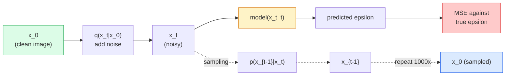

# Image Generation — Diffusion Models

> A diffusion model learns to denoise. Train it to remove a tiny bit of noise from a noisy image, repeat that backwards a thousand times, and you have an image generator.

**Type:** Build
**Languages:** Python
**Prerequisites:** Phase 4 Lesson 07 (U-Net), Phase 1 Lesson 06 (Probability), Phase 3 Lesson 06 (Optimizers)
**Time:** ~75 minutes

## Learning Objectives

- Derive the forward noising process `x_0 -> x_1 -> ... -> x_T` and explain why the closed-form `q(x_t | x_0)` holds for any t
- Implement a DDPM-style training objective that regresses the noise added at each step, and a sampler that walks back from pure noise to an image
- Build a time-conditioned U-Net (small enough to train on CPU) that predicts the noise for any timestep
- Explain the difference between DDPM and DDIM sampling, and when each is appropriate (Lesson 23 covers flow matching and rectified flow in depth)

## The Problem

GANs generate one-shot: noise in, image out, one forward pass. They are fast and hard to train. Diffusion models generate iteratively: start from pure noise, denoise in small steps, image emerges. They are slow and easy to train. For the last five years the latter property has dominated: any small team can train a diffusion model and get reasonable samples; GAN training is a craft you learn over years of failed runs.

Beyond training stability, diffusion's iterative structure is what unlocks everything modern image generation does: text conditioning, inpainting, image editing, super-resolution, controllable style. Each step of the sampling loop is a place to inject a new constraint. That hook is why Stable Diffusion, Imagen, DALL-E 3, Midjourney, and every controllable image model you will use are all diffusion-based.

This lesson builds the minimal DDPM: forward noising, backward denoising, training loop. The next lesson (Stable Diffusion) wires it into a production system with a VAE, a text encoder, and classifier-free guidance.

## The Concept

### The forward process

Take an image `x_0`. Add a tiny amount of Gaussian noise to get `x_1`. Add a tiny amount more to get `x_2`. Keep going for T steps until `x_T` is nearly indistinguishable from pure Gaussian noise.

```
q(x_t | x_{t-1}) = N(x_t; sqrt(1 - beta_t) * x_{t-1},  beta_t * I)
```

`beta_t` is a small variance schedule, typically linear from 0.0001 to 0.02 over T=1000 steps. Each step slightly shrinks the signal and injects fresh noise.

### The closed-form jump

Adding noise one step at a time is a Markov chain, but the math folds: you can sample `x_t` directly from `x_0` in one step.

```
Define alpha_t = 1 - beta_t
Define alpha_bar_t = prod_{s=1..t} alpha_s

Then:
  q(x_t | x_0) = N(x_t; sqrt(alpha_bar_t) * x_0,  (1 - alpha_bar_t) * I)

Equivalently:
  x_t = sqrt(alpha_bar_t) * x_0 + sqrt(1 - alpha_bar_t) * epsilon
  where epsilon ~ N(0, I)
```

This single equation is the whole reason diffusion is practical. During training you pick a random `t`, sample `x_t` directly from `x_0`, and train in one step — no simulation of the full Markov chain needed.

### The reverse process

The forward process is fixed. The reverse process `p(x_{t-1} | x_t)` is what the neural network learns. Diffusion models do not predict `x_{t-1}` directly; they predict the noise `epsilon` added at step t, and the math derives `x_{t-1}` from it.



### The training loss

For every training step:

1. Sample a real image `x_0`.
2. Sample a timestep `t` uniformly from [1, T].
3. Sample noise `epsilon ~ N(0, I)`.
4. Compute `x_t = sqrt(alpha_bar_t) * x_0 + sqrt(1 - alpha_bar_t) * epsilon`.
5. Predict `epsilon_theta(x_t, t)` with the network.
6. Minimise `|| epsilon - epsilon_theta(x_t, t) ||^2`.

That is it. The neural network learns to predict the noise at any timestep. The loss is MSE. There is no adversarial game, no collapse, no oscillation.

### The sampler (DDPM)

To generate: start from `x_T ~ N(0, I)` and walk backwards one step at a time.

```
for t = T, T-1, ..., 1:
    eps = model(x_t, t)
    x_{t-1} = (1 / sqrt(alpha_t)) * (x_t - (beta_t / sqrt(1 - alpha_bar_t)) * eps) + sqrt(beta_t) * z
    where z ~ N(0, I) if t > 1, else 0
return x_0
```

The key is that even though the reverse conditional is not known in closed form in general, for this specific Gaussian forward process it is. The ugly-looking coefficients are what Bayes' rule gives you.

### Why 1000 steps

The forward noise schedule is chosen so each step adds just enough noise that the reverse step is nearly Gaussian. Too few steps and the reverse step is far from Gaussian, the network cannot model it well. Too many steps and sampling becomes expensive with diminishing gain. T=1000 with a linear schedule is the DDPM default.

### DDIM: 20x faster sampling

Training is the same. Sampling changes. DDIM (Song et al., 2020) defines a deterministic reverse process that skips timesteps without retraining. Sampling in 50 steps with DDIM gives near-1000-step DDPM quality. Every production system uses DDIM or an even faster variant (DPM-Solver, Euler ancestral).

### Time conditioning

The network `epsilon_theta(x_t, t)` needs to know which timestep it is denoising. Modern diffusion models inject `t` via sinusoidal time embeddings (same idea as positional encoding in transformers) that get added to feature maps at every U-Net level.

```
t_embedding = sinusoidal(t)
feature_map += MLP(t_embedding)
```

Without time conditioning the network has to guess the noise level from the image itself, which works but is much less sample-efficient.

## Build It

### Step 1: Noise schedule

```python
import torch

def linear_beta_schedule(T=1000, beta_start=1e-4, beta_end=2e-2):
    return torch.linspace(beta_start, beta_end, T)


def precompute_schedule(betas):
    alphas = 1.0 - betas
    alphas_cumprod = torch.cumprod(alphas, dim=0)
    return {
        "betas": betas,
        "alphas": alphas,
        "alphas_cumprod": alphas_cumprod,
        "sqrt_alphas_cumprod": torch.sqrt(alphas_cumprod),
        "sqrt_one_minus_alphas_cumprod": torch.sqrt(1.0 - alphas_cumprod),
        "sqrt_recip_alphas": torch.sqrt(1.0 / alphas),
    }

schedule = precompute_schedule(linear_beta_schedule(T=1000))
```

Precompute once, gather by index during training and sampling.

### Step 2: Forward diffusion (q_sample)

```python
def q_sample(x0, t, noise, schedule):
    sqrt_a = schedule["sqrt_alphas_cumprod"][t].view(-1, 1, 1, 1)
    sqrt_one_minus_a = schedule["sqrt_one_minus_alphas_cumprod"][t].view(-1, 1, 1, 1)
    return sqrt_a * x0 + sqrt_one_minus_a * noise
```

One-line closed form. `t` is a batch of timesteps, one per image in the batch.

### Step 3: A tiny time-conditioned U-Net

```python
import torch.nn as nn
import torch.nn.functional as F
import math

def timestep_embedding(t, dim=64):
    half = dim // 2
    freqs = torch.exp(-math.log(10000) * torch.arange(half, device=t.device) / half)
    args = t[:, None].float() * freqs[None]
    emb = torch.cat([args.sin(), args.cos()], dim=-1)
    return emb


class TinyUNet(nn.Module):
    def __init__(self, img_channels=3, base=32, t_dim=64):
        super().__init__()
        self.t_mlp = nn.Sequential(
            nn.Linear(t_dim, base * 4),
            nn.SiLU(),
            nn.Linear(base * 4, base * 4),
        )
        self.t_dim = t_dim
        self.enc1 = nn.Conv2d(img_channels, base, 3, padding=1)
        self.enc2 = nn.Conv2d(base, base * 2, 4, stride=2, padding=1)
        self.mid = nn.Conv2d(base * 2, base * 2, 3, padding=1)
        self.dec1 = nn.ConvTranspose2d(base * 2, base, 4, stride=2, padding=1)
        self.dec2 = nn.Conv2d(base * 2, img_channels, 3, padding=1)
        self.time_proj = nn.Linear(base * 4, base * 2)

    def forward(self, x, t):
        t_emb = timestep_embedding(t, self.t_dim)
        t_emb = self.t_mlp(t_emb)
        t_proj = self.time_proj(t_emb)[:, :, None, None]

        h1 = F.silu(self.enc1(x))
        h2 = F.silu(self.enc2(h1)) + t_proj
        h3 = F.silu(self.mid(h2))
        d1 = F.silu(self.dec1(h3))
        d2 = torch.cat([d1, h1], dim=1)
        return self.dec2(d2)
```

Two-level U-Net with time conditioning injected at the bottleneck. Scale up the depth and width for real images.

### Step 4: Training loop

```python
def train_step(model, x0, schedule, optimizer, device, T=1000):
    model.train()
    x0 = x0.to(device)
    bs = x0.size(0)
    t = torch.randint(0, T, (bs,), device=device)
    noise = torch.randn_like(x0)
    x_t = q_sample(x0, t, noise, schedule)
    pred = model(x_t, t)
    loss = F.mse_loss(pred, noise)
    optimizer.zero_grad()
    loss.backward()
    optimizer.step()
    return loss.item()
```

That is the entire training loop. No GAN game, no specialised loss, one MSE call.

### Step 5: Sampler (DDPM)

```python
@torch.no_grad()
def sample(model, schedule, shape, T=1000, device="cpu"):
    model.eval()
    x = torch.randn(shape, device=device)
    betas = schedule["betas"].to(device)
    sqrt_one_minus_a = schedule["sqrt_one_minus_alphas_cumprod"].to(device)
    sqrt_recip_alphas = schedule["sqrt_recip_alphas"].to(device)

    for t in reversed(range(T)):
        t_batch = torch.full((shape[0],), t, dtype=torch.long, device=device)
        eps = model(x, t_batch)
        coef = betas[t] / sqrt_one_minus_a[t]
        mean = sqrt_recip_alphas[t] * (x - coef * eps)
        if t > 0:
            x = mean + torch.sqrt(betas[t]) * torch.randn_like(x)
        else:
            x = mean
    return x
```

1000 forward passes to produce one batch of samples. In real code you would swap this for a DDIM 50-step sampler.

### Step 6: DDIM sampler (deterministic, ~20x faster)

```python
@torch.no_grad()
def sample_ddim(model, schedule, shape, steps=50, T=1000, device="cpu", eta=0.0):
    model.eval()
    x = torch.randn(shape, device=device)
    alphas_cumprod = schedule["alphas_cumprod"].to(device)

    ts = torch.linspace(T - 1, 0, steps + 1).long()
    for i in range(steps):
        t = ts[i]
        t_prev = ts[i + 1]
        t_batch = torch.full((shape[0],), t, dtype=torch.long, device=device)
        eps = model(x, t_batch)
        a_t = alphas_cumprod[t]
        a_prev = alphas_cumprod[t_prev] if t_prev >= 0 else torch.tensor(1.0, device=device)
        x0_pred = (x - torch.sqrt(1 - a_t) * eps) / torch.sqrt(a_t)
        sigma = eta * torch.sqrt((1 - a_prev) / (1 - a_t) * (1 - a_t / a_prev))
        dir_xt = torch.sqrt(1 - a_prev - sigma ** 2) * eps
        noise = sigma * torch.randn_like(x) if eta > 0 else 0
        x = torch.sqrt(a_prev) * x0_pred + dir_xt + noise
    return x
```

`eta=0` is fully deterministic (same noise input always produces the same output). `eta=1` recovers DDPM.

## Use It

For production work, use `diffusers`:

```python
from diffusers import DDPMScheduler, UNet2DModel

unet = UNet2DModel(sample_size=32, in_channels=3, out_channels=3, layers_per_block=2)
scheduler = DDPMScheduler(num_train_timesteps=1000)
```

该库提供现成的调度程序（DDPM、DDIM、DPM-Solver、Euler、Heun）、可配置的 U-Net、文本到图像和图像到图像的管道以及 LoRA 微调助手。

对于研究来说，“k-diffusion”（Katherine Crowson）拥有最忠实的参考实现和最好的采样变体。

## 发货

本课产生：

- `outputs/prompt-diffusion-sampler-picker.md` — 根据质量目标、延迟预算和调节类型选择 DDPM / DDIM / DPM-Solver / Euler 的提示。
- `outputs/skill-noise-schedule-designer.md` — 一种在给定 T 和目标损坏级别的情况下生成线性、余弦或 sigmoid beta 计划的技能，以及随时间变化的信噪比诊断图。

## 练习

1. **（简单）** 可视化前向过程：拍摄一张图像并在 [0, 100, 250, 500, 750, 1000]` 中的 `t` 处绘制 `x_t`。验证“x_1000”看起来像纯高斯噪声。
2. **（中）** 在合成圆数据集上训练 TinyUNet 20 个周期并采样 16 个圆。比较 DDPM（1000 步）和 DDIM（50 步）采样——它们是否从相同的噪声种子中生成相似的图像？
3. **（难）** 实施余弦噪声计划（Nichol & Dhariwal，2021）：`alpha_bar_t = cos^2((t/T + s) / (1 + s) * pi / 2)`。使用线性和余弦计划训练相同的模型，并表明余弦在低步数下提供更好的样本。

## 关键术语

|术语 |人们怎么说 |它实际上意味着什么 |
|------|----------------|----------------------|
|转发进程| “随着时间的推移添加噪音” |修复了在 T 步内将图像损坏为高斯噪声的马尔可夫链 |
|逆向过程 | “一步一步去噪” |从噪声回到图像的学习分布 |
| Epsilon 预测 | “预测噪音”|训练目标：`epsilon_theta(x_t, t)` 预测在步骤 t 添加的噪声 |
|测试版时间表 | “噪音量” | T 个小方差的序列，定义每步进入的噪声量 |
|阿尔法栏_t | “累积保留系数”| (1 - beta_s) 截至时间 t 的乘积； t 越大意味着剩余信号越少 |
| DDPM 采样器 | “祖先的，随机的” |从其条件高斯对每个 x_{t-1} 进行采样； 1000 步 |
| DDIM 采样器 | “确定性、快速” |将采样重写为确定性 ODE； 20-100 步，质量相似 |
|时间调节| “告诉模型哪个t” |将 t 正弦嵌入注入 U-Net，以便了解噪声水平 |

## 进一步阅读

- [去噪扩散概率模型 (Ho et al., 2020)](https://arxiv.org/abs/2006.11239) — 这篇论文使扩散变得实用并在 FID 上击败了 GAN
- [改进的 DDPM (Nichol & Dhariwal, 2021)](https://arxiv.org/abs/2102.09672) — 余弦时间表和 v 参数化
- [DDIM（Song，Meng，Ermon，2020）]（https://arxiv.org/abs/2010.02502）——使实时推理成为可能的确定性采样器
- [阐明扩散的设计空间（Karras 等人，2022）](https://arxiv.org/abs/2206.00364) — 每个扩散设计选择的统一视图；当前最佳参考
