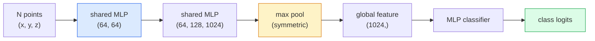

# 3D Vision — Point Clouds & NeRFs

> 3D vision comes in two flavours. Point clouds are the sensor's raw output. NeRFs are the learned volumetric field. Both answer "what is where in space."

**Type:** Learn + Build
**Languages:** Python
**Prerequisites:** Phase 4 Lesson 03 (CNNs), Phase 1 Lesson 12 (Tensor Operations)
**Time:** ~45 minutes

## Learning Objectives

- Distinguish explicit (point cloud, mesh, voxel) and implicit (signed distance field, NeRF) 3D representations and when each is used
- Understand PointNet's symmetric-function trick that makes a neural network permutation-invariant over an unordered set of points
- Trace a NeRF forward pass: ray casting, volumetric rendering, positional encoding, MLP density+colour head
- Use `nerfstudio` or `instant-ngp` for pretrained 3D reconstruction from a small set of posed images

## The Problem

A camera produces a 2D image. A LIDAR produces a set of 3D points with no ordering. A structure-from-motion pipeline produces a sparse cloud of 3D keypoints. A NeRF reconstructs an entire 3D scene from a handful of posed images. All of these are "vision" but none of them look like the dense tensor a CNN wants.

3D vision matters because almost every high-value robot task runs in 3D: grasping, obstacle avoidance, navigation, AR occlusion, 3D content capture. A vision engineer who only understands 2D images is locked out of the fastest-growing slice of the field (AR/VR content, robotics, autonomous driving stacks, NeRF-based 3D reconstruction for real-estate or construction).

The two representations dominate for different reasons. Point clouds are what sensors give you for free. NeRFs and their successors (3D Gaussian splatting, neural SDFs) are what you get when you ask a neural network to learn a scene.

## The Concept

### Point clouds

A point cloud is an unordered set of N points in R^3, optionally each with features (colour, intensity, normal).

```
cloud = [
  (x1, y1, z1, r1, g1, b1),
  (x2, y2, z2, r2, g2, b2),
  ...
  (xN, yN, zN, rN, gN, bN),
]
```

No grid, no connectivity. Two properties make this hard for neural networks:

- **Permutation invariance** — the output must not depend on point order.
- **Variable N** — a single model must handle clouds of different sizes.

PointNet (Qi et al., 2017) solved both with one idea: apply a shared MLP to every point, then aggregate with a symmetric function (max pool). The result is a fixed-size vector that does not depend on order.

```
f(P) = max_{p in P} MLP(p)
```

This is the entire core of PointNet. Deeper variants (PointNet++, Point Transformer) add hierarchical sampling and local aggregation but the symmetric-function trick is unchanged.

### The PointNet architecture



"Shared MLP" means the same MLP runs on every point independently. Implemented as a 1x1 conv over the point dimension for efficiency.

### Neural Radiance Fields (NeRFs)

NeRFs (Mildenhall et al., 2020) took the question "can we reconstruct a 3D scene from N photos?" and answered with a neural network that is the scene. The network maps `(x, y, z, viewing_direction)` to `(density, colour)`. Rendering a new view is a ray-casting loop over this network.

```
NeRF MLP:  (x, y, z, theta, phi) -> (sigma, r, g, b)

To render a pixel (u, v) of a new view:
  1. Cast a ray from the camera through pixel (u, v)
  2. Sample points along the ray at distances t_1, t_2, ..., t_N
  3. Query the MLP at each point
  4. Composite the colours weighted by (1 - exp(-sigma * dt))
  5. The sum is the rendered pixel colour
```

A loss compares the rendered pixel to the ground-truth pixel in the training photos. Backprop through the rendering step updates the MLP. No 3D ground truth, no explicit geometry — the scene is stored in the MLP weights.

### Positional encoding in NeRF

A vanilla MLP on `(x, y, z)` cannot represent high-frequency details because MLPs are spectrally biased toward low frequencies. NeRF fixes this by encoding each coordinate into a Fourier feature vector before the MLP:

```
gamma(p) = (sin(2^0 pi p), cos(2^0 pi p), sin(2^1 pi p), cos(2^1 pi p), ...)
```

Up to L=10 frequency levels. This is the same trick transformers use for positions, and it appears again in diffusion time conditioning (Lesson 10). Without it, NeRFs look blurry.

### Volumetric rendering

```
C(r) = sum_i T_i * (1 - exp(-sigma_i * delta_i)) * c_i

T_i  = exp(- sum_{j<i} sigma_j * delta_j)
delta_i = t_{i+1} - t_i
```

`T_i` is transmittance — how much light survives to point i. `(1 - exp(-sigma_i * delta_i))` is the opacity at point i. `c_i` is the colour. The final pixel is a weighted sum along the ray.

### What replaced NeRFs

Pure NeRFs are slow to train (hours) and slow to render (seconds per image). The lineage since:

- **Instant-NGP** (2022) — hash-grid encoding replaces the MLP's position input; trains in seconds.
- **Mip-NeRF 360** — handles unbounded scenes and anti-aliasing.
- **3D Gaussian Splatting** (2023) — replaces the volumetric field with millions of 3D Gaussians; trains in minutes, renders in real time. The current production default.

Almost every real NeRF product in 2026 is actually 3D Gaussian splatting. The mental model is still NeRF.

### Datasets and benchmarks

- **ShapeNet** — classification and segmentation of 3D CAD models as point clouds.
- **ScanNet** — real indoor scans for segmentation.
- **KITTI** — outdoor LIDAR point clouds for autonomous driving.
- **NeRF Synthetic** / **Blended MVS** — posed-image datasets for view synthesis.
- **Mip-NeRF 360** dataset — unbounded real scenes.

## Build It

### Step 1: PointNet classifier

```python
import torch
import torch.nn as nn

class PointNet(nn.Module):
    def __init__(self, num_classes=10):
        super().__init__()
        self.mlp1 = nn.Sequential(
            nn.Conv1d(3, 64, 1),    nn.BatchNorm1d(64),   nn.ReLU(inplace=True),
            nn.Conv1d(64, 64, 1),   nn.BatchNorm1d(64),   nn.ReLU(inplace=True),
        )
        self.mlp2 = nn.Sequential(
            nn.Conv1d(64, 128, 1),  nn.BatchNorm1d(128),  nn.ReLU(inplace=True),
            nn.Conv1d(128, 1024, 1), nn.BatchNorm1d(1024), nn.ReLU(inplace=True),
        )
        self.head = nn.Sequential(
            nn.Linear(1024, 512),   nn.BatchNorm1d(512),  nn.ReLU(inplace=True),
            nn.Dropout(0.3),
            nn.Linear(512, 256),    nn.BatchNorm1d(256),  nn.ReLU(inplace=True),
            nn.Dropout(0.3),
            nn.Linear(256, num_classes),
        )

    def forward(self, x):
        # x: (N, 3, num_points) — transposed for Conv1d
        x = self.mlp1(x)
        x = self.mlp2(x)
        x = torch.max(x, dim=-1)[0]       # (N, 1024)
        return self.head(x)

pts = torch.randn(4, 3, 1024)
net = PointNet(num_classes=10)
print(f"output: {net(pts).shape}")
print(f"params: {sum(p.numel() for p in net.parameters()):,}")
```

About 1.6M parameters. Runs on 1,024 points per cloud.

### Step 2: Positional encoding

```python
def positional_encoding(x, L=10):
    """
    x: (..., D) -> (..., D * 2 * L)
    """
    freqs = 2.0 ** torch.arange(L, dtype=x.dtype, device=x.device)
    args = x.unsqueeze(-1) * freqs * 3.141592653589793
    sinc = torch.cat([args.sin(), args.cos()], dim=-1)
    return sinc.reshape(*x.shape[:-1], -1)

x = torch.randn(5, 3)
y = positional_encoding(x, L=10)
print(f"input:  {x.shape}")
print(f"encoded: {y.shape}     # (5, 60)")
```

Multiplying by `2^l * pi` gives progressively higher frequencies.

### Step 3: Tiny NeRF MLP

```python
class TinyNeRF(nn.Module):
    def __init__(self, L_pos=10, L_dir=4, hidden=128):
        super().__init__()
        self.L_pos = L_pos
        self.L_dir = L_dir
        pos_dim = 3 * 2 * L_pos
        dir_dim = 3 * 2 * L_dir
        self.trunk = nn.Sequential(
            nn.Linear(pos_dim, hidden), nn.ReLU(inplace=True),
            nn.Linear(hidden, hidden),  nn.ReLU(inplace=True),
            nn.Linear(hidden, hidden),  nn.ReLU(inplace=True),
            nn.Linear(hidden, hidden),  nn.ReLU(inplace=True),
        )
        self.sigma = nn.Linear(hidden, 1)
        self.color = nn.Sequential(
            nn.Linear(hidden + dir_dim, hidden // 2), nn.ReLU(inplace=True),
            nn.Linear(hidden // 2, 3), nn.Sigmoid(),
        )

    def forward(self, x, d):
        x_enc = positional_encoding(x, self.L_pos)
        d_enc = positional_encoding(d, self.L_dir)
        h = self.trunk(x_enc)
        sigma = torch.relu(self.sigma(h)).squeeze(-1)
        rgb = self.color(torch.cat([h, d_enc], dim=-1))
        return sigma, rgb

nerf = TinyNeRF()
x = torch.randn(128, 3)
d = torch.randn(128, 3)
s, c = nerf(x, d)
print(f"sigma: {s.shape}   rgb: {c.shape}")
```

Tiny compared to the original NeRF (which has 2 MLP trunks of depth 8). Enough to demonstrate the architecture.

### Step 4: Volumetric rendering along a ray

```python
def volumetric_render(sigma, rgb, t_vals):
    """
    sigma: (..., N_samples)
    rgb:   (..., N_samples, 3)
    t_vals: (N_samples,) distances along the ray
    """
    delta = torch.cat([t_vals[1:] - t_vals[:-1], torch.full_like(t_vals[:1], 1e10)])
    alpha = 1.0 - torch.exp(-sigma * delta)
    trans = torch.cumprod(torch.cat([torch.ones_like(alpha[..., :1]), 1.0 - alpha + 1e-10], dim=-1), dim=-1)[..., :-1]
    weights = alpha * trans
    rendered = (weights.unsqueeze(-1) * rgb).sum(dim=-2)
    depth = (weights * t_vals).sum(dim=-1)
    return rendered, depth, weights


N = 64
t_vals = torch.linspace(2.0, 6.0, N)
sigma = torch.rand(N) * 0.5
rgb = torch.rand(N, 3)
rendered, depth, weights = volumetric_render(sigma, rgb, t_vals)
print(f"rendered colour: {rendered.tolist()}")
print(f"depth:           {depth.item():.2f}")
```

一条光线，64 个样本，合成为单个 RGB 像素和深度。

## 使用它

对于实际工作：

- `nerfstudio` (Tancik 等人) — NeRF / Instant-NGP / Gaussian Splatting 的当前参考库。命令行加网络查看器。
- `pytorch3d` (元) — 可微分渲染、点云实用程序、网格操作。
- `open3d` — 点云处理、配准、可视化。

在部署方面，3D 高斯泼溅已在很大程度上取代了纯 NeRF，因为它的渲染速度快了 100 倍。重建质量具有可比性。

## 发货

本课产生：

- `outputs/prompt-3d-task-router.md` — 根据任务和输入数据路由到正确的 3D 表示（点云、网格、体素、NeRF、高斯分布）的提示。
- `outputs/skill-point-cloud-loader.md` — 一项为 .ply / .pcd / .xyz 文件编写 PyTorch “数据集”的技能，具有正确的标准化、居中和点采样。

## 练习

1. **（简单）** 证明 PointNet 是排列不变的：将同一个云运行两次，一次对点进行打乱。验证输出在浮点噪声范围内是否相同。
2. **（中）** 实现最小光线生成函数，根据给定的相机内在特性和姿态，为 H x W 图像的每个像素生成光线原点和方向。
3. **（困难）** 在彩色立方体渲染视图的合成数据集（通过可微渲染或简单的光线追踪器生成）上训练 TinyNeRF。报告第 1、10 和 100 个时期的渲染损失。模型在哪个时期产生可识别的视图？

## 关键术语

|术语 |人们怎么说 |它实际上意味着什么 |
|------|----------------|----------------------|
|点云| “来自 LIDAR 的 3D 点”|无序集合 (x, y, z) + 每个点的可选特征 |
|点网| “第一个点云神经网络”|每点共享 MLP + 对称（最大）池；通过构造排列不变 |
|内尔夫| “MLP就是现场”|网络映射（x，y，z，dir）到（密度，颜色）；通过光线投射渲染 |
|位置编码 | “傅里叶特征” |将每个坐标编码为多个频率的 sin/cos，以克服 MLP 低频偏差 |
|体积渲染| “射线集成”|使用透射率和 Alpha 沿光线将样本合成为单个像素 |
|即时 NGP | “哈希网格 NeRF” |用多分辨率哈希网格替换 NeRF 的坐标 MLP；快 100-1000 倍 |
| 3D 高斯喷射 | “百万高斯”|场景 = 3D 高斯集合；实时渲染，几分钟内训练 |
|自卫队| “有符号距离场”|返回到最近表面的有符号距离的函数；另一种隐式表示 |

## 进一步阅读

- [PointNet (Qi et al., 2017)](https://arxiv.org/abs/1612.00593) — 排列不变分类器
- [NeRF (Mildenhall et al., 2020)](https://arxiv.org/abs/2003.08934) — 这篇论文将照片的 3D 重建变成了一个神经网络问题
- [Instant-NGP (Müller et al., 2022)](https://arxiv.org/abs/2201.05989) — 哈希网格，加速 1000 倍
- [3D Gaussian Splatting (Kerbl et al., 2023)](https://arxiv.org/abs/2308.04079) — 在生产中取代 NeRF 的架构
