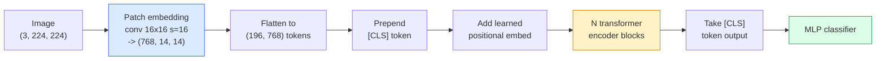

# Vision Transformers (ViT)

> Cut the image into patches, treat each patch as a word, run a standard transformer. Don't look back.

**Type:** Build
**Languages:** Python
**Prerequisites:** Phase 7 Lesson 02 (Self-Attention), Phase 4 Lesson 04 (Image Classification)
**Time:** ~45 minutes

## Learning Objectives

- Implement patch embedding, learned positional embedding, class token, and transformer encoder blocks from scratch to build a minimal ViT
- Explain why ViT was thought to need massive pretraining data until DeiT and MAE proved otherwise
- Compare ViT, Swin, and ConvNeXt on their architectural priors (none, local window attention, conv backbone)
- Fine-tune a pretrained ViT on a small dataset using `timm` and the standard linear-probe / fine-tune recipe

## The Problem

For a decade, convolution was synonymous with computer vision. CNNs had strong inductive biases — locality, translation equivariance — that nobody thought you could replace. Then Dosovitskiy et al. (2020) showed that a plain transformer applied to flattened image patches, with no convolutional machinery at all, could match or beat the best CNNs at scale.

The catch was "at scale." ViT on ImageNet-1k lost to ResNet. ViT pretrained on ImageNet-21k or JFT-300M then fine-tuned on ImageNet-1k beat it. The conclusion was that transformers lacked useful priors but could learn them from enough data. Subsequent work (DeiT, MAE, DINO) showed that with the right training recipes — strong augmentation, self-supervised pretraining, distillation — ViTs train fine on small data too.

By 2026, pure CNNs are still competitive on edge devices (ConvNeXt is the strongest), but transformers dominate everything else: segmentation (Mask2Former, SegFormer), detection (DETR, RT-DETR), multimodal (CLIP, SigLIP), video (VideoMAE, VJEPA). The ViT block structure is the one to know.

## The Concept

### The pipeline



Seven steps. Patches -> tokens -> attention -> classifier. Every variant (DeiT, Swin, ConvNeXt, MAE pretraining) changes one or two of the seven and leaves the rest alone.

### Patch embedding

The first conv is the secret. Kernel size 16, stride 16, so a 224x224 image becomes a 14x14 grid of 16x16 patches, each projected to a 768-dim embedding. That single conv both patchifies and linearly projects.

```
Input:  (3, 224, 224)
Conv (3 -> 768, k=16, s=16, no padding):
Output: (768, 14, 14)
Flatten spatial: (196, 768)
```

196 patches = 196 tokens. Each token's feature dimension is 768 (ViT-B), 1024 (ViT-L), or 1280 (ViT-H).

### Class token

A single learned vector prepended to the sequence:

```
tokens = [CLS; patch_1; patch_2; ...; patch_196]   shape (197, 768)
```

After N transformer blocks, the `[CLS]` output is the global image representation. Classification head reads only this one vector.

### Positional embedding

Transformers have no built-in notion of spatial position. Add a learned vector to every token:

```
tokens = tokens + learned_pos_embedding   (also shape (197, 768))
```

The embedding is a parameter of the model; gradient-based training adapts it to 2D image structure. Sinusoidal 2D alternatives exist but are rarely used in practice.

### Transformer encoder block

Standard. Multi-head self-attention, MLP, residual connections, pre-LayerNorm.

```
x = x + MSA(LN(x))
x = x + MLP(LN(x))

MLP is two-layer with GELU: Linear(d -> 4d) -> GELU -> Linear(4d -> d)
```

ViT-B/16 stacks 12 of these blocks, each with 12 attention heads, totalling 86M parameters.

### Why pre-LN

Early transformers used post-LN (`x = LN(x + sublayer(x))`) and struggled to train past 6-8 layers without warmup. Pre-LN (`x = x + sublayer(LN(x))`) trains deeper networks stably without warmup. Every ViT and every modern LLM uses pre-LN.

### Patch size trade-off

- 16x16 patches -> 196 tokens, standard.
- 32x32 patches -> 49 tokens, faster but lower resolution.
- 8x8 patches -> 784 tokens, finer but O(n^2) attention cost scales badly.

Bigger patches = fewer tokens = faster but less spatial detail. SwinV2 uses 4x4 patches in hierarchical windows.

### DeiT's recipe for training ViT on ImageNet-1k

The original ViT needed JFT-300M to beat CNNs. DeiT (Touvron et al., 2020) trained ViT-B to 81.8% top-1 on ImageNet-1k alone with four changes:

1. Heavy augmentation: RandAugment, Mixup, CutMix, Random Erasing.
2. Stochastic depth (drop entire blocks at random during training).
3. Repeated augmentation (same image sampled 3 times per batch).
4. Distillation from a CNN teacher (optional, lifts accuracy further).

Every modern ViT training recipe descends from DeiT.

### Swin vs ConvNeXt

- **Swin** (Liu et al., 2021) — window-based attention. Each block attends within a local window; alternating blocks shift the window to mix information across windows. Brings back a CNN-like locality prior while keeping the attention operator.
- **ConvNeXt** (Liu et al., 2022) — redesigned CNN that matches Swin's architecture choices (depthwise convs, LayerNorm, GELU, inverted bottleneck). Showed that the gap is not "attention vs convolution" but "modern training recipe + architecture."

In 2026, ConvNeXt-V2 and Swin-V2 are both production-grade; the right choice depends on your inference stack (ConvNeXt compiles better for edge) and pretraining corpus.

### MAE pretraining

Masked Autoencoder (He et al., 2022): mask 75% of patches at random, train the encoder to process only the visible 25%, train a small decoder to reconstruct the masked patches from the encoder's output. After pretraining, discard the decoder and fine-tune the encoder.

MAE makes ViT trainable on ImageNet-1k alone, hits SOTA, and is the current default self-supervised recipe.

## Build It

### Step 1: Patch embedding

```python
import torch
import torch.nn as nn

class PatchEmbedding(nn.Module):
    def __init__(self, in_channels=3, patch_size=16, dim=192, image_size=64):
        super().__init__()
        assert image_size % patch_size == 0
        self.proj = nn.Conv2d(in_channels, dim, kernel_size=patch_size, stride=patch_size)
        num_patches = (image_size // patch_size) ** 2
        self.num_patches = num_patches

    def forward(self, x):
        x = self.proj(x)
        return x.flatten(2).transpose(1, 2)
```

One conv, one flatten, one transpose. That is the entire image-to-tokens step.

### Step 2: Transformer block

Pre-LN, multi-head self-attention, MLP with GELU, residual connections.

```python
class Block(nn.Module):
    def __init__(self, dim, num_heads, mlp_ratio=4, dropout=0.0):
        super().__init__()
        self.ln1 = nn.LayerNorm(dim)
        self.attn = nn.MultiheadAttention(dim, num_heads, dropout=dropout, batch_first=True)
        self.ln2 = nn.LayerNorm(dim)
        self.mlp = nn.Sequential(
            nn.Linear(dim, dim * mlp_ratio),
            nn.GELU(),
            nn.Dropout(dropout),
            nn.Linear(dim * mlp_ratio, dim),
            nn.Dropout(dropout),
        )

    def forward(self, x):
        a, _ = self.attn(self.ln1(x), self.ln1(x), self.ln1(x), need_weights=False)
        x = x + a
        x = x + self.mlp(self.ln2(x))
        return x
```

`nn.MultiheadAttention` handles the splitting into heads, the scaled dot-product, and the output projection. `batch_first=True` so shapes are `(N, seq, dim)`.

### Step 3: The ViT

```python
class ViT(nn.Module):
    def __init__(self, image_size=64, patch_size=16, in_channels=3,
                 num_classes=10, dim=192, depth=6, num_heads=3, mlp_ratio=4):
        super().__init__()
        self.patch = PatchEmbedding(in_channels, patch_size, dim, image_size)
        num_patches = self.patch.num_patches
        self.cls_token = nn.Parameter(torch.zeros(1, 1, dim))
        self.pos_embed = nn.Parameter(torch.zeros(1, num_patches + 1, dim))
        self.blocks = nn.ModuleList([
            Block(dim, num_heads, mlp_ratio) for _ in range(depth)
        ])
        self.ln = nn.LayerNorm(dim)
        self.head = nn.Linear(dim, num_classes)
        nn.init.trunc_normal_(self.pos_embed, std=0.02)
        nn.init.trunc_normal_(self.cls_token, std=0.02)

    def forward(self, x):
        x = self.patch(x)
        cls = self.cls_token.expand(x.size(0), -1, -1)
        x = torch.cat([cls, x], dim=1)
        x = x + self.pos_embed
        for blk in self.blocks:
            x = blk(x)
        x = self.ln(x[:, 0])
        return self.head(x)

vit = ViT(image_size=64, patch_size=16, num_classes=10, dim=192, depth=6, num_heads=3)
x = torch.randn(2, 3, 64, 64)
print(f"output: {vit(x).shape}")
print(f"params: {sum(p.numel() for p in vit.parameters()):,}")
```

About 2.8M parameters — a tiny ViT tractable on CPU. Real ViT-B is 86M; same class definition with `dim=768, depth=12, num_heads=12`.

### Step 4: Sanity check — single image inference

```python
logits = vit(torch.randn(1, 3, 64, 64))
print(f"logits: {logits}")
print(f"probs:  {logits.softmax(-1)}")
```

Should run without error. Probabilities sum to 1.

## Use It

`timm` ships every ViT variant with ImageNet pretrained weights. One line:

```python
import timm

model = timm.create_model("vit_base_patch16_224", pretrained=True, num_classes=10)
```

`timm` 是 2026 年视觉 Transformer 的默认生产版本。在同一 API 下支持 ViT、DeiT、Swin、Swin-V2、ConvNeXt、ConvNeXt-V2、MaxViT、MViT、EfficientFormer 以及其他数十种。

对于多模式工作（图像+文本），“transformers”提供 CLIP、SigLIP、BLIP-2、LLaVA。所有这些中的图像编码器都是 ViT 变体。

## 发货

本课产生：

- `outputs/prompt-vit-vs-cnn-picker.md` — 根据数据集大小、计算和推理堆栈在 ViT、ConvNeXt 或 Swin 之间进行选择的提示。
- `outputs/skill-vit-patch-and-pos-embed-inspector.md` — 一项验证 ViT 的补丁嵌入和位置嵌入形状是否与模型的预期序列长度匹配的技能，捕获最常见的移植错误。

## 练习

1. **（简单）** 打印每个中间张量的形状，以便向前传递通过上面的微小 ViT。确认：输入 `(N, 3, 64, 64)` -> 修补 `(N, 16, 192)` -> 使用 CLS `(N, 17, 192)` -> 分类器输入 `(N, 192)` -> 输出 `(N, num_classes)`。
2. **（中）** 在第 4 课的合成 CIFAR 数据集上微调预训练的“timm” ViT-S/16。与对相同数据进行的 ResNet-18 微调进行比较。报告训练时间和最终准确性。
3. **（难）** 对微小的 ViT 实施 MAE 预训练：屏蔽 75% 的补丁，训练编码器 + 一个小型解码器来重建屏蔽的补丁。评估预训练前后合成数据的线性探针精度。

## 关键术语

|术语 |人们怎么说 |它实际上意味着什么 |
|------|----------------|----------------------|
|补丁嵌入| “第一次会议” |卷积核大小 = 步幅 = 补丁大小；将图像变成令牌嵌入网格 |
|类令牌 | “[CLS]”|学习到的向量添加到令牌序列之前；它的最终输出是全局图像表示 |
|位置嵌入| “学习了 pos”|添加到每个标记的学习向量，以便转换器知道每个补丁来自哪里 |
|预 LN | “子层之前的 LayerNorm”|稳定的变压器变体：`x + sublayer(LN(x))`而不是`LN(x + sublayer(x))` |
|多头关注 | “平行关注” |标准变压器注意力分为 num_heads 个独立子空间，然后连接起来 |
| ViT-B/16 | “基础，补丁 16”|规范尺寸：dim=768，深度=12，heads=12，patch_size=16，image=224； ~86M 参数 |
|德伊特 | “数据高效的 ViT”| ViT 仅在 ImageNet-1k 上进行了强增强训练；事实证明，并不严格需要大型预训练数据集 |
|梅 | “屏蔽自动编码器”|自监督预训练：屏蔽 75% 的 patch，重建；占主导地位的 ViT 预训练方法 |

## 进一步阅读

- [一张图像值得 16x16 个单词 (Dosovitskiy et al., 2020)](https://arxiv.org/abs/2010.11929) — ViT 论文
- [DeiT: Data-efficient Image Transformers (Touvron et al., 2020)](https://arxiv.org/abs/2012.12877) — 如何单独在 ImageNet-1k 上训练 ViT
- [Masked Autoencoders are Scalable Vision Learners (He et al., 2022)](https://arxiv.org/abs/2111.06377) — MAE 预训练
- [timm 文档](https://huggingface.co/docs/timm) — 您将在生产中使用的每个视觉转换器的参考
