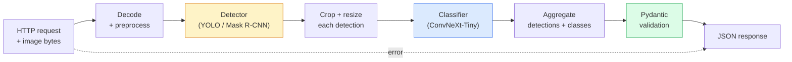

# Build a Complete Vision Pipeline — Capstone

> A production vision system is a chain of models and rules stitched with data contracts. The pieces are already in this phase; the capstone wires them together end-to-end.

**Type:** Build
**Languages:** Python
**Prerequisites:** Phase 4 Lessons 01-15
**Time:** ~120 minutes

## Learning Objectives

- Design a production vision pipeline that detects objects, classifies them, and emits structured JSON — with every failure path handled
- Plug a detector (Mask R-CNN or YOLO), a classifier (ConvNeXt-Tiny), and a data contract (Pydantic) into one service
- Benchmark the end-to-end pipeline and identify the first bottleneck (usually preprocessing, then the detector)
- Ship a minimal FastAPI service that accepts an image upload, runs the pipeline, and returns detections with classifications

## The Problem

Individual vision models are useful; vision products are chains of them. A retail shelf audit is a detector plus a product classifier plus a price-OCR pipeline. Autonomous driving is a 2D detector plus a 3D detector plus a segmenter plus a tracker plus a planner. A medical pre-screen is a segmenter plus a region classifier plus a clinician UI.

Wiring those chains is the part that separates a ML prototype from a product. Every interface between models is a new place for bugs. Every coordinate transform, every normalisation, every mask resize is a silent-failure candidate. A pipeline is as strong as its weakest interface.

This capstone sets up the minimum viable pipeline: detection + classification + structured output + a serving layer. Everything else in Phase 4 slots into this skeleton: swap Mask R-CNN for YOLOv8, add a OCR head, add a segmentation branch, add a tracker. The architecture is stable; the pieces are pluggable.

## The Concept

### The pipeline



Seven stages. The two model stages are expensive; the five other stages are where the bugs live.

### Data contracts with Pydantic

Every model boundary becomes a typed object. This turns silent failures into loud ones.

```
Detection(
    box: tuple[float, float, float, float],   # (x1, y1, x2, y2), absolute pixels
    score: float,                              # [0, 1]
    class_id: int,                             # from detector's label map
    mask: Optional[list[list[int]]],           # RLE-encoded if present
)

PipelineResult(
    image_id: str,
    detections: list[Detection],
    classifications: list[Classification],
    inference_ms: float,
)
```

When a detector returns boxes in `(cx, cy, w, h)` instead of `(x1, y1, x2, y2)`, Pydantic's validation fails at the boundary and you find out immediately instead of debugging a downstream crop that silently returns empty regions.

### Where latency goes

Three truths hold in nearly every vision pipeline:

1. **Preprocessing is often the biggest single block.** Decoding JPEGs, converting colour spaces, resizing — these are CPU-bound and easy to forget.
2. **The detector dominates GPU time.** 70-90% of GPU time is in the detection forward pass.
3. **Postprocessing (NMS, RLE encode/decode) is cheap on GPU, expensive on CPU.** Always profile with the actual target.

Knowing the distribution is what turns optimisation into a prioritised list.

### Failure modes

- **Empty detections** — return empty list, do not crash. Log.
- **Out-of-bounds boxes** — clamp to image size before cropping.
- **Tiny crops** — skip classification for boxes smaller than the classifier's minimum input.
- **Corrupt upload** — 400 response with a specific error code, not 500.
- **Model load failure** — fail at service startup, not at first request.

A production pipeline handles each of these without writing generic `try/except` that hides the failure. Every failure gets a named code and a response.

### Batching

A production service serves multiple clients. Batching detections and classifications across requests multiplies throughput. The trade-off: extra latency from waiting for a batch to fill. Typical setup: collect requests for up to 20ms, batch together, process, distribute responses. `torchserve` and `triton` do this natively; small services with predictable load roll their own micro-batcher.

## Build It

### Step 1: Data contracts

```python
from pydantic import BaseModel, Field
from typing import List, Optional, Tuple

class Detection(BaseModel):
    box: Tuple[float, float, float, float]
    score: float = Field(ge=0, le=1)
    class_id: int = Field(ge=0)
    mask_rle: Optional[str] = None


class Classification(BaseModel):
    detection_index: int
    class_id: int
    class_name: str
    score: float = Field(ge=0, le=1)


class PipelineResult(BaseModel):
    image_id: str
    detections: List[Detection]
    classifications: List[Classification]
    inference_ms: float
```

Five seconds of code saves an hour of debugging on any serious pipeline.

### Step 2: A minimal Pipeline class

```python
import time
import numpy as np
import torch
from PIL import Image

class VisionPipeline:
    def __init__(self, detector, classifier, class_names,
                 device="cpu", min_crop=32):
        self.detector = detector.to(device).eval()
        self.classifier = classifier.to(device).eval()
        self.class_names = class_names
        self.device = device
        self.min_crop = min_crop

    def preprocess(self, image):
        """
        image: PIL.Image or np.ndarray (H, W, 3) uint8
        returns: CHW float tensor on device
        """
        if isinstance(image, Image.Image):
            image = np.asarray(image.convert("RGB"))
        tensor = torch.from_numpy(image).permute(2, 0, 1).float() / 255.0
        return tensor.to(self.device)

    @torch.no_grad()
    def detect(self, image_tensor):
        return self.detector([image_tensor])[0]

    @torch.no_grad()
    def classify(self, crops):
        if len(crops) == 0:
            return []
        batch = torch.stack(crops).to(self.device)
        logits = self.classifier(batch)
        probs = logits.softmax(-1)
        scores, cls = probs.max(-1)
        return list(zip(cls.tolist(), scores.tolist()))

    def run(self, image, image_id="anonymous"):
        t0 = time.perf_counter()
        tensor = self.preprocess(image)
        det = self.detect(tensor)

        crops = []
        detections = []
        valid_indices = []
        for i, (box, score, cls) in enumerate(zip(det["boxes"], det["scores"], det["labels"])):
            x1, y1, x2, y2 = [max(0, int(b)) for b in box.tolist()]
            x2 = min(x2, tensor.shape[-1])
            y2 = min(y2, tensor.shape[-2])
            detections.append(Detection(
                box=(x1, y1, x2, y2),
                score=float(score),
                class_id=int(cls),
            ))
            if (x2 - x1) < self.min_crop or (y2 - y1) < self.min_crop:
                continue
            crop = tensor[:, y1:y2, x1:x2]
            crop = torch.nn.functional.interpolate(
                crop.unsqueeze(0),
                size=(224, 224),
                mode="bilinear",
                align_corners=False,
            )[0]
            crops.append(crop)
            valid_indices.append(i)

        class_preds = self.classify(crops)

        classifications = []
        for valid_idx, (cls_id, cls_score) in zip(valid_indices, class_preds):
            classifications.append(Classification(
                detection_index=valid_idx,
                class_id=int(cls_id),
                class_name=self.class_names[cls_id],
                score=float(cls_score),
            ))

        return PipelineResult(
            image_id=image_id,
            detections=detections,
            classifications=classifications,
            inference_ms=(time.perf_counter() - t0) * 1000,
        )
```

Every interface is typed. Every failure path has a specific handling decision.

### Step 3: Wire a detector and a classifier

```python
from torchvision.models.detection import maskrcnn_resnet50_fpn_v2
from torchvision.models import convnext_tiny

# Use ImageNet-pretrained weights for a realistic pipeline without training
detector = maskrcnn_resnet50_fpn_v2(weights="DEFAULT")
classifier = convnext_tiny(weights="DEFAULT")
class_names = [f"imagenet_class_{i}" for i in range(1000)]

pipe = VisionPipeline(detector, classifier, class_names)

# Smoke test with a synthetic image
test_image = (np.random.rand(400, 600, 3) * 255).astype(np.uint8)
result = pipe.run(test_image, image_id="demo")
print(result.model_dump_json(indent=2)[:500])
```

### Step 4: FastAPI service

```python
from fastapi import FastAPI, UploadFile, HTTPException
from io import BytesIO

app = FastAPI()
pipe = None  # initialised on startup

@app.on_event("startup")
def load():
    global pipe
    detector = maskrcnn_resnet50_fpn_v2(weights="DEFAULT").eval()
    classifier = convnext_tiny(weights="DEFAULT").eval()
    pipe = VisionPipeline(detector, classifier, class_names=[f"c{i}" for i in range(1000)])

@app.post("/detect")
async def detect_endpoint(file: UploadFile):
    if file.content_type not in {"image/jpeg", "image/png", "image/webp"}:
        raise HTTPException(status_code=400, detail="unsupported image type")
    data = await file.read()
    try:
        img = Image.open(BytesIO(data)).convert("RGB")
    except Exception:
        raise HTTPException(status_code=400, detail="cannot decode image")
    result = pipe.run(img, image_id=file.filename or "upload")
    return result.model_dump()
```

Run with `uvicorn main:app --host 0.0.0.0 --port 8000`. Test with `curl -F 'file=@dog.jpg' http://localhost:8000/detect`.

### Step 5: Benchmark the pipeline

```python
import time

def benchmark(pipe, num_runs=20, image_size=(400, 600)):
    img = (np.random.rand(*image_size, 3) * 255).astype(np.uint8)
    pipe.run(img)  # warm up

    stages = {"preprocess": [], "detect": [], "classify": [], "total": []}
    for _ in range(num_runs):
        t0 = time.perf_counter()
        tensor = pipe.preprocess(img)
        t1 = time.perf_counter()
        det = pipe.detect(tensor)
        t2 = time.perf_counter()
        crops = []
        for box in det["boxes"]:
            x1, y1, x2, y2 = [max(0, int(b)) for b in box.tolist()]
            x2 = min(x2, tensor.shape[-1])
            y2 = min(y2, tensor.shape[-2])
            if (x2 - x1) >= pipe.min_crop and (y2 - y1) >= pipe.min_crop:
                crop = tensor[:, y1:y2, x1:x2]
                crop = torch.nn.functional.interpolate(
                    crop.unsqueeze(0), size=(224, 224), mode="bilinear", align_corners=False
                )[0]
                crops.append(crop)
        pipe.classify(crops)
        t3 = time.perf_counter()
        stages["preprocess"].append((t1 - t0) * 1000)
        stages["detect"].append((t2 - t1) * 1000)
        stages["classify"].append((t3 - t2) * 1000)
        stages["total"].append((t3 - t0) * 1000)

    for stage, times in stages.items():
        times.sort()
        print(f"{stage:12s}  p50={times[len(times)//2]:7.1f} ms  p95={times[int(len(times)*0.95)]:7.1f} ms")
```

CPU 上的典型输出：预处理约 3 毫秒，检测 300-500 毫秒，分类 20-40 毫秒，总计 350-550 毫秒。在 GPU 上，检测时间为 20-40 毫秒，相对而言，预处理 + 分类开始变得更重要。

## 使用它

生产模板收敛于相同的结构，此外：

- **模型版本控制** — 始终在响应中记录模型名称和权重哈希。
- **每个请求跟踪 ID** — 记录每个请求的每个阶段计时，以便您可以将缓慢响应与阶段相关联。
- **后备路径** — 如果分类器超时，则返回没有分类的检测结果，而不是使整个请求失败。
- **安全过滤器** — NSFW / PII 过滤器在分类后、响应离开服务之前运行。
- **批处理端点** — `/detect_batch` 接受图像 URL 列表以进行批量处理。

对于生产服务，“torchserve”、“Triton Inference Server”和“BentoML”可以开箱即用地处理批处理、版本控制、指标和运行状况检查。直接运行“FastAPI”对于原型和小型产品来说是很好的。

## 发货

本课产生：

- `outputs/prompt-vision-service-shape-reviewer.md` — 一个提示，用于检查视觉服务代码是否存在契约/响应形状违规，并命名第一个严重错误。
- `outputs/skill-pipeline-budget-planner.md` — 一项技能，在给定目标延迟和吞吐量的情况下，为每个管道阶段分配时间预算，并标记哪个阶段将首先错过其预算。

## 练习

1. **（简单）** 对来自任何开放数据集的 10 个图像运行管道。报告每个阶段的平均时间和每个图像的检测计数分布。
2. **（中）** 将掩码输出字段添加到“Detection”并将其编码为 RLE。验证 JSON 是否保持在 1MB 以下，即使对于 10 个对象的图像也是如此。
3. **（困难）** 在分类器前面添加一个微批处理程序：收集最多 10 毫秒的农作物，在一次 GPU 调用中对它们进行分类，按请求返回结果。测量每秒 5 个并发请求的吞吐量增益以及增加的延迟。

## 关键术语

|术语 |人们怎么说 |它实际上意味着什么 |
|------|----------------|----------------------|
|管道| 「系统」|预处理、推理和后处理步骤的有序链，每对之间都有一个类型化接口 |
|数据合同| “架构” |每个阶段输入和输出都符合的 Pydantic / 数据类定义；捕获边界处的集成错误 |
|预处理 | “模特之前”|解码、颜色转换、调整大小、标准化；通常是最大的CPU时间消耗|
|后处理| 《模特之后》| NMS、掩模调整大小、阈值、RLE 编码； GPU 便宜，CPU 昂贵 |
|微量配料机| “收集然后转发”|聚合器等待多个请求的固定窗口，运行单个批量前向传递 |
|跟踪 ID | “请求 ID”|每个阶段都会记录每个请求标识符，因此可以端到端地跟踪缓慢的请求 |
|故障代码| “命名错误” |每个故障类别的特定错误代码而不是通用的 500；启用客户端重试逻辑 |
|健康检查| “准备就绪探针” |报告服务是否可以应答的廉价端点；负载均衡器依赖于此 |

## 进一步阅读

- [全栈深度学习 — 部署模型](https://fullstackdeeplearning.com/course/2022/lecture-5-deployment/) — 生产 ML 部署的规范概述
- [BentoML 文档](https://docs.bentoml.com) — 具有批处理、版本控制和指标的服务框架
- [torchserve 文档](https://pytorch.org/serve/) — PyTorch 的官方服务库
- [NVIDIA Triton 推理服务器](https://developer.nvidia.com/triton-inference-server) — 具有批处理和多模型支持的高吞吐量服务
