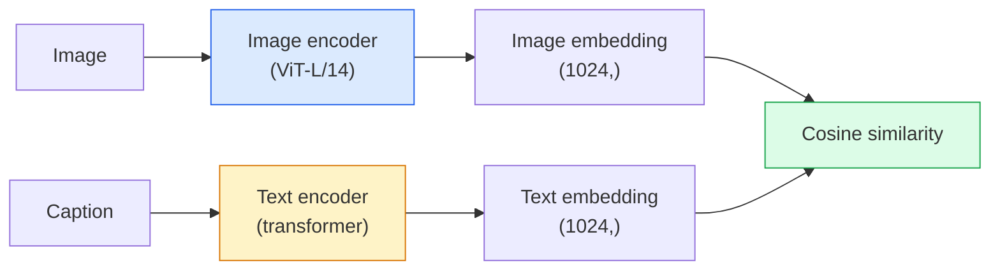

# Open-Vocabulary Vision — CLIP

> Train an image encoder and a text encoder together so that matching (image, caption) pairs land at the same point in a shared space. That is the whole trick.

**Type:** Build + Use
**Languages:** Python
**Prerequisites:** Phase 4 Lesson 14 (ViT), Phase 4 Lesson 17 (Self-Supervised)
**Time:** ~45 minutes

## Learning Objectives

- Explain CLIP's two-tower architecture and contrastive training objective
- Use a pretrained CLIP (or SigLIP) for zero-shot classification without any task-specific training
- Implement zero-shot classification from scratch: encode class prompts, compute cosine similarity, take argmax
- Distinguish CLIP, SigLIP, OpenCLIP, and LLaVA/LLaMA-vision models — what each is for in 2026

## The Problem

Traditional classifiers are closed-vocabulary: a 1000-class ImageNet model can only predict 1000 labels. Every new category requires labelled data and a retrained head.

CLIP (Radford et al., OpenAI 2021) showed that training on 400M (image, caption) pairs scraped from the web produces a model that can classify into any set of categories at inference, described purely in natural language. You give it a new class by writing a sentence.

That capability — zero-shot transfer — is why every modern vision system starts with a CLIP-family checkpoint. Detection (Grounding DINO, OWL-ViT), segmentation (CLIPSeg, SAM), retrieval, content moderation, VLMs, and text-to-image generation all build on CLIP-style joint embeddings.

## The Concept

### Two towers



Both encoders end with a linear projection to the same embedding dimension (512 for CLIP-B/32, 1024 for CLIP-L/14). L2-normalise and compute cosine similarity.

### The objective

Given a batch of N (image, caption) pairs, build an NxN similarity matrix. Train both encoders so the diagonal (matching pairs) has high similarity and off-diagonals (non-matching) have low similarity.

```
sim_matrix = image_embeddings @ text_embeddings.T / tau

loss_i2t = cross_entropy(sim_matrix,       targets=arange(N))
loss_t2i = cross_entropy(sim_matrix.T,     targets=arange(N))
loss = (loss_i2t + loss_t2i) / 2
```

Symmetric because both image-to-text and text-to-image retrieval should work. `tau` (temperature) is typically learned as a scalar parameter, initialised to 0.07.

### SigLIP: a better loss

SigLIP (Zhai et al., 2023) replaced the softmax with per-pair sigmoid:

```
loss = mean over pairs of log(1 + exp(-y_ij * sim_ij))
y_ij = +1 if matching, -1 otherwise
```

Per-pair loss removes the batch-level normalisation that CLIP requires. SigLIP trains better at small batch sizes and matches or exceeds CLIP at equal data.

### Zero-shot classification

Given a trained CLIP:

1. For each class, compose a prompt: "a photo of a {class}".
2. Encode all class prompts with the text encoder -> `T` shape (C, d).
3. Encode the test image -> `I` shape (1, d).
4. Similarity = `I @ T.T` shape (1, C).
5. Argmax -> predicted class.

Prompt engineering matters. OpenAI published 80 prompt templates for ImageNet ("a photo of a {}", "a blurry photo of a {}", "a sketch of a {}", ...). Average the embeddings of all templates per class for an extra 1-3% top-1 accuracy.

### Where CLIP-style models are used in 2026

- **Zero-shot classification** — direct use.
- **Image retrieval** — encode all images once, embed query at inference.
- **Text-conditioned detection** — Grounding DINO, OWL-ViT wrap a CLIP text tower around a detector.
- **Text-conditioned segmentation** — CLIPSeg; SAM uses text-prompt inputs via CLIP.
- **VLMs** — LLaVA, Qwen-VL, InternVL wire a CLIP-family vision encoder into an LLM.
- **Text-to-image gen** — Stable Diffusion, DALL-E 3 condition on CLIP text embeddings.

Once you have a shared embedding space, every vision+language task becomes a distance computation.

## Build It

### Step 1: A tiny two-tower model

Real CLIP is ViT + transformer. For this lesson the towers are small MLPs over pre-extracted features so the training signal is visible on CPU.

```python
import torch
import torch.nn as nn
import torch.nn.functional as F


class TwoTower(nn.Module):
    def __init__(self, img_in=128, txt_in=64, emb=64):
        super().__init__()
        self.image_proj = nn.Sequential(nn.Linear(img_in, 128), nn.ReLU(), nn.Linear(128, emb))
        self.text_proj = nn.Sequential(nn.Linear(txt_in, 128), nn.ReLU(), nn.Linear(128, emb))
        self.logit_scale = nn.Parameter(torch.ones([]) * 2.6592)  # ln(1/0.07)

    def forward(self, img_feats, txt_feats):
        i = F.normalize(self.image_proj(img_feats), dim=-1)
        t = F.normalize(self.text_proj(txt_feats), dim=-1)
        return i, t, self.logit_scale.exp()
```

Two projections, shared-dim output, learned temperature. Same shape as the real CLIP API.

### Step 2: Contrastive loss

```python
def clip_loss(image_emb, text_emb, logit_scale):
    N = image_emb.size(0)
    sim = logit_scale * image_emb @ text_emb.T
    targets = torch.arange(N, device=sim.device)
    l_i = F.cross_entropy(sim, targets)
    l_t = F.cross_entropy(sim.T, targets)
    return (l_i + l_t) / 2
```

Symmetric. Higher logit_scale = sharper softmax = more confident but risk of instability.

### Step 3: Zero-shot classifier

```python
@torch.no_grad()
def zero_shot_classify(model, image_feats, class_text_feats, class_names):
    """
    image_feats:      (N, img_in)
    class_text_feats: (C, txt_in)   one averaged embedding per class
    """
    i = F.normalize(model.image_proj(image_feats), dim=-1)
    t = F.normalize(model.text_proj(class_text_feats), dim=-1)
    sim = i @ t.T
    pred = sim.argmax(dim=-1)
    return [class_names[p] for p in pred.tolist()]
```

One line per step. This is the exact zero-shot procedure used with a production CLIP checkpoint.

### Step 4: Sanity check

```python
torch.manual_seed(0)
model = TwoTower()

img = torch.randn(8, 128)
txt = torch.randn(8, 64)
i, t, scale = model(img, txt)
loss = clip_loss(i, t, scale)
print(f"batch size: {i.size(0)}   loss: {loss.item():.3f}")
```

Loss should be close to `log(N) = log(8) = 2.08` for a randomly initialised model — the symmetric cross-entropy target when no structure is learned yet.

## Use It

OpenCLIP is the community default in 2026:

```python
import open_clip
import torch
from PIL import Image

model, _, preprocess = open_clip.create_model_and_transforms("ViT-B-32", pretrained="laion2b_s34b_b79k")
tokenizer = open_clip.get_tokenizer("ViT-B-32")

image = preprocess(Image.open("dog.jpg")).unsqueeze(0)
text = tokenizer(["a photo of a dog", "a photo of a cat", "a photo of a car"])

with torch.no_grad():
    image_features = model.encode_image(image)
    text_features = model.encode_text(text)
    image_features = image_features / image_features.norm(dim=-1, keepdim=True)
    text_features = text_features / text_features.norm(dim=-1, keepdim=True)
    probs = (100.0 * image_features @ text_features.T).softmax(dim=-1)

print(probs)
```

SigLIP 较新，在小规模下训练得更好，并且是新工作的首选：“google/siglip-base-patch16-224”。 Hugging Face 两者都包含。

## 发货

本课产生：

- `outputs/prompt-zero-shot-class-picker.md` — 在给定类列表和域的情况下为零样本 CLIP 设计类模板的提示。
- `outputs/skill-image-text-retriever.md` — 一种使用任何 CLIP 检查点构建图像嵌入索引的技能，支持按文本查询和按图像查询。

## 练习

1. **（简单）** 使用预训练的 OpenCLIP ViT-B/32 并使用 80 个模板提示集在 CIFAR-10 上进行零样本分类。报告 top-1 准确率；应该在85-90%左右。
2. **（中）** 在同一 CIFAR-10 任务上比较单模板（“{} 的照片”）与 80 个模板的平均嵌入。量化差距并解释为什么模板有帮助。
3. **（难）** 构建零样本图像检索索引：使用 CLIP 嵌入 1,000 张图像，构建 FAISS 索引，使用自然语言描述进行查询。针对您手写的 20 个保留查询报告检索召回@5。

## 关键术语

|术语 |人们怎么说 |它实际上意味着什么 |
|------|----------------|----------------------|
|两塔| “双编码器” |单独的图像和文本编码器以共享暗淡投影头结尾 |
|零射击| “没有针对特定任务的培训” |在推理时分类为仅由文本描述的类别；没有触及任何标签|
|温度/logit_scale | “tau”|学习标量在 softmax 之前缩放相似度矩阵 |
|提示模板 | “{} 的照片”|类名的自然语言包装；对许多模板进行平均可提高零样本精度
|剪辑 | “图像+文字模型”| 2021年OpenAI模型； 2026 年该领域的词汇 |
|西格利普 | “S形剪辑” |将 softmax 替换为每对 sigmoid；小批量训练效果更好 |
|开放剪辑| “开放复制”| LAION 上社区训练的 CLIP 变体；开源管道的生产默认设置
|视觉LM | “视觉语言模型”| CLIP 系列编码器加上法学硕士，经过培训可以回答有关图像的问题 |

## 进一步阅读

- [CLIP：从自然语言监督中学习可迁移的视觉模型（Radford 等人，2021）](https://arxiv.org/abs/2103.00020)
- [SigLIP：语言图像预训练的 Sigmoid 损失（Zhai 等人，2023）](https://arxiv.org/abs/2303.15343)
- [OpenCLIP](https://github.com/mlfoundations/open_clip) — 社区代码库
- [DINOv2 vs CLIP vs MAE：功能比较](https://huggingface.co/blog/dinov2) — 带有并排用例的 HF 指南
