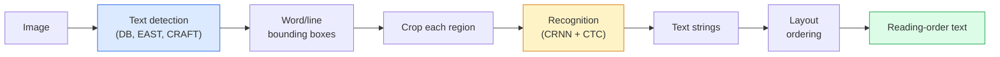

# OCR & Document Understanding

> OCR is a three-stage pipeline — detect text boxes, recognise the characters, then lay them out. Every modern OCR system reorders these stages or merges them.

**Type:** Learn + Use
**Languages:** Python
**Prerequisites:** Phase 4 Lesson 06 (Detection), Phase 7 Lesson 02 (Self-Attention)
**Time:** ~45 minutes

## Learning Objectives

- Trace the classical OCR pipeline (detect -> recognise -> layout) and the modern end-to-end alternatives (Donut, Qwen-VL-OCR)
- Implement CTC (Connectionist Temporal Classification) loss for sequence-to-sequence OCR training
- Use PaddleOCR or EasyOCR for production document parsing without training
- Distinguish OCR, layout parsing, and document understanding — and pick the right tool per task

## The Problem

Images full of text are everywhere: receipts, invoices, IDs, scanned books, forms, whiteboards, signs, screenshots. Extracting structured data from them — not just the characters, but "this is the total amount" — is one of the highest-value applied-vision problems.

The field splits into three skill layers:

1. **OCR proper**: turn pixels into text.
2. **Layout parsing**: group OCR output into regions (title, body, table, header).
3. **Document understanding**: extract structured fields ("invoice_total = $42.50") from layout.

Each layer has classical and modern approaches, and the gap between "I want text from an image" and "I need the total amount from this receipt" is bigger than most teams realise.

## The Concept

### The classical pipeline



- **Text detection** produces per-line or per-word quadrilaterals.
- **Recognition** crops each region to a fixed height, runs a CNN + BiLSTM + CTC to produce a character sequence.
- **Layout** rebuilds reading order (top-to-bottom, left-to-right for Latin; different for Arabic, Japanese).

### CTC in one paragraph

OCR recognition produces a variable-length sequence from a fixed-length feature map. CTC (Graves et al., 2006) lets you train this without character-level alignment. The model outputs a distribution over (vocab + blank) at every time step; CTC loss marginalises over all alignments that reduce to the target text after merging repeats and removing blanks.

```
raw output: "h h h _ _ e e l l _ l l o _ _"
after merge repeats and remove blanks: "hello"
```

CTC is the reason CRNN worked in 2015 and still trains most production OCR models in 2026.

### Modern end-to-end models

- **Donut** (Kim et al., 2022) — a ViT encoder + a text decoder; reads an image and emits JSON directly. No text detector, no layout module.
- **TrOCR** — ViT + transformer decoder for line-level OCR.
- **Qwen-VL-OCR / InternVL** — full vision-language models fine-tuned for OCR tasks; best accuracy in 2026 on complex documents.
- **PaddleOCR** — classical DB + CRNN pipeline in a mature production package; still the open-source workhorse.

End-to-end models need more data and compute but skip the error accumulation of multi-stage pipelines.

### Layout parsing

For structured documents, run a layout detector (LayoutLMv3, DocLayNet) that labels each region: Title, Paragraph, Figure, Table, Footnote. Reading order then becomes "iterate through regions in layout order, concatenate."

For forms, use **Key-Value extraction** models (Donut for visually-rich documents, LayoutLMv3 for plain scans). They take image + detected text + positions and predict structured key-value pairs.

### Evaluation metrics

- **Character Error Rate (CER)** — Levenshtein distance / length of reference. Lower is better. Production target: < 2% on clean scans.
- **Word Error Rate (WER)** — same at the word level.
- **F1 on structured fields** — for key-value tasks; measures whether `{invoice_total: 42.50}` appears correctly.
- **Edit distance on JSON** — for end-to-end document parsing; the Donut paper introduced normalised tree edit distance.

## Build It

### Step 1: CTC loss + greedy decoder

```python
import torch
import torch.nn as nn
import torch.nn.functional as F


def ctc_loss(log_probs, targets, input_lengths, target_lengths, blank=0):
    """
    log_probs:      (T, N, C) log-softmax over vocab including blank at index 0
    targets:        (N, S) int targets (no blanks)
    input_lengths:  (N,) per-sample time steps used
    target_lengths: (N,) per-sample target length
    """
    return F.ctc_loss(log_probs, targets, input_lengths, target_lengths,
                      blank=blank, reduction="mean", zero_infinity=True)


def greedy_ctc_decode(log_probs, blank=0):
    """
    log_probs: (T, N, C) log-softmax
    returns: list of index sequences (blanks removed, repeats merged)
    """
    preds = log_probs.argmax(dim=-1).transpose(0, 1).cpu().tolist()
    out = []
    for seq in preds:
        decoded = []
        prev = None
        for idx in seq:
            if idx != prev and idx != blank:
                decoded.append(idx)
            prev = idx
        out.append(decoded)
    return out
```

`F.ctc_loss` uses the efficient CuDNN implementation when available. The greedy decoder is simpler than a beam search and usually within 1% CER of it.

### Step 2: Tiny CRNN recogniser

Minimal CNN + BiLSTM for line OCR.

```python
class TinyCRNN(nn.Module):
    def __init__(self, vocab_size=40, hidden=128, feat=32):
        super().__init__()
        self.cnn = nn.Sequential(
            nn.Conv2d(1, feat, 3, 1, 1), nn.BatchNorm2d(feat), nn.ReLU(inplace=True),
            nn.MaxPool2d(2),
            nn.Conv2d(feat, feat * 2, 3, 1, 1), nn.BatchNorm2d(feat * 2), nn.ReLU(inplace=True),
            nn.MaxPool2d(2),
            nn.Conv2d(feat * 2, feat * 4, 3, 1, 1), nn.BatchNorm2d(feat * 4), nn.ReLU(inplace=True),
            nn.MaxPool2d((2, 1)),
            nn.Conv2d(feat * 4, feat * 4, 3, 1, 1), nn.BatchNorm2d(feat * 4), nn.ReLU(inplace=True),
            nn.MaxPool2d((2, 1)),
        )
        self.rnn = nn.LSTM(feat * 4, hidden, bidirectional=True, batch_first=True)
        self.head = nn.Linear(hidden * 2, vocab_size)

    def forward(self, x):
        # x: (N, 1, H, W)
        f = self.cnn(x)                # (N, C, H', W')
        f = f.mean(dim=2).transpose(1, 2)  # (N, W', C)
        h, _ = self.rnn(f)
        return F.log_softmax(self.head(h).transpose(0, 1), dim=-1)  # (W', N, vocab)
```

Fixed-height input (the CNN max-pools height to 1). Width is the time dimension for CTC.

### Step 3: Synthetic OCR

Generate black-on-white digit strings for an end-to-end smoke test.

```python
import numpy as np

def synthetic_line(text, height=32, char_width=16):
    W = char_width * len(text)
    img = np.ones((height, W), dtype=np.float32)
    for i, c in enumerate(text):
        x = i * char_width
        shade = 0.0 if c.isalnum() else 0.5
        img[6:height - 6, x + 2:x + char_width - 2] = shade
    return img


def build_batch(strings, vocab):
    H = 32
    W = 16 * max(len(s) for s in strings)
    imgs = np.ones((len(strings), 1, H, W), dtype=np.float32)
    target_lengths = []
    targets = []
    for i, s in enumerate(strings):
        imgs[i, 0, :, :16 * len(s)] = synthetic_line(s)
        ids = [vocab.index(c) for c in s]
        targets.extend(ids)
        target_lengths.append(len(ids))
    return torch.from_numpy(imgs), torch.tensor(targets), torch.tensor(target_lengths)


vocab = ["_"] + list("0123456789abcdefghijklmnopqrstuvwxyz")
imgs, targets, lengths = build_batch(["hello", "world"], vocab)
print(f"images: {imgs.shape}   targets: {targets.shape}   lengths: {lengths.tolist()}")
```

A real OCR dataset adds fonts, noise, rotation, blur, and colour. The pipeline above is identical.

### Step 4: Training sketch

```python
model = TinyCRNN(vocab_size=len(vocab))
opt = torch.optim.Adam(model.parameters(), lr=1e-3)

for step in range(200):
    strings = ["abc" + str(step % 10)] * 4 + ["xyz" + str((step + 1) % 10)] * 4
    imgs, targets, target_lens = build_batch(strings, vocab)
    log_probs = model(imgs)  # (W', 8, vocab)
    input_lens = torch.full((8,), log_probs.size(0), dtype=torch.long)
    loss = ctc_loss(log_probs, targets, input_lens, target_lens, blank=0)
    opt.zero_grad(); loss.backward(); opt.step()
```

Loss should drop from ~3 to ~0.2 over 200 steps on this trivial synthetic data.

## Use It

Three production paths:

- **PaddleOCR** — mature, fast, multilingual. One-line usage: `paddleocr.PaddleOCR(lang="en").ocr(image_path)`.
- **EasyOCR** — Python-native, multilingual, PyTorch backbone.
- **Tesseract** — classical; still useful for old scanned documents when models struggle.

For end-to-end document parsing, use Donut or a VLM:

```python
from transformers import DonutProcessor, VisionEncoderDecoderModel

processor = DonutProcessor.from_pretrained("naver-clova-ix/donut-base-finetuned-cord-v2")
model = VisionEncoderDecoderModel.from_pretrained("naver-clova-ix/donut-base-finetuned-cord-v2")
```

对于具有可重复结构的收据、发票和表格，请微调 Donut。对于任意文档或具有推理功能的 OCR，当前默认使用像 Qwen-VL-OCR 这样的 VLM。

## 发货

本课产生：

- `outputs/prompt-ocr-stack-picker.md` — 根据给定文档类型、语言和结构选择 Tesseract / PaddleOCR / Donut / VLM-OCR 的提示。
- `outputs/skill-ctc-decoder.md` — 一种从头开始编写贪婪和波束搜索 CTC 解码器的技能，包括长度标准化。

## 练习

1. **（简单）** 在 5 位随机数字字符串上训练 TinyCRNN 500 步。报告保留集的 CER。
2. **（中）** 用波束搜索替换贪婪解码（beam_width=5）。报告 CER 增量。集束搜索在哪些输入上获胜？
3. **（困难）** 在一组 20 张收据上使用 PaddleOCR，提取行项目，并针对 {item_name, Price} 对的手动标记的基本事实计算 F1。

## 关键术语

|术语 |人们怎么说 |它实际上意味着什么 |
|------|----------------|----------------------|
|光学字符识别 | “像素文本” |将图像区域转换为字符序列 |
| CTC | “无对齐损失” |训练没有每个时间步标签的序列模型的损失；边缘化超过结盟|
| CRNN | “经典OCR模型”| Conv特征提取器+BiLSTM+CTC；生产中仍使用 2015 年基准 |
|甜甜圈| “端到端 OCR”| ViT编码器+文本解码器；直接从图像发出 JSON |
|布局解析| “查找区域”|检测并标记文档中的标题/表格/图/段落区域 |
|阅读顺序| “文本序列” |将识别的区域排序成句子；对于拉丁语来说很简单，对于混合布局来说很重要 |
| CER/WER | “错误率” |字符或单词粒度的编辑距离/参考长度 |
| VLM-OCR | “法学硕士读着”|针对 OCR 任务进行训练或提示的视觉语言模型；复杂文档的当前 SOTA |

## 进一步阅读

- [CRNN (Shi et al., 2015)](https://arxiv.org/abs/1507.05717) — 原始的 CNN+RNN+CTC 架构
- [CTC (Graves et al., 2006)](https://www.cs.toronto.edu/~graves/icml_2006.pdf) — 原始 CTC 论文；算法思想密密麻麻
- [Donut (Kim et al., 2022)](https://arxiv.org/abs/2111.15664) — 无 OCR 文档理解转换器
- [PaddleOCR](https://github.com/PaddlePaddle/PaddleOCR) — 开源生产 OCR 堆栈
