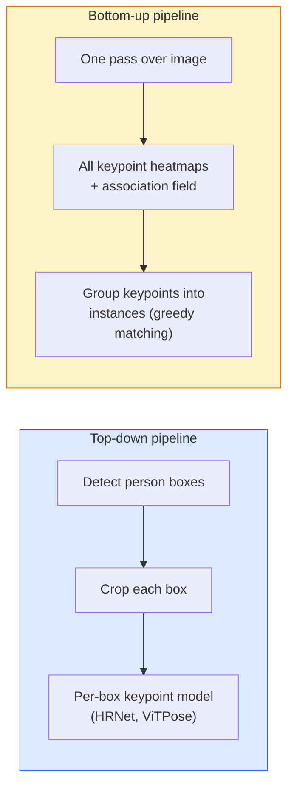

# Keypoint Detection & Pose Estimation

> A pose is a set of ordered keypoints. A keypoint detector is a heatmap regressor. Everything else is bookkeeping.

**Type:** Build
**Languages:** Python
**Prerequisites:** Phase 4 Lesson 06 (Detection), Phase 4 Lesson 07 (U-Net)
**Time:** ~45 minutes

## Learning Objectives

- Distinguish top-down and bottom-up pose estimation and state when each is used
- Regress heatmaps for K keypoints with a Gaussian-per-keypoint target and extract keypoint coordinates at inference
- Explain Part Affinity Fields (PAFs) and how bottom-up pipelines associate keypoints into instances
- Use MediaPipe Pose or MMPose for production keypoint estimation and understand their output format

## The Problem

Keypoint tasks hide under many names: human pose (17 body joints), face landmarks (68 or 478 points), hand (21 points), animal pose, robotic object pose, medical anatomy landmarks. Every one of them shares the same structure: detect K discrete points on an object and output their (x, y) coordinates.

Pose estimation is the foundation of motion capture, fitness apps, sports analytics, gesture control, animation, AR try-on, and robotic grasping. The 2D case is mature; 3D pose (estimating joint positions in world coordinates from a single camera) is the current research frontier.

The engineering question is scale. A single-image, single-person pose is a 20ms problem. Multi-person pose in a crowd at 30 fps is a different problem with different architectures.

## The Concept

### Top-down vs bottom-up



- **Top-down** — detect people first, then run a per-person keypoint model on each crop. Highest accuracy; scales linearly with number of people.
- **Bottom-up** — one forward pass predicts all keypoints plus an association field; group them. Constant time regardless of crowd size.

Top-down (HRNet, ViTPose) is the accuracy leader; bottom-up (OpenPose, HigherHRNet) is the throughput leader for crowded scenes.

### Heatmap regression

Instead of regressing `(x, y)` directly, predict an `H x W` heatmap per keypoint with a Gaussian blob centred at the true location.

```
target[k, y, x] = exp(-((x - cx_k)^2 + (y - cy_k)^2) / (2 sigma^2))
```

At inference, the argmax of each heatmap is the predicted keypoint location.

Why heatmaps work better than direct regression: the network's spatial structure (conv feature map) aligns naturally with spatial output. Gaussian targets also regularise — a small localisation error produces a small loss, not zero.

### Sub-pixel localisation

Argmax gives integer coordinates. For sub-pixel precision, refine by fitting a parabola to the argmax and its neighbours, or use the well-known offset `(dx, dy) = 0.25 * (heatmap[y, x+1] - heatmap[y, x-1], ...)` direction.

### Part Affinity Fields (PAFs)

OpenPose's trick for bottom-up association. For each pair of connected keypoints (e.g. left shoulder to left elbow), predict a 2-channel field that encodes the unit vector pointing from one to the other. To associate a shoulder with its elbow, integrate the PAF along the line connecting candidate pairs; the pair with the highest integral is matched.

```
For each connection (limb):
  PAF channels: 2 (unit vector x, y)
  Line integral: sum over sample points of (PAF . line_direction)
  Higher integral = stronger match
```

Elegant and scales to arbitrary crowd sizes without per-person crops.

### COCO keypoints

The standard body-pose dataset: 17 keypoints per person, PCK (Percentage of Correct Keypoints) and OKS (Object Keypoint Similarity) as metrics. OKS is the keypoint analogue of IoU and is what COCO mAP@OKS reports.

### 2D vs 3D

- **2D pose** — image coordinates; solved at production quality (MediaPipe, HRNet, ViTPose).
- **3D pose** — world / camera coordinates; still active research. Common approaches:
  - Lift 2D predictions to 3D with a small MLP (VideoPose3D).
  - Direct 3D regression from image (PyMAF, MHFormer).
  - Multi-view setups (CMU Panoptic) for ground truth.

## Build It

### Step 1: Gaussian heatmap target

```python
import numpy as np
import torch

def gaussian_heatmap(size, cx, cy, sigma=2.0):
    yy, xx = np.meshgrid(np.arange(size), np.arange(size), indexing="ij")
    return np.exp(-((xx - cx) ** 2 + (yy - cy) ** 2) / (2 * sigma ** 2)).astype(np.float32)

hm = gaussian_heatmap(64, 32, 32, sigma=2.0)
print(f"peak: {hm.max():.3f} at ({hm.argmax() % 64}, {hm.argmax() // 64})")
```

Per-keypoint heatmaps stacked along a channel axis give the full target tensor.

### Step 2: Tiny keypoint head

A U-Net-style model that outputs K heatmap channels.

```python
import torch.nn as nn
import torch.nn.functional as F

class TinyKeypointNet(nn.Module):
    def __init__(self, num_keypoints=4, base=16):
        super().__init__()
        self.down1 = nn.Sequential(nn.Conv2d(3, base, 3, 2, 1), nn.ReLU(inplace=True))
        self.down2 = nn.Sequential(nn.Conv2d(base, base * 2, 3, 2, 1), nn.ReLU(inplace=True))
        self.mid = nn.Sequential(nn.Conv2d(base * 2, base * 2, 3, 1, 1), nn.ReLU(inplace=True))
        self.up1 = nn.ConvTranspose2d(base * 2, base, 2, 2)
        self.up2 = nn.ConvTranspose2d(base, num_keypoints, 2, 2)

    def forward(self, x):
        h1 = self.down1(x)
        h2 = self.down2(h1)
        h3 = self.mid(h2)
        u1 = self.up1(h3)
        return self.up2(u1)
```

Input `(N, 3, H, W)`, output `(N, K, H, W)`. Loss is per-pixel MSE against Gaussian targets.

### Step 3: Inference — extract keypoint coordinates

```python
def heatmap_to_coords(heatmaps):
    """
    heatmaps: (N, K, H, W)
    returns:  (N, K, 2) float coordinates in image pixels
    """
    N, K, H, W = heatmaps.shape
    hm = heatmaps.reshape(N, K, -1)
    idx = hm.argmax(dim=-1)
    ys = (idx // W).float()
    xs = (idx % W).float()
    return torch.stack([xs, ys], dim=-1)

coords = heatmap_to_coords(torch.randn(2, 4, 32, 32))
print(f"coords: {coords.shape}")  # (2, 4, 2)
```

One line at inference. For sub-pixel refinement, interpolate around the argmax.

### Step 4: Synthetic keypoint dataset

Simple: draw four points on a white canvas and learn to predict them.

```python
def make_synthetic_sample(size=64):
    img = np.ones((3, size, size), dtype=np.float32)
    rng = np.random.default_rng()
    kps = rng.integers(8, size - 8, size=(4, 2))
    for cx, cy in kps:
        img[:, cy - 2:cy + 2, cx - 2:cx + 2] = 0.0
    hms = np.stack([gaussian_heatmap(size, cx, cy) for cx, cy in kps])
    return img, hms, kps
```

Easy enough for a tiny model to learn in a minute.

### Step 5: Training

```python
model = TinyKeypointNet(num_keypoints=4)
opt = torch.optim.Adam(model.parameters(), lr=3e-3)

for step in range(200):
    batch = [make_synthetic_sample() for _ in range(16)]
    imgs = torch.from_numpy(np.stack([b[0] for b in batch]))
    hms = torch.from_numpy(np.stack([b[1] for b in batch]))
    pred = model(imgs)
    # Upsample pred to full resolution
    pred = F.interpolate(pred, size=hms.shape[-2:], mode="bilinear", align_corners=False)
    loss = F.mse_loss(pred, hms)
    opt.zero_grad(); loss.backward(); opt.step()
```

## 使用它

- **MediaPipe Pose** — Google 的生产姿势估计器；提供 WebGL + 移动运行时，延迟低于 10 毫秒。
- **MMPose** (OpenMMLab) — 综合研究代码库；每个具有预训练权重的 SOTA 架构。
- **YOLOv8-pose** — 最快的实时多人姿势，只需一次前向传递。
- **transformers HumanDPT / PoseAnything** — 用于开放词汇姿势（任何对象、任何关键点集）的新视觉语言方法。

## 发货

本课产生：

- `outputs/prompt-pose-stack-picker.md` — 根据延迟、人群大小和 2D 与 3D 需求选择 MediaPipe / YOLOv8-pose / HRNet / ViTPose 的提示。
- `outputs/skill-heatmap-to-coords.md` — 一种编写每个生产姿势模型使用的子像素热图到坐标例程的技能。

## 练习

1. **（简单）** 在合成 4 点数据集上训练微小关键点模型。报告 200 步后预测关键点与真实关键点之间的平均 L2 误差。
2. **（中）** 添加子像素细化：给定 argmax 位置，从相邻像素沿 x 和 y 拟合一维抛物线。报告精度增益与整数 argmax 的关系。
3. **（难）** 构建一个 2 人合成数据集，其中每个图像显示 4 关键点模式的两个实例。使用 PAF 训练自下而上的管道，预测哪个关键点属于哪个实例，并评估 OKS。

## 关键术语

|术语 |人们怎么说 |它实际上意味着什么 |
|------|----------------|----------------------|
|关键点| “里程碑” |对象上的特定有序点（接头、角点、特征）|
|姿势| “骷髅”|属于一个实例的一组有序关键点 |
|自上而下| “检测然后摆姿势” |两级流程：人员检测器+每作物关键点模型；最高准确度 |
|自下而上| “先摆姿势，再分组”|单通道全关键点预测+分组；人群规模恒定时间|
|热图 | “高斯目标” |每个关键点的 H x W 张量，峰值位于真实位置；首选回归目标 |
| PAF | “零件亲和力场”| 2通道单位矢量场编码肢体方向；用于将关键点分组到实例中|
|好的 | “关键点借条” |对象关键点相似度；姿态的 COCO 度量 |
|人力资源网| 《高清网》|占主导地位的自顶向下关键点架构；始终保留高分辨率功能 |

## 进一步阅读

- [OpenPose (Cao et al., 2017)](https://arxiv.org/abs/1812.08008) — 自下而上的 PAF；仍然是该方法的最佳文章
- [HRNet (Sun et al., 2019)](https://arxiv.org/abs/1902.09212) — 自上而下的参考架构
- [ViTPose (Xu et al., 2022)](https://arxiv.org/abs/2204.12484) — 普通 ViT 作为姿势主干；当前在许多基准上的 SOTA
- [MediaPipe Pose](https://developers.google.com/mediapipe/solutions/vision/pose_landmarker) — 生产实时姿势； 2026 年部署速度最快的堆栈
