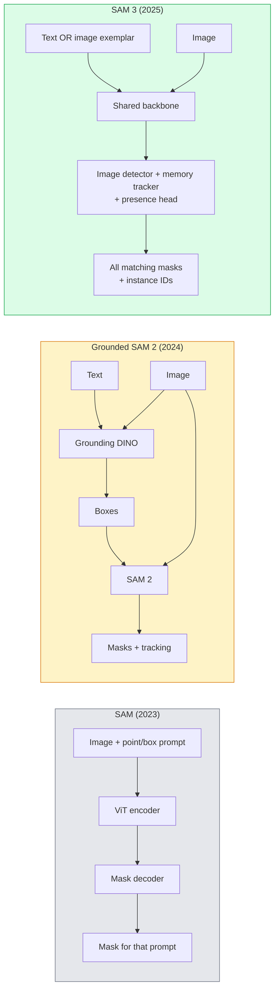

# SAM 3 & Open-Vocabulary Segmentation

> Give a model a text prompt and an image and get masks for every matching object. SAM 3 made that a single forward pass.

**Type:** Use + Build
**Languages:** Python
**Prerequisites:** Phase 4 Lesson 07 (U-Net), Phase 4 Lesson 08 (Mask R-CNN), Phase 4 Lesson 18 (CLIP)
**Time:** ~60 minutes

## Learning Objectives

- Distinguish SAM (visual prompts only), Grounded SAM / SAM 2 (detector + SAM), and SAM 3 (native text prompts via Promptable Concept Segmentation)
- Explain the SAM 3 architecture: shared backbone + image detector + memory-based video tracker + presence head + decoupled detector-tracker design
- Use Hugging Face `transformers` SAM 3 integration for text-prompted detection, segmentation, and video tracking
- Pick between SAM 3, Grounded SAM 2, YOLO-World, and SAM-MI based on latency, concept complexity, and deployment target

## The Problem

The 2023 SAM was a visual-prompt-only model: you click a point or draw a box and it returns a mask. For "give me all the oranges in this photo" you needed a detector (Grounding DINO) to produce boxes, then SAM to segment each. Grounded SAM turned this into a pipeline, but it was a cascade of two frozen models with inevitable error accumulation.

SAM 3 (Meta, Nov 2025, ICLR 2026) collapsed the cascade. It accepts a short noun phrase or an image exemplar as prompt and returns all matching masks and instance IDs in a single forward pass. That is **Promptable Concept Segmentation (PCS)**. Combined with the March 2026 Object Multiplex update (SAM 3.1), it tracks multiple instances of the same concept through video efficiently.

This lesson is about the structural shift this represents. 2D seg, detection, and text-image grounding have merged into one model. The production question is no longer "which pipeline do I chain together" but "which promptable model handles my use case end-to-end."

## The Concept

### The three generations



### Promptable Concept Segmentation

A "concept prompt" is a short noun phrase (`"yellow school bus"`, `"striped red umbrella"`, `"hand holding a mug"`) or an image exemplar. The model returns segmentation masks for every instance in the image that matches the concept, plus a unique instance ID per match.

This differs from classic visual-prompt SAM in three ways:

1. No per-instance prompting required — one text prompt returns all matches.
2. Open-vocabulary — the concept can be anything describable in natural language.
3. Returns multiple instances at once rather than one mask per prompt.

### Key architectural pieces

- **Shared backbone** — a single ViT processes the image. Both the detector head and the memory-based tracker read from it.
- **Presence head** — predicts whether the concept is present in the image at all. Decouples "is this here?" from "where is it?". Reduces false positives on absent concepts.
- **Decoupled detector-tracker** — image-level detection and video-level tracking have separate heads so they do not interfere.
- **Memory bank** — stores per-instance features across frames for video tracking (same mechanism SAM 2 used).

### Training at scale

SAM 3 was trained on **4 million unique concepts** generated by a data engine that iteratively annotates and corrects using AI + human review. The new **SA-CO benchmark** contains 270K unique concepts, 50x larger than prior benchmarks. SAM 3 reaches 75-80% of human performance on SA-CO and doubles existing systems on image + video PCS.

### SAM 3.1 Object Multiplex

March 2026 update: **Object Multiplex** introduces a shared-memory mechanism for joint tracking of many instances of the same concept at once. Previously, tracking N instances meant N separate memory banks. Multiplex collapses that into one shared memory with per-instance queries. Result: substantially faster multi-object tracking without sacrificing accuracy.

### Where Grounded SAM still matters in 2026

- When you need a specific open-vocabulary detector swapped in (DINO-X, Florence-2).
- When the SAM 3 license (gated on HF) is a blocker.
- When you need more control over the detector threshold than SAM 3 exposes.
- For research / ablation work on the detector component.

Modular pipelines still have a place. For most production work, SAM 3 is the simpler answer.

### YOLO-World vs SAM 3

- **YOLO-World** — open-vocabulary detector only (no masks). Real-time. Best when you need boxes at high fps.
- **SAM 3** — full segmentation + tracking. Slower but richer output.

Production split: YOLO-World for fast detection-only pipelines (robotics navigation, fast dashboards), SAM 3 for anything that needs masks or tracking.

### SAM-MI efficiency

SAM-MI (2025-2026) addresses SAM's decoder bottleneck. Key ideas:

- **Sparse point prompting** — uses a few well-chosen points instead of dense prompts; reduces decoder calls by 96%.
- **Shallow mask aggregation** — merges rough mask predictions into one sharper mask.
- **Decoupled mask injection** — decoder receives pre-computed mask features instead of re-running.

Result: ~1.6× speedup over Grounded-SAM on open-vocabulary benchmarks.

### Output format for the three models

All return the same general structure (boxes + labels + scores + masks + IDs), which is helpful — your pipeline downstream does not have to branch on which model ran.

## Build It

### Step 1: Prompt construction

Build a helper that turns a user sentence into a list of SAM 3 concept prompts. This is the boundary where "what the user typed" meets "what the model consumes".

```python
def split_concepts(sentence):
    """
    Heuristic splitter for multi-concept prompts.
    Returns list of short noun phrases.
    """
    for sep in [",", ";", "and", "or", "&"]:
        if sep in sentence:
            parts = [p.strip() for p in sentence.replace("and ", ",").split(",")]
            return [p for p in parts if p]
    return [sentence.strip()]

print(split_concepts("cats, dogs and balloons"))
```

SAM 3 accepts one concept per forward pass; for multi-concept queries, loop or batch them.

### Step 2: Post-processing helpers

Turn SAM 3's raw outputs into a clean list of detections that match our Phase 4 Lesson 16 pipeline contract.

```python
from dataclasses import dataclass
from typing import List

@dataclass
class ConceptDetection:
    concept: str
    instance_id: int
    box: tuple          # (x1, y1, x2, y2)
    score: float
    mask_rle: str       # run-length encoded


def rle_encode(binary_mask):
    flat = binary_mask.flatten().astype("uint8")
    runs = []
    prev, count = flat[0], 0
    for v in flat:
        if v == prev:
            count += 1
        else:
            runs.append((int(prev), count))
            prev, count = v, 1
    runs.append((int(prev), count))
    return ";".join(f"{v}x{c}" for v, c in runs)
```

RLE keeps response payloads small even for many high-resolution masks. The same format works across SAM 2, SAM 3, Grounded SAM 2.

### Step 3: A unified open-vocab segmentation interface

Wrap whatever backend you have (SAM 3, Grounded SAM 2, YOLO-World + SAM 2) behind a single method. Your downstream code does not change when the backend does.

```python
from abc import ABC, abstractmethod
import numpy as np

class OpenVocabSeg(ABC):
    @abstractmethod
    def detect(self, image: np.ndarray, concept: str) -> List[ConceptDetection]:
        ...


class StubOpenVocabSeg(OpenVocabSeg):
    """
    Deterministic stub used for pipeline testing when real models are not loaded.
    """
    def detect(self, image, concept):
        h, w = image.shape[:2]
        return [
            ConceptDetection(
                concept=concept,
                instance_id=0,
                box=(w * 0.2, h * 0.3, w * 0.5, h * 0.8),
                score=0.89,
                mask_rle="0x100;1x50;0x200",
            ),
            ConceptDetection(
                concept=concept,
                instance_id=1,
                box=(w * 0.55, h * 0.25, w * 0.85, h * 0.75),
                score=0.74,
                mask_rle="0x80;1x40;0x220",
            ),
        ]
```

The real `SAM3OpenVocabSeg` subclass would wrap `transformers.Sam3Model` and `Sam3Processor`.

### Step 4: Hugging Face SAM 3 usage (reference)

For the actual model, the `transformers` integration:

```python
from transformers import Sam3Processor, Sam3Model
import torch

processor = Sam3Processor.from_pretrained("facebook/sam3")
model = Sam3Model.from_pretrained("facebook/sam3").eval()

inputs = processor(images=pil_image, return_tensors="pt")
inputs = processor.set_text_prompt(inputs, "yellow school bus")

with torch.no_grad():
    outputs = model(**inputs)

masks = processor.post_process_masks(
    outputs.masks, inputs.original_sizes, inputs.reshaped_input_sizes
)
boxes = outputs.boxes
scores = outputs.scores
```

One prompt, all matches returned in a single call.

### Step 5: Measure what Grounded SAM 2 gave you for free

An honest benchmark: what happens when you replace Grounded SAM 2 with SAM 3 in a real pipeline?

- Latency: SAM 3 saves one forward pass (no separate detector) but the model itself is heavier; usually net-neutral or a slight speedup.
- Accuracy: SAM 3 substantially better on rare or compositional concepts ("striped red umbrella"). Similar on common single-word concepts.
- Flexibility: Grounded SAM 2 lets you swap detectors (DINO-X, Florence-2, Grounding DINO 1.5); SAM 3 is monolithic.

Conclusion: SAM 3 is the default for 2026 open-vocab seg. Grounded SAM 2 is still the right answer when you need detector flexibility or different license terms.

## Use It

Production deployment patterns:

- **Real-time annotation** — SAM 3 + CVAT's label-as-text-prompt feature. Annotators select a label name; SAM 3 pre-labels every matching instance. Review and correct.
- **Video analytics** — SAM 3.1 Object Multiplex for multi-object tracking; feed frames to the memory-based tracker.
- **Robotics** — SAM 3 for open-vocab manipulation ("pick up the red cup"); runs as a planning primitive.
- **Medical imaging** — SAM 3 fine-tuned on medical concepts; requires access request on HF.

Ultralytics wraps SAM 3 in its Python package:

```python
from ultralytics import SAM

model = SAM("sam3.pt")
results = model(image_path, prompts="yellow school bus")
```

与 YOLO 和 SAM 2 相同的界面。

## 发货

本课产生：

- `outputs/prompt-open-vocab-stack-picker.md` — 根据延迟、概念复杂性和许可选择 SAM 3 / Grounded SAM 2 / YOLO-World / SAM-MI 的提示。
- `outputs/skill-concept-prompt-designer.md` — 一项将用户话语转化为格式良好的 SAM 3 概念提示（拆分、消歧、回退）的技能。

## 练习

1. **（简单）** 使用您选择的概念提示在 10 个图像上运行 SAM 3。在相同图像上与 SAM 2 + Grounding DINO 1.5 进行比较。报告每个模型错过了哪些概念。
2. **（中）** 在 SAM 3 之上构建“单击包含/单击排除”UI：文本提示返回候选实例；用户点击会保留哪些点击算作积极点击。将最终概念集输出为 JSON。
3. **（困难）** 在自定义概念集（例如 5 种电子元件）上微调 SAM 3，每个概念集有 20 个标记图像。与相同测试集上的零样本 SAM 3 进行比较；测量掩模 IoU 的改善。

## 关键术语

|术语 |人们怎么说 |它实际上意味着什么 |
|------|----------------|----------------------|
|开放词汇分割 | “按文本分段”|为自然语言描述的对象生成掩码，而不是固定的标签集 |
|电脑| “及时的概念分割”| SAM 3 的核心任务 - 给定名词短语或图像范例，分割所有匹配的实例 |
|概念提示| “文本输入” |简短的名词短语或图像范例；不是一个完整的句子 |
|存在头 | “是这里吗？” | SAM 3 模块在定位前判断图像中是否存在概念 |
|南非-CO | “SAM 3 基准测试”| 270K 概念开放词汇分割基准；比之前的开放词汇基准大 50 倍 |
|对象复用| “SAM 3.1 更新”|共享内存多目标跟踪；多个实例的快速联合跟踪|
|接地 SAM 2 | “模块化管道”|探测器+SAM 2级联；当探测器交换很重要时仍然相关 |
|萨米 | “高效 SAM 变体”|掩模注入比接地 SAM 加速 1.6 倍 |

## 进一步阅读

- [SAM 3：用概念分割任何东西 (arXiv 2511.16719)](https://arxiv.org/abs/2511.16719)
- [SAM 3.1 对象复用（Meta AI，2026 年 3 月）](https://ai.meta.com/blog/segment-anything-model-3/)
- [Hugging Face 上的 SAM 3 模型页面](https://huggingface.co/facebook/sam3)
- [Grounded SAM 2 教程 (PyImageSearch)](https://pyimagesearch.com/2026/01/19/grounded-sam-2-from-open-set-detection-to-segmentation-and-tracking/)
- [Ultralytics SAM 3 文档](https://docs.ultralytics.com/models/sam-3/)
- [SAM3-I：指令感知 SAM (arXiv 2512.04585)](https://arxiv.org/abs/2512.04585)
