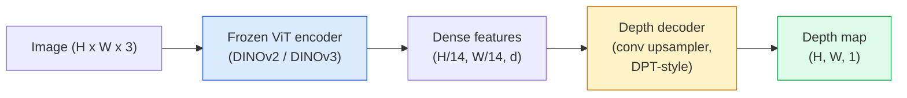

# Monocular Depth & Geometry Estimation

> A depth map is a single-channel image where each pixel is a distance from the camera. Predicting it from one RGB frame used to be impossible without stereo or LiDAR. In 2026 a frozen ViT encoder plus a lightweight head gets within a few percent of ground truth.

**Type:** Build + Use
**Languages:** Python
**Prerequisites:** Phase 4 Lesson 14 (ViT), Phase 4 Lesson 17 (Self-Supervised Vision), Phase 4 Lesson 07 (U-Net)
**Time:** ~60 minutes

## Learning Objectives

- Distinguish relative and metric depth and state which one each production model (MiDaS, Marigold, Depth Anything V3, ZoeDepth) solves
- Use Depth Anything V3 (DINOv2 backbone) to predict depth for arbitrary single images with no calibration
- Explain why monocular depth works at all from a single image (perspective cues, texture gradients, learned priors) and what it cannot recover (absolute scale, occluded geometry)
- Lift 2D detections to 3D points using a depth map and pinhole camera intrinsics

## The Problem

Depth is the missing axis in 2D computer vision. Given RGB, you know where things appear in the image plane; you do not know how far they are. Depth sensors (stereo rigs, LiDAR, time-of-flight) solve this directly but are expensive, fragile, and limited in range.

Monocular depth estimation — predicting depth from a single RGB frame — used to produce blurry, unreliable output. By 2026 large pretrained encoders changed that: Depth Anything V3 uses a frozen DINOv2 backbone and produces depth maps that generalise across indoor, outdoor, medical, and satellite domains. Marigold reframes depth as a conditional diffusion problem. ZoeDepth regresses true metric distances.

Depth is also the bridge between 2D detection and 3D understanding: multiply a detected box's pixels by depth and you lift the 2D object into a 3D point cloud. That is the core of every AR occlusion system, every obstacle-avoidance pipeline, and every "pick up the cup" robot.

## The Concept

### Relative vs metric depth

- **Relative depth** — ordered `z` values without a real-world unit. "Pixel A is closer than pixel B, but the ratio of distances is not anchored to metres."
- **Metric depth** — absolute distance in metres from the camera. Requires the model to have learnt the statistical relationship between image cues and real distance.

MiDaS and Depth Anything V3 produce relative depth. Marigold produces relative depth. ZoeDepth, UniDepth, and Metric3D produce metric depth. Metric models are sensitive to camera intrinsics; relative models are not.

### The encoder-decoder pattern



Depth Anything V3 freezes the encoder and trains only the DPT-style decoder. The encoder provides rich features; the decoder interpolates them back to image resolution and regresses depth.

### Why a single image produces depth at all

A 2D image contains many monocular cues that correlate with depth:

- **Perspective** — parallel lines in 3D converge in 2D.
- **Texture gradient** — surfaces far away have smaller, denser texture.
- **Occlusion order** — nearer objects occlude farther ones.
- **Size constancy** — known objects (cars, humans) give approximate scale.
- **Atmospheric perspective** — distant objects appear hazier and bluer in outdoor scenes.

A ViT trained on billions of images internalises these cues. With enough data and a strong backbone, monocular depth hits reasonable accuracy without any explicit 3D supervision.

### What monocular depth cannot do

- **Absolute metric scale** without intrinsics or a known object in the scene. The network can predict "the cup is twice as far as the spoon" without knowing whether the cup is 1 m or 10 m away.
- **Occluded geometry** — the back of a chair is unseen and cannot be inferred reliably.
- **Truly untextured / reflective surfaces** — mirrors, glass, uniform walls. The network reports plausible but wrong depth.

### Depth Anything V3 in 2026

- Vanilla DINOv2 ViT-L/14 as encoder (frozen).
- DPT decoder.
- Trained on posed image pairs from diverse sources (no explicit depth supervision needed beyond photometric consistency).
- Predicts spatially consistent geometry from **an arbitrary number of visual inputs, with or without known camera poses**.
- SOTA across monocular depth, any-view geometry, visual rendering, camera pose estimation.

This is the drop-in model to call when you need depth in 2026.

### Marigold — diffusion for depth

Marigold (Ke et al., CVPR 2024) reframes depth estimation as conditional image-to-image diffusion. Conditioning: RGB. Target: depth map. Uses a pretrained Stable Diffusion 2 U-Net as backbone. Output depth maps are exceptionally sharp at object boundaries. Trade-off: slower inference than feed-forward models (10-50 denoising steps).

### Intrinsics and the pinhole camera

To lift a pixel `(u, v)` with depth `d` to a 3D point `(X, Y, Z)` in camera coordinates:

```
fx, fy, cx, cy = camera intrinsics
X = (u - cx) * d / fx
Y = (v - cy) * d / fy
Z = d
```

Intrinsics come from EXIF metadata, a calibration pattern, or a monocular intrinsics estimator (Perspective Fields, UniDepth). Without intrinsics, you can still render a point cloud by assuming a 60-70° FOV and moderate-resolution principals — usable for visualisation, not for measurement.

### Evaluation

Two standard metrics:

- **AbsRel** (absolute relative error): `mean(|d_pred - d_gt| / d_gt)`. Lower is better. 0.05-0.1 for production models.
- **delta < 1.25** (threshold accuracy): fraction of pixels where `max(d_pred/d_gt, d_gt/d_pred) < 1.25`. Higher is better. 0.9+ for SOTA.

For relative depth (Depth Anything V3, MiDaS), evaluation uses scale-and-shift invariant versions of both metrics.

## Build It

### Step 1: Depth metrics

```python
import torch

def abs_rel_error(pred, target, mask=None):
    if mask is not None:
        pred = pred[mask]
        target = target[mask]
    return (torch.abs(pred - target) / target.clamp(min=1e-6)).mean().item()


def delta_accuracy(pred, target, threshold=1.25, mask=None):
    if mask is not None:
        pred = pred[mask]
        target = target[mask]
    ratio = torch.maximum(pred / target.clamp(min=1e-6), target / pred.clamp(min=1e-6))
    return (ratio < threshold).float().mean().item()
```

Always mask invalid depth pixels (zero, NaN, saturated) before evaluation.

### Step 2: Scale-and-shift alignment

For relative-depth models, align prediction to ground truth before computing metrics. Least-squares fit of `a * pred + b = target`:

```python
def align_scale_shift(pred, target, mask=None):
    if mask is not None:
        p = pred[mask]
        t = target[mask]
    else:
        p = pred.flatten()
        t = target.flatten()
    A = torch.stack([p, torch.ones_like(p)], dim=1)
    coeffs, *_ = torch.linalg.lstsq(A, t.unsqueeze(-1))
    a, b = coeffs[:2, 0]
    return a * pred + b
```

Run `align_scale_shift` before `abs_rel_error` when evaluating MiDaS / Depth Anything.

### Step 3: Lift depth to a point cloud

```python
import numpy as np

def depth_to_point_cloud(depth, intrinsics):
    H, W = depth.shape
    fx, fy, cx, cy = intrinsics
    v, u = np.meshgrid(np.arange(H), np.arange(W), indexing="ij")
    z = depth
    x = (u - cx) * z / fx
    y = (v - cy) * z / fy
    return np.stack([x, y, z], axis=-1)


depth = np.random.uniform(0.5, 4.0, (240, 320))
intr = (320.0, 320.0, 160.0, 120.0)
pc = depth_to_point_cloud(depth, intr)
print(f"point cloud shape: {pc.shape}  (H, W, 3)")
```

One function, every 3D-lifted application. Export the point cloud to `.ply` and open in MeshLab or CloudCompare.

### Step 4: Smoke test with a synthetic depth scene

```python
def synthetic_depth(size=96):
    yy, xx = np.meshgrid(np.arange(size), np.arange(size), indexing="ij")
    # Floor: linear gradient from near (top) to far (bottom)
    depth = 1.0 + (yy / size) * 4.0
    # Box in the middle: closer
    mask = (np.abs(xx - size / 2) < size / 6) & (np.abs(yy - size * 0.6) < size / 6)
    depth[mask] = 2.0
    return depth.astype(np.float32)


gt = torch.from_numpy(synthetic_depth(96))
pred = gt + 0.3 * torch.randn_like(gt)  # simulated prediction
aligned = align_scale_shift(pred, gt)
print(f"before align  absRel = {abs_rel_error(pred, gt):.3f}")
print(f"after align   absRel = {abs_rel_error(aligned, gt):.3f}")
```

### Step 5: Depth Anything V3 usage (reference)

```python
import torch
from transformers import pipeline
from PIL import Image

pipe = pipeline(task="depth-estimation", model="LiheYoung/depth-anything-v2-large")

image = Image.open("street.jpg").convert("RGB")
out = pipe(image)
depth_np = np.array(out["depth"])
```

三行。 `out["depth"]` 是一个 PIL 灰度图；转换为 numpy 进行数学计算。特别是对于 Depth Anything V3，一旦发布就交换模型 ID； API 不变。

## 使用它

- **Depth Anything V3** (Meta AI / ByteDance, 2024-2026) — 相对深度的默认值。生产中速度最快的 ViT 大骨干模型。
- **Marigold** (ETH, 2024) — 最高的视觉质量，缓慢的推理。
- **UniDepth** (ETH, 2024) — 具有相机内在估计的度量深度。
- **ZoeDepth**（英特尔，2023）——公制深度；老了，还是靠谱的。
- **MiDaS v3.1** — 遗留但稳定；良好的比较基准。

典型的集成模式：

1. RGB 帧到达。
2.深度模型产生深度图。
3. 检测器产生盒子。
4. 将盒子质心从深度提升到 3D；与点云合并（如果可用）。
5.下游：AR遮挡、路径规划、物体大小估计、立体替换。

对于实时使用，Depth Anything V2 Small（INT8 量化）在 518x518 的消费级 GPU 上达到约 30 fps。

## 发货

本课产生：

- `outputs/prompt-depth-model-picker.md` — 在给定延迟、度量与相对需求和场景类型的 Depth Anything V3、Marigold、UniDepth、MiDaS 之间进行选择。
- `outputs/skill-depth-to-pointcloud.md` — 一种通过正确的内在函数处理从深度图构建点云并导出到 `.ply` 的技能。

## 练习

1. **（简单）** 在桌面上的任意 10 个图像上运行 Depth Anything V2。将深度保存为灰度 PNG 并进行检查。找出一个预测深度看起来错误的物体，并解释单眼线索失败的原因。
2. **（中）** 给定 RGB + 来自 Depth Anything V2 的深度，提升到点云并使用“open3d”进行渲染。比较两个场景（室内/室外）并注意哪个看起来更可信。
3. **（困难）** 拍摄五对图像，这些图像仅因已知物体的位置而不同（例如，瓶子移近了 30 厘米）。使用 UniDepth 预测两者的度量深度。报告预测距离增量与真实 30 厘米的距离。

## 关键术语

|术语 |人们怎么说 |它实际上意味着什么 |
|------|----------------|----------------------|
|单眼深度| “单幅图像深度” |从一帧 RGB 帧进行深度估计，无立体或 LiDAR |
|相对深度| “有序深度” |没有实际单位的有序 z 值 |
|公制深度 | “绝对距离” |深度以米为单位；需要校准或经过度量监督训练的模型 |
|绝对相对 | “绝对相对误差” | |d_pred - d_gt| 的平均值/d_gt;标准深度公制|
| Delta 精度 | “增量 < 1.25”|预测值与真实值相差 25% 以内的像素比例 |
|针孔相机| “fx、fy、cx、cy”|用于将 (u, v, d) 提升到 (X, Y, Z) 的相机模型 |
| DPT | “密集预测变压器”|基于卷积的解码器在冻结 ViT 编码器之上用于深度 |
| DINOv2 骨干 | “它起作用的原因” |无需深度标签即可跨领域泛化的自监督功能 |

## 进一步阅读

- [Depth Anything V3 论文页面](https://depth-anything.github.io/) — 使用 DINOv2 编码器的 SOTA 单目深度
- [Marigold (Ke et al., CVPR 2024)](https://marigoldmonodepth.github.io/) — 基于扩散的深度估计
- [UniDepth (Piccinelli et al., 2024)](https://arxiv.org/abs/2403.18913) — 具有内在函数的度量深度
- [MiDaS v3.1 (Intel ISL)](https://github.com/isl-org/MiDaS) — 规范的相对深度基线
- [DINOv3 博客文章 (Meta)](https://ai.meta.com/blog/dinov3-self-supervised-vision-model/) — 提高深度精度的编码器系列
